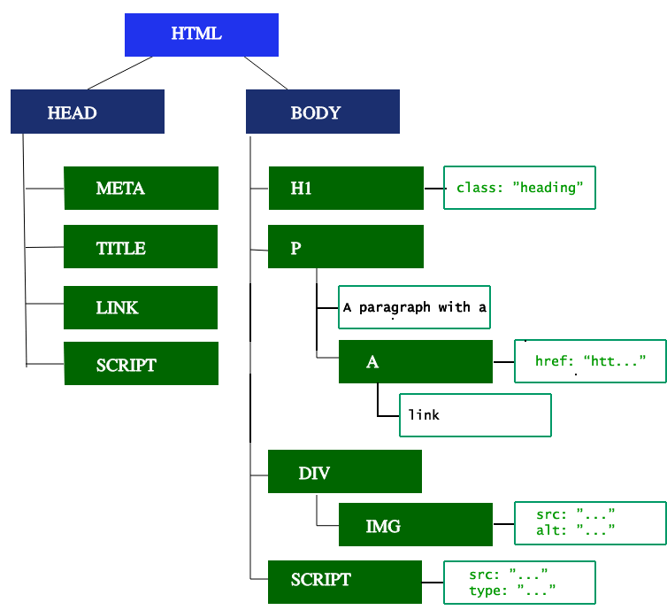
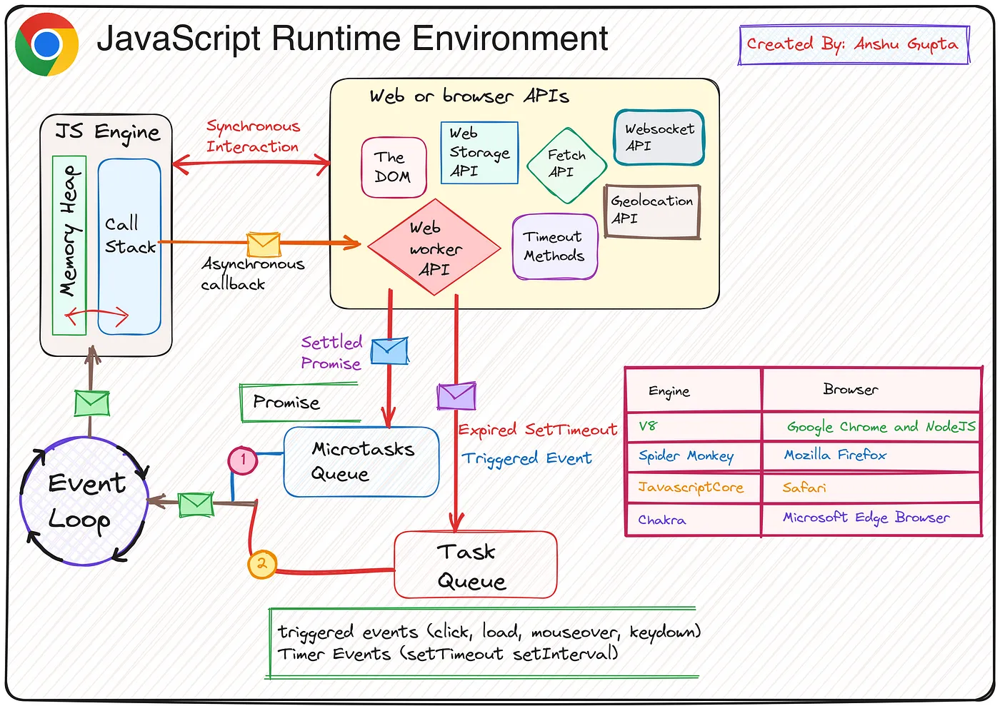
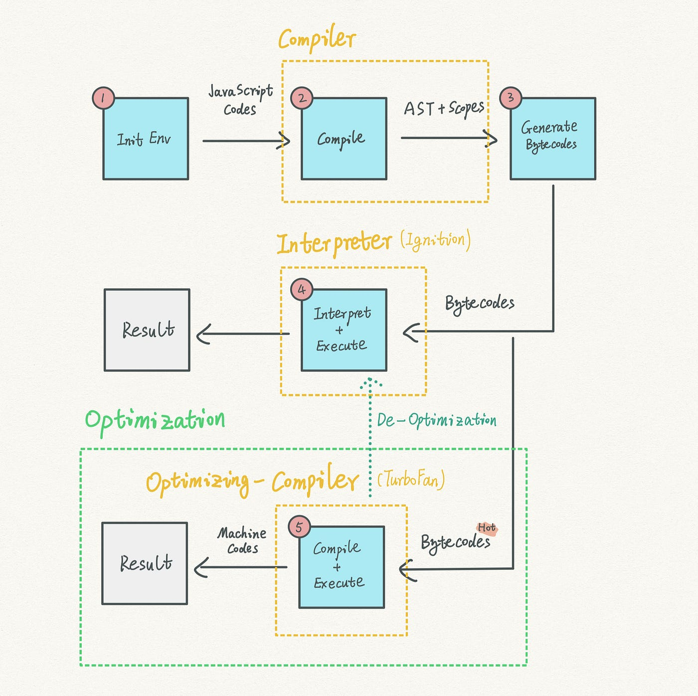
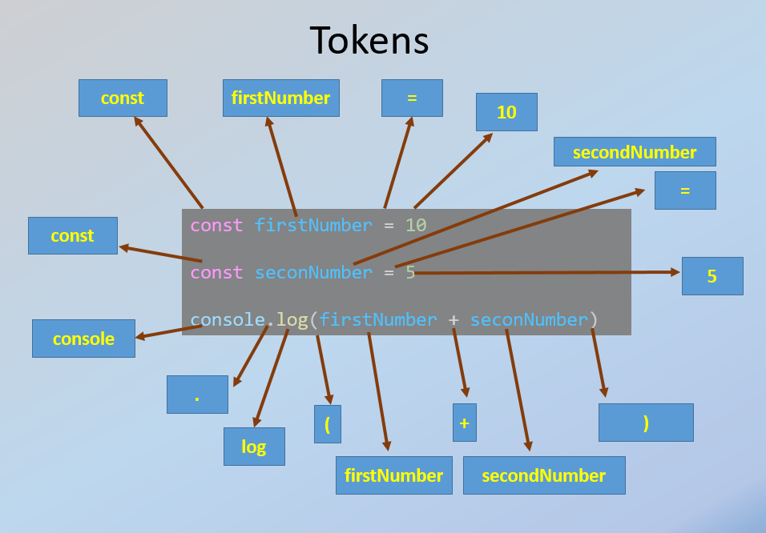
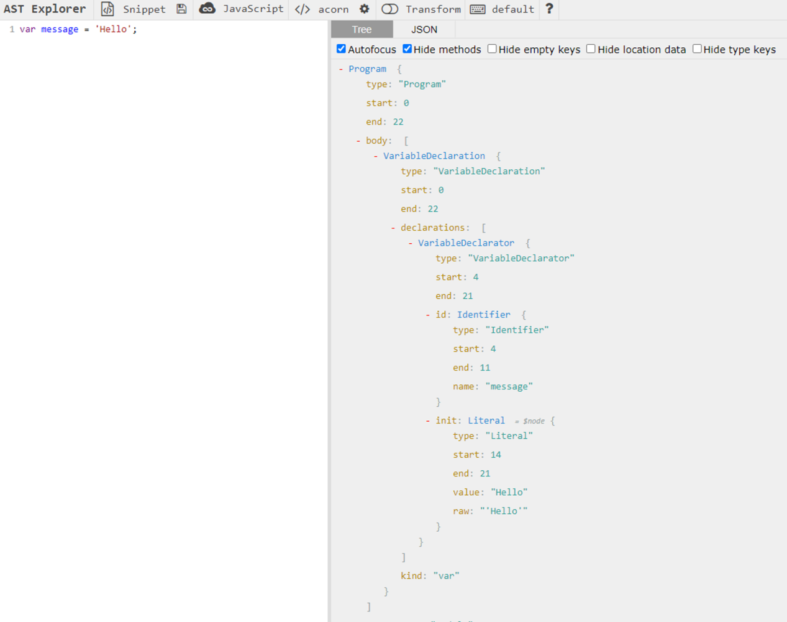
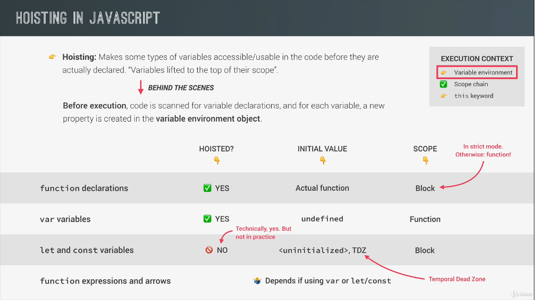
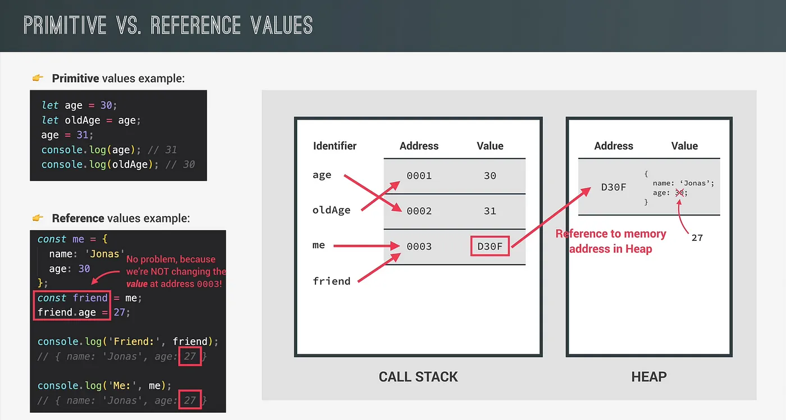
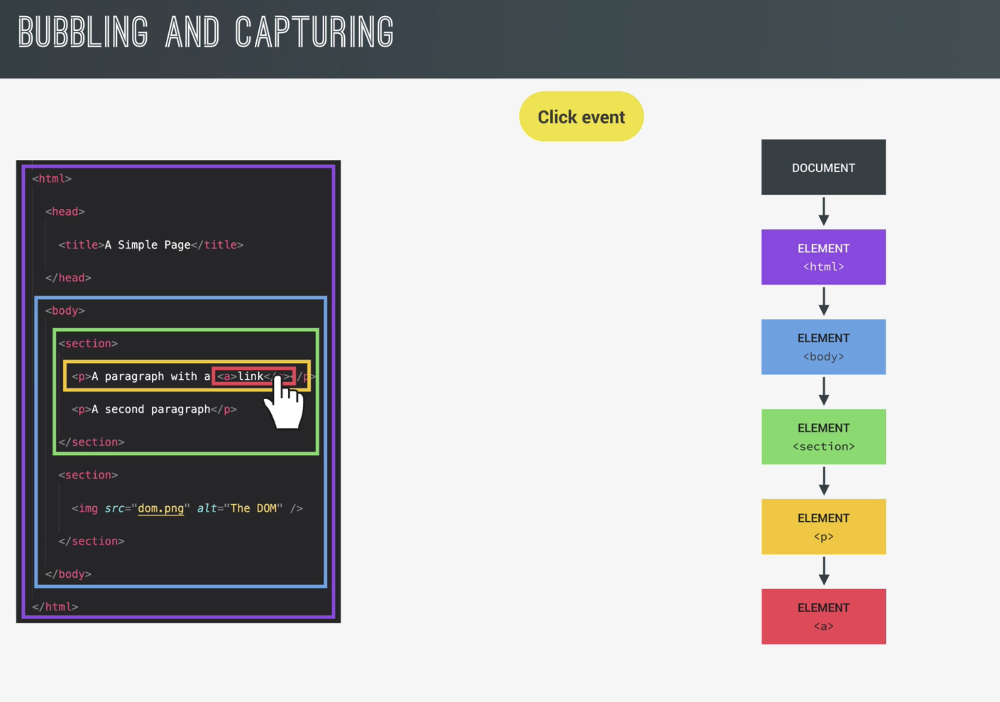
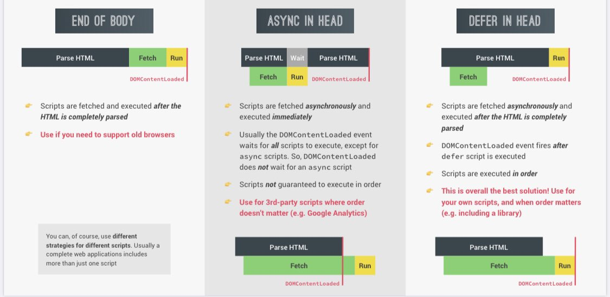

# JAVASCRIPT

## Table of Contents

- [Start](#VARIABLES)
- [Operators](#operators)
- [Type coercion](#type-coercion)
- [STRICT MODE](#strict-mode)
- [Common web APIs](#common-web-APIs)
- [JAVASCRIPT BEHIND THE SCENES](#javascript-behind-the-scenes)
- [Mark-and-sweep Algorithm](#mark-and-sweep-algorithm)
- [How browsers works](#how-browsers-works)
- [Introduction to Critical Rendering Path](#introduction-to-critical-rendering-path)
- [JS Engine](#js-engine)
- [Phases](#phases)
- [Hoisting](#hoisting)
- [Primitive vs Reference Values](#primitive-vs-reference-values)
- [Destructuring Assignment](#destructuring-assignment)
- [Rest Parameters](#rest-parameters)
- [Using && and ||](#using-logical-operators)
- [for...of loop](#for-of-loop)
- [for...in loop](#for-in-loop)
- [Set](#set)
- [Map](#map-object)
- [Which data structure to use](#which-data-structure-to-use)
- [String](#string)
- [Functions](#functions)
- [Call Apply Bind](#function-methods)
- [IIFE](#iife)
- [This keyword and Call Apply Bind](#this-keyword-and-call-apply-bind)
- [Array methods](#array-methods)
- [Dom tree](#dom-tree)
- [Event Propagation in the DOM](#event-propagation-in-the-dom)
- [Event Delegation in the DOM](#event-delegation-in-the-dom)
- [The closest Method in the DOM](#the-closest-method-in-the-dom)
- [The matches Method in the DOM](#the-matches-method-in-the-dom)
- [Regular Async Defer](#regular-async-defer)
- [Object-oriented programming](#object-oriented-programming)
- [ES6 Classes](#es6-classes)
- [Promises](#promises)
- [Asynchronous programming behind the scenes](#asynchronous-programming-behind-the-scenes)

#### **VARIABLES**

1. **Naming Rules:**
   - Variables cannot start with a number: `let 3years = 3` results in a syntax error.
   - Special characters (e.g., `&`) are not allowed in variable names: `let man&woman = human` results in a syntax error.
   - Valid characters include letters, numbers (but not at the start), underscores, and `$` sign.
   - Reserved keywords (e.g., `new`, `function`) cannot be used as variable names.
   - Using `name` as a variable name can interfere with `window.name` in browsers.
   - It's conventional to avoid starting variable names with uppercase letters, as this is typically reserved for classes or constructor functions.
   - All-uppercase variable names are conventionally reserved for constants, e.g., `const PI = 3.14`.

#### **DATA TYPES**

1. **Primitive Data Types:**
   - **Numbers:** JavaScript uses floating-point numbers for both decimals and integers.
   - **Strings:** Sequence of characters.
   - **Booleans:** `true` or `false`.
   - **Undefined:** Variable declared without a value.
   - **Null:** Represents no value or object, used intentionally to indicate absence.
   - **Symbols:** Unique values, useful for unique property keys.
   - **BigInt:** Represents integers larger than `2^53 - 1` (the max safe integer for the `Number` type).

`Symbols are values that will never change.`

```javascript
Symbol("foo") === Symbol("foo");
```

`Output: false`

```javascript
Symbol.keyFor(Symbol.for("tokenString")) === "tokenString";
```

`Output: true`

They are mainly used as unique propery keys because symbol never clashes with any other property either symbol or string
`javascript
     const LOADING = Symbol('LOADING');
     const SUCCESS = Symbol('SUCCESS');
     `

```javascript
$$typeof: Symbol(react.element);
```

Symbols are guaranteed to be unique. By using a Symbol, React can ensure that $$typeof uniquely identifies a React element,
making it easy to distinguish React elements from other objects or data

JavaScript has `dymamic typing, which means that when we create a new variable, we don not have to manually define the data type of the value that it contains.
We can assing a new value with different data type to a same variable.
typeof undefined is undefined
typeof null is object which is abug in js
typeof Nan is number which is an invalid number

### Operators

In JavaScript, operators are special symbols used to perform operations on operands (values and variables). Here’s a summary of the basic operators in JavaScript:

#### 1. **Arithmetic Operators**

- Used to perform mathematical operations.

| Operator | Description             | Example          | Result  |
| -------- | ----------------------- | ---------------- | ------- |
| `+`      | Addition                | `5 + 2`          | `7`     |
| `-`      | Subtraction             | `5 - 2`          | `3`     |
| `*`      | Multiplication          | `5 * 2`          | `10`    |
| `/`      | Division                | `5 / 2`          | `2.5`   |
| `%`      | Modulus (Remainder)     | `5 % 2`          | `1`     |
| `**`     | Exponentiation (ES6)    | `5 ** 2`         | `25`    |
| `++`     | Increment (adds 1)      | `let x = 5; x++` | `x = 6` |
| `--`     | Decrement (subtracts 1) | `let x = 5; x--` | `x = 4` |

#### 2. **Assignment Operators**

- Used to assign values to variables.

| Operator | Description               | Example   | Equivalent to |
| -------- | ------------------------- | --------- | ------------- |
| `=`      | Assigns value             | `x = 5`   | `x = 5`       |
| `+=`     | Adds and assigns          | `x += 5`  | `x = x + 5`   |
| `-=`     | Subtracts and assigns     | `x -= 5`  | `x = x - 5`   |
| `*=`     | Multiplies and assigns    | `x *= 5`  | `x = x * 5`   |
| `/=`     | Divides and assigns       | `x /= 5`  | `x = x / 5`   |
| `%=`     | Modulus and assigns       | `x %= 5`  | `x = x % 5`   |
| `**=`    | Exponentiates and assigns | `x **= 5` | `x = x ** 5`  |

#### 3. **Comparison Operators**

- Used to compare two values and return a boolean (`true` or `false`).

| Operator | Description                     | Example     | Result  |
| -------- | ------------------------------- | ----------- | ------- |
| `==`     | Equal to                        | `5 == '5'`  | `true`  |
| `===`    | Strict equal to (same type)     | `5 === '5'` | `false` |
| `!=`     | Not equal to                    | `5 != '5'`  | `false` |
| `!==`    | Strict not equal to (same type) | `5 !== '5'` | `true`  |
| `>`      | Greater than                    | `5 > 2`     | `true`  |
| `<`      | Less than                       | `5 < 2`     | `false` |
| `>=`     | Greater than or equal to        | `5 >= 5`    | `true`  |
| `<=`     | Less than or equal to           | `5 <= 2`    | `false` |

#### 4. **Logical Operators**

- Used to combine multiple conditions.

| Operator | Description | Example           | Result  |
| -------- | ----------- | ----------------- | ------- |
| `&&`     | Logical AND | `true && false`   | `false` |
| `\|\|`   | Logical OR  | `true \|\| false` | `true`  |
| `!`      | Logical NOT | `!true`           | `false` |

#### 5. **String Operators**

- Operate on strings.

| Operator | Description            | Example                           | Result          |
| -------- | ---------------------- | --------------------------------- | --------------- |
| `+`      | Concatenation          | `'Hello' + 'World'`               | `'HelloWorld'`  |
| `+=`     | Concatenate and assign | `let s = 'Hello'; s += ' World';` | `'Hello World'` |

#### 6. **Conditional (Ternary) Operator**

- The only operator that takes three operands.

| Operator | Description                                             | Example               | Result  |
| -------- | ------------------------------------------------------- | --------------------- | ------- |
| `? :`    | Condition, if true, first value, otherwise second value | `true ? 'Yes' : 'No'` | `'Yes'` |

#### 7. **Type Operators**

- Used to determine or manipulate types.

| Operator     | Description                                   | Example               | Result     |
| ------------ | --------------------------------------------- | --------------------- | ---------- |
| `typeof`     | Returns the type of a variable                | `typeof 123`          | `'number'` |
| `instanceof` | Checks if an object is an instance of a class | `[] instanceof Array` | `true`     |

#### 8. **Comma Operator**

- Evaluates each operand from left to right and returns the value of the last operand.

```javascript
let a = (1, 2, 3);
console.log(a); // Output: 3
```

#### 9. **Unary Operators**

- Operate on a single operand.

| Operator | Description                         | Example          | Result     |
| -------- | ----------------------------------- | ---------------- | ---------- |
| `+`      | Unary plus (converts to number)     | `+'5'`           | `5`        |
| `-`      | Unary negation (converts to number) | `-'5'`           | `-5`       |
| `++`     | Increment                           | `let x = 5; ++x` | `x = 6`    |
| `--`     | Decrement                           | `let x = 5; --x` | `x = 4`    |
| `!`      | Logical NOT                         | `!true`          | `false`    |
| `~`      | Bitwise NOT                         | `~5`             | `-6`       |
| `typeof` | Returns the type of the operand     | `typeof 'hello'` | `'string'` |

#### 11. **Spread and Rest Operators (`...`)**

- Used for expanding or gathering elements.

| Operator | Description                              | Example                    | Result                         |
| -------- | ---------------------------------------- | -------------------------- | ------------------------------ |
| `...`    | Spread syntax (expands elements)         | `[...arr1, ...arr2]`       | Combines two arrays            |
| `...`    | Rest syntax (gathers remaining elements) | `function sum(...args) {}` | Collects arguments as an array |

#### 12. **Optional Chaining (`?.`)**

- Allows safe access to deeply nested object properties.

| Operator | Description       | Example              | Result                            |
| -------- | ----------------- | -------------------- | --------------------------------- |
| `?.`     | Optional chaining | `obj?.prop?.subprop` | Safely accesses nested properties |

#### Operator Precedence

Sure! Here's a table of commonly used JavaScript operators, ordered by their precedence from highest to lowest, including their associativity:

| **Precedence** | **Operator** | **Description**                                 | **Associativity** |
| -------------- | ------------ | ----------------------------------------------- | ----------------- | ------------- | ------------- |
| 1              | `()`         | Grouping (controls order of evaluation)         | N/A               |
| 2              | `.`          | Member access (dot notation)                    | Left-to-right     |
| 2              | `[]`         | Computed member access (bracket notation)       | Left-to-right     |
| 2              | `()`         | Function call                                   | Left-to-right     |
| 3              | `new`        | Create an instance of an object                 | Right-to-left     |
| 4              | `++`         | Postfix increment                               | N/A               |
| 4              | `--`         | Postfix decrement                               | N/A               |
| 5              | `++`         | Prefix increment                                | Right-to-left     |
| 5              | `--`         | Prefix decrement                                | Right-to-left     |
| 5              | `+`          | Unary plus (convert to number)                  | Right-to-left     |
| 5              | `-`          | Unary negation (negate number)                  | Right-to-left     |
| 5              | `!`          | Logical NOT                                     | Right-to-left     |
| 5              | `~`          | Bitwise NOT                                     | Right-to-left     |
| 6              | `**`         | Exponentiation                                  | Right-to-left     |
| 7              | `*`          | Multiplication                                  | Left-to-right     |
| 7              | `/`          | Division                                        | Left-to-right     |
| 7              | `%`          | Modulus (remainder)                             | Left-to-right     |
| 8              | `+`          | Addition                                        | Left-to-right     |
| 8              | `-`          | Subtraction                                     | Left-to-right     |
| 9              | `<<`         | Bitwise left shift                              | Left-to-right     |
| 9              | `>>`         | Bitwise right shift                             | Left-to-right     |
| 9              | `>>>`        | Bitwise unsigned right shift                    | Left-to-right     |
| 10             | `<`          | Less than                                       | Left-to-right     |
| 10             | `<=`         | Less than or equal                              | Left-to-right     |
| 10             | `>`          | Greater than                                    | Left-to-right     |
| 10             | `>=`         | Greater than or equal                           | Left-to-right     |
| 10             | `instanceof` | Instance of object                              | Left-to-right     |
| 10             | `in`         | Property in object                              | Left-to-right     |
| 11             | `==`         | Equality                                        | Left-to-right     |
| 11             | `!=`         | Inequality                                      | Left-to-right     |
| 11             | `===`        | Strict equality                                 | Left-to-right     |
| 11             | `!==`        | Strict inequality                               | Left-to-right     |
| 12             | `&`          | Bitwise AND                                     | Left-to-right     |
| 13             | `^`          | Bitwise XOR                                     | Left-to-right     |
| 14             | `            | `                                               | Bitwise OR        | Left-to-right |
| 15             | `&&`         | Logical AND                                     | Left-to-right     |
| 16             | `            |                                                 | `                 | Logical OR    | Left-to-right |
| 17             | `??`         | Nullish coalescing                              | Left-to-right     |
| 18             | `? :`        | Ternary conditional                             | Right-to-left     |
| 19             | `=`          | Assignment                                      | Right-to-left     |
| 19             | `+=`         | Addition assignment                             | Right-to-left     |
| 19             | `-=`         | Subtraction assignment                          | Right-to-left     |
| 19             | `*=`         | Multiplication assignment                       | Right-to-left     |
| 19             | `/=`         | Division assignment                             | Right-to-left     |
| 19             | `%=`         | Modulus assignment                              | Right-to-left     |
| 19             | `**=`        | Exponentiation assignment                       | Right-to-left     |
| 20             | `,`          | Comma operator (sequences multiple expressions) | Left-to-right     |

This table should give you a clear overview of operator precedence and associativity for commonly used operators in JavaScript.

### Type coercion

`Type coercion` in JavaScript refers to the automatic or implicit conversion of values from one data type to another. It often leads to confusing or unexpected results.

#### **1. String Concatenation with Numbers**

When a number is added to a string, the number is coerced to a string, and the result is string concatenation.

```javascript
console.log(1 + "2"); // Output: "12"
console.log("5" + 3); // Output: "53"
```

#### **3. Mixed Boolean and Number Operations**

Booleans are coerced to numbers in arithmetic operations (`true` becomes `1`, `false` becomes `0`).

```javascript
console.log(true + 1); // Output: 2 (true is 1)
console.log(false + 5); // Output: 5 (false is 0)
```

#### **4. Logical NOT (`!`) with Non-Boolean Types**

The logical NOT operator converts its operand to a boolean and then negates it.

```javascript
console.log(!"hello"); // Output: false (Non-empty string is truthy)
console.log(!0); // Output: true (0 is falsy)
```

#### **5. Double Logical NOT (`!!`) for Truthiness**

Double logical NOT converts a value to its boolean equivalent.

```javascript
console.log(!!"hello"); // Output: true (Non-empty string is truthy)
console.log(!!0); // Output: false (0 is falsy)
```

#### **6. Equality vs. Strict Equality**

The `==` operator coerces types, while `===` does not.

```javascript
console.log(5 == "5"); // Output: true (string '5' is coerced to number 5)
console.log(5 === "5"); // Output: false (no type coercion, different types)
```

#### **7. Null vs. Undefined**

`null` and `undefined` are treated as equal with `==` but not with `===`.

```javascript
console.log(null == undefined); // Output: true
console.log(null === undefined); // Output: false
```

#### **8. Adding Arrays and Numbers**

Adding an array to a number first converts the array to a string, then performs string concatenation.

```javascript
console.log([] + 1); // Output: "1" (Empty array becomes an empty string)
console.log([1, 2] + 3); // Output: "1,23" (Array becomes "1,2")
```

#### **9. Subtracting Arrays**

Subtracting an array from a number or another array converts the array to a number.

```javascript
console.log([] - 1); // Output: -1 (Empty array becomes 0)
console.log([1, 2] - 1); // Output: NaN (Array can't be converted to a single number)
```

#### **10. Adding Objects and Numbers**

When an object is added to a number, the object is coerced to a primitive value, usually `[object Object]` or `NaN`.

```javascript
console.log({} + 1); // Output: "[object Object]1"
console.log({} - 1); // Output: NaN
```

#### **11. Comparison with `NaN`**

`NaN` is not equal to anything, including itself.

```javascript
console.log(NaN == NaN); // Output: false
console.log(NaN === NaN); // Output: false
```

#### **12. Using `+` to Convert to Number**

The unary plus operator can convert non-numeric types to numbers.

```javascript
console.log(+"5"); // Output: 5
console.log(+true); // Output: 1
console.log(+null); // Output: 0
console.log(+undefined); // Output: NaN
```

#### **13. Comparisons Involving `null`**

`null` behaves differently in equality (`==`) vs. relational comparisons (`<`, `>`, `<=`, `>=`).

```javascript
console.log(null == 0); // Output: false
console.log(null < 1); // Output: true
console.log(null > -1); // Output: true
console.log(null >= 0); // Output: true
```

#### **14. Adding Booleans and Strings**

Booleans are converted to numbers when added to strings.

```javascript
console.log("5" + true); // Output: "5true" (Boolean converted to string)
console.log("5" + false); // Output: "5false"
```

#### **15. `null` with Arithmetic Operations**

`null` is converted to `0` in arithmetic operations.

```javascript
console.log(null + 1); // Output: 1
console.log(null * 2); // Output: 0
```

#### **16. Implicit Type Coercion in Logical Operations**

Logical operators `&&` and `||` can trigger type coercion based on "truthy" and "falsy" values.

```javascript
console.log(null || "default"); // Output: "default" (null is falsy)
console.log("value" && 0); // Output: 0 (Both sides are evaluated)
console.log(0 && "value"); // Output: 0 (First operand is falsy)
```

#### **17. Complex Type Coercion in Comparisons**

JavaScript performs complex type coercion when comparing different types.

```javascript
console.log([] == false); // Output: true (Empty array coerced to empty string, then to 0)
console.log("0" == false); // Output: true (String '0' coerced to number 0)
console.log(" \t\r\n" == 0); // Output: true (Whitespace string coerced to 0)
```

#### Three values type coercion

##### **1. Multiple Values with Addition and Concatenation**

In this example, the presence of a string in the expression causes everything to be coerced into strings.

```javascript
console.log(1 + 2 + "3"); // Output: "33"
// Explanation: 1 + 2 is evaluated first to give 3, then 3 + '3' gives "33"

console.log("1" + 2 + 3); // Output: "123"
// Explanation: '1' + 2 is evaluated first to give "12", then "12" + 3 gives "123"
```

##### **2. Mixed Types in Arithmetic Operations**

When different types are involved, JavaScript tries to convert all values to numbers, except in cases where a string is involved.

```javascript
console.log(true + null + 1); // Output: 2
// Explanation: true is coerced to 1, null is coerced to 0, so 1 + 0 + 1 = 2

console.log("5" - 3 + true); // Output: 3
// Explanation: '5' is coerced to 5, true is coerced to 1, so 5 - 3 + 1 = 3
```

##### **3. Logical Operators with Multiple Values**

Logical operators like `&&` and `||` return one of the original values rather than a boolean, depending on the truthiness of the operands.

```javascript
console.log(0 || null || "Hello"); // Output: "Hello"
// Explanation: 0 is falsy, null is falsy, 'Hello' is truthy, so it returns "Hello"

console.log("" && true && 100); // Output: ""
// Explanation: '' is falsy, so it returns the first falsy value ""

console.log(false || 0 || "No" || 10); // Output: "No"
// Explanation: false and 0 are falsy, 'No' is truthy, so it returns "No"
```

##### **4. Comparisons Involving Multiple Values**

When performing comparisons with multiple values, JavaScript may coerce them in unexpected ways.

```javascript
console.log((0 == false) == ""); // Output: true
// Explanation: 0 == false is true, true == '' is false, but the whole expression becomes true

console.log(null + undefined + 5); // Output: NaN
// Explanation: null is 0, undefined is NaN, so 0 + NaN + 5 = NaN
```

##### **5. Ternary Operators with Mixed Types**

The ternary operator can also exhibit type coercion when used with mixed types.

```javascript
console.log(1 ? "true" : "false" + 2 + 3); // Output: "true"
// Explanation: Since 1 is truthy, the first part 'true' is returned.

console.log(0 ? 5 : 1 + 2 + " apples"); // Output: "3 apples"
// Explanation: Since 0 is falsy, the second part is evaluated: 1 + 2 + ' apples' becomes "3 apples"
```

##### **6. Subtracting Arrays with Multiple Values**

Subtracting arrays from numbers or each other can lead to unexpected results.

```javascript
console.log([2, 3] - [1, 2] - 1); // Output: NaN
// Explanation: Arrays are converted to NaN when subtracted, so NaN - 1 = NaN

console.log([10] - 5 - 3); // Output: 2
// Explanation: [10] is coerced to 10, so 10 - 5 - 3 = 2
```

##### **7. Using Mixed Operators**

When combining different operators, type coercion can become especially confusing.

```javascript
console.log("5" + true + null); // Output: "5truenull"
// Explanation: '5' + true gives "5true", then "5true" + null gives "5truenull"

console.log("5" - true + null); // Output: 4
// Explanation: '5' is coerced to 5, true to 1, null to 0, so 5 - 1 + 0 = 4
```

##### **8. Using `+` with Arrays and Booleans**

Arrays and booleans can lead to surprising results when used with the `+` operator.

```javascript
console.log([] + false + true); // Output: "falsetrue"
// Explanation: [] is coerced to an empty string, so "" + false gives "false", "false" + true gives "falsetrue"

console.log([] + null + 1); // Output: "null1"
// Explanation: [] is coerced to "", "" + null gives "null", "null" + 1 gives "null1"
```

##### **9. Coercion with Empty Strings**

Empty strings can also lead to some unexpected type coercion results.

```javascript
console.log("" - 1 + 0); // Output: -1
// Explanation: '' is coerced to 0, so 0 - 1 + 0 = -1

console.log("" + null + true); // Output: "nulltrue"
// Explanation: '' is an empty string, so the result is string concatenation: "nulltrue"
```

##### **10. Implicit Boolean Coercion in Logical Chains**

Logical chains can sometimes coerce types in surprising ways.

```javascript
console.log(true || "hello" || 0 || false); // Output: true
// Explanation: true is truthy, so it short-circuits and returns true

console.log(false && "text" && 42); // Output: false
// Explanation: false is falsy, so it short-circuits and returns false
```

**What's the output**

```javascript
const set = new Set();

set.add(1);
set.add("Lydia");
set.add({ name: "Lydia" });

for (let item of set) {
  console.log(item + 2);
}
```

Answer: `3`, `Lydia2`, `[object Object]2`

#### TRUTHY AND FALSY

Falsy values: 0, '', undefined, null, NaN

#### STATEMENTS AND EXPRESSIONS

An expression is a piece of code that produces a value
A statement is a bigger piece of code that is executed and which does not produce a value

JavaScript excepts statements and expressions in different places.
For example in template literal we can only insert expressions. `Hello, my name is ${name} and I am ${age} years old.`;
and statements are needed when we need to do something.

#### ES6

ES1 or ECMAScript 1 was the first standard for JavaScript, In 2015 the biggest update to the language was done and the version is known as ES6
Every release has backwards compatibility, so that modern browsers can understand old codes without having to rely on version numbers.
As we don't want to break the web never anything is removed from the language, only new things are added.
Browsers don't have forwards compatibility, we can't use new releases of languages in old browsers.
During development: Use latest browsers to use latest features of the language.
During production: Use Babel to transpile and polyfill the code converting back to ES5. as we cannot control which browser user will use and only ES5 is compatible with all the browsers.

#### STRICT MODE

Strict mode makes it easier for us developers to avoid accidental errors
It prevents us to do certain things
It creates visible errors in certian situations in which without strict mode js will simply fail wihout letting use know that we did a mistake.
Strict mode in JavaScript enforces stricter parsing and error handling:

1. Prevents Silent Errors: Converts silent errors into thrown errors, aiding in debugging.
2. Avoids Accidental Globals: Disallows creating global variables by mistake.
3. Disallows Duplicates: Prevents duplicate parameter names and object properties.
4. Restricts `this`: In functions, `this` is `undefined` if not explicitly set.
5. Disallows Octal Syntax: Octal literals are not allowed.
6. Reserved Words: Prevents using future ECMAScript keywords as variable names.
7. Immutable `arguments`: Changes to arguments don’t affect the `arguments` object.

#### Examples

```js
function myFunction() {
  x = 10; // ReferenceError: x is not defined with strict mode
}
myFunction();

function myFunction(a, a) {
  // SyntaxError: Duplicate parameter name not allowed in this context with strict mode
  console.log(a);
}
function myFunction() {
  console.log(this); // Outputs: global object (window in browsers) wihout strict mode
}
myFunction();
function myFunction() {
  console.log(this); // Outputs: undefined with strict mode
}
myFunction();

var num = 0123; // No error, num is 83 in decimal
console.log(num); // Outputs: 83 without strict mode

var num = 0123; // SyntaxError: Octal literals are not allowed in strict mode

var public = 10; // No error
console.log(public); // Outputs: 10 wihout strict mode

var public = 10; // SyntaxError: Unexpected strict mode reserved word, similarly const interface =  'Audio"; const private = 123; const if = 'abc'

function myFunction(a) {
  a = 42;
  console.log(arguments[0]); // Outputs: 42 changes effecting the argument object without strict mode
}
myFunction(10);

function myFunction(a) {
  a = 42;
  console.log(arguments[0]); // Outputs: 10 with strict mode arguments object is immutable
}
myFunction(10);
```

Enable it with `'use strict';` at the start of a script or function. It makes our code safer and more predictable.

#### FUNCTION DECLARATION vs FUNCTION EXPRESSIONS

function declaration (){}
const expression = function (){}
We can call function declarations before they are defined in the code.
Function expression will throw an uncaught ReferenceError, cannot access 'expression' before intialization

## DOM

DOCUMENT OBJECT MODEL: Structured representation of HTML documents.
Dom always starts with document object that we have access to in js. document object serves as entry point into the dom, then we have the html element then head body and so on
The DOM represents a document with a logical tree. Not only nodes everything that is in html page is part of dom as we see in the elements tab of the dev tools.
Each branch of the tree ends in a node, and each node contains objects.
DOM methods allow programmatic access to the tree. With them, we can change the document's structure, style, or content.
Nodes can also have event handlers attached to them. Once an event is triggered, the event handlers get executed.

### Common web APIs

#### Selecting Element

document.querySelector(selector)

- Returns the first element that matches the CSS selector. it can be class id attribute
- Example: `const div = document.querySelector('#myDiv');`

document.querySelectorAll(selector)

- Returns a NodeList of all elements that match the CSS selector.
- Example: `const paragraphs = document.querySelectorAll('p');`

document.getElementById(id)

- Returns the element with the specified ID.
- Example: `const element = document.getElementById('header');`

document.getElementsByClassName(className)

- Returns a live HTMLCollection of all elements with the specified class name.
- Example: `const items = document.getElementsByClassName('list-item');`

document.getElementsByTagName(tagName)

- Returns a live HTMLCollection of all elements with the specified tag name.
- Example: `const divs = document.getElementsByTagName('div');`

. Creating and Inserting Element

document.createElement(tagName)

- Creates a new element with the specified tag name.
- Example: `const newDiv = document.createElement('div');`

Element.appendChild(child)

- Adds a node as the last child of an element.
- Example: `div.appendChild(newParagraph);`

Element.append(...nodesOrStrings)

- Inserts nodes or strings after the last child of the element.
- Example: `div.append(newParagraph, ' and more text.');`

Element.prepend(...nodesOrStrings)

- Inserts nodes or strings before the first child of the element.
- Example: `div.prepend(newHeading);`

#### Modifying Element Conten

Element.innerHTML

- Gets or sets the HTML content inside an element.
- Example: `div.innerHTML = '<p>New content</p>';`

Element.textContent

- Gets or sets the text content of an element (no HTML parsing).
- Example: `div.textContent = 'Just text content.';`

Element.insertAdjacentHTML(position, text)

- Parses the text as HTML and inserts it into the DOM at the specified position.
- Positions: `'beforebegin'`, `'afterbegin'`, `'beforeend'`, `'afterend'`
- Example: `div.insertAdjacentHTML('beforeend', '<p>Inserted HTML</p>');`

. Working with Attribute

Element.setAttribute(name, value)

- Sets the value of an attribute on the element.
- Example: `img.setAttribute('alt', 'Image description');`

Element.getAttribute(name)

- Gets the value of the specified attribute.
- Example: `const altText = img.getAttribute('alt');`

Element.removeAttribute(name)

- Removes the specified attribute from the element.
- Example: `img.removeAttribute('alt');`

. Manipulating Classes

Element.classList.add(...classes)

- Adds one or more classes to the element.
- Example: `div.classList.add('new-class');`

Element.classList.remove(...classes)

- Removes one or more classes from the element.
- Example: `div.classList.remove('old-class');`

Element.classList.toggle(class)

- Toggles the specified class on the element.
- Example: `div.classList.toggle('active');`
  If the class is already present on the element, toggle() will remove it; if the class is not present, toggle() will add it.

Element.classList.contains(class)

- Checks if the element contains the specified class.
- Example: `const hasClass = div.classList.contains('active');`

. Working with Style

Element.style.propertyName

- Gets or sets the inline style of the element.
- Example: `div.style.backgroundColor = 'blue';`

Element.style.cssText

- Sets multiple styles at once using a string.
- Example: `div.style.cssText = 'color: white; background-color: blue;';`

#### Event Handling

Element.addEventListener(eventType, callback)

- Attaches an event listener to the element.
- Example:

  button.addEventListener('click', () => {
  alert('Button clicked!');
  });

Element.removeEventListener(eventType, callback)

- Removes an event listener that was added with `addEventListener`.
- Example:

  button.removeEventListener('click', handleClick);

#### DOM Traversal

Element.parentElement

- Returns the parent element of the specified element.
- Example: `const parent = div.parentElement;`

Element.children

- Returns a live HTMLCollection of child elements.
- Example: `const children = div.children;`

Element.firstElementChild

- Returns the first child element.
- Example: `const firstChild = div.firstElementChild;`

Element.lastElementChild

- Returns the last child element.
- Example: `const lastChild = div.lastElementChild;`

Element.nextElementSibling

- Returns the next sibling element.
- Example: `const nextSibling = div.nextElementSibling;`

Element.previousElementSibling

- Returns the previous sibling element.
- Example: `const prevSibling = div.previousElementSibling;`

#### DOM Navigation

Element.closest(selector)

- Returns the closest ancestor (or self) that matches the selector.
- Example: `const closestDiv = button.closest('div');`

Element.querySelector(selector)

- Returns the first descendant that matches the selector.
- Example: `const firstParagraph = div.querySelector('p');`

Element.querySelectorAll(selector)

- Returns all descendants that match the selector.
- Example: `const paragraphs = div.querySelectorAll('p');`

Element.scrollIntoView(options)

- Scrolls the element into the visible area of the browser window.
- Example: `target.scrollIntoView({ behavior: 'smooth' });`

window.scrollTo(x-coord, y-coord)

- Scrolls the window to the specified coordinates.
- Example: `window.scrollTo(0, 500);`

window.onload

- Executes a function when the window has finished loading.
- Example:

  window.onload = () => {
  console.log('Page fully loaded');
  };

### localStorage

#### Setting Data

localStorage.setItem(key, value)

- Stores a value in `localStorage` under the specified key.
- Example:

  localStorage.setItem('username', 'KumarAbhimanyu');

#### Getting Data

localStorage.getItem(key)

- Retrieves the value associated with the specified key from `localStorage`.
- Example:

  const username = localStorage.getItem('username');
  console.log(username); // Output: KumarAbhimanyu

#### Removing Data

localStorage.removeItem(key)

- Removes the key-value pair associated with the specified key.
- Example:

  localStorage.removeItem('username');

. Clearing All Data

localStorage.clear()

- Removes all key-value pairs from `localStorage`.
- Example:

  localStorage.clear();

. Checking the Number of Item

#### storing Objects

- We can only store strings in `localStorage`.
  To store objects, use `JSON.stringify()` to convert the object to a string before storing it, and `JSON.parse()` to convert it back to an object when retrieving it.
- Example:
  const user = { name: 'Kumar', age: 25 };
  localStorage.setItem('user', JSON.stringify(user));

  const retrievedUser = JSON.parse(localStorage.getItem('user'));
  console.log(retrievedUser.name); // Output: Kumar

persistent Data

- Unlike `sessionStorage`, which only stores data for the duration of the page session, `localStorage` data persists until explicitly deleted by our app or the user.

storage Limits

- The size limit for `localStorage` varies by browser, typically around 5-10 MB per origin.

#### Window Object

The `window` object represents the browser window. It provides methods to interact with the browser itself.

window.innerWidth`/`window.innerHeight

- Returns the width/height of the window's content area.
- Example: `const width = window.innerWidth;`

window.location

- Provides information about the current URL and allows we to change it.
- Example: `window.location.href = 'https://example.com';`

window.open(url, target)

- Opens a new browser window or tab.
- Example: `window.open('https://example.com', '_blank');`

window.close()

- Closes the current window (can only close windows opened by `window.open`).
- Example: `window.close();`

window.alert(message)

- Displays an alert dialog with the specified message.
- Example: `window.alert('This is an alert!');`

window.confirm(message)

- Displays a dialog with a message and OK/Cancel buttons.
- Returns `true` if OK is clicked, otherwise `false`.
- Example: `const isConfirmed = window.confirm('Are we sure?');`

window.prompt(message, defaultValue)

- Displays a dialog with a text input and returns the entered text.
- Example: `const userInput = window.prompt('Enter your name:');`

window.setTimeout(callback, delay)

- Executes a function after a specified delay (in milliseconds).
- Example:

  window.setTimeout(() => {
  console.log('This is delayed');
  }, 1000);

window.setInterval(callback, interval)

- Repeatedly executes a function at specified intervals (in milliseconds).
- Example:

  const intervalId = window.setInterval(() => {
  console.log('This repeats every second');
  }, 1000);

window.clearInterval(intervalId)

- Stops the execution of a function that was set by `setInterval`.
- Example: `window.clearInterval(intervalId);`

#### History Object

The `history` object allows we to interact with the browser's session history.

history.back()

- Navigates to the previous page in the session history.
- Example: `history.back();`

history.forward()

- Navigates to the next page in the session history.
- Example: `history.forward();`

history.go(delta)

- Navigates to a specific page in the session history relative to the current page.
- Example: `history.go(-2); // Goes back two pages`

history.pushState(state, title, url)

- Adds a new entry to the history stack.
- Example:

  history.pushState({ page: 1 }, 'title 1', '?page=1');

history.replaceState(state, title, url)

- Modifies the current history entry.
- Example:

  history.replaceState({ page: 2 }, 'title 2', '?page=2');

#### Navigator Object

The `navigator` object provides information about the browser and the device.

navigator.userAgent

- Returns a string representing the browser's user agent.
- Example: `console.log(navigator.userAgent);`

navigator.geolocation.getCurrentPosition(success, error)

- Retrieves the device's current location.
- Example:

  navigator.geolocation.getCurrentPosition((position) => {
  console.log(position.coords.latitude, position.coords.longitude);
  });

navigator.clipboard.writeText(text)

- Writes text to the clipboard.
- Example:

  navigator.clipboard.writeText('Copied to clipboard!');

navigator.onLine

- Returns a boolean indicating if the browser is connected to the internet.
- Example: `console.log(navigator.onLine);`

#### Fetch API

The `fetch` API is used to make network requests.

fetch(url, options)

- Makes a network request and returns a promise that resolves to a `Response` object.
- Example:

  fetch('https://api.example.com/data')
  .then(response => response.json())
  .then(data => console.log(data));

#### File API

The `File` and `FileReader` objects allow us to work with files from the user's device.

File

- Represents a file object, typically obtained from an `<input type="file">`.
- Example: `const file = input.files[0];`

FileReader.readAsText(file)

- Reads the content of a file as text.
- Example:

  const reader = new FileReader();
  reader.onload = () => {
  console.log(reader.result);
  };
  reader.readAsText(file);

#### Notifications API

The `Notifications` API allows we to display notifications to the user.

Notification.requestPermission()

- Requests permission to show notifications.
- Example:

  Notification.requestPermission().then(permission => {
  console.log(permission);
  });

new Notification(title, options)

- Displays a notification.
- Example:

  if (Notification.permission === 'granted') {
  new Notification('Hello!', {
  body: 'This is a notification.',
  icon: 'icon.png'
  });
  }

#### Intersection Observer API

The `IntersectionObserver` API is used to detect when an element is visible within the viewport.

new IntersectionObserver(callback, options)

- Creates a new observer to track visibility of target elements.
- Example:

  const observer = new IntersectionObserver((entries) => {
  entries.forEach(entry => {
  if (entry.isIntersecting) {
  console.log('Element is in view:', entry.target);
  }
  });
  }, {
  threshold: 0.5
  });

observer.observe(element)

- Starts observing the specified element.
- Example: `observer.observe(targetElement);`

observer.unobserve(element)

- Stops observing the specified element.
- Example: `observer.unobserve(targetElement);`

Element.getBoundingClientRect()

- Returns the size of an element and its position relative to the viewport.
- Example: `const rect = element.getBoundingClientRect();`

Element.matches(selector)

- Checks if the element matches the given CSS selector.
- Example: `const isMatch = element.matches('.active');`

#### Selectors for querySelector

1. Type Selector (Tag Selector)
   Selects: All elements of a specific type (HTML tag).
   Example:
   const element = document.querySelector('div');
   This selects the first `<div>` element in the document.

2. Class Selector
   Selects: All elements with a specific class.
   Syntax: .classname
   Example:
   const element = document.querySelector('.my-class');
   This selects the first element with the class my-class.

3. ID Selector
   Selects: The element with a specific ID.
   Syntax: #idname
   Example:
   const element = document.querySelector('#my-id');
   This selects the element with the ID my-id.

4. Attribute Selector
   Selects: Elements based on the presence or value of an attribute.
   Syntax: [attribute], [attribute=value], [attribute^=value], [attribute$=value], [attribute*=value]
   Examples:
   Selects the first element with a 'data-role' attribute
   const element = document.querySelector('[data-role]');

Selects the first `<input>` element with 'type="text"'

```javascript
const element = document.querySelector('input[type="text"]');
```

Selects the first `<a>` element whose 'href' starts with 'https'

```javascript
const element = document.querySelector('a[href^="https"]');
```

Selects the first `<a>` element whose 'href' ends with '.pdf'

```javascript
const element = document.querySelector('a[href$=".pdf"]');
```

Selects the first element whose 'class' attribute contains 'active'

```javascript
const element = document.querySelector('[class*="active"]');
```

## JAVASCRIPT BEHIND THE SCENES

#### Definition

JavaScript is a high level, prototype based object oriented, multi paradigm, interpretted or just in time compiled, dynamic, single threaded,
garbage collected programing language with first class functions and a non blocking concurrency model

1.  High-Level Language

- Abstracted from Machine Code: JavaScript is a high-level language, meaning it's designed to be easy for humans to read and write.
  It abstracts away most of the complexities of the machine's hardware and provides a syntax closer to human languages.
- Memory Management: Developers don't need to manually manage memory (allocating/deallocating), as JavaScript handles this automatically.

2.  Prototype-Based Object-Oriented

- Prototype Chain: JavaScript is prototype-based, meaning objects can inherit properties and methods from other objects.
  This is done via a prototype chain, where objects have an internal link to another object called a prototype.
- No Classes in Original JS: Unlike class-based languages like Java or C++, JavaScript doesn't have traditional classes.
  Instead, it uses functions as constructors to create objects, and these objects can serve as prototypes for other objects.
- ES6 Classes: With ES6 (ECMAScript 2015), JavaScript introduced a class syntax, which is syntactic sugar over its existing prototype-based inheritance.

3.  Multi-Paradigm

- Supports Different Programming Styles: JavaScript is a multi-paradigm language, meaning it supports various programming paradigms, including:
  - Imperative Programming: Writing instructions that change a program's state.
  - Functional Programming: Treating functions as first-class citizens and using pure functions and immutability.
  - Object-Oriented Programming (OOP): Using objects to model real-world entities and their interactions.
  - Event-Driven Programming: Writing programs that respond to events or user actions.

4.  Interpreted or Just-In-Time (JIT) Compiled

- Interpreted Language: JavaScript code is typically executed directly by the JavaScript engine (like V8 in Chrome or SpiderMonkey in Firefox)
  without needing a prior compilation step.
- JIT Compilation: Modern JavaScript engines use Just-In-Time compilation, where the code is compiled into machine code at runtime,
  improving execution speed. The engine compiles the code during execution and optimizes it on the fly.

5.  Dynamic

- Dynamic Typing: JavaScript is dynamically typed, meaning variables can hold values of any type at any time.
  The type of a variable is determined at runtime, and you can change the type of a variable by assigning it a different value.
- Flexible Data Structures: Arrays, objects, and other data structures can hold values of different types and be modified on the fly.

6.  Single-Threaded

- One Thread of Execution: JavaScript typically runs on a single thread, meaning it can only do one thing at a time.
  This is due to its event-driven architecture, which makes it efficient for handling I/O operations without blocking the main thread.
- Concurrency Model: Although JavaScript is single-threaded, it can handle asynchronous operations using callbacks, promises, and async/await.
  This allows it to perform non-blocking I/O operations.

7.  Garbage Collected

- Automatic Memory Management: JavaScript automatically manages memory allocation and deallocation, thanks to its garbage collector.
  The garbage collector automatically reclaims memory that is no longer in use (i.e., memory that is unreachable from any active code), which helps prevent memory leaks.
- Mark-and-Sweep Algorithm: Most JavaScript engines use a "mark-and-sweep" algorithm,
  where objects that are no longer reachable are marked for deletion and then cleaned up.

8.  First-Class Functions

- Functions as Values: In JavaScript, functions are first-class citizens, meaning they can be assigned to variables, passed as arguments to other functions,
  and returned from other functions.
- Higher-Order Functions: Since functions are first-class, JavaScript supports higher-order functions, which can take other functions as arguments or return them as results.
- Closures: JavaScript functions can form closures, meaning they can capture and remember the variables from the scope in which they were created,
  even after that scope has finished executing.

9.  Non-Blocking Concurrency Model

- Event Loop: JavaScript uses an event loop to handle asynchronous operations.
  The event loop continuously checks if the call stack is empty and then processes any pending tasks in the task queue (e.g., timers, I/O operations).
- Non-Blocking I/O: JavaScript's non-blocking concurrency model allows it to handle I/O operations (like reading files,
  making HTTP requests) without blocking the main thread. This is achieved using asynchronous APIs like callbacks, promises, and async/await.
- Concurrency vs. Parallelism: Although JavaScript handles asynchronous tasks concurrently,
  it does not achieve true parallelism in the main thread. However, with web workers, JavaScript can perform tasks in parallel by offloading work to separate threads.

#### Mark-and-sweep Algorithm

The "mark-and-sweep" algorithm is a fundamental garbage collection technique used in many programming languages, including JavaScript,
to automatically manage memory. The primary goal of this algorithm is to reclaim memory occupied by objects that are no longer needed by the program,
thus preventing memory leaks.

How the "Mark-and-Sweep" Algorithm Works:

1. Mark Phase:

   - Starting Point: The garbage collector begins with a set of root objects, which are typically the global objects, local variables in the stack,
     and other objects that are directly accessible in the current scope.
   - Traversal: The garbage collector then traverses the object graph starting from these root objects. It follows references to other objects,
     marking each one it encounters as "reachable" or "alive."
   - Marking: Each object that is reachable from the root objects is marked, usually by setting a special bit or flag in the object's header.

2. Sweep Phase:
   - Inspection: Once the marking phase is complete, the garbage collector inspects all the objects in the heap.
   - Reclamation: Objects that were not marked during the mark phase are considered "unreachable" or "garbage." These objects are then reclaimed,
     meaning their memory is freed up and can be reused for new objects.
   - Memory Compaction (Optional): In some implementations, after sweeping, the memory may be compacted to reduce fragmentation.
     This involves moving the remaining live objects together to create a contiguous block of free memory.

Key Characteristics:

- Root Objects: The set of objects that are directly accessible by the program and form the starting point for the mark phase.
- Reachability: An object is considered reachable if there is some path from a root object to the object in question.
- Non-Intrusive: The algorithm does not require the program to pause frequently; it works incrementally, making it less disruptive to the program's execution.

Advantages:

- Simplicity: The algorithm is conceptually simple and relatively easy to implement.
- Effectiveness: It effectively reclaims memory that is no longer in use, which helps in managing memory automatically.

Disadvantages:

- Pause Times: In some implementations, the mark-and-sweep algorithm can cause noticeable pauses in program execution, especially if the heap is large,
  as marking and sweeping can be time-consuming.
- Fragmentation: Since it only marks and sweeps, without compaction, it can lead to memory fragmentation,
  where free memory is scattered in small chunks, making it harder to allocate large blocks of memory.

Modern Usage:

While the basic mark-and-sweep algorithm is still in use, modern garbage collectors often employ variations or enhancements,
such as generational garbage collection, incremental marking, and concurrent sweeping, to reduce pause times and improve performance.
These improvements allow the garbage collector to work more efficiently in real-time applications like web browsers, where smooth and responsive user experiences are crucial.

### How browsers works

#### Navigation

Navigation is the first step in loading a web page. It occurs whenever a user requests a page by entering a URL into the address bar, clicking a link, submitting a form, as well as other actions.

One of the goals of web performance is to minimize the amount of time navigation takes to complete. In ideal conditions, this usually doesn't take too long, but latency and bandwidth are foes that can cause delays.

#### DNS lookup

The first step of navigating to a web page is finding where the assets for that page are located. If you navigate to https://example.com, the HTML page is located on the server with IP address of 93.184.216.34. If you've never visited this site, a DNS lookup must happen.
It's what happens when you enter a URL into your browser's address bar, and your computer asks a Domain Name System (DNS) server for information about the domain.

Your browser requests a DNS lookup, which is eventually fielded by a name server 'https://example.com, which in turn responds with an IP address 93.184.216.34. . After this initial request, the IP will likely be cached for a time, which speeds up subsequent requests by retrieving the IP address from the cache instead of contacting a name server again.

DNS lookups usually only need to be done once per hostname for a page load. However, DNS lookups must be done for each unique hostname the requested page references. If your fonts, images, scripts, ads, and metrics all have different hostnames, a DNS lookup will have to be made for each one.


Mobile requests go first to the cell tower, then to a central phone company computer before being sent to the internet
This can be problematic for performance, particularly on mobile networks. When a user is on a mobile network, each DNS lookup has to go from the phone to the cell tower to reach an authoritative DNS server. The distance between a phone, a cell tower, and the name server can add significant latency.

For desktop users, the DNS lookup process is typically faster and more efficient compared to mobile networks:

1. **Local and Router Cache**: The desktop checks its local DNS cache first, followed by the router's cache, for the IP address.
2. **ISP DNS Server**: If not cached, the request goes to the ISP's DNS server, usually nearby, minimizing latency.
3. **Fewer Intermediaries**: Desktop connections, like fiber or cable, are more direct and stable, reducing delays.

Unlike mobile networks, which involve extra steps through cell towers, desktop DNS lookups have shorter paths and fewer delays, leading to better performance.

#### TCP handshake

The TCP (Transmission Control Protocol) handshake is a process used to establish a reliable connection between a client and a server before data can be exchanged. It involves three steps, often referred to as the "three-way handshake."

#### Steps in the TCP Handshake:

1. **SYN (Synchronize) - Client to Server**:

   - The client sends a TCP packet with the SYN (synchronize) flag set to the server, indicating a request to establish a connection. This packet also includes an initial sequence number (ISN), which is a random number used to start the communication.

2. **SYN-ACK (Synchronize-Acknowledge) - Server to Client**:

   - The server responds with a SYN-ACK packet. This packet has both the SYN flag (to synchronize) and the ACK (acknowledge) flag set. The server also sends its own sequence number and acknowledges the client's sequence number by setting the acknowledgment number to the client's ISN + 1.

3. **ACK (Acknowledge) - Client to Server**:
   - The client sends an ACK packet back to the server, acknowledging the server's sequence number by setting the acknowledgment number to the server's ISN + 1. This finalizes the connection setup, allowing data transmission to begin.

Once this handshake is complete, the TCP connection is established, and data can flow between the client and server reliably.

#### TLS negotiation

TLS (Transport Layer Security) negotiation, also known as the TLS handshake, is a process that establishes a secure connection between a client (e.g., a web browser) and a server (e.g., a website). This handshake ensures that the data exchanged between them is encrypted and secure.

#### Steps in the TLS Handshake:

1. **Client Hello**:

   - The client sends a "Client Hello" message to the server. This message includes:
     - The TLS version the client supports.
     - A list of cryptographic algorithms (cipher suites) the client can use.
     - A randomly generated number (client random) used in the encryption process.
     - Optional: Extensions like the Server Name Indication (SNI) to indicate the desired server (useful for servers hosting multiple domains).

2. **Server Hello**:

   - The server responds with a "Server Hello" message, which includes:
     - The TLS version selected by the server.
     - The chosen cipher suite.
     - A randomly generated number (server random).
     - The server's digital certificate (which contains its public key) to prove its identity.
     - Optional: Additional parameters or extensions.

3. **Server Key Exchange (Optional)**:

   - If the chosen cipher suite requires it, the server sends a "Server Key Exchange" message with additional cryptographic information, such as Diffie-Hellman parameters.

4. **Client Authentication (Optional)**:

   - The server may request a certificate from the client for mutual authentication, where the client also proves its identity.

5. **Client Key Exchange**:

   - The client generates a "pre-master secret," encrypts it with the server's public key (from the server's certificate), and sends it to the server. This pre-master secret is used by both the client and server, along with the random numbers, to generate the session keys for encryption.

6. **Change Cipher Spec (Client and Server)**:

   - The client sends a "Change Cipher Spec" message to inform the server that it will switch to the newly negotiated cipher suite and start encrypting all future communication with the session key.
   - The server sends its own "Change Cipher Spec" message to confirm it will do the same.

7. **Finished (Client and Server)**:
   - The client and server send "Finished" messages, each containing a hash of the entire handshake, encrypted with the session key. This verifies that the handshake was not tampered with.

Once the TLS handshake is complete, the client and server communicate securely using the established session keys.

The DNS lookup, the TCP handshake, and steps of the TLS handshake including clienthello, serverhello and certificate, clientkey and finished for both server and client.
While making the connection secure adds time to the page load, a secure connection is worth the latency expense, as the data transmitted between the browser and the web server cannot be decrypted by a third party.

After the eight round trips to the server, the browser is finally able to make the request.

#### Response

Once we have an established connection to a web server, the browser sends an initial HTTP GET request on behalf of the user, which for websites is most often an HTML file. Once the server receives the request, it will reply with relevant response headers and the contents of the HTML.

```javascript
<!doctype html>
<html lang="en-US">
  <head>
    <meta charset="UTF-8" />
    <title>My simple page</title>
    <link rel="stylesheet" href="styles.css" />
    <script src="myscript.js"></script>
  </head>
  <body>
    <h1 class="heading">My Page</h1>
    <p>A paragraph with a <a href="https://example.com/about">link</a></p>
    <div>
      
    </div>
    <script src="anotherscript.js"></script>
  </body>
</html>
```

This response for this initial request contains the first byte of data received. Time to First Byte (TTFB) is the time between when the user made the request — say by clicking on a link — and the receipt of this first packet of HTML. The first chunk of content is usually 14KB of data.

In our example above, the request is definitely less than 14KB, but the linked resources aren't requested until the browser encounters the links during parsing, described below.

#### Congestion control / TCP slow start

TCP packets are split into segments during transmission. Because TCP guarantees the sequence of packets, the server must receive an acknowledgment from the client in the form of an ACK packet after sending a certain number of segments.

If the server waits for an ACK after each segment, that will result in frequent ACKs from the client and may increase transmission time, even in the case of a low-load network.

On the other hand, sending too many segments at once can lead to the problem that in a busy network the client will not be able to receive the segments and will just keep responding with ACKs for a long time, and the server will have to keep re-sending the segments.

In order to balance the number of transmitted segments, the TCP slow start algorithm is used to gradually increase the amount of transmitted data until the maximum network bandwidth can be determined, and to reduce the amount of transmitted data in case of high network load.

The number of segments to be transmitted is controlled by the value of the congestion window (CWND), which can be initialized to 1, 2, 4, or 10 MSS (MSS is 1500 bytes over the Ethernet protocol). That value is the number of bytes to send, upon receipt of which the client must send an ACK.

If an ACK is received, then the CWND value will be doubled, and so the server will be able to send more segments the next time. If instead no ACK is received, then the CWND value will be halved. That mechanism thus achieves a balance between sending too many segments, and sending too few.

#### Parsing

Once the browser receives the first chunk of data, it can begin parsing the information received. Parsing is the step the browser takes to turn the data it receives over the network into the DOM and CSSOM, which is used by the renderer to paint a page to the screen.

The DOM is the internal representation of the markup for the browser. The DOM is also exposed and can be manipulated through various APIs in JavaScript.

Even if the requested page's HTML is larger than the initial 14KB packet, the browser will begin parsing and attempting to render an experience based on the data it has. This is why it's important for web performance optimization to include everything the browser needs to start rendering a page, or at least a template of the page — the CSS and HTML needed for the first render — in the first 14KB. But before anything is rendered to the screen, the HTML, CSS, and JavaScript have to be parsed.

#### Building the DOM tree

For more details, see [Introduction to Critical Rendering Path](#introduction-to-critical-rendering-path).

The first step is processing the HTML markup and building the DOM tree. HTML parsing involves tokenization and tree construction. HTML tokens include start and end tags, as well as attribute names and values. If the document is well-formed, parsing it is straightforward and faster. The parser parses tokenized input into the document, building up the document tree.

The DOM tree describes the content of the document. The <html> element is the first element and root node of the document tree. The tree reflects the relationships and hierarchies between different elements. Elements nested within other elements are child nodes. The greater the number of DOM nodes, the longer it takes to construct the DOM tree.



The DOM tree for our sample code, showing all the nodes, including text nodes.
When the parser finds non-blocking resources, such as an image, the browser will request those resources and continue parsing. Parsing can continue when a CSS file is encountered, but `<script>` elements — particularly those without an async or defer attribute — block rendering, and pause the parsing of HTML. Though the browser's preload scanner hastens this process, excessive scripts can still be a significant bottleneck.

#### Preload scanner

While the browser builds the DOM tree, this process occupies the main thread. As this happens, the preload scanner will parse through the content available and request high-priority resources like CSS, JavaScript, and web fonts. Thanks to the preload scanner, we don't have to wait until the parser finds a reference to an external resource to request it. It will retrieve resources in the background so that by the time the main HTML parser reaches the requested assets, they may already be in flight or have been downloaded. The optimizations the preload scanner provides reduce blockages.

```javascript
<link rel="stylesheet" href="styles.css" />
<script src="myscript.js" async></script>

<script src="anotherscript.js" async></script>
```

In this example, while the main thread is parsing the HTML and CSS, the preload scanner will find the scripts and image, and start downloading them as well. To ensure the script doesn't block the process, add the async attribute, or the defer attribute if JavaScript parsing and execution order is important.

Waiting to obtain CSS doesn't block HTML parsing or downloading, but it does block JavaScript because JavaScript is often used to query CSS properties' impact on elements.

#### Building the CSSOM tree

The second step in the critical rendering path is processing CSS and building the CSSOM tree. The CSS object model is similar to the DOM. The DOM and CSSOM are both trees. They are independent data structures. The browser converts the CSS rules into a map of styles it can understand and work with. The browser goes through each rule set in the CSS, creating a tree of nodes with parent, child, and sibling relationships based on the CSS selectors.

As with HTML, the browser needs to convert the received CSS rules into something it can work with. Hence, it repeats the HTML-to-object process, but for the CSS.

The CSSOM tree starts with default styles from the browser, known as the user agent stylesheet. When the browser processes CSS rules, it begins with these default styles and then applies more specific CSS rules defined in our stylesheets.

Here's how it works:

1. **Initial Styles**: The browser starts with the default styles for each HTML element.
2. **Applying Styles**: As it encounters CSS rules in your stylesheets, it updates the styles for elements. These rules can be more specific and override the defaults.
3. **Cascading**: If multiple rules apply to the same element, the browser uses specificity and importance to decide which rule takes precedence. For example, a class selector will override element selectors, and inline styles will override all other rules. This that the final style applied to an element reflects the most specific and relevant rules based on the CSS cascade.

Building the CSSOM is very, very fast and is not displayed in a unique color in current developer tools. Rather, the "Recalculate Style" in developer tools shows the total time it takes to parse CSS, construct the CSSOM tree, and recursively calculate computed styles. In terms of web performance optimization, there are lower hanging fruit, as the total time to create the CSSOM is generally less than the time it takes for one DNS lookup.

#### Other processes

JavaScript compilation
While the CSS is being parsed and the CSSOM created, other assets, including JavaScript files, are downloading (thanks to the preload scanner). JavaScript is parsed, compiled, and interpreted. The scripts are parsed into abstract syntax trees. Some browser engines take the abstract syntax trees and pass them into a compiler, outputting bytecode. This is known as JavaScript compilation.
JavaScript code is usually interpreted and executed on the main thread, which is responsible for updating the user interface and handling user interactions. If the main thread is busy running long or complex scripts, it can cause the page to become unresponsive.

Web Workers provide a way to run JavaScript code in the background on separate threads. This means that time-consuming tasks can be processed without blocking the main thread, allowing the user interface to remain responsive. Web Workers communicate with the main thread via messaging, enabling parallel execution and improving overall performance.

#### Building the accessibility tree

The browser also builds an accessibility tree that assistive devices use to parse and interpret content. The accessibility object model (AOM) is like a semantic version of the DOM. The browser updates the accessibility tree when the DOM is updated. The accessibility tree is not modifiable by assistive technologies themselves.

Until the AOM is built, the content is not accessible to screen readers.

#### Render

Rendering steps include style, layout, paint, and in some cases compositing. The CSSOM and DOM trees created in the parsing step are combined into a render tree which is then used to compute the layout of every visible element, which is then painted to the screen. In some cases, content can be promoted to its own layer and composited, improving performance by painting portions of the screen on the GPU instead of the CPU, freeing up the main thread.

#### Style

The third step in the critical rendering path is combining the DOM and CSSOM into a render tree. The computed style tree, or render tree, construction starts with the root of the DOM tree, traversing each visible node.

Elements that aren't going to be displayed, like the <head> element and its children and any nodes with display: none, such as the script { display: none; } we will find in user agent stylesheets, are not included in the render tree as they will not appear in the rendered output. Nodes with visibility: hidden applied are included in the render tree, as they do take up space. As we have not given any directives to override the user agent default, the script node in our code example above will not be included in the render tree.

Each visible node has its CSSOM rules applied to it. The render tree holds all the visible nodes with content and computed styles — matching up all the relevant styles to every visible node in the DOM tree, and determining, based on the CSS cascade, what the computed styles are for each node.

#### Layout

The fourth step in the critical rendering path is running layout on the render tree to compute the geometry of each node. Layout is the process by which the dimensions and location of all the nodes in the render tree are determined, plus the determination of the size and position of each object on the page. Reflow is any subsequent size and position determination of any part of the page or the entire document.

Once the render tree is built, layout commences. The render tree identified which nodes are displayed (even if invisible) along with their computed styles, but not the dimensions or location of each node. To determine the exact size and position of each object, the browser starts at the root of the render tree and traverses it.

On the web page, almost everything is a box. Different devices and different desktop preferences mean an unlimited number of differing viewport sizes. In this phase, taking the viewport size into consideration, the browser determines what the sizes of all the different boxes are going to be on the screen. Taking the size of the viewport as its base, layout generally starts with the body, laying out the sizes of all the body's descendants, with each element's box model properties, providing placeholder space for replaced elements it doesn't know the dimensions of, such as our image.

The first time the size and position of each node is determined is called layout. Subsequent recalculations of are called reflows. In our example, suppose the initial layout occurs before the image is returned. Since we didn't declare the dimensions of our image, there will be a reflow once the image dimensions are known.

#### Paint

The last step in the critical rendering path is painting the individual nodes to the screen, the first occurrence of which is called the first meaningful paint. In the painting or rasterization phase, the browser converts each box calculated in the layout phase to actual pixels on the screen. Painting involves drawing every visual part of an element to the screen, including text, colors, borders, shadows, and replaced elements like buttons and images. The browser needs to do this super quickly.

To ensure smooth scrolling and animation, everything occupying the main thread, including calculating styles, along with reflow and paint, must take the browser less than 16.67ms to accomplish. At 2048 x 1536, the iPad has over 3,145,000 pixels to be painted to the screen. That is a lot of pixels that have to be painted very quickly. To ensure repainting can be done even faster than the initial paint, the drawing to the screen is generally broken down into several layers. If this occurs, then compositing is necessary.

Painting can break the elements in the layout tree into layers. Promoting content into layers on the GPU (instead of the main thread on the CPU) improves paint and repaint performance. There are specific properties and elements that instantiate a layer, including `<video>` and `<canvas>`, and any element which has the CSS properties of opacity, a 3D transform, will-change, and a few others. These nodes will be painted onto their own layer, along with their descendants, unless a descendant necessitates its own layer for one (or more) of the above reasons.

Layers do improve performance but are expensive when it comes to memory management, so should not be overused as part of web performance optimization strategies.

#### Compositing

When elements are drawn in different layers, the browser needs to ensure they are composed correctly on the screen. If a layer changes (due to user interaction, for example), only that layer is repainted and composited, reducing the need for a full reflow.

#### Interactivity

Once the main thread is done painting the page, we would think we would be "all set." That isn't necessarily the case. If the load includes JavaScript, that was correctly deferred, and only executed after the onload event fires, the main thread might be busy, and not available for scrolling, touch, and other interactions.

Time to Interactive (TTI) is the measurement of how long it took from that first request which led to the DNS lookup and TCP connection to when the page is interactive — interactive being the point in time after the First Contentful Paint when the page responds to user interactions within 50ms. If the main thread is occupied parsing, compiling, and executing JavaScript, it is not available and therefore not able to respond to user interactions in a timely (less than 50ms) fashion.

In our example, maybe the image loaded quickly, but perhaps the anotherscript.js file was 2MB and our user's network connection was slow. In this case, the user would see the page super quickly, but wouldn't be able to scroll without jank until the script was downloaded, parsed, and executed. That is not a good user experience. Avoid occupying the main thread, as demonstrated in this WebPageTest example:

The main thread is occupied by the downloading, parsing and execution of a JavaScript file - over a fast connection

### Introduction to Critical Rendering Path

The **Critical Rendering Path (CRP)** is a concept that outlines the series of steps the browser takes to convert HTML, CSS, and JavaScript into pixels on the screen. Optimizing this process can significantly improve page load times and the overall user experience. Let’s break down the CRP with reference to the MDN documentation you provided:

#### 1. **Document Object Model (DOM) Construction**

- **HTML Parsing**: When a web page is requested, the browser receives the HTML document and begins parsing it. As the browser reads the HTML, it converts the content into the DOM tree. Each HTML element is turned into a DOM node, which represents the structure of the page.
- **JavaScript Impact**: If the HTML document contains references to JavaScript files, the browser may pause DOM construction to fetch and execute the scripts because they might modify the DOM. This can delay the creation of the full DOM tree.

#### 2. **CSS Object Model (CSSOM) Construction**

- **CSS Parsing**: While the DOM is being constructed, the browser also parses the CSS. This results in the creation of the CSSOM, a tree-like structure that contains all the styles for the document.
- **Render-Blocking**: Unlike the DOM, which is built incrementally, the CSSOM must be fully constructed before the browser can move forward. This is because CSS rules can override each other, and the browser needs the complete set of rules to determine how to style the elements.

#### 3. **Render Tree Construction**

- **Combining DOM and CSSOM**: The browser combines the DOM and CSSOM to build the Render Tree. This tree represents all the visible elements on the page and their associated styles. Not all nodes in the DOM are included in the Render Tree; for example, elements with `display: none;` or nodes inside the `<head>` section (which typically doesn't contain visible content) are excluded.
- **Visible Content Only**: The Render Tree only includes elements that need to be painted on the screen, ensuring that only what's necessary is processed.

#### 4. **Layout**

- **Position and Size Calculation**: With the Render Tree ready, the browser can now calculate the position and size of each element. This process, known as layout or reflow, depends on the dimensions of the screen and other elements on the page.
- **Responsive Design**: The layout process is sensitive to the viewport size. For example, different screen sizes or orientations (like rotating a phone) will trigger a new layout calculation to adjust the content accordingly.

#### 5. **Paint**

- **Rendering Pixels**: The final step is painting the content to the screen. The browser goes through the Render Tree and draws each node to the viewport. Initially, the entire page is painted, but subsequent changes only repaint the affected areas.
- **Optimization**: Browsers are optimized to repaint as little as possible to maintain performance. Therefore, understanding how layout and paint work can help in optimizing animations and interactions to prevent jank (stuttering or delays in rendering).

#### **Optimization Tips for CRP**

- **Minimize Critical Resources**: Only load the most important resources first, and defer or async-load non-critical resources to avoid blocking the rendering process.
- **Reduce File Sizes and Requests**: Optimize assets like images and scripts to reduce the time it takes to download them. Fewer requests mean less waiting time for the browser.
- **Control Resource Order**: Ensure that critical resources like CSS are loaded as soon as possible to speed up the creation of the Render Tree.

## JavaScript Runtime Environment

In a `JavaScript runtime environment`, we need the below elements.
JavaScript Engine
Web API
Event loop
Task queue
Microtask queue



### JS Engine

The JS Engine is the heart of the JavaScript runtime environment. Every browser has a JS Engine.
Chrome has V8. Not only the Chrome, V8 also powers Node.js and Deno.
Firefox has SpiderMonkey
Edge has Chakra
Safari has JavaScriptCore
The most important protocol for a JS Engine is to follow the ECMAScript Standard, which is the governing body of JavaScript. The first JS Engine, SpiderMonkey, was created by Brendan Eich, the creator of the JavaScript language. The initial JS Engine was implemented in Netscape (now Mozilla Firefox)
Regardless of the specific engine, they all operate in a similar manner, typically being written in C/C++. When we execute our JavaScript code, it actually runs within the JS Engine. Let's take a bird's-eye view of the V8 engine.



**Source code**
The source code is received from Blink, the render engine for v8. The source code is actually the code we write as a developer. It has the variables, objects, functions, arrays etc.

**Tokenizer**
After taking the code, the engine should process it in ‘tokenizer’ because, the code intended to be executed by the CPU, which does not know JavaScript. During the tokenization phase, the code is broken down to ‘tokens’.

Tokens are blocks of one or more character that have a single semantic meaning: an operator like ‘=’, an identifier, a string. You may heard the terms lexical analysis, lexing. Lexical analysis is a process used to breaking the code into tokens by analyzing character after character of the code. In V8 engine, it is called by ‘Scanner’. It tries to find the the keywords in our code and tries to understand what we meant and constructs tokens by combining consecutive characters in an underlying character stream.

**Parsing**
**First thing that happens when the JavaScript code goes into the JS engine parsers:**  
It takes that code and changes it into an object representation called an Abstract Syntax Tree (AST).

- **Lexical Analysis**: Before creating the AST, the code is broken down into tokens during the lexical analysis phase.
  

**The reason to have an AST is so that we can feed it into the first phase of execution**, which is the interpreter called Ignition in V8. This interpreter generates bytecode, which then runs in the interpreter.

- **JIT Compilation**: Just-In-Time (JIT) compilation is utilized, allowing the engine to compile code during execution.

**This code only runs once in the interpreter as bytecode that it generates.**  
Sometimes, code gets repeated quite often, and that code needs to be optimized. That's why while we are running bytecode in the interpreter, JS engines collect feedback while they are running.

- **Type Feedback**: The engine collects data on the types of values passed to functions, aiding in optimization.

**This means that when we see a specific function getting called many times with the same kinds of arguments** (always with numbers, for example), the JS engine will remember that and then try to create optimized machine code in the optimizing compiler that is simply optimized for those cases that we've seen. In this example, it would be for the number case.

**Optimizing compiler, called TurboFan in V8, only kicks in when the JS engine detects that a particular function is what we call hot.**  
A hot code is code that becomes a bottleneck for performance—code that is repeated very often or running in a tight loop. It depends on what code we are running.

- **Function Inlining**: TurboFan may also inline small functions to reduce call overhead.
  Function inlining is an optimization technique where the compiler replaces a function call with the actual code of the function, reducing the overhead of calling the function, especially for small, frequently-used functions.

#### Example:

Given a function:

```javascript
function add(a, b) {
  return a + b;
}
```

And a call:

```javascript
let sum = add(5, 10);
```

With inlining, TurboFan might replace the call with:

```javascript
let sum = 5 + 10;
```

**On an average web page, we can have a lot of code that is used to initialize the page,** and we only need to run that once. In that case, it makes sense to run it in the interpreter.
The difference in the bytecode from running in the interpreter and the optimized machine code is that the machine code can directly run on the CPU, while the bytecode runs in the interpreter of the JS engine. For the interpreted code, the runtime is a bit slow. The benefit of the interpreter is that it is very quick to get something running—it’s quick to generate code, but executing the bytecode is not very efficient. The optimizing compiler is the other way around: it takes a little bit longer to produce optimized machine code, but it runs very efficiently. Therefore, we have to be careful about what code needs to be optimized.

**Deoptimization**  
Let's have a function that adds two numbers together. The feedback that the JS engine would get from that, if we keep calling that function with two numbers, is that the function will become hot. We would optimize for the cases where the arguments are both numbers, and optimized code will be produced for those cases. Then imagine calling the same function with different arguments, maybe with strings. In that case, the optimized machine code includes a check to see if the assumptions that we made are still correct, like: Are the two arguments still numbers? If so, then run this optimized code; else, I don't know what to do with it—I don't have optimized code for this. In that case, we will have to deoptimize, which means going back to the interpreter.

- **Deoptimization Triggers**: Changes in the types of arguments passed to a function can trigger deoptimization, which could degrade performance.

As a developer, it's important to make sure that the function is passed the same type of arguments every time to avoid looping optimization and deoptimization.

**Importance of Code Shape**  
Code shape is something that JS engines use, and they attach it to properties in objects. For example, let's suppose we have a bunch of objects in our codebase. In the real world, it's fairly common to have objects with different values in them, but at least some of our objects will have the same property keys. We can have an empty object, then we can add property `x` to it, and then we add property `y` to it, and then maybe we have hundreds or thousands of these objects. If two or more objects have the same set of properties (the values can be different), we can say that these objects have the same shape. This can be used by the JS engines for lots of different optimizations. JS has to store these objects somewhere. Naively, we could create some JS object data structure, store the property names and values, and also things like property attributes, like writable, enumerable, whether it shows up in a for-in loop, whether it is deletable, or configurable.  
Multiple objects with the same shape are common in real-world codebases. It would be quite wasteful to duplicate all the information for all those objects. The correct way is that all we need to store for each individual object is the values that are unique to that object. That's what the JS engines do—they separate the shape, which has the information about the property names and whether the object property is writable, enumerable, etc., and store that information separately in the shape. Each object only holds the unique values. This means that even if we have a million objects with `x` and `y` shape, we don't have to store the shape a million times; we only store it once.

**Inline Caching**  
This is impossible without shape. Let's say we have a function that loads a property off an object, e.g., `getX`. All it does is take an object as an argument, then return `obj.x`. The first time we run this code, it is not optimized. The JS engine will be profiling data and feedback as it runs for the first time, then the second time. The JS engine will say, "Okay, I see that this function is called with an object, and this object has this particular shape." The JS engine then can remember the shape that it has seen to load the actual `x` property value. It needs to do several lookups: to look at the shape that is associated with the object, and then to look at the object and read out the offset that is also stored in the shape. It needs to know where it can find that value that corresponds to this particular property in this object with this particular shape. The first time, there is no choice but to do these lookups, but if we keep repeating the same function, then the function becomes hot, and we can cache some of those lookups.

**Arrays are treated a bit differently**: They behave similarly to other objects, except that it’s most common to access index properties to get the value out of them. JS engines store the index properties separately for optimization purposes. In V8, there is a mechanism in place called **element kinds**. Whenever we create an array in the codebase, V8 keeps track of the type of value that the array contains and tries to give the array a label. For example, this array contains only integers, which is the element kind. If the array contains elements of different kinds, we call it elements. Therefore, while looping, V8 can look at the element kinds of the particular array and optimize specifically for those element kinds.

**Memory Management**  
As we know, JS is single-threaded. If we visit a website, there is only one main thread—that's the thread JS runs on. Other things that the browser does, such as painting, layout, and rendering, also happen on the same thread. These processes are constantly competing with JS execution. The user wants a 60 fps smooth experience—how do we make that happen? This is hard already, and garbage collection makes it even harder. Garbage collection happens in the JS engine, and as a developer, we don't have control over how and when it happens. Even if we build a very high-performance web application, every now and then, we can become unlucky when garbage collection kicks in at the wrong time, causing our frame rate to drop.

- **Concurrent Garbage Collection**: Recently in V8, the garbage collector has been made almost entirely concurrent. Most of the garbage collection that happens does not block the main thread, significantly reducing performance hits during execution.

### Speeding Up - CSS & JS Delivery

If you want DOM to get parsed as fast as possible after the user had requested the page, some things you could do is turn your javascript asynchronous and optimize loading of stylesheets which if used as usual, slow down page load due to being loaded in parallel, "stealing" traffic from the main HTML document.

To make pages load faster, limit the size of the data (HTML markup, images, CSS, JavaScript) that is needed to render the above-the-fold content of your page. There are several ways to do this:

Structure your HTML to load the critical, above-the-fold content first

Load the main content of your page first. Structure your page so the initial response from your server sends the data necessary to render the critical part of the page immediately and defer the rest.
This may mean that you must split your CSS into two parts: an inline part that is responsible for styling the visible portion of the content, and the part that can be deferred.
Reduce the amount of data used by your resources

Minify Resources: HTML
Consider using CSS instead of images where possible
Enable Compression

1. Optimize CSS Delivery
   1.1 Overview - Before the browser can render content it must process all the style and layout information for the current page. As a result, the browser will block rendering until external stylesheets are downloaded and processed, which may require multiple roundtrips and delay the time to first render.

1.2 Recommendations

If the external CSS resources are small, you can insert those directly into the HTML document, which is called inlining.
Keep in mind if the CSS file is large, completely inlining the CSS may cause PageSpeed Insights to warn that the above-the-fold portion of your page is too large.
In the case of a large CSS file, you will need to identify and inline the CSS necessary for rendering the above-the-fold content and defer loading the remaining styles until after the above-the-fold content.
Don't inline large data URIs
Don’t inline CSS attributes 2. Optimize JS Delivery
2.1 Overview Any script can insert its own HTML via document.write() or other DOM manipulations. This implies that the parser has to wait until the script has been downloaded & executed before it can safely parse the rest of the document. After all, the script could have inserted its own HTML into the document. However, most javascript developers no longer manipulate the DOM while the document is loading. So the big question occurs to the mind is Where can you put your javascript script tags and why?

2.2 Recommendations The old approach to solve this problem was to put

```javascript
 <script> tags at the bottom of your <body>
```

, because this ensures the parser isn't blocked until the very end.

This approach has its own problem: the browser cannot start downloading the scripts until the entire document is parsed. For larger websites with large scripts & stylesheets, being able to download the script as soon as possible is very important for performance.

If your website doesn't load within 2 seconds, people will go to another website.

In an optimal solution, the browser would start downloading your scripts as soon as possible, while at the same time parsing the rest of your document.

The modern approach Today, browsers support the async and defer attributes on scripts. These attributes tell the browser it's safe to continue parsing while the scripts are being downloaded.

async

```javascript
<script type="text/javascript" src="path/to/script1.js" async>
</script>
<script type="text/javascript" src="path/to/script2.js" async>
</script>
```

Scripts with the async attribute are executed asynchronously.

This means the script is executed as soon as it's downloaded, without blocking the browser in the meantime.

This implies that it's possible that script 2 is downloaded & executed before script 1. According to caniuse(script-async), 90% of all browsers support this.

defer

<script type="text/javascript" src="path/to/script1.js" defer>
</script>
<script type="text/javascript" src="path/to/script2.js" defer>
</script>

Scripts with the defer attribute are executed in order (i.e. first, script 1. Then, script 2). This also does not block the browser.

Unlike async scripts, defer scripts are only executed after the entire document has been loaded.

According to caniuse(script-defer), 90% of all browsers support this. 92% support it at least partially.

An important note on browser compatibility: in some circumstances IE <= 9 may execute deferred scripts out of order. If you need to support those browsers, please read this first!

2.3 Conclusion The current state-of-the-art is to put scripts in the tag and use the async or defer attributes. This allows your scripts to be downloaded asap without blocking your browser. The good thing is that your website should still load correctly on the 20% of browsers that do not support these attributes, while speeding up the other 80%.

[Bonus] Render-tree Construction, Layout, and Paint
The DOM and CSSOM trees are combined to form the render tree.
Render tree contains only the nodes required to render the page.
Layout computes the exact position and size of each object.
The last step is paint, which takes in the final render tree and renders the pixels to the screen.

### RUNNING THE CODE

Above we understood how the the engine parses tokenizes and then how interpreter and optimizing compiler work together. now lets understand how exactly the js engine reads, allocates memory and executes the code.

### **JavaScript Engine: Main Parts**

1. **Call Stack**:

   - **Role**: The call stack is a data structure that keeps track of the function calls in a program. It handles the `execution context`, meaning it keeps track of what function is currently running and what functions need to run next.
   - `execution context` consist of `variable environment`, `scope chain` and `this` key word, Execution context which gets created when the function is called and variable environment, scope chain and this key word are allocated in compilation phase, variable environment has the variable declarations function declarations and arguments object, Arrow functions do not get their arguments object and this key word, they use the arguments object and this key word from the closest regular function parent.
   - **Declaration and Execution**: When a function is invoked, a new frame is created on the call stack for that function's execution context, including its variables, arguments, and inner function calls. Execution of code happens within the context of the call stack.
   - **Primitive Values**: Variables that hold primitive values (e.g., `number`, `boolean`, `string`) are stored directly in the call stack because they are simple data types that fit neatly in the stack.

2. **Heap**:
   - **Role**: The heap is a large, unstructured region of memory used for dynamic memory allocation. It stores objects, functions, arrays, and other reference types that may require more memory than primitive values.
   - **References**: When an object, array, or function is created, it is stored in the heap. However, the variable that references this object is stored in the call stack. This reference is typically a pointer or memory address that points to the location in the heap where the actual data resides.

In the JavaScript engine, the heap is used for dynamic memory allocation, where larger and more complex data types like objects, arrays, and functions are stored. The actual data in the heap is stored in a structured format that the JavaScript engine can efficiently manage. Here's how this works:

#### **Form of Data in the Heap**

1. **Objects**:

   - **Structure**: Objects are stored as key-value pairs. The object itself is represented as a block of memory that contains these key-value pairs. Each key is typically a string (or symbol), and the associated value can be a primitive (e.g., number, string) or another reference to an object or array in the heap.
   - **Example**:
     ```javascript
     let obj = { name: "Alice", age: 30 };
     ```
     In the heap, this object might be stored as:
     ```
     {
       "name": "Alice",
       "age": 30
     }
     ```
     Here, the `obj` variable in the call stack holds a reference (a memory address or pointer) to the location in the heap where this object is stored.

2. **Arrays**:

   - **Structure**: Arrays are stored as indexed collections of elements. Each element in the array is stored in the heap, and the array itself holds references to these elements. The array object maintains an ordered list of references to these elements in the heap.
   - **Example**:
     ```javascript
     let arr = [1, "hello", { key: "value" }];
     ```
     In the heap, this array might be stored as:
     ```
     [
       1,
       "hello",
       { key: "value" }
     ]
     ```
     Each element, whether it's a primitive or another object, is stored at a different location in the heap, with the array structure holding references to these locations.

3. **Functions**:

   - **Structure**: Functions in JavaScript are also objects, so they are stored in the heap as function objects. This function object includes the code (the function body) as well as any properties or references to the outer scope, if it’s a closure.
   - **Example**:
     ```javascript
     function greet() {
       console.log("Hello!");
     }
     ```
     The `greet` function is stored in the heap, and the variable `greet` in the call stack holds a reference to this function object.

4. **Reference Types**:
   - **References**: When a reference type (like an object, array, or function) is created, the variable in the call stack holds a reference (pointer) to the actual data in the heap. This reference is typically a memory address pointing to the location in the heap where the data is stored.

#### **Memory Layout in the Heap**

- **Pointers**: The heap does not store data in a strict order. Instead, it allocates memory dynamically based on the size of the data. When a variable in the call stack references data in the heap, it points to the memory location where that data starts.
- **Garbage Collection**: JavaScript’s garbage collector keeps track of these references. When no more references point to a piece of data in the heap, the garbage collector can reclaim that memory.

### Phases

JavaScript goes into two phases to execute the code in a single scope.
It starts with the global scope first, **parses** the code, **extracts** all the declarations, and prepares memory if needed for execution. If it finds any function declaration in the global scope, it creates a reference in the call stack and stores the function's code in the heap at the pointer of the reference. Once this has been done for everything in the global scope, it enters the execution phase of the global scope. When it finds any function call, it creates a new execution context for that function and repeats the same two phases within that context.

#### 1. Compilation Phase

In JavaScript, the term "compilation" refers to the process where the JavaScript engine parses the code and prepares it for execution. Despite JavaScript being a just-in-time (JIT) compiled language, there is a compilation step that happens before execution.

- **Parsing**: The JavaScript engine parses the code to create an Abstract Syntax Tree (AST). This step involves breaking down the code into tokens and then analyzing the structure of the code.

- **Scope Creation**: During this phase, the engine also creates scopes (global, function, block) and hoists declarations. Hoisting means that variable and function declarations are moved to the top of their respective scopes. Only declarations are hoisted, not initializations.

- **Creation of Execution Contexts**: Execution contexts for functions and the global context are created. This involves setting up the environment for variable objects, scope chains, and the value of `this`.

#### 2. Execution Phase

After the compilation phase, the JavaScript engine enters the execution phase, where the actual execution of the code takes place.

- **Execution of Code**: In this phase, the JavaScript engine starts executing the code line by line, based on the compiled AST.

- **Memory Allocation**: Memory is allocated to variables and functions as they are encountered during execution. If a variable is assigned a value, the value is stored in memory.

- **Function Execution**: When a function is called, a new execution context is created for that function. The engine executes the function's code, and once it finishes, the context is popped off the stack.

- **Handling of Expressions and Operations**: The engine evaluates expressions, performs operations (arithmetic, logical, etc.), and handles control flow constructs (if-else, loops, etc.).

##### **Lets understand with example**

```javascript
var a = 2;
b = 1;
function f(z) {
  b = 3;
  c = 4;
  var d = 6;
  e = 1;
  function g() {
    var e = 0;
    d = 3 * d;
    return d;
  }
  return g();
  var e;
}
f(1); // 18
```

- Javascript will start at line one, with global compilation phase,

##### Compilation global

We are at the compilation phase so the value doesn't matter, It looks at the code and says `var a`, A memory is allocated in call stack in the global scope.

- At `b = 1`,`b` is not declared with `var`, so during the global compilation phase, `b` is not allocated in memory yet..
- It moves to line 3 and sees a function declaration, it creates a reference of `f` `the name of the function` and whatever is inside the `f` its checks the syntax and then skips to the end block of `f`. Whate ever is the content of `f` is put together and is put in heap. and at this point it doesn't even know that a function `g` exists.
- At line `f(1);` there is no other declaration, we are done with the compilation, in the global object in call stack we have declaration of `a` and reference of `f` let's call it lamda f.

##### Execution global

- After the compilation is done immediately execution begins, once it tries to execute it ignores all the declarations and tries to execute the code at `var a = 2` in the global scope the value 2 gets assigned to `a`
- At line `b = 1` in execution phase it asks the memory, do you know what `b` is, here there is an exeption, JavaScript will implicitly create b in the global scope when this line is executed (unless in strict mode).
- Now there is nothing to execute in global scope it directly hits line `f(1);`.

##### Compilation f

- The moment it sees function call for `f`, it creates a execution context for `f` in the call stack and enters `f` and goes in compilation phase agian. Whenever the local `EC of f` is created, there is also one pointer created from the actual execution scope from which `EC of f` was created global being this time. this is called lexical definition which means whenever `f` gets executed it has a back pointer to its outer environment it has,
- `f` has the parameter `z`, `z` is also a local variable which is declaration, z gets declared in the `EC of f`,
- b and c are skipped as no compilation is required for that,
- then it hits another declaration `var d = 6`, and d is allocated in `EC of f`.
- it hits another declaration g and it does exactly the same thing, it doesn't even go inside `g` to see what's inside, its checks the syntax and then skips to the end block of `g`. Whatever is the content of `g`, is put together and is put in heap.
- As we are going through the compilation phase it sees `var e;`. Even if we have return statment which is above `var e`, we are sure that this `var e` will never be executed, but as js goes through a compilation phase a local variable`e` is created (hoisting).

##### Execution f

- After this we have no more declarations so the js enters the execution phase for `f`, what is passed of `f` is `1` so `z` becomes `1`.
- When it hits `b = 3;`, as far as the js runtime is concerned, it will ask the same question to the memory in the local `EC of f` do you know what `b` is. `EC of f` will not know what `b` is, it will follow the back poiter to its outer environment no matter how many chains up, that is in this case the global scope, , it finds the definition of `b` that is equal to `1` and reassigns it in the global scope, as now the value is `3`.
- similar thing happens for `c = 4;` it goes to the global scope and global scope also does not have `c`, the global scope is forgiving (not in strict mode), it assigns the value, `c` equals `4` there.
- At `var d = 6;` d is assigned to 6 in `EC of f` ;
- At `e = 1;` e is assigned to 1 in `EC of f`
- Now it skips the declation and moves to `return g()`, Agian we have return state to execute the function itself, the momen we have a call we have to go to declaration of `g`

##### Declaration g

- The moment it sees function call for `g`, it creates a `EC of g` with
  a pointer back to the outside scope which is `EC of f` in this case.
- `var e = 0;` is only one declaration in this function `e` gets defined in `EC of g` and compilation phase ends.

##### Execution of g

- when we are inside g we will only get the local `e` that is already defined in `EC of g`. even if we have a pointer which points back to `EC of f` and `f` has a definition `e`, every time we ask for `e`, we will only get the local `e` not the `e` inside `EC of f`. ` e = 1;` inside `EC of f` is completely hidden for `EC of g` and this is called `variable shadowing` therefore e is assigned to `0`.
- At `d = 3*d` same quetion is asked for `EC of g` do you know what `d` is, `EC of g` says no, it follows the pointer back to `EC of f` and asks `EC of f` do you know what `d` is it says yes we have the definition of `d` and the value is `6`. `3` times of `6` is done and the value is assigned to same variable `d` inside `EC of f`
- `return d`, here `d` is returned with value `18`. and exectution of `g` is done. `EC of g` is garbage collected

##### Execution of f

- the execution now goes to the outer scope and agian sees a return statement `return g()` which is now basically `return 18` as `g()` has become 18 after the execution of `g`,
  `EC of f` is also garbage collected, and `f(1)` becomes `18`, if we had to store the value as result of the `f` call we must store `var result = f(1);`

Certainly! Let's go through the code in detail, covering both the compilation and execution phases for each part.

```javascript
var a = 2;
b = 1;
function f(z) {
  b = 3;
  c = 4;
  var d = 6;
  e = 1;
  function g() {
    var e = 0;
    d = 3 * d;
    return d;
  }
  return g;
  var e;
}
var myG = f(1);
myG(); // 18
```

##### **Global Compilation Phase:**

1. **`var a = 2;`**:

   - Memory is allocated for `a` in the global scope. `a` is declared, but not yet initialized, so its initial value is `undefined`.

2. **`b = 1;`**:

   - `b` is used but not declared with `var`, `let`, or `const`. It will be implicitly created in the global scope during the execution phase.

3. **`function f(z)`**:

   - The function `f` is declared and a reference to it is stored in the global scope.
   - Inside `f`, there's a declaration of function `g` which will be analyzed later.
   - Memory for `f` is set up, including the reference to `g` and placeholders for variables `d` and `e`.

4. **`var myG = f(1);`**:
   - The variable `myG` is declared but not yet initialized. During the compilation phase, it's just set up as `undefined`.

##### **Global Execution Phase:**

1. **`var a = 2;`**:

   - The value `2` is assigned to `a` in the global scope.

2. **`b = 1;`**:

   - Since `b` is not declared with `var`, it is implicitly created in the global scope and assigned the value `1`.

3. **`function f(z)`**:

   - The function `f` is available in memory with its reference.

4. **`var myG = f(1);`**:
   - The function `f` is called with the argument `1`. This triggers the creation of a new execution context (EC) for `f`.

##### **Function `f` Compilation Phase:**

1. **Parameter `z`**:

   - `z` is a parameter of `f`. Memory is allocated for `z` in the `EC of f` with initial value `undefined`.

2. **`b = 3;` and `c = 4;`**:

   - These are assignments, so they do not affect the compilation phase.

3. **`var d = 6;`**:

   - The variable `d` is declared and allocated memory in `EC of f` with initial value `undefined`.

4. **`function g()`**:

   - The function `g` is declared inside `f`. A reference to `g` is created and stored in `EC of f`. This function `g` retains access to the variables from its outer function `f`, demonstrating closure.

5. **`var e;`**:
   - The variable `e` is declared and allocated memory in `EC of f` with initial value `undefined`.

##### **Function `f` Execution Phase:**

1. **Parameter `z`**:

   - The argument `1` is passed to `f`, so `z` is set to `1`.

2. **`b = 3;`**:

   - `b` is updated to `3` in the global scope, as it is not found in the local `EC of f` but exists in the global scope.

3. **`c = 4;`**:

   - `c` is created and assigned the value `4` in the global scope.

4. **`var d = 6;`**:

   - The variable `d` in `EC of f` is assigned the value `6`.

5. **`e = 1;`**:

   - The variable `e` in `EC of f` is assigned the value `1`.

6. **`return g;`**:
   - The function `g` is returned by `f`. The reference to `g` is returned, not the result of `g`. which means the function f will finishe executing at `return g`, but the `EC of f` will not pop off the call stack as it has to hold the reference to `g`, this behaviour is called closure.

##### **Global Execution Phase (continued):**

1. **`myG();`**:
   - The function `g` is called using `myG`, as calling of `f(1)` gives reference to `g` which is now `myG` therefore if `myG` is called `g` is called. This triggers the creation of a new execution context `EC of g`.

##### **Function `g` Compilation Phase:**

1. **`var e = 0;`**:
   - The variable `e` is declared and allocated memory in `EC of g` with initial value `undefined`.

##### **Function `g` Execution Phase:**

1. **`var e = 0;`**:

   - `e` is set to `0` in the `EC of g`. This local `e` shadows the `e` from `EC of f`.

2. **`d = 3 * d;`**:

   - The `d` in `EC of g` is not found, so it looks up to `EC of f`. The value of `d` in `EC of f` is `6`. The expression `3 * 6` is computed, updating `d` in `EC of f` to `18`.

3. **`return d;`**:
   - The function `g` returns the value `18`. The execution context for `g` is popped off the call stack.

##### **Global Execution Phase (continued):**

1. **`myG();`**:
   - The function `g` returns `18`. This value is the result of calling `myG()`.

##### **Final Output:**

The final output of `myG()` is `18`.

##### **Key Points on Closures:**

- **Closure**: Function `g` retains access to the variables of its outer function `f` (`d` in this case) even after `f` has finished execution. This is because `g` is a closure. Closures allow functions to maintain access to their lexical environment.
- **Variable Shadowing**: Inside `g`, the local variable `e` shadows the `e` in `f`. The `e` in `g` does not affect the `e` in `f`.

### Hoisting

Hoisting in JavaScript is a mechanism where variables and function declarations are moved to the top of their containing scope (either global or function) during the compilation phase before the code execution. This means you can use functions and variables before they're actually declared in the code, but the behavior varies depending on how they're declared.

#### 1. **Function Declarations**

Function declarations are fully hoisted, meaning both the function's name and its body are hoisted to the top of their scope. This allows you to call a function before you declare it in the code.

```javascript
greet(); // Works fine, outputs: "Hello!"

function greet() {
  console.log("Hello!");
}
```

#### 2. **`var` Declarations**

Variables declared with `var` are also hoisted, but only the declaration is hoisted, not the initialization. As a result, if you try to access the variable before its declaration in the code, you'll get `undefined` because the initialization hasn't occurred yet.

```javascript
console.log(x); // Outputs: undefined
var x = 10;
console.log(x); // Outputs: 10
```

In this example, the declaration `var x` is hoisted to the top, but `x` is not initialized with `10` until that line is executed, so `x` is `undefined` when first accessed.

#### 3. **`let` and `const` Declarations**

Variables declared with `let` and `const` are hoisted but are placed in a "temporal dead zone" (TDZ) from the start of the block until the declaration is encountered. This means that while the declaration is hoisted, the variables cannot be accessed before the declaration is actually reached in the code. If you try to access them before they are declared, it will result in a `ReferenceError`.

```javascript
console.log(y); // ReferenceError: Cannot access 'y' before initialization
let y = 20;

console.log(z); // ReferenceError: Cannot access 'z' before initialization
const z = 30;
```

#### 4. **Function Expressions**

Function expressions are not hoisted in the same way as function declarations. The behavior depends on how the function expression is declared:

- **With `var`:** The variable is hoisted, but similar to other `var` declarations, the initialization does not happen until that line is executed, so accessing it before initialization will give `undefined`.

  ```javascript
  console.log(sayHello); // Outputs: undefined
  var sayHello = function () {
    console.log("Hello!");
  };
  ```

- **With `let` or `const`:** Since `let` and `const` are hoisted but not initialized, trying to access the function expression before the line where it’s declared will result in a `ReferenceError`.

  ```javascript
  console.log(sayHi); // ReferenceError: Cannot access 'sayHi' before initialization
  const sayHi = function () {
    console.log("Hi!");
  };
  ```

#### Summary of Hoisting Behavior:

- **Function Declarations:** Fully hoisted, can be used before they are declared.
- **`var` Declarations:** Hoisted but initialized with `undefined`. Accessing before initialization results in `undefined`.
- **`let` and `const` Declarations:** Hoisted but placed in a TDZ. Accessing before initialization results in a `ReferenceError`.
- **Function Expressions:** Hoisted depending on whether they are declared with `var`, `let`, or `const`. `var` results in `undefined`, while `let` and `const` result in a `ReferenceError`.



The `this` keyword in JavaScript is a special variable that is dynamically assigned a value based on how a function is called. Its value isn't fixed and changes depending on the context of the function invocation. Let's explore the different scenarios where the value of `this` varies:

#### 1. **Method Calls (Object Method)**

When a function is called as a method of an object (i.e., the function is a property of the object), the `this` keyword refers to the object that is calling the method.

```javascript
const person = {
  name: "Alice",
  greet: function () {
    console.log(this.name); // "this" refers to the "person" object
  },
};

person.greet(); // Outputs: "Alice"
```

In this example, `this` inside the `greet` method points to the `person` object because `greet` is called as a method of `person`.

#### 2. **Function Calls (Normal Function)**

When a function is called as a regular function (not as a method of an object), the value of `this` depends on whether the function is in strict mode or not:

- **In Non-Strict Mode:** `this` defaults to the global object (i.e., `window` in browsers).
- **In Strict Mode:** `this` is `undefined`.

```javascript
function showName() {
  console.log(this); // In non-strict mode: global object (window), in strict mode: undefined
}

showName(); // In non-strict mode: window, in strict mode: undefined
```

#### 3. **Arrow Functions**

Arrow functions do not have their own `this` keyword. Instead, they inherit `this` from the surrounding lexical context at the time they are defined, meaning `this` refers to the `this` value of the enclosing function or the global scope if there is no enclosing function.

```javascript
const person = {
  name: "Alice",
  greet: function () {
    const arrowGreet = () => {
      console.log(this.name); // "this" refers to the "person" object because it’s inherited from the surrounding "greet" method
    };
    arrowGreet();
  },
};

person.greet(); // Outputs: "Alice"
```

In this example, the arrow function `arrowGreet` inherits `this` from the `greet` method, so `this.name` still refers to `"Alice"`.

#### 4. **Event Listeners**

When a function is used as an event listener, the `this` keyword refers to the DOM element that the event listener is attached to.

```javascript
const button = document.querySelector("button");

button.addEventListener("click", function () {
  console.log(this); // "this" refers to the button DOM element
});
```

Here, `this` points to the `button` element that triggered the event.

#### 5. **`call` Method**

The `call` method allows you to invoke a function and explicitly specify what `this` should refer to. You can pass arguments directly to the function after the `this` value.

**Syntax:**

```javascript
functionName.call(thisArg, arg1, arg2, ...);
```

**Example:**

```javascript
function greet(greeting) {
  console.log(greeting + ", " + this.name);
}

const person = { name: "Alice" };

greet.call(person, "Hello"); // Outputs: "Hello, Alice"
```

In this example, `call` sets `this` to the `person` object, so `this.name` is `"Alice"`.

#### 6. **`apply` Method**

The `apply` method is similar to `call`, but instead of passing arguments individually, you pass them as an array.

**Syntax:**

```javascript
functionName.apply(thisArg, [arg1, arg2, ...]);
```

**Example:**

```javascript
function greet(greeting, punctuation) {
  console.log(greeting + ", " + this.name + punctuation);
}

const person = { name: "Bob" };

greet.apply(person, ["Hi", "!"]); // Outputs: "Hi, Bob!"
```

Here, `apply` sets `this` to the `person` object and passes an array of arguments to the function.

#### 7. **`bind` Method**

The `bind` method creates a new function that, when invoked, has `this` set to the specified value. Unlike `call` and `apply`, `bind` does not immediately execute the function; instead, it returns a new function with the given `this` context.

**Syntax:**

```javascript
const boundFunction = functionName.bind(thisArg, arg1, arg2, ...);
```

**Example:**

```javascript
function greet(greeting) {
  console.log(greeting + ", " + this.name);
}

const person = { name: "Charlie" };

const greetPerson = greet.bind(person, "Hey");
greetPerson(); // Outputs: "Hey, Charlie"
```

In this case, `bind` creates a new function `greetPerson` where `this` is permanently set to the `person` object. Even when `greetPerson` is called later, `this` still refers to `person`.

### Primitive vs Reference Values



#### How reference types (objects, arrays, etc.) behave:

1. **Question:**

   ```javascript
   let a = { name: "Alice" };
   let b = a;
   b.name = "Bob";
   console.log(a.name);
   ```

   **Explanation:**
   Objects in JavaScript are reference types, meaning variables don’t hold the object itself but a reference to it in memory. When you assign `b = a`, both `a` and `b` point to the same object in memory. Thus, changing `b.name` also changes `a.name` since they reference the same object.
   **Expected Output:** `"Bob"`

2. **Question:**

   ```javascript
   let x = [1, 2, 3];
   let y = x;
   y.push(4);
   console.log(x);
   ```

   **Explanation:**
   Arrays in JavaScript are also reference types. When `y` is assigned to `x`, both variables reference the same array in memory. Therefore, modifications to `y` (like `push(4)`) affect the original array `x`.
   **Expected Output:** `[1, 2, 3, 4]`

3. **Question:**

   ```javascript
   let arr1 = [1, 2, 3];
   let arr2 = arr1.slice();
   arr2.push(4);
   console.log(arr1);
   console.log(arr2);
   ```

   **Explanation:**
   The `slice()` method creates a shallow copy of the array. `arr2` is a new array that is a copy of `arr1`, so when you push `4` to `arr2`, it doesn’t affect `arr1`. Therefore, `arr1` remains unchanged.
   **Expected Output:** `[1, 2, 3]`, `[1, 2, 3, 4]`

4. **Question:**

   ```javascript
   let original = { a: 1 };
   let copy = { ...original };
   copy.a = 2;
   console.log(original.a);
   console.log(copy.a);
   ```

   **Explanation:**
   The spread operator `{ ...original }` creates a shallow copy of the object `original`. This means `copy` is a new object with the same properties as `original`, but they don’t share the same reference. Changing `copy.a` to `2` doesn’t affect `original.a`.
   **Expected Output:** `1`, `2`

5. **Question:**

   ```javascript
   let x = { foo: "bar" };
   let y = { foo: "bar" };
   console.log(x === y);
   ```

   **Explanation:**
   Even though `x` and `y` have the same properties and values, they are distinct objects with different references in memory. JavaScript compares objects by reference, not by value, so `x === y` evaluates to `false`.
   **Expected Output:** `false`

6. **Question:**

   ```javascript
   let obj = { a: 1 };
   let arr = [obj];
   arr[0].a = 2;
   console.log(obj.a);
   ```

   **Explanation:**
   The array `arr` contains a reference to the object `obj`. When you modify `arr[0].a`, you’re actually modifying the `a` property of the original `obj` since `arr[0]` holds the reference to `obj`.
   **Expected Output:** `2`

7. **Question:**

   ```javascript
   let obj1 = { a: 10 };
   let obj2 = { b: 20 };
   let merged = Object.assign({}, obj1, obj2);
   merged.a = 3;
   console.log(obj1.a);
   console.log(merged.a);
   ```

   **Explanation:**
   The `Object.assign` method copies properties from `obj1` and `obj2` into a new object, `merged`. Since `merged` is a new object, modifying `merged.a` doesn’t affect `obj1.a`.
   **Expected Output:** `10`, `3`

8. **Question:**

   ```javascript
   let obj1 = { a: { b: 1 } };
   let obj2 = { ...obj1 };
   obj2.a.b = 2;
   console.log(obj1.a.b);
   ```

   **Explanation:**
   The spread operator `{ ...obj1 }` creates a shallow copy of `obj1`. However, `obj1.a` is an object itself, and only the reference to this nested object is copied. Therefore, both `obj1.a` and `obj2.a` point to the same nested object. Modifying `obj2.a.b` also modifies `obj1.a.b`.
   **Expected Output:** `2`

9. **Question:**

   ```javascript
   const obj = { key: 1 };
   function modify(o) {
     o.key++;
   }
   modify(obj);
   console.log(obj.key);
   ```

   **Explanation:**
   When `obj` is passed to the `modify` function, it’s passed by reference, meaning `o` inside the function refers to the same object as `obj`. Therefore, incrementing `o.key` also increments `obj.key`.
   **Expected Output:** `2`

10. **Question:**

    ```javascript
    let arr1 = [{ key: "value1" }];
    let arr2 = arr1.slice();
    arr2[0].key = "value2";
    console.log(arr1[0].key);
    ```

    **Explanation:**
    The `slice()` method creates a shallow copy of `arr1`. However, the array contains objects, and the references to those objects are copied, not the objects themselves. As a result, `arr2[0]` and `arr1[0]` refer to the same object, so modifying `arr2[0].key` also changes `arr1[0].key`.
    **Expected Output:** `"value2"`

11. **Question:**

    ```javascript
    let a = { num: 1 };
    let b = a;
    a = { num: 2 };
    console.log(b.num);
    ```

    **Explanation:**
    Initially, both `a` and `b` point to the same object `{ num: 1 }`. However, when you reassign `a` to a new object `{ num: 2 }`, `b` still holds the reference to the original object. Therefore, `b.num` remains `1`.
    **Expected Output:** `1`

12. **Question:**

    ```javascript
    let arr = [1, 2, 3];
    function modifyArray(array) {
      array[0] = 9;
    }
    modifyArray(arr);
    console.log(arr);
    ```

    **Explanation:**
    Arrays are passed by reference in JavaScript. The `modifyArray` function directly modifies the contents of the `arr` array, changing the first element to `9`.
    **Expected Output:** `[9, 2, 3]`

13. **Question:**

```javascript
function checkAge(data) {
  if (data === { age: 18 }) {
    console.log("You are an adult!");
  } else if (data == { age: 18 }) {
    console.log("You are still an adult.");
  } else {
    console.log(`Hmm.. You don't have an age I guess`);
  }
}

checkAge({ age: 18 });
```

**Explanation:**
When testing equality, primitives are compared by their _value_, while objects are compared by their _reference_. JavaScript checks if the objects have a reference to the same location in memory.

The two objects that we are comparing don't have that: the object we passed as a parameter refers to a different location in memory than the object we used in order to check equality.

This is why both `{ age: 18 } === { age: 18 }` and `{ age: 18 } == { age: 18 }` return `false`.
**Expected Output:** `You are still an adult.`

14. **Question:**

```javascript
let person = { name: "Lydia" };
const members = [person];
person = null;

console.log(members);
```

**Explanation:**
First, we declare a variable `person` with the value of an object that has a `name` property.


Then, we declare a variable called `members`. We set the first element of that array equal to the value of the `person` variable. Objects interact by _reference_ when setting them equal to each other. When you assign a reference from one variable to another, you make a _copy_ of that reference. (note that they don't have the _same_ reference!)


Then, we set the variable `person` equal to `null`.


We are only modifying the value of the `person` variable, and not the first element in the array, since that element has a different (copied) reference to the object. The first element in `members` still holds its reference to the original object. When we log the `members` array, the first element still holds the value of the object, which gets logged.

**Expected Output:** `[{ name: "Lydia" }]`

15. **Question:**

```javascript
function getInfo(member, year) {
  member.name = "Lydia";
  year = "1998";
}

const person = { name: "Sarah" };
const birthYear = "1997";

getInfo(person, birthYear);

console.log(person, birthYear);
```

**Explanation:**
Arguments are passed by _value_, unless their value is an object, then they're passed by _reference_. `birthYear` is passed by value, since it's a string, not an object. When we pass arguments by value, a _copy_ of that value is created (see question 46).

The variable `birthYear` has a reference to the value `"1997"`. The argument `year` also has a reference to the value `"1997"`, but it's not the same value as `birthYear` has a reference to. When we update the value of `year` by setting `year` equal to `"1998"`, we are only updating the value of `year`. `birthYear` is still equal to `"1997"`.

The value of `person` is an object. The argument `member` has a (copied) reference to the _same_ object. When we modify a property of the object `member` has a reference to, the value of `person` will also be modified, since they both have a reference to the same object. `person`'s `name` property is now equal to the value `"Lydia"`

**Expected Output:** `{ name: "Lydia" }, "1997"`

15. **Question:**

```javascript
const food = ["🍕", "🍫", "🥑", "🍔"];
const info = { favoriteFood: food[0] };

info.favoriteFood = "🍝";

console.log(food);
```

**Explanation:**
We set the value of the `favoriteFood` property on the `info` object equal to the string with the pizza emoji, `'🍕'`. A string is a primitive data type. In JavaScript, primitive data types don't interact by reference.

In JavaScript, primitive data types (everything that's not an object) interact by _value_. In this case, we set the value of the `favoriteFood` property on the `info` object equal to the value of the first element in the `food` array, the string with the pizza emoji in this case (`'🍕'`). A string is a primitive data type, and interact by value (see my [blogpost](https://www.theavocoder.com/complete-javascript/2018/12/21/by-value-vs-by-reference) if you're interested in learning more)

Then, we change the value of the `favoriteFood` property on the `info` object. The `food` array hasn't changed, since the value of `favoriteFood` was merely a _copy_ of the value of the first element in the array, and doesn't have a reference to the same spot in memory as the element on `food[0]`. When we log food, it's still the original array, `['🍕', '🍫', '🥑', '🍔']`.
**Expected :** `['🍕', '🍫', '🥑', '🍔']'`

### Destructuring Assignment

The destructuring assignment syntax is a JavaScript expression that makes it possible to unpack values from arrays, or properties from objects, into distinct variables.

#### Array Destructuring

1. **Question:**

   ```javascript
   const [a, b] = [10, 20];
   console.log(a);
   console.log(b);
   ```

   **Explanation:**
   Array destructuring allows you to extract values from an array into variables. Here, `a` is assigned the first value `10`, and `b` is assigned the second value `20`.
   **Expected Output:** `10`, `20`

2. **Question:**

   ```javascript
   const [x, , y] = [1, 2, 3];
   console.log(x);
   console.log(y);
   ```

   **Explanation:**
   You can skip elements in the array by leaving a blank space in the destructuring pattern. Here, `x` is assigned `1`, and `y` is assigned `3`, while the middle element `2` is skipped.
   **Expected Output:** `1`, `3`

3. **Question:**

   ```javascript
   const [first, ...rest] = [5, 10, 15, 20];
   console.log(first);
   console.log(rest);
   ```

   **Explanation:**
   The rest operator `...` collects the remaining elements into an array. Here, `first` is assigned the value `5`, and `rest` is assigned the array `[10, 15, 20]`.
   **Expected Output:** `5`, `[10, 15, 20]`

4. **Question:**

   ```javascript
   const [a, b = 7] = [3];
   console.log(a);
   console.log(b);
   ```

   **Explanation:**
   Default values can be provided in destructuring. If the array doesn’t contain enough elements, the default value is used. Here, `a` is `3` and `b` defaults to `7` because there is no second element in the array.
   **Expected Output:** `3`, `7`

5. **Question:**

   ```javascript
   const [a, b = 10, c] = [7, 8];
   console.log(a);
   console.log(b);
   console.log(c);
   ```

   **Explanation:**
   If no value is provided in the array for a destructured variable, the variable is `undefined` unless a default value is specified. Here, `a` is `7`, `b` is `8`, and `c` is `undefined` since there is no third element.
   **Expected Output:** `7`, `8`, `undefined`

6. **Question:**

   ```javascript
   const numbers = [1, 2, 3, 4, 5];
   const [a, , b, , c] = numbers;
   console.log(a);
   console.log(b);
   console.log(c);
   ```

   **Explanation:**
   In this example, the destructuring skips every second element in the array. `a` is `1`, `b` is `3`, and `c` is `5`.
   **Expected Output:** `1`, `3`, `5`

7. **Question:**

   ```javascript
   const arr = [10];
   const [a, b = a * 2] = arr;
   console.log(a);
   console.log(b);
   ```

   **Explanation:**
   The default value for `b` can depend on the value of `a`. Here, `a` is assigned `10`, and `b` is calculated as `a * 2`, resulting in `20`.
   **Expected Output:** `10`, `20`

8. **Question:**

   ```javascript
   const nestedArray = [1, [2, 3], 4];
   const [a, [b, c], d] = nestedArray;
   console.log(a);
   console.log(b);
   console.log(c);
   console.log(d);
   ```

   **Explanation:**
   Destructuring can be used with nested arrays. Here, `a` is `1`, `b` is `2`, `c` is `3`, and `d` is `4`. The second element `[2, 3]` is further destructured into `b` and `c`.
   **Expected Output:** `1`, `2`, `3`, `4`

9. **Question:**

   ```javascript
   const [a = 5, b = 7] = [undefined, null];
   console.log(a);
   console.log(b);
   ```

   **Explanation:**
   In destructuring, `undefined` triggers the default value, but `null` does not. Here, `a` uses the default value `5`, but `b` is assigned `null` directly, bypassing the default value `7`.
   **Expected Output:** `5`, `null`

10. **Question:**

    ```javascript
    const arr = [10, 20, 30];
    let a, b;
    [a, b] = arr;
    console.log(a);
    console.log(b);
    ```

    **Explanation:**
    You can destructure an array into variables that have already been declared. Here, `a` and `b` are assigned `10` and `20`, respectively.
    **Expected Output:** `10`, `20`

11. **Question:**

    ```javascript
    const [a, b, ...rest] = [1];
    console.log(a);
    console.log(b);
    console.log(rest);
    ```

    **Explanation:**
    When destructuring, if there are not enough elements for all variables, the unmatched variables are `undefined`. The rest operator `...rest` will be an empty array if there are no remaining elements.
    **Expected Output:** `1`, `undefined`, `[]`

12. **Question:**

    ```javascript
    const arr = [100, 200, 300, 400];
    const [, , third, fourth] = arr;
    console.log(third);
    console.log(fourth);
    ```

    **Explanation:**
    You can skip the first few elements and directly assign later elements by using commas. Here, the third element is `300` and the fourth is `400`.
    **Expected Output:** `300`, `400`

13. **Question:**

```javascript
const [a = 5, b = a * 2, c = b * 2] = [10];
console.log(a);
console.log(b);
console.log(c);
```

**Explanation:**
The default values depend on previously assigned variables in the destructuring pattern. Here, `a` is `10`, `b` is `a * 2` (which is `20`), and `c` is `b * 2` (which is `40`).
**Expected Output:** `10`, `20`, `40`

14. **Question:**

```javascript
const [, [a, , b], [c, d]] = [1, [2, 3, 4], [5, 6]];
console.log(a);
console.log(b);
console.log(c);
console.log(d);
```

**Explanation:**
This example involves nested array destructuring with skipping elements. `a` is `2`, `b` is `4`, `c` is `5`, and `d` is `6`.
**Expected Output:** `2`, `4`, `5`, `6`

15. **Question:**

```javascript
const arr = [
  [1, 2],
  [3, 4],
  [5, 6],
];
const [, [, b], ...[c, d]] = arr;
console.log(b);
console.log(c);
console.log(d);
```

**Explanation:**
The rest operator `...` can be used in nested destructuring. Here, `b` is `4`, `c` is `[5, 6]`, but since `d` is undefined, the `rest` is the entire last array.
**Expected Output:** `4`, `[5, 6]`, `undefined`

16. **Question:**

```javascript
const arr = [10, 20, 30, [40, [50, 60]], 70];
const [a, , , [b, [, c]], d = 80] = arr;
console.log(a);
console.log(b);
console.log(c);
console.log(d);
```

**Explanation:**
This question combines skipping elements and destructuring nested arrays with default values. `a` is `10`, `b` is `40`, `c` is `60`, and `d` is `70`.
**Expected Output:** `10`, `40`, `60`, `70`

17. **Question:**

```javascript
const arr = [1, 2, [3, 4, [5, 6, 7]]];
const [, , [, , [a, b, c = a + b]]] = arr;
console.log(a);
console.log(b);
console.log(c);
```

**Explanation:**
In this nested array, `a` is `5`, `b` is `6`, and `c` defaults to `a + b`, which results in `11`.
**Expected Output:** `5`, `6`, `11`

18. **Question:**

```javascript
const arr = [7, [8, [9, [10]]]];
const [a, [b, [c, [d, e = b * 2]]]] = arr;
console.log(a);
console.log(b);
console.log(c);
console.log(d);
console.log(e);
```

**Explanation:**
Here, `a` is `7`, `b` is `8`, `c` is `9`, `d` is `10`, and `e` is calculated as `b * 2`, which equals `16`.
**Expected Output:** `7`, `8`, `9`, `10`, `16`

19. **Question:**

```javascript
const arr = [
  [1, 2, 3],
  [4, 5],
  [6, 7, 8, 9],
];
const [[, b], ...[c, [, d]]] = arr;
console.log(b);
console.log(c);
console.log(d);
```

**Explanation:**
Destructuring with a combination of skipping and the rest operator. `b` is `2`, `c` is `[4, 5]`, and `d` is `7`.
**Expected Output:** `2`, `[4, 5]`, `7`

20. **Question:**

```javascript
const arr = [
  [3, 4],
  [5, 6, [7, 8]],
];
const [, [, , [, b]]] = arr;
console.log(b);
```

**Explanation:**
Nested destructuring with skips. The inner array `[7, 8]` is accessed, and `b` is `8`.
**Expected Output:** `8`

21. **Question:**

    ```javascript
    const arr = [1, [2, 3], [4, 5, [6, 7, 8]]];
    const [, , [, , [, c, d = c * 2]]] = arr;
    console.log(c);
    console.log(d);
    ```

    **Explanation:**
    Nested destructuring with default values based on another destructured variable. `c` is `7`, and `d` is `8`.
    **Expected Output:** `7`, `8`

22. **Question:**

    ```javascript
    const [a, [b = 5, ...rest], c] = [undefined, [undefined, 2], 3];
    console.log(a);
    console.log(b);
    console.log(rest);
    console.log(c);
    ```

    **Explanation:**
    In this case, `a` is `undefined`, `b` defaults to `5`, `rest` is `[2]`, and `c` is `3`.
    **Expected Output:** `undefined`, `5`, `[2]`, `3`

23. **Question:**

```javascript
const arr = [10, 20, 30];
const [a, ...[b, c]] = arr;
console.log(a);
console.log(b);
console.log(c);
```

**Explanation:**
Using the rest operator with a nested destructuring pattern. `a` is `10`, and the rest is `[20, 30]`, which then further destructures into `b = 20` and `c = 30`.
**Expected Output:** `10`, `20`, `30`

24. **Question:**

```javascript
const spookyItems = ["👻", "🎃", "🕸"];
({ item: spookyItems[3] } = { item: "💀" });
console.log(spookyItems);
```

**Explanation:**
By destructuring objects, we can unpack values from the right-hand object, and assign the unpacked value to the value of the same property name on the left-hand object. In this case, we're assigning the value "💀" to `spookyItems[3]`. This means that we're modifying the `spookyItems` array, we're adding the "💀" to it. When logging `spookyItems`, `["👻", "🎃", "🕸", "💀"]` gets logged.
**Expected Output:** `["👻", "🎃", "🕸", "💀"]`

25. **Question:**

```javascript
const numbers = [1, 2, 3, 4, 5];
const [y] = numbers;
console.log(y);
```

**Explanation:**
We can unpack values from arrays or properties from objects through destructuring. For example:

```javascript
[a, b] = [1, 2];
```


The value of `a` is now `1`, and the value of `b` is now `2`. What we actually did in the question, is:

```javascript
[y] = [1, 2, 3, 4, 5];
```


This means that the value of `y` is equal to the first value in the array, which is the number `1`. When we log `y`, `1` is returned.
**Expected Output:** `1`

#### Object destructuring

1. **Question:**

   ```javascript
   const person = { name: "Alice", age: 25 };
   const { name, age } = person;
   console.log(name);
   console.log(age);
   ```

   **Explanation:**
   Object destructuring allows you to extract properties from an object into variables. Here, `name` is assigned `'Alice'`, and `age` is assigned `25`.
   **Expected Output:** `Alice`, `25`

2. **Question:**

   ```javascript
   const person = { name: "Bob", age: 30 };
   const { name, age, gender } = person;
   console.log(name);
   console.log(age);
   console.log(gender);
   ```

   **Explanation:**
   If a property does not exist in the object, the corresponding variable will be `undefined`. Here, `name` is `'Bob'`, `age` is `30`, and `gender` is `undefined`.
   **Expected Output:** `Bob`, `30`, `undefined`

3. **Question:**

   ```javascript
   const user = { id: 101, name: "Charlie" };
   const { id: userId, name: userName } = user;
   console.log(userId);
   console.log(userName);
   ```

   **Explanation:**
   You can rename the variables while destructuring by using the syntax `property: newVariableName`. Here, `id` is assigned to `userId` with the value `101`, and `name` is assigned to `userName` with the value `'Charlie'`.
   **Expected Output:** `101`, `Charlie`

4. **Question:**

   ```javascript
   const product = { name: "Laptop", price: 1500 };
   const { name, price, stock = 100 } = product;
   console.log(name);
   console.log(price);
   console.log(stock);
   ```

   **Explanation:**
   Default values can be provided for properties that are not present in the object. Here, `stock` is not in the object, so it takes the default value `100`.
   **Expected Output:** `Laptop`, `1500`, `100`

5. **Question:**

   ```javascript
   const employee = { name: "David", position: "Engineer" };
   const { name, age = 40 } = employee;
   console.log(name);
   console.log(age);
   ```

   **Explanation:**
   The `age` property is not present in the `employee` object, so it defaults to `40`. The `name` is destructured as usual.
   **Expected Output:** `David`, `40`

6. **Question:**

   ```javascript
   const user = { name: "Eve", address: { city: "Paris", country: "France" } };
   const {
     name,
     address: { city, country },
   } = user;
   console.log(name);
   console.log(city);
   console.log(country);
   ```

   **Explanation:**
   You can destructure nested objects by using the same syntax as you would with the top-level object. Here, `name` is `'Eve'`, `city` is `'Paris'`, and `country` is `'France'`.
   **Expected Output:** `Eve`, `Paris`, `France`

7. **Question:**

   ```javascript
   const person = { name: "Frank", age: 28 };
   const { name: firstName, age: yearsOld } = person;
   console.log(firstName);
   console.log(yearsOld);
   ```

   **Explanation:**
   Here, `name` is renamed to `firstName` and `age` to `yearsOld`. `firstName` will have the value `'Frank'`, and `yearsOld` will be `28`.
   **Expected Output:** `Frank`, `28`

8. **Question:**

   ```javascript
   const person = { firstName: "Grace", lastName: "Hopper", age: 85 };
   const { firstName, lastName, ...details } = person;
   console.log(firstName);
   console.log(lastName);
   console.log(details);
   ```

   **Explanation:**
   The rest operator `...details` collects the remaining properties of the object into another object. Here, `firstName` is `'Grace'`, `lastName` is `'Hopper'`, and `details` is `{ age: 85 }`.
   **Expected Output:** `Grace`, `Hopper`, `{ age: 85 }`

9. **Question:**

   ```javascript
   const person = { name: "Ivy", age: 22, country: "USA" };
   const { name, ...rest } = person;
   console.log(name);
   console.log(rest);
   ```

   **Explanation:**
   The rest operator `...rest` gathers the remaining properties into an object. Here, `name` is `'Ivy'`, and `rest` is `{ age: 22, country: 'USA' }`.
   **Expected Output:** `Ivy`, `{ age: 22, country: 'USA' }`

10. **Question:**

    ```javascript
    const data = { name: "John", details: { age: 25, gender: "male" } };
    const {
      details: { age, gender },
    } = data;
    console.log(age);
    console.log(gender);
    ```

    **Explanation:**
    Nested object destructuring allows you to directly extract properties from a nested object. Here, `age` is `25`, and `gender` is `'male'`.
    **Expected Output:** `25`, `male`

11. **Question:**

    ```javascript
    const data = { name: "Kate" };
    const { name, age = 30, gender = "female" } = data;
    console.log(name);
    console.log(age);
    console.log(gender);
    ```

    **Explanation:**
    Since `age` and `gender` are not present in the `data` object, they take their default values `30` and `'female'`, respectively. `name` is destructured as usual.
    **Expected Output:** `Kate`, `30`, `female`

12. **Question:**

    ```javascript
    const person = { name: "Liam", contact: { phone: "1234567890" } };
    const {
      contact: { email = "Not Provided" },
    } = person;
    console.log(email);
    ```

    **Explanation:**
    Since `email` is not defined within `contact`, it defaults to `'Not Provided'`. Here, `email` will be `'Not Provided'`.
    **Expected Output:** `Not Provided`

13. **Question:**

    ```javascript
    const settings = { theme: "dark", language: "en" };
    const { theme, language = "fr" } = settings;
    console.log(language);
    ```

    **Explanation:**
    Since `language` is already defined in `settings`, it will take its value `'en'`, ignoring the default value `'fr'`.
    **Expected Output:** `en`

14. **Question:**

```javascript
const person = {
  name: "Oscar",
  age: 32,
  address: { city: "Berlin", country: "Germany" },
};
const {
  name: firstName,
  address: { city: location = "Unknown" },
} = person;
console.log(firstName);
console.log(location);
```

**Explanation:**
Here, we're renaming `name` to `firstName` and destructuring a nested object to extract `city` into `location`. The tricky part is that if `city` were missing, `location` would default to `'Unknown'`, but in this case, `location` will be `'Berlin'`.
**Expected Output:** `Oscar`, `Berlin`

19. **Question:**

```javascript
const user = { name: "Paul", preferences: { theme: "light" } };
const { preferences: { theme, fontSize = "16px" } = {} } = user;
console.log(theme);
console.log(fontSize);
```

**Explanation:**
This question tests your understanding of providing defaults for nested properties and the entire object. If `preferences` were `undefined`, the entire destructuring would fall back to an empty object, so `theme` would be `undefined` and `fontSize` would default to `'16px'`. However, in this case, `theme` is `'light'`, and `fontSize` is `'16px'`.
**Expected Output:** `light`, `16px`

20. **Question:**

```javascript
const person = {
  name: "Quincy",
  contact: { email: "quincy@example.com", phone: "123456789" },
};
const {
  contact: { email, phone, address: { city = "Unknown" } = {} },
} = person;
console.log(email);
console.log(city);
```

**Explanation:**
This example involves deep destructuring with nested defaults. The `address` object doesn't exist, so `city` will default to `'Unknown'`.
**Expected Output:** `quincy@example.com`, `Unknown`

21. **Question:**

```javascript
const employee = {
  id: 123,
  details: { position: "Manager", department: { name: "HR", head: "Alice" } },
};
const {
  details: {
    department: { name: deptName, head: deptHead = "Not Assigned" } = {},
  },
} = employee;
console.log(deptName);
console.log(deptHead);
```

**Explanation:**
The `department` object is being destructured, with `name` renamed to `deptName` and `head` renamed to `deptHead`. Since `head` exists, it won't default to `'Not Assigned'`.
**Expected Output:** `HR`, `Alice`

22. **Question:**

```javascript
const data = {
  name: "Sophia",
  info: { age: 29, skills: ["JavaScript", "React"] },
};
const {
  info: { skills: [primarySkill, secondarySkill = "HTML"] = [] },
} = data;
console.log(primarySkill);
console.log(secondarySkill);
```

**Explanation:**
This question involves destructuring an array inside an object. `primarySkill` gets the first item of the `skills` array, and `secondarySkill` is supposed to get the second item. Since there is a second item, it won't default to `'HTML'`.
**Expected Output:** `JavaScript`, `React`

23. **Question:**

```javascript
const person = { name: "Thomas", languages: ["English", "Spanish"] };
const {
  languages: [, secondLanguage],
  country = "Unknown",
} = person;
console.log(secondLanguage);
console.log(country);
```

**Explanation:**
This question demonstrates partial destructuring of an array inside an object. Here, `secondLanguage` is assigned `'Spanish'`, and `country` defaults to `'Unknown'` since it's not defined in the object.
**Expected Output:** `Spanish`, `Unknown`

24. **Question:**

    ```javascript
    const options = { network: { proxy: null } };
    const {
      network: { proxy = { host: "localhost", port: 8080 } },
    } = options;
    console.log(proxy.host);
    ```

    **Explanation:**
    The tricky part here is understanding that `null` is a valid value, so `proxy` doesn’t fall back to the default object. Accessing `proxy.host` when `proxy` is `null` will result in an error.
    **Expected Output:** `TypeError: Cannot read properties of null (reading 'host')`

25. **Question:**

    ```javascript
    const data = { count: 42 };
    const { count, id = count + 1 } = data;
    console.log(id);
    ```

    **Explanation:**
    The `id` property is assigned based on the existing `count` value in the object, which is `42`. Therefore, `id` will be `43`.
    **Expected Output:** `43`

26. **Question:**

```javascript
const data = {
  name: "John",
  address: {
    city: "New York",
    coordinates: {
      lat: 40.7128,
      long: -74.006,
    },
  },
  hobbies: ["reading", "gaming"],
};

const {
  address: {
    coordinates: { lat, long },
    postalCode = "10001",
  },
  hobbies: [firstHobby, secondHobby],
  phone = "123-456-7890",
} = data;

console.log(lat);
console.log(long);
console.log(postalCode);
console.log(firstHobby);
console.log(secondHobby);
console.log(phone);
```

**Explanation:**
This example involves deep nested destructuring with defaults. Here’s the breakdown:

- `lat` and `long` are destructured from `coordinates`.
- `postalCode` is set to `'10001'` because it's not defined in the `data`.
- `hobbies` is an array, where `firstHobby` and `secondHobby` are assigned `'reading'` and `'gaming'`, respectively.
- `phone` defaults to `'123-456-7890'` because it's not present in the `data`.

**Expected Output:**

```
40.7128
-74.0060
10001
reading
gaming
123-456-7890
```

27. **Question:**

```javascript
const config = {
  mode: "dark",
  layout: {
    header: "fixed",
    footer: "dynamic",
  },
  widgets: ["clock", "weather", "news"],
  advanced: {
    security: {
      encryption: "AES",
      firewall: "enabled",
    },
  },
};

const {
  layout: { header, sidebar = "collapsed" },
  widgets: [firstWidget, ...otherWidgets],
  advanced: {
    security: { encryption, vpn = "disabled" },
  },
} = config;

console.log(header);
console.log(sidebar);
console.log(firstWidget);
console.log(otherWidgets);
console.log(encryption);
console.log(vpn);
```

**Explanation:**

- `header` is destructured from `layout`.
- `sidebar` defaults to `'collapsed'`.
- Array destructuring is used to get `firstWidget` (`'clock'`) and the rest in `otherWidgets` (`['weather', 'news']`).
- `encryption` is destructured from `security`, and `vpn` defaults to `'disabled'`.

**Expected Output:**

```
fixed
collapsed
clock
['weather', 'news']
AES
disabled
```

28. **Question:**

```javascript
const user = {
  name: "Tom",
  profile: {
    bio: "Software Developer",
    social: {
      twitter: "@tom",
      github: "tom-dev",
    },
  },
  projects: ["project1", "project2"],
};

const {
  profile: {
    social: { twitter, linkedin = "Not Provided" },
  },
  projects: [, secondProject],
  role = "User",
} = user;

console.log(twitter);
console.log(linkedin);
console.log(secondProject);
console.log(role);
```

**Explanation:**

- `twitter` is destructured from `social`.
- `linkedin` is not present, so it defaults to `'Not Provided'`.
- The second element in the `projects` array is destructured as `secondProject`.
- `role` defaults to `'User'`.

**Expected Output:**

```
@tom
Not Provided
project2
User
```

29. **Question:**

```javascript
const employee = {
  name: "Jane",
  department: {
    name: "Development",
    lead: "John Doe",
  },
  schedule: {
    days: ["Monday", "Tuesday", "Wednesday"],
    hours: {
      start: "09:00 AM",
      end: "05:00 PM",
    },
  },
};

const {
  department: { name: deptName },
  schedule: {
    days: [firstDay, , thirdDay],
    hours: { start: startTime },
  },
  vacationDays = 15,
} = employee;

console.log(deptName);
console.log(firstDay);
console.log(thirdDay);
console.log(startTime);
console.log(vacationDays);
```

**Explanation:**

- `deptName` is destructured from `department`.
- Array destructuring is used to get `firstDay` and `thirdDay`.
- `startTime` is destructured from `hours`.
- `vacationDays` defaults to `15`.

**Expected Output:**

```
Development
Monday
Wednesday
09:00 AM
15
```

30. **Question:**

```javascript
const student = {
  name: "Lucy",
  scores: {
    math: 95,
    science: 90,
  },
  interests: ["music", "art"],
  address: {
    street: "123 Main St",
    city: "Metropolis",
  },
};

const {
  scores: { math, english = 85 },
  interests: [, secondInterest],
  address: { country = "USA" },
} = student;

console.log(math);
console.log(english);
console.log(secondInterest);
console.log(country);
```

**Explanation:**

- `math` is destructured from `scores`.
- `english` defaults to `85` because it's not present in `

scores`.

- Array destructuring is used to get the second interest (`'art'`).
- `country` defaults to `'USA'` because it’s not in the `address`.

**Expected Output:**

```
95
85
art
USA
```

31. **Question:**

```javascript
const game = {
  title: "Chess",
  players: {
    max: 2,
    min: 2,
  },
  rules: {
    turnTime: 60,
    undo: false,
  },
  popularity: {
    rating: 4.8,
    country: "Worldwide",
  },
};

const {
  players: { max, min = 1 },
  rules: { undo, draw = false },
  popularity: { region = "Global", country },
} = game;

console.log(max);
console.log(min);
console.log(undo);
console.log(draw);
console.log(region);
console.log(country);
```

**Explanation:**

- `max` and `min` are destructured from `players`, with `min` defaulting to `1` (but overridden by `2`).
- `undo` is destructured from `rules`, and `draw` defaults to `false`.
- `region` defaults to `'Global'` because it's not in `popularity`.
- `country` takes the value `'Worldwide'`.

**Expected Output:**

```
2
2
false
false
Global
Worldwide
```

### Rest Parameters

The JavaScript `Rest parameter` allows a function to accept an indefinite number of arguments as an array. It is represented by three dots (…) followed by the parameter name and must be the last parameter in the function, enabling flexible and dynamic argument handling.

1. **Question:**

   ```javascript
   function sum(...args) {
     return args.reduce((total, num) => total + num);
   }
   console.log(sum(1, 2, 3, 4));
   ```

   **Explanation:**
   The rest operator `...args` collects all the arguments passed to the `sum` function into an array `args`. The `reduce` method is then used to sum up all the numbers in this array. The result is the sum of `1 + 2 + 3 + 4`.
   **Expected Output:** `10`

2. **Question:**

   ```javascript
   const [first, ...rest] = [10, 20, 30, 40];
   console.log(first);
   console.log(rest);
   ```

   **Explanation:**
   In this array destructuring, `first` takes the value `10`, which is the first element of the array. The rest operator collects the remaining elements into the `rest` array: `[20, 30, 40]`.
   **Expected Output:** `10`, `[20, 30, 40]`

3. **Question:**

   ```javascript
   const { a, ...rest } = { a: 1, b: 2, c: 3 };
   console.log(a);
   console.log(rest);
   ```

   **Explanation:**
   This is an object destructuring example. `a` takes the value `1`, while the rest operator gathers the remaining properties into the `rest` object, which becomes `{ b: 2, c: 3 }`.
   **Expected Output:** `1`, `{ b: 2, c: 3 }`

4. **Question:**

   ```javascript
   function multiply(multiplier, ...nums) {
     return nums.map((num) => num * multiplier);
   }
   console.log(multiply(2, 1, 2, 3));
   ```

   **Explanation:**
   The function `multiply` uses the rest operator to collect all arguments after `multiplier` into the `nums` array. The `map` method then multiplies each number in the `nums` array by the `multiplier`. The result is `[2, 4, 6]`.
   **Expected Output:** `[2, 4, 6]`

5. **Question:**

   ```javascript
   function combine(first, ...rest) {
     return [first, ...rest].join("-");
   }
   console.log(combine("a", "b", "c", "d"));
   ```

   **Explanation:**
   This function combines the `first` argument with the rest of the arguments (collected into the `rest` array) and joins them all into a string separated by `'-'`. The result is `'a-b-c-d'`.
   **Expected Output:** `'a-b-c-d'`

6. **Question:**

   ```javascript
   const data = { x: 1, y: 2, z: 3 };
   const { x, ...rest } = data;
   rest.x = 10;
   console.log(rest);
   console.log(data);
   ```

   **Explanation:**
   In this example, the rest operator is used to create a shallow copy of the `data` object, excluding the `x` property. Modifying `rest` doesn’t affect the original `data` object since they are separate objects.
   **Expected Output:** `{ y: 2, z: 3, x: 10 }`, `{ x: 1, y: 2, z: 3 }`

7. **Question:**

   ```javascript
   const [first, ...rest] = "hello";
   console.log(first);
   console.log(rest);
   ```

   **Explanation:**
   The string `'hello'` is destructured as an array of characters. `first` takes the value `'h'`, while `rest` becomes an array of the remaining characters: `['e', 'l', 'l', 'o']`.
   **Expected Output:** `'h'`, `['e', 'l', 'l', 'o']`

8. **Question:**

   ```javascript
   function logArgs(a, b, ...rest) {
     console.log(a);
     console.log(b);
     console.log(rest);
   }
   logArgs(1, 2, 3, 4, 5);
   ```

   **Explanation:**
   The function `logArgs` demonstrates how the rest operator works when there are multiple parameters. The first two arguments (`1` and `2`) are assigned to `a` and `b`, respectively. The rest of the arguments (`3, 4, 5`) are collected into an array `rest`.
   **Expected Output:** `1`, `2`, `[3, 4, 5]`

9. **Question:**

   ```javascript
   const { p, q, ...rest } = { p: 10, q: 20, r: 30, s: 40 };
   console.log(rest.r + rest.s);
   ```

   **Explanation:**
   Here, `p` and `q` are destructured out of the object, while the rest operator collects the remaining properties `r` and `s` into the `rest` object. The output is the sum of `rest.r` and `rest.s`, which is `30 + 40`.
   **Expected Output:** `70`

10. **Question:**

    ```javascript
    function calculateTotal(...prices) {
      return prices.reduce((total, price) => total + price, 0);
    }
    console.log(calculateTotal());
    ```

    **Explanation:**
    The rest operator collects all the arguments into the `prices` array. Since no arguments are passed, `prices` is an empty array. The `reduce` method, therefore, returns the initial value of `0`.
    **Expected Output:** `0`

11. **Question:**

    ```javascript
    const person = { name: "Lucy", age: 30, profession: "Engineer" };
    const { name, ...rest } = person;
    rest.name = "Anna";
    console.log(rest);
    ```

    **Explanation:**
    After destructuring, `name` is excluded from `rest`, leaving `rest` with `age` and `profession`. Adding `name` to `rest` creates a new property within the `rest` object. The original `person` object remains unchanged.
    **Expected Output:** `{ age: 30, profession: 'Engineer', name: 'Anna' }`

12. **Question:**

    ```javascript
    function mergeObjects(...objs) {
      return objs.reduce((acc, obj) => ({ ...acc, ...obj }), {});
    }
    console.log(mergeObjects({ a: 1 }, { b: 2 }, { a: 3, c: 4 }));
    ```

    **Explanation:**
    The rest operator is used to collect all the objects into an array `objs`. The `reduce` method merges these objects. The last occurrence of the property `a` overwrites the previous ones, so the output will be `{ a: 3, b: 2, c: 4 }`.
    **Expected Output:** `{ a: 3, b: 2, c: 4 }`

13. **Question:**

    ```javascript
    function countArguments(first, ...rest) {
      console.log(rest.length);
    }
    countArguments(1);
    countArguments(1, 2, 3);
    ```

    **Explanation:**
    This example demonstrates how the length of the `rest` array changes based on the number of arguments passed. In the first call, `rest` is an empty array, so `rest.length` is `0`. In the second call, `rest` contains two elements `[2, 3]`, so `rest.length` is `2`.
    **Expected Output:** `0`, `2`

14. **Question:**

    ```javascript
    const person = {
      name: "Nina",
      age: 29,
      profession: "Developer",
      location: "NY",
    };
    const { profession, ...rest } = person;
    console.log(rest);
    ```

    **Explanation:**
    The rest operator gathers all properties of `person` except for `profession` into the `rest` object. Thus, `rest` contains `{ name: 'Nina', age: 29, location: 'NY' }`.
    **Expected Output:** `{ name: 'Nina', age: 29, location: 'NY' }`

15. **Question:**

    ```javascript
    const data = { a: 1, b: 2, c: 3, d: 4 };
    const { c, d, ...rest } = data;
    const newData = { ...rest, e: 5 };
    console.log(newData);
    ```

    **Explanation:**
    After destructuring `data`, `rest` contains `{ a: 1, b: 2 }`. The new object `newData` is created by spreading `rest` and adding a new property `e`. The final object is `{ a: 1, b: 2, e: 5 }`.
    **Expected Output:** `{ a: 1, b: 2, e: 5 }`

16. **Question:**

    ```javascript
    function add(a, b, ...nums) {
      return a + b + nums.reduce((sum, num) => sum + num, 0);
    }
    console.log(add(1, 2, 3, 4, 5));
    ```

    **Explanation:**
    The `add` function adds the first two parameters (`1` and `2`), and then sums up the remaining arguments using the rest operator. The result is `1 + 2 + (3 + 4 + 5) = 15`.
    **Expected Output:** `15`

17. **Question:**

    ```javascript
    function logLastArgument(...args) {
      console.log(args.pop());
    }
    logLastArgument(5, 10, 15, 20);
    ```

    **Explanation:**
    The rest operator collects all arguments into the `args` array. The `pop` method removes and returns the last element of the array, which in this case is `20`.
    **Expected Output:** `20`

18. **Question:**

```javascript
function getAge(...args) {
  console.log(typeof args);
}

getAge(21);
```

**Explanation:**
The rest parameter (`...args`) lets us "collect" all remaining arguments into an array. An array is an object, so `typeof args` returns `"object"`
**Expected Output:** `"object"`

19. **Question:**

```javascript
function getItems(fruitList, ...args, favoriteFruit) {
return [...fruitList, ...args, favoriteFruit]
}

getItems(["banana", "apple"], "pear", "orange")
```

**Explanation:**
`...args` is a rest parameter. The rest parameter's value is an array containing all remaining arguments, **and can only be the last parameter**! In this example, the rest parameter was the second parameter. This is not possible, and will throw a syntax error.
**Expected Output:** `"syntax error"`

19. **Question:**

```javascript
const getList = ([x, ...y]) => [x, y]
const getUser = user => { name: user.name, age: user.age }

const list = [1, 2, 3, 4]
const user = { name: "Lydia", age: 21 }

console.log(getList(list))
console.log(getUser(user))
```

**Explanation:**
The `getList` function receives an array as its argument. Between the parentheses of the `getList` function, we destructure this array right away. You could see this as:

`[x, ...y] = [1, 2, 3, 4]`

With the rest parameter `...y`, we put all "remaining" arguments in an array. The remaining arguments are `2`, `3` and `4` in this case. The value of `y` is an array, containing all the rest parameters. The value of `x` is equal to `1` in this case, so when we log `[x, y]`, `[1, [2, 3, 4]]` gets logged.

The `getUser` function receives an object. With arrow functions, we don't _have_ to write curly brackets if we just return one value. However, if you want to instantly return an _object_ from an arrow function, you have to write it between parentheses, otherwise everything between the two braces will be interpreted as a block statement. In this case the code between the braces is not a valid JavaScript code, so a `SyntaxError` gets thrown.

The following function would have returned an object:

`const getUser = user => ({ name: user.name, age: user.age })`
**Expected Output:** `[1, [2, 3, 4]]` and `SyntaxError`

### Using logical operators

The `logical AND (&&)` (logical conjunction) operator for a set of boolean operands will be true if and only if all the operands are true. Otherwise it will be false.

More generally, the operator returns the value of the first falsy operand encountered when evaluating from left to right, or the value of the last operand if they are all truthy.

The `logical OR (||)` (logical disjunction) operator for a set of operands is true if and only if one or more of its operands is true. It is typically used with boolean (logical) values. When it is, it returns a Boolean value. However, the || operator actually returns the value of one of the specified operands, so if this operator is used with non-Boolean values, it will return a non-Boolean value.

1. **Question:**

```javascript
const result = true && "Hello" && 0 && "World";
console.log(result);
```

**Explanation:**
In the `&&` operator, if the first operand is truthy, the evaluation continues to the next operand. The operation short-circuits when it encounters a falsy value. Here, `true` and `'Hello'` are truthy, but `0` is falsy, so `0` is returned and evaluation stops.
**Expected Output:** `0`

2. **Question:**

```javascript
const result = false || "Hello" || "";
console.log(result);
```

**Explanation:**
The `||` operator returns the first truthy value it encounters. If all values are falsy, the last value is returned. Here, `false` is falsy, so evaluation continues. `'Hello'` is truthy, so it’s returned, and the remaining operands are not evaluated.
**Expected Output:** `'Hello'`

3. **Question:**

```javascript
const a = 0;
const b = 2;
const result = a || b || 3;
console.log(result);
```

**Explanation:**
The `||` operator checks `a`, which is `0` (falsy), then moves to `b`, which is `2` (truthy). Since `2` is truthy, it's returned, and the third operand `3` is not evaluated.
**Expected Output:** `2`

4. **Question:**

```javascript
const isLoggedIn = false;
const welcomeMessage = isLoggedIn && "Welcome Back!";
console.log(welcomeMessage);
```

**Explanation:**
The `&&` operator returns the first falsy value it encounters. Since `isLoggedIn` is `false`, which is falsy, the evaluation stops, and `false` is returned. This means `'Welcome Back!'` is not evaluated.
**Expected Output:** `false`

5. **Question:**

```javascript
const input = null;
const result = (input && "Valid input") || "Invalid input";
console.log(result);
```

**Explanation:**
First, `input && 'Valid input'` is evaluated. Since `input` is `null` (falsy), the `&&` expression short-circuits and returns `null`. Then, `null || 'Invalid input'` is evaluated, returning `'Invalid input'`.
**Expected Output:** `'Invalid input'`

7. **Question:**

```javascript
const hasAccess = true;
const isAdmin = false;
const message = (hasAccess && isAdmin && "Admin Access") || "Restricted";
console.log(message);
```

**Explanation:**
The `&&` operator checks `hasAccess` (true), then moves to `isAdmin` (false). Since `isAdmin` is falsy, `false` is returned, and the second part of the expression (`false || 'Restricted'`) evaluates, returning `'Restricted'`.
**Expected Output:** `'Restricted'`

8. **Question:**

```javascript
const flag = true;
const message = flag && ("This is a truthy message" || "Fallback message");
console.log(message);
```

**Explanation:**
The `&&` operator first checks `flag`, which is `true`. Then, `('This is a truthy message' || 'Fallback message')` is evaluated. Since `'This is a truthy message'` is truthy, it is returned, and thus the entire expression returns `'This is a truthy message'`.
**Expected Output:** `'This is a truthy message'`

9. **Question:**

```javascript
const isAuthenticated = false;
const dashboard = (isAuthenticated && "User Dashboard") || "Login Page";
console.log(dashboard);
```

**Explanation:**
Since `isAuthenticated` is `false` (falsy), the `&&` operator short-circuits and returns `false`. The `||` operator then evaluates `false || 'Login Page'`, returning `'Login Page'`.
**Expected Output:** `'Login Page'`

10. **Question:**

```javascript
const result = true || (false && false);
console.log(result);
```

**Explanation:**
According to operator precedence, `&&` is evaluated before `||`. However, here, since `true` is the first operand in `true || ...`, the `||` operator short-circuits and immediately returns `true` without evaluating `false && false`.
**Expected Output:** `true`

11. **Question:**

```javascript
const isActive = false;
const message = isActive || (isActive && "Active") || "Not Active";
console.log(message);
```

**Explanation:**
First, `isActive || ...` is evaluated, which is `false`. Then `isActive && 'Active'` is evaluated, which also returns `false`. Finally, `false || 'Not Active'` is evaluated, returning `'Not Active'`.
**Expected Output:** `'Not Active'`

12. **Question:**

```javascript
const firstCheck = 0;
const secondCheck = "passed";
const result = firstCheck || (secondCheck && "checked");
console.log(result);
```

**Explanation:**
The `||` operator evaluates `firstCheck`, which is `0` (falsy). Then `secondCheck && 'checked'` is evaluated, which returns `'checked'` because `secondCheck` is truthy. Finally, `0 || 'checked'` returns `'checked'`.
**Expected Output:** `'checked'`

13. **Question:**

```javascript
const a = true;
const b = false;
const c = null;
const result = (a && b) || c || "Default";
console.log(result);
```

**Explanation:**
First, `a && b` is evaluated. Since `b` is `false`, the result is `false`. Then, `false || c || 'Default'` is evaluated. Since `c` is `null` (falsy), `'Default'` is returned.
**Expected Output:** `'Default'`

13. **Question:**

```javascript
const output = `${[] && "Im"}possible!
   You should${"" && `n't`} see a therapist after so much JavaScript lol`;
```

**Explanation:**
`[]` is a truthy value. With the `&&` operator, the right-hand value will be returned if the left-hand value is a truthy value. In this case, the left-hand value `[]` is a truthy value, so `"Im'` gets returned.

`""` is a falsy value. If the left-hand value is falsy, nothing gets returned. `n't` doesn't get returned.
**Expected Output:** `Impossible! You should see a therapist after so much JavaScript lol`

13. **Question:**

```javascript
const one = false || {} || null;
const two = null || false || "";
const three = [] || 0 || true;

console.log(one, two, three);
```

**Explanation:**
With the `||` operator, we can return the first truthy operand. If all values are falsy, the last operand gets returned.

`(false || {} || null)`: the empty object `{}` is a truthy value. This is the first (and only) truthy value, which gets returned. `one` is equal to `{}`.

`(null || false || "")`: all operands are falsy values. This means that the last operand, `""` gets returned. `two` is equal to `""`.

`([] || 0 || "")`: the empty array`[]` is a truthy value. This is the first truthy value, which gets returned. `three` is equal to `[]`.
**Expected Output:** `{}` `""` `[]`

### Nullish Coalescing Operator (??)

The nullish coalescing (??) operator is a logical operator that returns its right-hand side operand when its left-hand side operand is null or undefined, and otherwise returns its left-hand side operand.

1. **Question:**

```javascript
const value = null ?? "default";
console.log(value);
```

**Explanation:**
The Nullish Coalescing Operator (`??`) returns the right-hand operand when the left-hand operand is `null` or `undefined`. Since `value` is `null`, the result is `'default'`.
**Expected Output:** `'default'`

2. **Question:**

```javascript
const value = 0 ?? "default";
console.log(value);
```

**Explanation:**
Unlike `||`, the `??` operator only considers `null` and `undefined` as nullish. Here, `0` is neither `null` nor `undefined`, so the operator returns `0`.
**Expected Output:** `0`

3. **Question:**

```javascript
const value = undefined ?? "fallback";
console.log(value);
```

**Explanation:**
Since the left-hand operand is `undefined`, which is a nullish value, the `??` operator returns `'fallback'`.
**Expected Output:** `'fallback'`

4. **Question:**

```javascript
const name = "" ?? "Anonymous";
console.log(name);
```

**Explanation:**
An empty string (`''`) is not considered nullish by `??`. Therefore, it is returned directly without falling back to `'Anonymous'`.
**Expected Output:** `''`

5. **Question:**

```javascript
const result = null ?? undefined ?? "fallback" ?? 42;
console.log(result);
```

**Explanation:**
The `??` operator is evaluated from left to right. The first operand is `null`, so it moves to the second operand, which is `undefined`. Since both are nullish, the evaluation continues to the third operand, which is `'fallback'`, a non-nullish value, and it's returned.
**Expected Output:** `'fallback'`

6. **Question:**

```javascript
const a = undefined;
const b = 0;
const c = a ?? b ?? 10;
console.log(c);
```

**Explanation:**
The first operand `a` is `undefined`, so the `??` operator checks the second operand `b`, which is `0`. Since `0` is not nullish, it is returned.
**Expected Output:** `0`

7. **Question:**

```javascript
const user = { name: null };
const displayName = user.name ?? "Guest";
console.log(displayName);
```

**Explanation:**
`user.name` is `null`, so the `??` operator returns `'Guest'` as the fallback value.
**Expected Output:** `'Guest'`

8. **Question:**

```javascript
const foo = "" ?? null ?? "bar";
console.log(foo);
```

**Explanation:**
The first operand is an empty string, which is not nullish, so it's returned immediately by the `??` operator.
**Expected Output:** `''`

9. **Question:**

```javascript
const str = "Hello" ?? "Hi";
console.log(str);
```

**Explanation:**
The first operand `'Hello'` is non-nullish, so it is returned without evaluating the second operand.
**Expected Output:** `'Hello'`

10. **Question:**

```javascript
const settings = { theme: "dark", fontSize: null };
const theme = settings.theme ?? "light";
const fontSize = settings.fontSize ?? 16;
console.log(theme, fontSize);
```

**Explanation:**
The `theme` is `'dark'`, a non-nullish value, so it is returned. However, `fontSize` is `null`, so the `??` operator returns the fallback value `16`.
**Expected Output:** `'dark', 16`

11. **Question:**

```javascript
const input = false ?? "default";
console.log(input);
```

**Explanation:**
Since `false` is not nullish, the `??` operator returns `false` without considering the fallback.
**Expected Output:** `false`

12. **Question:**

```javascript
const isLoggedIn = true;
const welcomeMessage = isLoggedIn ?? "Please log in";
console.log(welcomeMessage);
```

**Explanation:**
Since `isLoggedIn` is `true`, a non-nullish value, the `??` operator returns `true`, without evaluating the fallback message.
**Expected Output:** `true`

### for of loop

1. **Question:**

   ```javascript
   const array = [10, 20, 30];
   let sum = 0;
   for (const value of array) {
     sum += value;
   }
   console.log(sum);
   ```

   **Explanation:**
   The `for...of` loop iterates over the values of an iterable object. Here, it sums the elements of the array.
   **Expected Output:** `60`

2. **Question:**

   ```javascript
   const string = "Hello";
   for (const char of string) {
     console.log(char);
   }
   ```

   **Explanation:**
   The `for...of` loop iterates over the characters of a string. Each character in the string `'Hello'` is logged individually.
   **Expected Output:**

   ```
   H
   e
   l
   l
   o
   ```

3. **Question:**

   ```javascript
   const set = new Set([1, 2, 3, 4, 4]);
   let output = "";
   for (const num of set) {
     output += num + " ";
   }
   console.log(output.trim());
   ```

   **Explanation:**
   The `for...of` loop iterates over the unique values of a `Set`. Duplicate values are automatically removed by the `Set`.
   **Expected Output:** `'1 2 3 4'`

4. **Question:**

   ```javascript
   const map = new Map([
     ["name", "John"],
     ["age", 30],
   ]);
   for (const [key, value] of map) {
     console.log(`${key}: ${value}`);
   }
   ```

   **Explanation:**
   The `for...of` loop can be used to iterate over the entries of a `Map`, where each entry is an array containing the key and value.
   **Expected Output:**

   ```
   name: John
   age: 30
   ```

5. **Question:**

   ```javascript
   const obj = { a: 1, b: 2, c: 3 };
   for (const key of Object.keys(obj)) {
     console.log(key);
   }
   ```

   **Explanation:**
   Objects are not directly iterable with `for...of`. However, you can iterate over an object’s keys by first converting them to an array using `Object.keys()`.
   **Expected Output:**

   ```
   a
   b
   c
   ```

6. **Question:**

   ```javascript
   const obj = { a: 1, b: 2, c: 3 };
   for (const [key, value] of Object.entries(obj)) {
     console.log(`${key}: ${value}`);
   }
   ```

   **Explanation:**
   `Object.entries(obj)` converts an object into an array of key-value pairs. The `for...of` loop then iterates over this array.
   **Expected Output:**

   ```
   a: 1
   b: 2
   c: 3
   ```

7. **Question:**

   ```javascript
   const mixedArray = [1, "two", [3], { four: 4 }];
   for (const item of mixedArray) {
     console.log(typeof item);
   }
   ```

   **Explanation:**
   The `for...of` loop iterates over each element in the array, which can be of different types. `typeof` will return the type of each element.
   **Expected Output:**

   ```
   number
   string
   object
   object
   ```

8. **Question:**

```javascript
const iterable = [1, 2, 3];
iterable[Symbol.iterator] = function* () {
  yield* [4, 5, 6];
};
for (const value of iterable) {
  console.log(value);
}
```

**Explanation:**
The `for...of` loop uses the iterator defined by the `[Symbol.iterator]` method. By customizing the iterator, you can control what values are iterated over.
**Expected Output:**

```
4
5
6
```

11. **Question:**

```javascript
const array = [1, 2, 3];
for (const value of array) {
  value = value * 2;
}
console.log(array);
```

**Explanation:**
The `for...of` loop iterates over values, not references, so modifying `value` does not change the original array elements.
**Expected Output:** `[1, 2, 3]`

12. **Question:**

```javascript
const str = "Hello";
let count = 0;
for (const char of str) {
  count++;
}
console.log(count);
```

**Explanation:**
The `for...of` loop iterates over each character in the string, incrementing the `count` for each character.
**Expected Output:** `5`

13. **Question:**

```javascript
const array = [1, 2, 3, 4, 5];
let evenSum = 0;
for (const num of array) {
  if (num % 2 === 0) {
    evenSum += num;
  }
}
console.log(evenSum);
```

**Explanation:**
This `for...of` loop sums only the even numbers in the array.
**Expected Output:** `6`

14. **Question:**

```javascript
const array = [1, 2, 3];
const iterator = array[Symbol.iterator]();
for (const value of iterator) {
  console.log(value);
  break;
}
for (const value of iterator) {
  console.log(value);
}
```

**Explanation:**
After the `break`, the iterator remains in its current state. The second loop continues from where the first loop left off.
**Expected Output:**

```
1
2
3
```

15. **Question:**

```javascript
const matrix = [
  [1, 2, 3],
  [4, 5, 6],
  [7, 8, 9],
];
let output = "";
for (const row of matrix) {
  for (const num of row) {
    output += num + " ";
  }
}
console.log(output.trim());
```

**Explanation:**
The `for...of` loop can be nested to iterate over multidimensional arrays (e.g., a matrix).
**Expected Output:** `'1 2 3 4 5 6 7 8 9'`

16. **Question:**

```javascript
const obj = { x: 1, y: 2, z: 3 };
try {
  for (const value of obj) {
    console.log(value);
  }
} catch (error) {
  console.log(error.message);
}
```

**Explanation:**
Objects are not iterable by default in JavaScript. Attempting to iterate over an object with `for...of` throws an error.
**Expected Output:** `"obj is not iterable"`

17. **Question:**

```javascript
const arr = [1, 2, 3];
const iterator = arr[Symbol.iterator]();
iterator.next();
for (const value of iterator) {
  console.log(value);
}
```

**Explanation:**
By calling `iterator.next()` before the loop, the first value is skipped in the `for...of` iteration.
**Expected Output:**

```
2
3
```

18. **Question:**

```javascript
const nums = [1, 2, 3, 4];
for (const num of nums) {
  if (num > 2) {
    break;
  }
  console.log(num);
}
```

**Explanation:**
The `break` statement exits

the `for...of` loop when the condition is met. Only numbers less than or equal to 2 are logged.
**Expected Output:**

```
1
2
```

19. **Question:**

```javascript
const iterable = {
  *[Symbol.iterator]() {
    yield "A";
    yield "B";
    yield "C";
  },
};
for (const value of iterable) {
  console.log(value);
}
```

**Explanation:**
The `for...of` loop can iterate over custom iterables defined with a generator function.
**Expected Output:**

```
A
B
C
```

20. **Question:**

```javascript
const arr = [1, 2, 3];
arr[Symbol.iterator] = function* () {
  yield 1;
  yield* [2, 3];
  yield 4;
};
for (const num of arr) {
  console.log(num);
}
```

**Explanation:**
By customizing the `[Symbol.iterator]` method, you can change the sequence of elements that the `for...of` loop iterates over.
**Expected Output:**

```
1
2
3
4
```

`Use for...of to iterate over values of iterable collections like arrays, strings, maps, and sets.`

`Use for...in to iterate over object properties (keys). index in array`

### for in loop

1. **Question:**

   ```javascript
   const obj = { a: 1, b: 2, c: 3 };
   for (const key in obj) {
     console.log(key);
   }
   ```

   **Explanation:**
   The `for...in` loop iterates over the enumerable properties of an object. It outputs the keys (`a`, `b`, `c`) of the `obj` object.
   **Expected Output:**

   ```
   a
   b
   c
   ```

2. **Question:**

   ```javascript
   const arr = [10, 20, 30];
   for (const index in arr) {
     console.log(index);
   }
   ```

   **Explanation:**
   When used on arrays, the `for...in` loop iterates over the array indices (which are strings) rather than the array elements.
   **Expected Output:**

   ```
   0
   1
   2
   ```

3. **Question:**

   ```javascript
   const arr = [10, 20, 30];
   for (const index in arr) {
     console.log(arr[index]);
   }
   ```

   **Explanation:**
   The `for...in` loop provides the index as a string, which you can use to access the corresponding array elements.
   **Expected Output:**

   ```
   10
   20
   30
   ```

4. **Question:**

   ```javascript
   const obj = { x: 10, y: 20, z: 30 };
   obj.a = 40;
   Object.prototype.b = 50;
   for (const key in obj) {
     console.log(key);
   }
   ```

   **Explanation:**
   The `for...in` loop iterates over all enumerable properties of the object, including those inherited from the prototype chain. `Object.prototype.b` is inherited, so `b` will also be printed.
   **Expected Output:**

   ```
   x
   y
   z
   a
   b
   ```

5. **Question:**

   ```javascript
   const obj = { x: 10, y: 20, z: 30 };
   Object.defineProperty(obj, "a", {
     value: 40,
     enumerable: false,
   });
   for (const key in obj) {
     console.log(key);
   }
   ```

   **Explanation:**
   The `for...in` loop only iterates over enumerable properties. Since `a` is defined as non-enumerable, it will not be included in the iteration.
   **Expected Output:**

   ```
   x
   y
   z
   ```

6. **Question:**

   ```javascript
   const obj = { a: 1, b: 2 };
   const symbolKey = Symbol("c");
   obj[symbolKey] = 3;
   for (const key in obj) {
     console.log(key);
   }
   ```

   **Explanation:**
   The `for...in` loop does not iterate over properties keyed by symbols. It only iterates over string keys.
   **Expected Output:**

   ```
   a
   b
   ```

7. **Question:**

   ```javascript
   const obj = { a: 1, b: 2 };
   const array = [];
   for (const key in obj) {
     array.push(key);
   }
   obj.c = 3;
   console.log(array);
   ```

   **Explanation:**
   The `for...in` loop iterates over the keys of an object at the time the loop runs. The array stores the keys present when the loop was executed, so `c` won't be included.
   **Expected Output:** `['a', 'b']`

8. **Question:**

   ```javascript
   const arr = [1, 2, 3];
   arr.test = "test";
   for (const key in arr) {
     console.log(key);
   }
   ```

   **Explanation:**
   When using `for...in` on an array, it will iterate over both numeric indices and any enumerable properties (like `test`) added to the array object.
   **Expected Output:**

   ```
   0
   1
   2
   test
   ```

9. **Question:**

   ```javascript
   const arr = [1, 2, 3];
   for (const index in arr) {
     console.log(typeof index);
   }
   ```

   **Explanation:**
   In `for...in`, the index of an array is returned as a string, not a number.
   **Expected Output:**

   ```
   string
   string
   string
   ```

10. **Question:**

```javascript
const obj = Object.create({ inherited: true });
obj.own = true;
for (const key in obj) {
  console.log(key);
}
```

**Explanation:**
The `for...in` loop iterates over both own properties (`own`) and inherited properties (`inherited`). It’s a common mistake to expect it to iterate only over own properties.
**Expected Output:**

```
own
inherited
```

12. **Question:**

```javascript
const obj = { a: 1, b: 2, c: 3 };
const keys = [];
for (const key in obj) {
  keys.push(key);
  delete obj[key];
}
console.log(keys, obj);
```

**Explanation:**
The `for...in` loop iterates over all keys initially present, even if the properties are deleted during the loop. Deleting properties does not affect the loop, so `keys` will contain all initial keys, and `obj` will be empty after the loop.
**Expected Output:**

```
['a', 'b', 'c'] {}
```

13. **Question:**

```javascript
const obj = { a: 1, b: 2, c: 3 };
const keys = [];
for (const key in obj) {
  keys.push(key);
  obj[key + "1"] = obj[key];
}
console.log(keys);
```

**Explanation:**
Modifying the object by adding new properties during iteration can lead to unexpected results or infinite loops. Here, only the original keys `a`, `b`, and `c` are pushed to the `keys` array since `for...in` does not recheck the object's properties during iteration.
**Expected Output:** `['a', 'b', 'c']`

14. **Question:**

```javascript
const obj = { 0: "a", 1: "b", 2: "c" };
obj.length = 3;
for (const key in obj) {
  console.log(key);
}
```

**Explanation:**
`for...in` iterates over all enumerable properties, including those that resemble array indices and the `length` property. This is a common mistake when working with array-like objects.
**Expected Output:**

```
0
1
2
length
```

15. **Question:**

```javascript
const obj = { a: 1, b: 2, c: 3 };
const filteredKeys = [];
for (const key in obj) {
  if (obj[key] > 1) {
    filteredKeys.push(key);
  }
}
console.log(filteredKeys);
```

**Explanation:**
You can use `for...in` to filter properties based on their values. In this case, only the keys `b` and `c` meet the condition `obj[key] > 1`.
**Expected Output:** `['b', 'c']`

16. **Question:**

```javascript
const obj = { a: 1, b: 2, c: 3 };
const logKeys = () => {
  for (const key in obj) {
    console.log(key);
  }
};
obj.d = 4;
logKeys();
```

**Explanation:**
The `for...in` loop will include the newly added property `d` when the `logKeys` function is called after the property has been added to `obj`.
**Expected Output:**

```
a
b
c
d
```

17. **Question**

```javascript
const obj = { a: 1, b: 2, c: 3 };
Object.prototype.d = 4;
for (const key in obj) {
  if (obj.hasOwnProperty(key)) {
    console.log(key);
  }
}
```

**Explanation:**
The `for...in` loop iterates over all enumerable properties, including inherited ones. To avoid iterating over inherited properties, use `obj.hasOwnProperty(key)`.
**Expected Output:**

```
a
b
c
```

18. **Question:**

```javascript
const arr = ["a", "b", "c"];
arr[-1] = "negative one";
for (const index in arr) {
  console.log(index);
}
```

**Explanation:**
Array indices are positive integers, but `for...in` will iterate over all enumerable properties, including the string `'-1'`.
**Expected Output:**

```
0
1
2
-1
```

19. **Question:**

```javascript
const obj = { a: 1, b: 2, c: 3 };
for (const key in obj) {
  if (key === "b") break;
  console.log(key);
}
```

**Explanation:**
The `break` statement can be used to exit the `for...in` loop prematurely. Here, the loop breaks when `key` is `'b'`, so only `'a'` is logged.
**Expected Output:**

```
a
```

20. **Question:**

```javascript
const obj = { a: 1, b: 2, c: 3 };
for (const key in obj) {
  if (key === "b") continue;
  console.log(key);
}
```

**Explanation:**
The `continue` statement skips the current iteration. In this case, `'b'` is skipped, so only `'a'` and `'c'` are logged.
**Expected Output:**

```
a
c
```

### Set

- **Overview**: A `Set` is a collection of unique values. Each value can only occur once in a set, ensuring no duplicates.
- **Creation**: Use `new Set([iterable])` to create a set. The optional iterable (like an array) initializes the set with elements.

- **Main Methods**:

  - `.add(value)`: Adds a value to the set.
  - `.delete(value)`: Removes a value from the set.
  - `.has(value)`: Checks if a value exists in the set.
  - `.clear()`: Removes all elements from the set.
  - `.size`: Returns the number of elements in the set.

- **Iteration**: Sets can be iterated over using `for...of` or `forEach`. They maintain insertion order.

- **Conversions**:

  - To Array: Use `Array.from(set)` or `[...set]`.
  - From Array: `new Set(array)` converts an array to a set.

- **Use Cases**: Sets are useful for storing unique elements, filtering duplicates, or performing operations like union, intersection, and difference on arrays.

1. **Question:**

   ```javascript
   const set = new Set([1, 2, 3, 4, 4]);
   console.log(set.size);
   ```

   **Explanation:**
   The `Set` object stores unique values only. Even though the value `4` is repeated, it will only be stored once.
   **Expected Output:** `4`

2. **Question:**

   ```javascript
   const set = new Set();
   set.add(5);
   set.add(5);
   set.add("5");
   console.log(set.size);
   ```

   **Explanation:**
   `Set` differentiates between values by both type and value. The number `5` and the string `'5'` are considered different values.
   **Expected Output:** `2`

3. **Question:**

   ```javascript
   const set = new Set([1, 2, 3]);
   console.log(set.has(2));
   console.log(set.has(4));
   ```

   **Explanation:**
   The `has()` method checks if a value exists in the `Set`. `2` is present, while `4` is not.
   **Expected Output:**

   ```
   true
   false
   ```

4. **Question:**

   ```javascript
   const set = new Set([1, 2, 3, 4]);
   set.delete(3);
   console.log(set.has(3));
   console.log(set.size);
   ```

   **Explanation:**
   The `delete()` method removes a specific value from the `Set`. After deleting `3`, the `Set` no longer contains it, and the size is reduced.
   **Expected Output:**

   ```
   false
   3
   ```

5. **Question:**

   ```javascript
   const set = new Set([1, 2, 3]);
   set.clear();
   console.log(set.size);
   ```

   **Explanation:**
   The `clear()` method removes all elements from the `Set`, resetting its size to `0`.
   **Expected Output:** `0`

6. **Question:**

   ```javascript
   const arr = [1, 2, 3, 3, 4, 4];
   const uniqueArray = [...new Set(arr)];
   console.log(uniqueArray);
   ```

   **Explanation:**
   You can use `Set` to remove duplicates from an array by converting the array to a `Set` and then back to an array using the spread operator.
   **Expected Output:** `[1, 2, 3, 4]`

7. **Question:**

   ```javascript
   const set1 = new Set([1, 2, 3]);
   const set2 = new Set([3, 4, 5]);
   const union = new Set([...set1, ...set2]);
   console.log(union);
   ```

   **Explanation:**
   The union of two sets can be created by combining their elements using the spread operator inside a new `Set`.
   **Expected Output:** `Set {1, 2, 3, 4, 5}`

8. **Question:**

   ```javascript
   const set1 = new Set([1, 2, 3]);
   const set2 = new Set([3, 4, 5]);
   const intersection = new Set([...set1].filter((x) => set2.has(x)));
   console.log(intersection);
   ```

   **Explanation:**
   The intersection of two sets can be found by filtering the elements of one set to include only those that are present in the other set.
   **Expected Output:** `Set {3}`

9. **Question:**

   ```javascript
   const set1 = new Set([1, 2, 3]);
   const set2 = new Set([3, 4, 5]);
   const difference = new Set([...set1].filter((x) => !set2.has(x)));
   console.log(difference);
   ```

   **Explanation:**
   The difference between two sets is the set of elements present in one set but not in the other.
   **Expected Output:** `Set {1, 2}`

10. **Question:**

```javascript
const obj = { a: 1 };
const set = new Set();
set.add(obj);
console.log(set.has({ a: 1 }));
```

**Explanation:**
`Set` checks for object references, not object values. Even though the objects look the same, they are different references.
**Expected Output:** `false`

11. **Question:**

```javascript
const set = new Set([NaN, NaN, "NaN"]);
console.log(set.size);
```

**Explanation:**
`Set` treats `NaN` as the same value, even though `NaN !== NaN` in normal comparisons. However, `'NaN'` is a string and is treated as a different value.
**Expected Output:** `2`

12. **Question:**

```javascript
const set = new Set([1, 2, 3, 4]);
for (const value of set) {
  console.log(value);
}
```

**Explanation:**
`Set` is iterable using `for...of`. This loop iterates over each unique value in the `Set`.
**Expected Output:**

```
1
2
3
4
```

13. **Question:**

```javascript
const set = new Set([1, 2, 3]);
const arrayFromSet = Array.from(set);
console.log(arrayFromSet);
```

**Explanation:**
You can convert a `Set` back into an array using `Array.from()`, preserving the order of elements.
**Expected Output:** `[1, 2, 3]`

14. **Question:**

```javascript
const set1 = new Set([1, 2, 3]);
const set2 = new Set(set1);
set2.add(4);
console.log(set1.size, set2.size);
```

**Explanation:**
`Set` objects are shallow-copied when passed to another `Set` constructor. The new `Set` can be modified independently of the original.
**Expected Output:** `3 4`

15. **Question:**

```javascript
const set = new Set([1, 2, 3]);
set.forEach((value) => {
  console.log(value * 2);
});
```

**Explanation:**
The `forEach()` method is available on `Set` and works similarly to `Array.forEach`, iterating over each value in the `Set`.
**Expected Output:**

```
2
4
6
```

16. **Question:**

```javascript
const set = new Set();
set.add(1).add(2).add(3);
console.log(set.size);
```

**Explanation:**
The `add()` method returns the `Set` object, allowing method chaining. The `size` reflects all added values.
**Expected Output:** `3`

17. **Question:**

```javascript
const arr = [1, 2, 2, 3];
const set = new Set(arr);
arr.push(4);
console.log(set.has(4));
```

**Explanation:**
Modifying the original array after creating a `Set` from it does not affect the `Set`. The `Set` remains with the original elements.
**Expected Output:** `false` 18. **Question:**

```javascript
const obj = { 1: "a", 2: "b", 3: "c" };
const set = new Set([1, 2, 3, 4, 5]);

obj.hasOwnProperty("1");
obj.hasOwnProperty(1);
set.has("1");
set.has(1);
```

**Explanation:**
All object keys (excluding Symbols) are strings under the hood, even if you don't type it yourself as a string. This is why `obj.hasOwnProperty('1')` also returns true.

It doesn't work that way for a set. There is no `'1'` in our set: `set.has('1')` returns `false`. It has the numeric type `1`, `set.has(1)` returns `true`.
**Expected Output:** `true` `true` `false` `true` 19. **Question:**

```javascript
const set = new Set([1, 1, 2, 3, 4]);

console.log(set);
```

**Explanation:**
The `Set` object is a collection of _unique_ values: a value can only occur once in a set.

We passed the iterable `[1, 1, 2, 3, 4]` with a duplicate value `1`. Since we cannot have two of the same values in a set, one of them is removed. This results in `{1, 2, 3, 4}`.
**Expected Output:** `{1, 2, 3, 4}` 20. **Question:**

```javascript
const set = new Set();

set.add(1);
set.add("Lydia");
set.add({ name: "Lydia" });

for (let item of set) {
  console.log(item + 2);
}
```

**Explanation:**
The `+` operator is not only used for adding numerical values, but we can also use it to concatenate strings. Whenever the JavaScript engine sees that one or more values are not a number, it coerces the number into a string.

The first one is `1`, which is a numerical value. `1 + 2` returns the number 3.

However, the second one is a string `"Lydia"`. `"Lydia"` is a string and `2` is a number: `2` gets coerced into a string. `"Lydia"` and `"2"` get concatenated, which results in the string `"Lydia2"`.

`{ name: "Lydia" }` is an object. Neither a number nor an object is a string, so it stringifies both. Whenever we stringify a regular object, it becomes `"[object Object]"`. `"[object Object]"` concatenated with `"2"` becomes `"[object Object]2"`.
**Expected Output:** ``3`, `Lydia2`, `[object Object]2`

### Map object

The `Map` object holds key-value pairs and remembers the original insertion order of the keys. Any value `(both objects and primitive values)` may be used as either a key or a value.

1.  **Question:**

```javascript
const map = new Map();
map.set("a", 1);
map.set("b", 2);
console.log(map.size);
```

**Explanation:**
The `size` property of a `Map` returns the number of key-value pairs it contains. In this case, the map has two entries.
**Expected Output:** `2`

2.  **Question:**

```javascript
const map = new Map();
map.set("a", 1);
map.set("a", 2);
console.log(map.get("a"));
```

**Explanation:**
If you set the same key multiple times, the value is overwritten. The key `'a'` is set to `2` after being initially set to `1`.
**Expected Output:** `2`

3.  **Question:**

```javascript
const map = new Map();
map.set({}, "value1");
map.set({}, "value2");
console.log(map.size);
```

**Explanation:**
In a `Map`, object keys are reference-based, meaning that each empty object `{}` is a unique reference. Therefore, the map has two separate entries.
**Expected Output:** `2`

4.  **Question:**

```javascript
const map = new Map();
const key = {};
map.set(key, "value");
console.log(map.get({}));
```

**Explanation:**
The `get` method uses reference equality to check keys. Since the key `{}` used in `get` is a different object reference from the key used in `set`, `undefined` is returned.
**Expected Output:** `undefined`

5.  **Question:**

```javascript
const map = new Map();
const key = {};
map.set(key, "value");
console.log(map.get(key));
```

**Explanation:**
Here, the same object reference is used for both `set` and `get`, so the value `'value'` is returned.
**Expected Output:** `'value'`

6.  **Question:**

```javascript
const map = new Map([
  ["a", 1],
  ["b", 2],
]);
console.log(map.has("a"));
console.log(map.has("c"));
```

**Explanation:**
The `has` method checks if a key exists in the map. It returns `true` for existing keys (`'a'`) and `false` for non-existing keys (`'c'`).
**Expected Output:**

```
true
false
```

7.  **Question:**

```javascript
const map = new Map([
  ["a", 1],
  ["b", 2],
]);
map.delete("a");
console.log(map.size);
console.log(map.has("a"));
```

**Explanation:**
The `delete` method removes the key-value pair with the specified key. The `size` decreases, and `has('a')` returns `false` after deletion.
**Expected Output:**

```
1
false
```

8.  **Question:**

```javascript
const map = new Map([
  ["a", 1],
  ["b", 2],
]);
map.clear();
console.log(map.size);
```

**Explanation:**
The `clear` method removes all key-value pairs from the map, resulting in a `size` of `0`.
**Expected Output:** `0`

9.  **Question:**

```javascript
const map = new Map([
  ["a", 1],
  ["b", 2],
]);
console.log([...map.keys()]);
```

**Explanation:**
The `keys` method returns an iterator over the map’s keys. Using the spread operator `...`, you can convert the iterator to an array.
**Expected Output:** `['a', 'b']`

10. **Question:**

```javascript
const map = new Map([
  ["a", 1],
  ["b", 2],
]);
console.log([...map.values()]);
```

**Explanation:**
The `values` method returns an iterator over the map’s values. Using the spread operator `...`, you can convert the iterator to an array.
**Expected Output:** `[1, 2]`

11. **Question:**

```javascript
const map = new Map([
  ["a", 1],
  ["b", 2],
]);
console.log([...map.entries()]);
```

**Explanation:**
The `entries` method returns an iterator over the map’s `[key, value]` pairs. Using the spread operator `...`, you can convert the iterator to an array of arrays.
**Expected Output:** `[['a', 1], ['b', 2]]`

12. **Question:**

```javascript
const map = new Map([
  ["a", 1],
  ["b", 2],
]);
map.forEach((value, key) => {
  console.log(key, value);
});
```

**Explanation:**
The `forEach` method iterates over the map’s key-value pairs, providing the `value` and `key` to the callback function in that order.
**Expected Output:**

```
a 1
b 2
```

13. **Question:**

```javascript
const map1 = new Map([
  ["a", 1],
  ["b", 2],
]);
const map2 = new Map(map1);
map1.set("c", 3);
console.log(map2.has("c"));
```

**Explanation:**
When creating `map2` from `map1`, it copies the entries from `map1`. Changes to `map1` after this point do not affect `map2`.
**Expected Output:** `false`

14. **Question:**

```javascript
const map = new Map();
const key = { id: 1 };
map.set(key, "value");
key.id = 2;
console.log(map.get(key));
```

**Explanation:**
The map key is based on the reference to the object. Even if you modify the properties of the key object, the reference remains the same, so `get` will still return `'value'`.
**Expected Output:** `'value'`

15. **Question:**

```javascript
const map = new Map();
map.set("1", "string");
map.set(1, "number");
console.log(map.get("1"));
console.log(map.get(1));
```

**Explanation:**
`Map` keys are not type-coerced like object properties. Here, the string `'1'` and the number `1` are treated as separate keys.
**Expected Output:**

```
string
number
```

16. **Question:**

```javascript
const map = new Map();
const arrKey = [1, 2, 3];
map.set(arrKey, "array");
console.log(map.get([1, 2, 3]));
```

**Explanation:**
Array keys are reference-based in `Map`. The `arrKey` and `[1, 2, 3]` references are different, so `get` returns `undefined`.
**Expected Output:** `undefined`

17. **Question:**

```javascript
const map = new Map([
  ["a", 1],
  ["b", 2],
]);
console.log([...map].reduce((acc, [key, value]) => acc + value, 0));
```

**Explanation:**
The spread operator converts the map to an array of `[key, value]` pairs, which can then be reduced to sum the values.
**Expected Output:** `3`

18. **Question:**

```javascript
const map = new Map();
map.set(NaN, "not a number");
console.log(map.get(NaN));
```

**Explanation:**
Unlike objects, where `NaN` cannot be reliably used as a key, `Map` treats all `NaN` values as the same key.
**Expected Output:** `'not a number'`

19. **Question:**

```javascript
const myMap = new Map();
const myFunc = () => "greeting";

myMap.set(myFunc, "Hello world!");

//1
myMap.get("greeting");
//2
myMap.get(myFunc);
//3
myMap.get(() => "greeting");
```

**Explanation:**
When adding a key/value pair using the `set` method, the key will be the value of the first argument passed to the `set` function, and the value will be the second argument passed to the `set` function. The key is the _function_ `() => 'greeting'` in this case, and the value `'Hello world'`. `myMap` is now `{ () => 'greeting' => 'Hello world!' }`.

1 is wrong, since the key is not `'greeting'` but `() => 'greeting'`.
3 is wrong, since we're creating a new function by passing it as a parameter to the `get` method. Object interacts by _reference_. Functions are objects, which is why two functions are never strictly equal, even if they are identical: they have a reference to a different spot in memory.

**Expected :** `myMap.get(myFunc) will only print 'Hello world!'`

### Which data sturcture to use

#### Simple Lists: Arrays or Sets

1. **Arrays**: Use Arrays when you have a simple list of values that might contain duplicates and when the order of the values is important. Arrays are suitable when you need to manipulate the data with various array methods.
2. **Sets**: Use Sets when you have a simple list of values that must be unique. Sets are optimal when high performance is important, especially for operations like searching for an item. Sets can also be used to remove duplicates from an array.

#### Key-Value Pairs: Objects or Maps

1. **Objects**: Use Objects when you need to store key-value pairs where the keys are typically strings, and you want easy access to the values. Objects are also useful when you need to include functions as values or when working with JSON data. The `this` keyword in Object methods allows you to access the Object's properties.
2. **Maps**: Use Maps when you need a key-value structure where keys can be of any data type, not just strings. Maps are easier to iterate over and provide a convenient `size` property. They are ideal when you need to map keys to values and when you need the keys to be non-string types.

#### Arrays

1. **Order Matters**: Use Arrays when the order of elements is important, as arrays maintain the insertion order.
2. **Duplicates Allowed**: Arrays can store duplicate values, making them ideal for lists where repetition is allowed.
3. **Array Methods**: Arrays offer a variety of built-in methods (`map`, `filter`, `reduce`, `find`, `slice`, `concat`, etc.) for data manipulation.
4. **Indexed Access**: Accessing elements in an array is quick, using indices, making it efficient for ordered data processing.

#### Sets

1. **Unique Values**: Sets are designed to store unique values only, automatically eliminating duplicates.
2. **Performance**: Operations like searching, adding, or removing an item can be faster in Sets compared to Arrays, especially for large datasets.
3. **No Indexes**: Unlike Arrays, Sets do not support indexing, meaning you cannot access elements by their position.
4. **Common Use Cases**: Removing duplicates from an array, efficiently checking the presence of a value, and working with large datasets where uniqueness is crucial.

#### Objects

1. **Key-Value Pairs**: Objects are perfect for storing key-value pairs where each key is associated with a specific value.
2. **Flexible Keys**: In Objects, keys are typically strings or symbols, and values can be of any data type.
3. **Method Definitions**: Objects allow for methods (functions) as values, enabling complex data structures with behaviors.
4. **`this` Keyword**: Within an Object's methods, `this` refers to the Object itself, allowing easy access to its properties.
5. **JSON Compatibility**: Objects are the backbone of JSON, making them essential for working with JSON data in web applications.

#### Maps

1. **Any Data Type as Keys**: Maps allow any data type (objects, functions, etc.) as keys, unlike Objects where keys are usually strings.
2. **Ordered Key-Value Pairs**: Maps maintain the order of key-value pairs, unlike Objects where key order is not guaranteed.
3. **Easy Iteration**: Maps provide built-in methods for iteration, such as `forEach`, `keys`, `values`, and `entries`, making them easy to loop through.
4. **Size Property**: Maps have a `size` property that returns the number of key-value pairs, unlike Objects where you have to manually calculate the size.
5. **Performance**: Maps can be more performant for frequent additions and removals of key-value pairs, especially when the keys are not strings.

### Strings

#### Advanced JavaScript String Methods: Detailed Questions and Explanations

Here's a comprehensive list of questions covering JavaScript string methods, including explanations to clarify common concepts and confusing scenarios.

1.  **Question:**

```javascript
const str = "Hello, World!";
console.log(str.length);
```

**Explanation:**
The `length` property returns the number of characters in the string, including spaces and punctuation.
**Expected Output:** `13`

2.  **Question:**

```javascript
const str = "Hello, World!";
console.log(str.indexOf("o"));
```

**Explanation:**
The `indexOf` method returns the first index where the specified substring is found. If the substring is not found, it returns `-1`.
**Expected Output:** `4`

3.  **Question:**

```javascript
const str = "Hello, World!";
console.log(str.lastIndexOf("r"));
```

**Explanation:**
The `lastIndexOf` method returns the last index where the specified character is found. It is useful for finding the last occurrence of a substring.
**Expected Output:** `9`

4.  **Question:**

```javascript
const str = "   Hello, World!   ";
console.log(str.trim());
```

**Explanation:**
The `trim` method removes whitespace from both ends of the string but not from the middle.
**Expected Output:** `'Hello, World!'`

5.  **Question:**

```javascript
const str = "Hello, World!";
console.log(str.replace("World", "Universe"));
```

**Explanation:**
The `replace` method replaces the first occurrence of the specified substring with a new substring. It performs only the first replacement.
**Expected Output:** `'Hello, Universe!'`

6.  **Question:**

```javascript
const str = "Hello, World!";
console.log(str.includes("World"));
```

**Explanation:**
The `includes` method checks if the string contains the specified substring and returns `true` or `false`.
**Expected Output:** `true`

7.  **Question:**

```javascript
const str = "Hello, World!";
console.log(str.startsWith("Hello"));
```

**Explanation:**
The `startsWith` method checks if the string starts with the specified substring.
**Expected Output:** `true`

8.  **Question:**

```javascript
const str = "Hello, World!";
console.log(str.endsWith("World!"));
```

**Explanation:**
The `endsWith` method checks if the string ends with the specified substring.
**Expected Output:** `true`

9.  **Question:**

```javascript
const str = "Hello, World!";
console.log(str.split(","));
```

**Explanation:**
The `split` method divides the string into an array of substrings based on the specified delimiter.
**Expected Output:** `['Hello', ' World!']`

10. **Question:**

```javascript
const str = "Hello, World!";
const arr = str.split(",");
console.log(arr.join(""));
```

**Explanation:**
The `join` method combines the elements of an array into a string, using the specified separator. In this case, the separator is an empty string.
**Expected Output:** `'HelloWorld!'`

11. **Question:**

```javascript
const str = "Hello";
console.log(str.padStart(10, "*"));
```

**Explanation:**
The `padStart` method pads the current string with the specified character until it reaches the given length. The padding is added to the start of the string.
**Expected Output:** `'*****Hello'`

12. **Question:**

```javascript
const str = "Hello";
console.log(str.padEnd(10, "*"));
```

**Explanation:**
The `padEnd` method pads the current string with the specified character until it reaches the given length. The padding is added to the end of the string.
**Expected Output:** `'Hello*****'`

13. **Question:**

```javascript
const str = "hello world";
console.log(str.charAt(6));
```

**Explanation:**
The `charAt` method returns the character at the specified index.
**Expected Output:** `'w'`

14. **Question:**

```javascript
const str = "hello";
console.log(str.toUpperCase());
```

**Explanation:**
The `toUpperCase` method converts all characters in the string to uppercase.
**Expected Output:** `'HELLO'`

15. **Question:**

```javascript
const str = "HELLO";
console.log(str.toLowerCase());
```

**Explanation:**
The `toLowerCase` method converts all characters in the string to lowercase.
**Expected Output:** `'hello'`

16. **Question:**

```javascript
const str = "hello world";
console.log(str.substring(1, 5));
```

**Explanation:**
The `substring` method extracts characters from a string between two indices. Unlike `slice`, it does not accept negative indices.
**Expected Output:** `'ello'`

17. **Question:**

```javascript
const str = "Hello, World!";
console.log(str.slice(7, 12));
```

**Explanation:**
The `slice` method extracts a part of the string based on the start and end indices. The character at index `12` is not included.
**Expected Output:** `'World'`

18. **Question:**

```javascript
const str = "hello";
console.log(str.slice(1, -1));
```

**Explanation:**
`slice` with positive start index and negative end index extracts characters from index `1` to the second last character.
**Expected Output:** `'ell'` 19. **Question:**

```javascript
const str = "hello";
console.log(str.slice(-1));
```

**Explanation:**
The `slice` method with a negative index extracts characters starting from the end. Here, `-1` refers to the last character.
**Expected Output:** `'o'`

20. **Question:**

```javascript
const str = "hello world";
console.log(str.slice(0, -6));
```

**Explanation:**
`slice` with a negative end index excludes characters from the end of the string. Here, it excludes the last 6 characters.
**Expected Output:** `'hello'` 21. **Question:**

```javascript
const str = "Hello, World!";
console.log(str.slice(-6, -1));
```

**Explanation:**
When using negative indices with `slice`, it counts from the end of the string. Here, `-6` refers to the 6th position from the end, and `-1` refers to the position before the end.
**Expected Output:** `'World'`

22. **Question:**

```javascript
const str = "hello";
console.log(str.slice(1, 10));
```

**Explanation:**
`slice` extracts characters starting from index `1` to the end of the string, even if the end index exceeds the string length.
**Expected Output:** `'ello'`

23. **Question:**

```javascript
const str = "   Hello World!   ";
console.log(str.trimStart());
```

**Explanation:**
The `trimStart` method removes whitespace from the beginning of the string.
**Expected Output:** `'Hello World!   '`

24. **Question:**

```javascript
const str = "   Hello World!   ";
console.log(str.trimEnd());
```

**Explanation:**
The `trimEnd` method removes whitespace from the end of the string.
**Expected Output:** `'   Hello World!'`

25. **Question:**

```javascript
const str = "   Hello World!   ";
console.log(str.replace(/Hello/g, "Hi"));
```

**Explanation:**
The `replace` method with a global regular expression replaces all occurrences of the substring `'Hello'` with `'Hi'`.
**Expected Output:** `'   Hi World!   '`

26. **Question:**

```javascript
const str = "hello hello world";
console.log(str.replace(/hello/g, "hi"));
```

**Explanation:**
The `replace` method with a global regular expression replaces all instances of `'hello'` with `'hi'`.
**Expected Output:** `'hi hi world'`

27. **Question:**

```javascript
const str = "hello world";
console.log(str.substring(5, 0));
```

**Explanation:**
`substring` with indices in reverse order extracts characters from the lower index to the higher index. Here, `0` to `5`.
**Expected Output:** `'hello'`

28. **Question:**

```javascript
const str = "   Hello, World!   ";
console.log(str.split(" ").filter(Boolean).join(" "));
```

**Explanation:**
Splits the string by spaces, filters out empty strings, and joins the non-empty parts.
**Expected Output:** `'Hello, World!'`

29. **Question:**

```javascript
const str = "hello world";
console.log(str.replace(/world|hello/, "hi"));
```

**Explanation:**
Uses a regular expression to replace either `'world'` or `'hello'` with `'hi'`. Only the first match is replaced.
**Expected Output:** `'hi world'`

30. **Question:**

```javascript
const str = "Hello World!";
console.log(str.replace(/\s+/g, " ").trim());
```

**Explanation:**
Replaces multiple spaces with a single space and trims any leading or trailing whitespace.
**Expected Output:** `'Hello World!'`

31. **Question:**

```javascript
const str = "abc";
console.log(str.repeat(3));
```

**Explanation:**
The `repeat` method creates a new string with the specified number of repetitions of the original string.
**Expected Output:** `'abcabcabc'`

32. **Question:**

```javascript
const str = "The quick brown fox jumps over the lazy dog";
console.log(str.split(" ").reduce((acc, word) => acc + (word[0] || ""), ""));
```

**Explanation:**
Splits the string into words, reduces the array to concatenate the first letter of each word.
**Expected Output:** `'Tqbfjotld'`

33. **Question:**

```javascript
const str = "foo bar baz qux";
console.log(
  str
    .split(" ")
    .map((word, index) =>
      index % 2 === 0 ? word.toUpperCase() : word.toLowerCase()
    )
    .join(" ")
);
```

**Explanation:**
Alternates between uppercase and lowercase for each word in the string based on the word's index.
**Expected Output:** `'FOO bar BAZ qux'`

34. **Question:**

```javascript
console.log(String.raw`Hello\nworld`);
```

**Explanation:**
`String.raw` returns a string where the escapes (`\n`, `\v`, `\t` etc.) are ignored! Backslashes can be an issue since you could end up with something like:

`` const path = `C:\Documents\Projects\table.html` ``

Which would result in:

`"C:DocumentsProjects able.html"`

With `String.raw`, it would simply ignore the escape and print:

`C:\Documents\Projects\table.html`

In this case, the string is `Hello\nworld`, which gets logged.
**Expected Output:** `Hello\nworld`

## Functions

### Passing by value and Passing by reference

#### 1. **Primitive Types (Passing by Value)**

For primitive data types (e.g., `number`, `string`, `boolean`, `null`, `undefined`, `symbol`, and `bigint`), JavaScript passes the arguments **by value**. This means that when you pass a primitive type to a function, the function gets a copy of the original value. Any changes made to this value within the function do not affect the original value outside the function.

**Example:**

```javascript
function modifyValue(val) {
  val = val + 10;
  console.log("Inside function:", val); // Inside function: 20
}

let num = 10;
modifyValue(num);
console.log("Outside function:", num); // Outside function: 10
```

In this example, the `num` variable remains unchanged outside the function because the function operates on a copy of `num`.

#### 2. **Objects and Arrays (Passing by Reference)**

For objects, arrays, and functions (which are also objects in JavaScript), JavaScript passes the arguments **by reference**. This means that when you pass an object or array to a function, the function receives a reference to the same memory location as the original object or array. Therefore, if you modify the object or array within the function, the changes are reflected outside the function as well.

**Example:**

```javascript
function modifyObject(obj) {
  obj.name = "New Name";
  console.log("Inside function:", obj.name); // Inside function: New Name
}

let person = { name: "Original Name" };
modifyObject(person);
console.log("Outside function:", person.name); // Outside function: New Name
```

Here, the `person` object is modified inside the function, and the changes persist outside the function because the function operates on a reference to the original object.

#### 3. **Reassigning Object References**

If you reassign an object reference inside the function, it won't affect the original object outside the function because the reference itself is passed by value. This means that while you can modify the properties of an object, reassigning the entire object inside the function does not change the original reference.

**Example:**

```javascript
function reassignObject(obj) {
  obj = { name: "Reassigned Name" };
  console.log("Inside function:", obj.name); // Inside function: Reassigned Name
}

let person = { name: "Original Name" };
reassignObject(person);
console.log("Outside function:", person.name); // Outside function: Original Name
```

In this case, reassigning `obj` inside the function does not change the original `person` object outside the function because `obj` is a local variable inside the function.

Your notes on first-class functions in JavaScript cover many key concepts, and I'll expand on them while organizing the information into clear, point-by-point explanations. Here’s a detailed breakdown:

### 1. **First-Class Functions in JavaScript**

- **Definition**: In JavaScript, functions are treated as "first-class citizens," meaning they are values just like numbers, strings, or objects. This feature allows functions to be:
  - Stored in variables or object properties.
  - Passed as arguments to other functions.
  - Returned as values from other functions.
- **Explanation**: Since functions are treated as objects, they can have properties and methods, just like any other object. This is what allows JavaScript to support higher-order functions (HOFs).

- **Example**:

  ```javascript
  // Storing a function in a variable
  const greet = function (name) {
    return `Hello, ${name}!`;
  };

  console.log(greet("Abhimanyu")); // Output: Hello, Abhimanyu!
  ```

#### 2. **Functions as Values**

- **Key Concept**: Since functions are objects, they can be manipulated as any other value. You can assign them to variables, store them in data structures like arrays or objects, and pass them around as arguments.
- **Methods on Functions**: Functions, being objects, have built-in methods like `.bind()`, `.call()`, and `.apply()` that allow you to control their execution context (`this` value) or invoke them with arguments.

- **Example**:

  ```javascript
  const multiply = function (a, b) {
    return a * b;
  };

  const double = multiply.bind(null, 2); // Binds 2 as the first argument
  console.log(double(5)); // Output: 10
  ```

#### 3. **Higher-Order Functions (HOFs)**

- **Definition**: A higher-order function is a function that:
  - Takes one or more functions as arguments (callback functions).
  - Returns a function as its result.
- **Explanation**: HOFs enable the creation of more abstract, reusable, and modular code. The function passed as an argument (callback) is invoked within the higher-order function, allowing you to define different behaviors dynamically.
- **Common Examples**:

  - **`Array.prototype.map()`**: Applies a function to each element in an array and returns a new array.
  - **`Array.prototype.filter()`**: Returns a new array with elements that satisfy the condition defined by the callback function.
  - **`Array.prototype.reduce()`**: Accumulates values in an array based on the logic provided by the callback function.

- **Example**:

  ```javascript
  const numbers = [1, 2, 3, 4, 5];

  const squaredNumbers = numbers.map(function (number) {
    return number * number;
  });

  console.log(squaredNumbers); // Output: [1, 4, 9, 16, 25]
  ```

#### 4. **Callback Functions**

- **Definition**: A callback function is a function that is passed into another function as an argument and is executed after some kind of event or task has completed.
- **Explanation**: Callback functions allow us to write asynchronous code, split our code into more manageable, reusable, and interconnected parts, and create abstractions that simplify complex tasks. The higher-order function doesn’t care about how the functionality is implemented in the callback—it just invokes it when needed.
- **Common Use Cases**:

  - **`setTimeout()`**: Executes a callback after a specified delay.
  - **`addEventListener()`**: Registers a callback function to be called when an event occurs.

- **Example**:

  ```javascript
  function fetchData(callback) {
    setTimeout(function () {
      const data = { name: "Abhimanyu", age: 25 };
      callback(data);
    }, 1000);
  }

  fetchData(function (data) {
    console.log(`Name: ${data.name}, Age: ${data.age}`);
  });
  // Output after 1 second: Name: Abhimanyu, Age: 25
  ```

#### 5. **Abstraction Using Higher-Order Functions**

- **Key Concept**: Higher-order functions help in abstracting out repetitive logic by allowing us to pass different callback functions that dictate specific behaviors. This makes code more flexible and reduces redundancy.
- **Example**: Consider a function that performs a certain operation on each element of an array. Instead of writing separate functions for different operations, we can use a higher-order function to generalize the process.

- **Example**:

  ```javascript
  function processArray(arr, operation) {
    return arr.map(operation);
  }

  const numbers = [1, 2, 3, 4];

  const doubled = processArray(numbers, function (num) {
    return num * 2;
  });

  const squared = processArray(numbers, function (num) {
    return num * num;
  });

  console.log(doubled); // Output: [2, 4, 6, 8]
  console.log(squared); // Output: [1, 4, 9, 16]
  ```

#### 6. **First-Class Functions vs. Higher-Order Functions**

- **Clarification**:

  - **First-Class Functions**: Refers to the feature of the programming language where functions can be treated as values.
  - **Higher-Order Functions**: Refers to specific functions that can accept other functions as arguments or return them. HOFs are possible because JavaScript supports first-class functions.

- **Key Point**: The existence of higher-order functions is a direct result of functions being first-class citizens. Without first-class functions, the concept of higher-order functions wouldn’t be possible.

### Function methods

#### 1. **Function Methods Overview**

- **Function Methods**: JavaScript provides several built-in methods that allow you to explicitly control how functions are invoked and how the `this` keyword is set within them. The three key methods are:
  - **`call()`**
  - **`apply()`**
  - **`bind()`**

#### 2. **`call()` Method**

- **Definition**: The `call()` method allows you to invoke a function and explicitly set the `this` keyword to a specific value.
- **Syntax**:
  ```javascript
  functionName.call(thisArg, arg1, arg2, ...)
  ```
  - **`thisArg`**: The value you want to set as `this` inside the function.
  - **`arg1, arg2, ...`**: The arguments you want to pass to the function.
- **Explanation**: By using `call()`, you can ensure that the function is executed with a specific context (`this` value), which is particularly useful when borrowing methods from other objects or when working with functions that rely on `this`.

- **Example**:

  ```javascript
  const person = {
    firstName: "John",
    lastName: "Doe",
    fullName: function () {
      return this.firstName + " " + this.lastName;
    },
  };

  const anotherPerson = {
    firstName: "Jane",
    lastName: "Smith",
  };

  // Using call() to borrow the fullName method
  console.log(person.fullName.call(anotherPerson)); // Output: Jane Smith
  ```

#### 3. **`apply()` Method**

- **Definition**: The `apply()` method is similar to `call()`, but instead of passing arguments individually, you pass them as an array.
- **Syntax**:
  ```javascript
  functionName.apply(thisArg, [argsArray]);
  ```
  - **`thisArg`**: The value to use as `this` inside the function.
  - **`[argsArray]`**: An array or array-like object containing the arguments for the function.
- **Explanation**: `apply()` is particularly useful when you have an array of arguments that you want to pass to a function without having to spread them out manually.

- **Example**:

  ```javascript
  const numbers = [5, 10, 15, 20];

  function sum(a, b, c, d) {
    return a + b + c + d;
  }

  // Using apply() to pass the array of numbers
  console.log(sum.apply(null, numbers)); // Output: 50
  ```

#### 4. **`bind()` Method**

- **Definition**: The `bind()` method creates a new function where the `this` keyword is permanently bound to a specific value. Unlike `call()` and `apply()`, `bind()` does not immediately invoke the function but returns a new function that can be invoked later with the desired `this` context.
- **Syntax**:
  ```javascript
  const boundFunction = functionName.bind(thisArg, arg1, arg2, ...)
  ```
  - **`thisArg`**: The value you want to bind to `this` inside the function.
  - **`arg1, arg2, ...`**: Optional arguments to pre-fill for the function.
- **Explanation**: `bind()` is useful when you need to pass a function as a callback or event handler with a specific `this` context, ensuring that the function always executes with the desired `this` value, regardless of how or where it is invoked.

- **Example**:

```javascript
const module = {
  x: 42,
  getX: function () {
    return this.x;
  },
};

const unboundGetX = module.getX;
console.log(unboundGetX()); // The function gets invoked at the global scope
// Expected output: undefined

const boundGetX = unboundGetX.bind(module);
console.log(boundGetX());
// Expected output: 42
```

#### 5. **Comparison of `call()`, `apply()`, and `bind()`**

- **`call()` vs. `apply()`**:
  - **Similarities**: Both `call()` and `apply()` immediately invoke the function and allow you to explicitly set `this`.
  - **Differences**:
    - `call()` accepts a list of arguments.
    - `apply()` accepts a single array of arguments.
- **`bind()`**:

  - **Key Difference**: Unlike `call()` and `apply()`, `bind()` does not immediately invoke the function. Instead, it returns a new function with `this` permanently bound to the specified value.

- **Example of All Three**:

  ```javascript
  const person = {
    name: "Alice",
    sayHello: function (greeting) {
      return `${greeting}, ${this.name}!`;
    },
  };

  const anotherPerson = { name: "Bob" };

  // Using call()
  console.log(person.sayHello.call(anotherPerson, "Hi")); // Output: Hi, Bob!

  // Using apply()
  console.log(person.sayHello.apply(anotherPerson, ["Hello"])); // Output: Hello, Bob!

  // Using bind()
  const sayHelloToBob = person.sayHello.bind(anotherPerson, "Hey");
  console.log(sayHelloToBob()); // Output: Hey, Bob!

  console.log(person.sayHello()); // Output: undefined, Alice!

  console.log(person.sayHello.bind(person, "Yo")()); // Output: Yo, Alice!
  console.log(person.sayHello.call(person, "Yo")); // Output: Yo, Alice!
  console.log(person.sayHello.call(this, "Yo")); // Output: Yo, undefined
  ```

#### 6. **Practical Applications**

- **Method Borrowing**: You can use `call()` and `apply()` to borrow methods from other objects.
- **Event Handling**: Use `bind()` to ensure event handler functions have the correct `this` context.
- **Partial Application**: `bind()` can also be used for partial application, where some arguments are pre-filled when creating the bound function.

#### 1. **Partial Application**

- **Definition**: Partial application is the process of fixing a few arguments of a function and generating a new function. The new function takes the remaining arguments as its inputs.
- **Explanation**: When you partially apply a function, you're essentially pre-filling some of its arguments with specific values, and the returned function is waiting for the remaining arguments to be provided later.

- **Example**:

  ```javascript
  function multiply(a, b, c) {
    return a * b * c;
  }

  const multiplyByTwo = multiply.bind(null, 2);

  console.log(multiplyByTwo(3, 4)); // Output: 24 (2 * 3 * 4)
  ```

  - In this example, `multiplyByTwo` is a partially applied function where `a` is fixed to `2`. The returned function takes two more arguments (`b` and `c`) and performs the multiplication.

- **Key Point**: Partial application returns a new function with some arguments already provided.

#### 2. **Full Application**

- **Definition**: Full application occurs when a function is invoked with all of its expected arguments. The function is executed immediately, producing a result.
- **Explanation**: Unlike partial application, where a new function is created to accept the remaining arguments, full application means you are supplying all the required arguments at once, and the function runs to completion.

- **Example**:

  ```javascript
  function multiply(a, b, c) {
    return a * b * c;
  }

  console.log(multiply(2, 3, 4)); // Output: 24
  ```

  - Here, the `multiply` function is fully applied with all three arguments (`a`, `b`, and `c`), and it directly returns the result.

- **Key Point**: Full application means providing all necessary arguments to a function, leading to its immediate execution.

#### 3. **Summary of Differences**

- **Partial Application**:

  - Fixes some arguments.
  - Returns a new function waiting for the remaining arguments.
  - Example: `multiply.bind(null, 2)` (fixes `2` and returns a function needing more arguments).

- **Full Application**:
  - Provides all arguments at once.
  - Immediately executes the function.
  - Example: `multiply(2, 3, 4)` (executes the function directly).

#### 4. **Practical Example Comparing Both**

- **Partial Application Example**:

  ```javascript
  function greet(greeting, name) {
    return `${greeting}, ${name}!`;
  }

  const sayHello = greet.bind(null, "Hello");

  console.log(sayHello("Alice")); // Output: Hello, Alice!
  console.log(sayHello("Bob")); // Output: Hello, Bob!
  ```

  - `sayHello` is a partially applied function where `greeting` is fixed to "Hello". It can be reused with different names.

- **Full Application Example**:
  ```javascript
  console.log(greet("Hello", "Alice")); // Output: Hello, Alice!
  console.log(greet("Hi", "Bob")); // Output: Hi, Bob!
  ```
  - Here, `greet` is fully applied each time with both `greeting` and `name` provided, executing immediately.

1. **Question:**

   ```javascript
   const person = { name: "Lydia" };

   function sayHi(age) {
     return `${this.name} is ${age}`;
   }

   console.log(sayHi.call(person, 21));
   console.log(sayHi.bind(person, 21));
   ```

   **Explanation:**
   With both, we can pass the object to which we want the `this` keyword to refer to. However, `.call` is also _executed immediately_!

`.bind.` returns a _copy_ of the function, but with a bound context! It is not executed immediately.

**Expected Output:** `Lydia is 21` `function`

2. **Question:**

```javascript
var status = "😎";

setTimeout(() => {
  const status = "😍";

  const data = {
    status: "🥑",
    getStatus() {
      return this.status;
    },
  };

  console.log(data.getStatus());
  console.log(data.getStatus.call(this));
}, 0);
```

**Explanation:**
The value of the `this` keyword is dependent on where you use it. In a **method**, like the `getStatus` method, the `this` keyword refers to _the object that the method belongs to_. The method belongs to the `data` object, so `this` refers to the `data` object. When we log `this.status`, the `status` property on the `data` object gets logged, which is `"🥑"`.

With the `call` method, we can change the object to which the `this` keyword refers. In **functions**, the `this` keyword refers to the _the object that the function belongs to_. We declared the `setTimeout` function on the _global object_, so within the `setTimeout` function, the `this` keyword refers to the _global object_. On the global object, there is a variable called _status_ with the value of `"😎"`. When logging `this.status`, `"😎"` gets logged.

**Expected Output:** `Lydia is 21` `function`

### IIFE

#### 1. **Definition**

- **IIFE** stands for **Immediately Invoked Function Expression**.
- It is a function in JavaScript that runs as soon as it is defined.
- The syntax involves wrapping the function inside parentheses followed by another set of parentheses to invoke it immediately.

#### 2. **Purpose and Use Cases**

- **Avoiding Global Scope Pollution**: IIFEs are often used to create a new scope, particularly to avoid polluting the global namespace with variables.
- **Encapsulation**: They help in encapsulating code, ensuring that variables and functions inside the IIFE do not interfere with other parts of the code.
- **Private Variables and Methods**: IIFEs can be used to create private variables and methods that cannot be accessed from outside the function.

#### 3. **Syntax of IIFE**

- **Basic Structure**:

  ```javascript
  (function () {
    // Code inside the IIFE
  })();
  ```

  - **Explanation**:
    - The function is wrapped in parentheses `(function() { ... })` to turn it into an expression.
    - The second set of parentheses `()` immediately invokes the function.

- **Example**:
  ```javascript
  (function () {
    console.log("IIFE runs immediately upon definition!");
  })();
  // Output: IIFE runs immediately upon definition!
  ```

#### 4. **IIFE with Parameters**

- **Passing Arguments**: You can pass arguments to an IIFE in the same way you pass arguments to a regular function.
- **Syntax**:
  ```javascript
  (function (param1, param2) {
    console.log(param1 + param2);
  })(5, 10);
  ```
  - **Example**:
  ```javascript
  (function (a, b) {
    console.log(a + b);
  })(5, 10);
  // Output: 15
  ```

#### 5. **IIFE with Arrow Functions**

- **Using Arrow Functions**: IIFEs can also be written using arrow function syntax.
- **Syntax**:
  ```javascript
  (() => {
    console.log("IIFE with Arrow Function!");
  })();
  ```
  - **Example**:
  ```javascript
  (() => {
    console.log("Arrow function IIFE!");
  })();
  // Output: Arrow function IIFE!
  ```

#### 6. **Benefits of IIFE**

- **Avoiding Variable Hoisting Issues**: Since variables inside an IIFE are not hoisted to the global scope, they prevent accidental overwriting of global variables.
- **Creating Isolated Scopes**: IIFEs are useful in creating isolated scopes, particularly in loops or when dealing with closures.
- **Simulating Block Scope in ES5**: Before the introduction of `let` and `const` in ES6, IIFEs were commonly used to create block-scoped variables in ES5.

#### 7. **Practical Examples**

- **Example 1: Encapsulating Code**

  ```javascript
  (function () {
    var secret = "I'm a secret!";
    console.log(secret);
  })();

  // Trying to access 'secret' outside the IIFE will result in an error
  console.log(secret); // Error: secret is not defined
  ```

  - **Explanation**: The variable `secret` is confined to the IIFE, preventing it from leaking into the global scope.

- **Example 2: IIFE in Loops**

  ```javascript
  for (var i = 0; i < 3; i++) {
    (function (index) {
      setTimeout(function () {
        console.log(index);
      }, 1000);
    })(i);
  }
  ```

  - **Explanation**: Here, each iteration of the loop gets its own copy of `i` (referred to as `index` inside the IIFE), ensuring the correct value is logged after 1 second.

- **Example 3: Module Pattern Using IIFE**

  ```javascript
  var Counter = (function () {
    var count = 0;

    return {
      increment: function () {
        count++;
        console.log(count);
      },
      reset: function () {
        count = 0;
        console.log("Counter reset");
      },
    };
  })();

  Counter.increment(); // Output: 1
  Counter.increment(); // Output: 2
  Counter.reset(); // Output: Counter reset
  ```

  - **Explanation**: The IIFE creates a private `count` variable, and the returned object provides public methods to interact with it. This is an example of the **Module Pattern**.

After the introduction of ES6 (ECMAScript 2015), many of the use cases for Immediately Invoked Function Expressions (IIFEs) have been addressed by new language features. However, IIFEs still hold value in certain scenarios. Let's explore how IIFEs are useful after ES6:

#### 1. **Block Scope with `let` and `const`**

- **Before ES6**: IIFEs were commonly used to create a block scope in JavaScript, since `var` is function-scoped, not block-scoped.
- **After ES6**: With the introduction of `let` and `const`, you can create block-scoped variables, reducing the need for IIFEs in this context.

```javascript
{
  let x = 10;
  console.log(x); // 10
}
// x is not accessible here
```

**Why IIFEs Might Still Be Useful**:

- **Isolating Code**: When you want to ensure that certain pieces of code, especially initialization code, run only once and remain completely isolated, an IIFE can still be a clean solution.
- **Legacy Code Compatibility**: If you're working in a mixed environment where some parts of your codebase are using `var` and others `let/const`, an IIFE can help maintain scope isolation consistently.

#### 2. **Creating Private Variables and Methods**

- **ES6 Alternative**: ES6 introduced modules and classes, which offer a more structured way to create private variables and methods using closures, `Symbol`, or private class fields.
- **IIFE Use**: IIFEs can still be used for quickly creating isolated scopes without the overhead of defining a class or module. This can be useful for small scripts or snippets where setting up a module might be overkill.

**Example**:

```javascript
const Counter = (function () {
  let count = 0;
  return {
    increment() {
      count++;
      console.log(count);
    },
  };
})();

Counter.increment(); // 1
Counter.increment(); // 2
```

#### 3. **Encapsulation in Modules**

- **ES6 Modules**: With the introduction of ES6 modules, encapsulation and modularity can be achieved more naturally through `import` and `export`.
- **IIFE Use**: In environments where you can't use ES6 modules (e.g., in inline scripts or older projects), IIFEs still provide a quick and easy way to encapsulate code and avoid global scope pollution.

**Example**:

```javascript
(function () {
  const API_KEY = "your-api-key";
  console.log("API Key:", API_KEY);
})();
```

#### 4. **Executing Code Immediately**

- **Before ES6**: IIFEs were the go-to method for running code immediately, particularly for initialization.
- **ES6 Alternative**: Arrow functions and modules also support immediate execution of code, but IIFEs remain a concise way to achieve this in certain scenarios.

**Example**:

```javascript
(() => {
  console.log("Code executed immediately");
})();
```

#### 5. **Compatibility and Simplicity**

- **ES6 Features**: Not all environments may support ES6 features, especially in legacy systems or older browsers.
- **IIFE Use**: IIFEs are supported in all versions of JavaScript, making them a reliable tool for ensuring compatibility across different environments.

#### 6. **Self-Contained Script Execution**

- **Use Case**: When you want to write self-contained scripts (e.g., bookmarklets, browser extensions, or isolated scripts on a webpage), an IIFE can ensure that your code does not interfere with the global scope or other scripts running on the same page.

**Example**:

```javascript
(function () {
  // Self-contained code that won't affect the global scope
  let x = "IIFE Example";
  console.log(x);
})();
```

#### 7. **Working with Asynchronous Code**

- **ES6 Alternatives**: The introduction of async/await has provided more powerful tools for handling asynchronous code.
- **IIFE Use**: IIFEs can still be used with async functions to immediately invoke asynchronous operations.

**Example**:

```javascript
(async function () {
  const response = await fetch("https://api.example.com/data");
  const data = await response.json();
  console.log(data);
})();
```

#### **Common Interview Questions Related to IIFE**

- **What is an IIFE and why would you use it?**
  - An IIFE is a function that is immediately executed after its creation. It’s used to avoid polluting the global scope and to create private variables.
- **How can you pass arguments to an IIFE?**
  - Arguments can be passed by including them in the second set of parentheses. For example:
    ```javascript
    (function (a, b) {
      console.log(a + b);
    })(2, 3);
    ```
- **How does an IIFE help with variable hoisting?**
  - Variables declared inside an IIFE are not accessible outside of it, preventing hoisting issues in the global scope.
- **What is the difference between an IIFE and a regular function?**
  - An IIFE is executed immediately after it is defined, whereas a regular function needs to be explicitly invoked after its definition.

## This keyword and Call Apply Bind

The determination of what value (usually, object) `this` points at is not made at author time, but rather determined at runtime. That means you cannot simply look at a `this`-aware function (even a method in a `class` definition) and know for sure what `this` will hold while that function runs.

Instead, you have to find each place the function is invoked, and look at _how_ it's invoked (not even _where_ matters).

In fact, a single `this`-aware function can be invoked at least four different ways, and any of those approaches will end up assigning a different `this` for that particular function invocation.

So the typical question we might ask when reading code -- "What does `this` point to the function?" -- is not actually a valid question. The question you really have to ask is, "When the function is invoked a certain way, what `this` will be assigned for that invocation?"

### This Aware

I used the phrase `this`-aware just a moment ago. But what exactly do I mean by that?

Any function that has a `this` keyword in it.

If a function does not have `this` in it anywhere, then the rules of how `this` behaves don't affect that function in any way. But if it _does_ have even a single `this` in it, then you absolutely cannot determine how the function will behave without figuring out, for each invocation of the function, what `this` will point to.

First of all, you don't always write all the code that invokes your function(s). Your `this`-aware function(s) might be passed as a callback(s) to some other code, either in your code base, or in a third-party framework/utility, or even inside a native built-in mechanism of the language or environment that's hosting your program.

But even aside from passing functions as callbacks, several mechanisms in JS allow for conditional runtime behaviors to determine which value (again, usually object) will be set for the `this` of a particular function invocation. So even though you may have written all that code, you _at best_ will have to mentally execute the different conditions/paths that end up affecting the function invocation.

### This Confuses Me

In many ways, a function's parameters are similar to an implicit argument called `this`. To understand how a function works, we need to know what arguments are passed to it, just as we need to understand the `this` context within the function.

Unlike regular parameters, the `this` parameter is implicit and isn't defined in the function header, so there's no immediate hint about its nature or purpose. The name `this` is generic, adding to the confusion about what it represents. Moreover, `this`-aware code often assumes that `this` holds the expected value without any validation or conversion, which can easily lead to unexpected bugs.

Here's a more concise version of the explanation:

---

### So What Is `this`?

If `this` is an implicit parameter, what's its purpose?

Lexical scope in JavaScript is static, meaning the context for a function's variables is determined at the time the code is written, based on where functions and variables are declared. This static context is fixed and unaffected by runtime conditions.

In contrast, some languages use dynamic scope, where the context for variable references is determined at runtime, offering more flexibility but also more complexity.

JavaScript's `this` mechanism acts as a dynamic context, allowing a function to be invoked in different contexts, unlike lexical scope, which is fixed. This flexibility makes `this` a powerful feature in JavaScript, enabling dynamic behavior that static lexical scope cannot achieve.

### Why Is This So Implicit?

You might wonder why something as important as a _dynamic_ context is handled as an implicit input to a function, rather than being an explicit argument passed in.

That's a very important question, but it's not one we can quite answer, yet. Hold onto that question though.

### This Is It!

```js
var point = {
  x: null,
  y: null,

  init(x, y) {
    this.x = x;
    this.y = y;
  },
  rotate(angleRadians) {
    var rotatedX =
      this.x * Math.cos(angleRadians) - this.y * Math.sin(angleRadians);
    var rotatedY =
      this.x * Math.sin(angleRadians) + this.y * Math.cos(angleRadians);
    this.x = rotatedX;
    this.y = rotatedY;
  },
  toString() {
    return `(${this.x},${this.y})`;
  },
};
```

In the given `point` object, the `init(..)`, `rotate(..)`, and `toString()` methods use `this`. You might assume `this` will always refer to the `point` object, but that's not guaranteed.

Remember, the value of `this` is determined by how a function is invoked, not by its definition or where it is defined. The key factor is how the function is called, not where it is called from or its enclosing context.

### Understanding the `this` Keyword in JavaScript

The `this` keyword in JavaScript is a fundamental concept that refers to the context in which a function is executed. It allows a function to access the object that is currently being used. Understanding `this` is crucial for mastering JavaScript, as it affects how functions interact with objects and how methods are called. Here's a detailed breakdown of how `this` behaves in various contexts:

#### **1. Implicit Context Invocation**

When you invoke a method on an object using dot notation, the `this` keyword is bound to the object that owns the method.

**Example:**

```js
var point = {
  x: null,
  y: null,
  init(x, y) {
    this.x = x;
    this.y = y;
  },
};

point.init(3, 4);
```

- **Explanation:** Here, `point.init(3, 4)` implicitly sets `this` to the `point` object. Inside the `init` method, `this.x` and `this.y` refer to `point.x` and `point.y`, respectively.

#### **2. Default Context Invocation**

When a function is called without a specific `this` context, the behavior depends on whether strict mode is enabled or not.

**Non-Strict Mode:**

```js
function init(x, y) {
  this.x = x;
  this.y = y;
}

var point = {};
init.call(point, 3, 4);
```

- **Explanation:** In non-strict mode, if you assign a function to a variable and call it directly (like `init(3, 4)`), `this` defaults to the global object (`window` in browsers or `global` in Node.js). If the function modifies properties on `this`, it will affect the global object, potentially leading to unintended side effects like global variables.

**Strict Mode:**

```js
"use strict";

function init(x, y) {
  this.x = x;
  this.y = y;
}

var point = {};
init.call(point, 3, 4); // Throws TypeError in strict mode
```

- **Explanation:** In strict mode, `this` defaults to `undefined` if not explicitly set, and trying to set properties on `undefined` throws a `TypeError`. This behavior helps catch bugs where `this` is not explicitly set.

#### **3. Explicit Context Invocation**

JavaScript provides `call()` and `apply()` methods to explicitly set the `this` context of a function.

**Example:**

```js
var point = {
  x: null,
  y: null,
  init(x, y) {
    this.x = x;
    this.y = y;
  },
};

var anotherPoint = {};
point.init.call(anotherPoint, 5, 6);

console.log(anotherPoint.x); // 5
console.log(anotherPoint.y); // 6
```

- **Explanation:** `point.init.call(anotherPoint, 5, 6)` explicitly sets `this` to `anotherPoint`. This allows the `init` method to modify `anotherPoint` instead of `point`. The `call()` method takes individual arguments, while `apply()` takes an array of arguments.

#### **4. `new` Context Invocation**

When a function is invoked with the `new` keyword, it creates a new object and sets `this` to that object.

**Example:**

```js
var Point = function (x, y) {
  this.x = x;
  this.y = y;
};

var point = new Point(3, 4);

console.log(point.x); // 3
console.log(point.y); // 4
```

- **Explanation:** `new Point(3, 4)` creates a new object, sets `this` to that object, and initializes its properties. If the function returns an object explicitly, that object is returned instead of the newly created one. Otherwise, the newly created object is returned.

**Alternative:**

```js
var Point = {
  init: function (x, y) {
    this.x = x;
    this.y = y;
  },
};

var anotherPoint = Object.create(Point);
Point.init.call(anotherPoint, 5, 6);

console.log(anotherPoint.x); // 5
console.log(anotherPoint.y); // 6
```

- **Explanation:** Using `Object.create(Point)` creates a new object that inherits from `Point`. The `init` method is then called with `anotherPoint` as the context using `call()`.

### **Order of Context Assignment**

1. **`new` Invocation:** When a function is called with `new`, it creates a new object and sets `this` to that object.
2. **`call()` / `apply()` Invocation:** These methods explicitly set the `this` context of a function.
3. **Implicit Context:** When a function is called as a method of an object (e.g., `obj.method()`), `this` is set to the object.
4. **Default Context:** If none of the above apply and strict mode is not enabled, `this` defaults to the global object. In strict mode, `this` defaults to `undefined`.

### **1. Regular Functions vs. Arrow Functions**

**Regular Functions:**

1. **Function Declaration:**

   ```js
   function clickHandler(evt) {
     evt.target.matches("button")
       ? this.theFormElem.submit()
       : evt.stopPropagation();
   }
   ```

2. **Function Expression:**

   ```js
   const clickHandler = function (evt) {
     evt.target.matches("button")
       ? this.theFormElem.submit()
       : evt.stopPropagation();
   };
   ```

3. **Method in Object Literal:**
   ```js
   const obj = {
     clickHandler(evt) {
       evt.target.matches("button")
         ? this.theFormElem.submit()
         : evt.stopPropagation();
     },
   };
   ```

**Arrow Functions:**

```js
const clickHandler = (evt) =>
  evt.target.matches("button")
    ? this.theFormElem.submit()
    : evt.stopPropagation();
```

**Key Difference:**

- **Regular Functions:** The value of `this` depends on how the function is invoked. It follows specific rules based on the call-site.
- **Arrow Functions:** Do not have their own `this` context. Instead, they inherit `this` from the enclosing lexical scope.

#### **2. The Call-Site and `this`**

**Call-Site and Function Invocation:**

To understand `this`, we need to know how and where the function is called. Let's explore different call-sites for the `clickHandler` function.

Consider the following setup:

```js
var infoForm = {
  theFormElem: null,
  theSubmitBtn: null,

  init() {
    this.theFormElem = document.getElementById("the-info-form");
    this.theSubmitBtn = this.theFormElem.querySelector("button[type=submit]");

    this.theSubmitBtn.addEventListener("click", this.clickHandler, false);
  },

  clickHandler(evt) {
    evt.target.matches("button")
      ? this.theFormElem.submit()
      : evt.stopPropagation();
  },
};
```

When the `clickHandler` is assigned to the event listener:

```js
this.theSubmitBtn.addEventListener("click", this.clickHandler, false);
```

- **Arrow Function:** The `this` value in the `clickHandler` function will be the same as the `this` in the enclosing scope of `clickHandler`. Arrow functions capture `this` from the context where they are defined.

- **Regular Function:** When used as an event handler, the `this` context is set to the DOM element that triggered the event, not the `infoForm` object.

#### **3. The Problem with `this` in Event Handlers**

When you pass `this.clickHandler` to `addEventListener`, it loses its context. This means `this` inside `clickHandler` refers to the DOM element that triggered the event, not the `infoForm` object.

**Example Issue:**

```js
this.theSubmitBtn.addEventListener("click", this.clickHandler, false);
```

Here, `this.clickHandler` will be invoked with `this` pointing to the button element, not the `infoForm` object. Thus, `this.theFormElem` will be undefined because `theFormElem` is not a property of the button element.

#### **4. Fixing the `this` Context Issue**

To ensure `this` inside `clickHandler` refers to the `infoForm` object, you can use `bind` or create an intermediary function.

**Using `bind`:**

```js
this.theSubmitBtn.addEventListener(
  "click",
  this.clickHandler.bind(this),
  false
);
```

**Creating an Intermediary Function:**

```js
var context = this;

this.theSubmitBtn.addEventListener(
  "click",
  function handler(evt) {
    return context.clickHandler(evt);
  },
  false
);
```

In the second method:

- `var context = this;` creates a variable that holds the current `this` value.
- The `handler` function is defined with `context` to ensure `this` in `clickHandler` refers to `infoForm`, regardless of how `handler` is called.

#### **5. Summary**

- **Arrow Functions** capture `this` from their enclosing context, which is useful when you want to preserve the `this` value from an outer scope.
- **Regular Functions** determine `this` based on the call-site, which can lead to unexpected values if not handled correctly, especially in event handlers.
- When using event handlers or callbacks where the context may change, use `bind`, an intermediary function, or other techniques to ensure `this` refers to the intended object.

Understanding and managing `this` in JavaScript requires a careful consideration of function types, call-sites, and context preservation techniques.

### Lexical `this`

#### Understanding Lexical `this`

**Lexical `this`** refers to a behavior where the `this` keyword behaves like a regular variable rather than being dynamically bound. Unlike traditional functions in JavaScript, which dynamically determine the value of `this` based on how they are called, lexical `this` is consistent and determined by the context in which the function is defined.

#### Arrow Functions and Lexical `this`

Arrow functions (`=>`) are designed to provide lexical scoping for `this`. This means that an arrow function does not have its own `this` context but instead uses the `this` from the surrounding context where it was defined.

**Key Characteristics of Arrow Functions:**

- **No `this` Binding:** Arrow functions do not have their own `this`. They capture the `this` value from the surrounding context at the time they are created.
- **No `arguments` Object:** Arrow functions also do not have their own `arguments` object.
- **Cannot be used as Constructors:** Arrow functions cannot be used with `new` to create instances.

#### Example of Lexical `this` with Arrow Functions

Consider the following example:

```js
function outer() {
  console.log(this.value); // Logs the value of `this` in the `outer` function

  var inner = () => {
    console.log(this.value); // Logs the value of `this` from the surrounding `outer` function
  };

  return inner;
}

var one = {
  value: 42,
};

var two = {
  value: "sad face",
};

var innerFn = outer.call(one); // `outer` is called with `this` set to `one`
innerFn.call(two); // Logs 42, not "sad face"
```

In this example:

- `innerFn` is an arrow function defined within `outer`.
- When `innerFn` is called, it retains the `this` context from `outer`, which is set to `one` via `outer.call(one)`.
- `innerFn.call(two)` does not change the `this` context of the arrow function. It still uses the `this` value from `outer`, which is `one`.

#### Using Arrow Functions to Solve `this` Problems

Arrow functions can be used to solve common problems with `this` in JavaScript. For example, in event handlers, you might want to preserve the `this` context of the containing object:

```js
this.submitBtn.addEventListener(
  "click",
  (evt) => this.clickHandler(evt),
  false
);
```

In this case:

- `this` inside the arrow function refers to the `this` of the surrounding context where the arrow function is defined.
- This allows `clickHandler` to be called with the correct `this` context, avoiding common pitfalls of losing the desired `this` in event handlers.

#### Confessions About `this`

Even though arrow functions provide lexical `this`, it's important to remember:

- **Enclosing Function Context:** The value of `this` in an arrow function is not dynamically bound and is inherited from its surrounding context.
- **Call-Site Consideration:** For arrow functions, the `this` binding of their surrounding context is used regardless of how the function is invoked. This makes understanding `this` more predictable in certain scenarios.

#### Complex Call-Stack Example

Let's analyze the following example:

```js
globalThis.value = { result: "Sad face" };

function one() {
  function two() {
    var three = {
      value: { result: "Hmmm" },

      fn: () => {
        const four = () => this.value;
        return four.call({
          value: { result: "OK" },
        });
      },
    };
    return three.fn();
  }
  return two();
}

new one(); // ???
```

**Call-Stack Analysis:**

```
four         |
three.fn     |
two          | (this = globalThis)
one          | (this = {})
[ global ]   | (this = globalThis)
```

1. **Call `new one()`:** Creates a new instance of `one`, which invokes `two()`.
2. **In `two()`:** Calls `three.fn()`, which is an arrow function.
3. **In `three.fn()`:** Defines `four` as another arrow function and calls it with a specific `this` context.

**Determining the `this` Value:**

- **`four.call(...)`:** `four` is an arrow function, so `this` within `four` is inherited from `three.fn()`'s `this`.
- **`three.fn()`:** Is an arrow function, so `this` is inherited from `two()`, which is not a `this`-assigning function. So it uses `globalThis`.

**Final Result:**

- The `this` in `four` is `globalThis`, so `this.value` is `{ result: "Sad face" }`.

**Conclusion:**

The `this` context in arrow functions is resolved lexically based on their defining scope, making them predictable for handling `this` in nested functions. However, understanding the full call-stack and where `this` is assigned is crucial for correctly determining the final `this` value.

#### The Role of `bind(..)`

The `bind(..)` method is a built-in utility in JavaScript that creates a new function with a fixed `this` value. This can be useful when you want to ensure that a function always uses a specific `this` value, regardless of how it's called.

```js
this.submitBtn.addEventListener("click", this.clickHandler.bind(this), false);
```

In this example, `this.clickHandler.bind(this)` creates a new function where `this` is permanently bound to the current context (`this`). This ensures that no matter how the function is invoked, it will always use the `this` value from the surrounding context.

#### Hard Binding vs. Arrow Functions

The `=>` arrow function and `bind(..)` method are often compared in terms of their ability to fix the `this` context. However, they achieve this in different ways:

- **Arrow Functions**:

  - Arrow functions do not have their own `this` context. Instead, they inherit `this` from the surrounding lexical scope where they were defined. This is known as "lexical this."
  - Example:

    ```js
    function outer() {
      var inner = () => {
        console.log(this.value);
      };
      return inner;
    }
    ```

  - When `inner` is invoked, it uses the `this` value from `outer`'s scope, even if invoked from a different context.

- **`bind(..)` Method**:

  - The `bind(..)` method creates a new function that is permanently bound to the specified `this` context. Unlike arrow functions, bound functions can be explicitly created with a fixed `this` value.
  - Example:

    ```js
    function thisAwareFn() {
      console.log(`Value: ${this.value}`);
    }

    var obj = { value: 42 };
    var boundFn = thisAwareFn.bind(obj);
    boundFn(); // Output: "Value: 42"
    ```

  - However, even though `bind(..)` fixes the `this` value, it can be overridden by using `new`. For example, `new boundFn()` creates a new object and assigns it to `this`.

#### Comparison and Nuances

Let's compare and explore some of the nuances between `bind(..)` and arrow functions:

- **Arrow Function Behavior**:

  - Arrow functions cannot be used with `new`, as they do not have a `this` context to bind to an instance.
  - Example:

    ```js
    function fakeBind(fn, context) {
      return (...args) => fn.apply(context, args);
    }

    var obj = { value: 42 };
    var fakeBoundFn = fakeBind(thisAwareFn, obj);

    fakeBoundFn(); // Output: "Value: 42"
    new fakeBoundFn(); // Throws an exception
    ```

  - Arrow functions ignore `call(..)`, `apply(..)`, and `bind(..)` in the sense that they do not use these methods to modify their `this` context.

- **`bind(..)` Behavior**:

  - The `bind(..)` method creates a new function with a fixed `this`, but this binding can be overridden by `new`.
  - Example:

    ```js
    var boundFn = thisAwareFn.bind(obj);
    new boundFn(); // Output: "Value: undefined"
    ```

  - This demonstrates that `new` can bypass the `this` binding set by `bind(..)`.

#### Detailed Example

Consider the following example to illustrate the behavior of `this` in different contexts:

```js
globalThis.value = { result: "Sad face" };

function one() {
  function two() {
    var three = {
      value: { result: "Hmmm" },

      fn: () => {
        const four = () => this.value;
        return four.call({
          value: { result: "OK" },
        });
      },
    };
    return three.fn();
  }
  return two();
}

new one(); // Output: { result: "Sad face" }
```

- **Call Stack Analysis**:
  - `four.call(..)` is an arrow function and does not use the `this` context from `four.call(..)`. Instead, it looks up the call stack.
  - `three.fn()` is also an arrow function and does not have its own `this`. It looks up to `two()`, which uses the global context (`globalThis`).

**Result**:

- The output is `{ result: "Sad face" }`, as the `this` context ends up being `globalThis`.

#### Conclusion

- **Arrow Functions**: Provide lexical scoping for `this`, meaning `this` is inherited from the surrounding scope. They cannot be used with `new`, and `call(..)`, `apply(..)`, and `bind(..)` have no effect on their `this`.
- **`bind(..)`**: Creates a function with a fixed `this` context, but this binding can be overridden by `new`. It is a useful tool for ensuring a function uses a specific `this` context, but it is more complex compared to the lexical scoping of arrow functions.

Certainly! Let’s break down the concept of closures in JavaScript in detail and correct or elaborate on the points you've mentioned.

### Overview of Closures

A closure is a function that retains access to its lexical scope even when the function is executed outside that scope. This means that an inner function can access variables from its outer function even after the outer function has finished executing.

#### Detailed Explanation with Corrections and Additions

1. **Declaration and Initialization in the Global Context:**

   - **Compilation Phase:** During the compilation phase of the global context, the JavaScript engine sets up the global execution context. This includes creating a global object (e.g., `window` in browsers) and a global scope for variables and functions. Any function declarations are hoisted, meaning that the function declarations are available throughout the scope where they are defined. Variable declarations are also hoisted but are initialized to `undefined`.

   ```javascript
   var outerFunction; // Declaration is hoisted and initialized to undefined
   function outerFunction() {
     // Function declaration is hoisted
     function innerFunction() {
       // innerFunction can access outerFunction's scope
     }
     return innerFunction;
   }
   ```

   - **Execution Phase:** When the outer function is called and its return value (the inner function) is assigned to a global variable, this variable holds a reference to the inner function, not the result of executing it.

   ```javascript
   var storedInnerFunction = outerFunction(); // Call outerFunction and store the returned innerFunction
   ```

2. **Inner Function’s Closure:**

   - **Execution Context of Outer Function:** When `outerFunction` is called, a new execution context for `outerFunction` is created. In this context:
     - The outer function’s local variables and function declarations are accessible.
     - The inner function is defined and retains access to the variables in `outerFunction`'s scope.

   ```javascript
   function outerFunction() {
     var outerVar = "I am from outerFunction";
     function innerFunction() {
       console.log(outerVar); // Accesses outerVar from outerFunction’s scope
     }
     return innerFunction;
   }
   ```

   - **Returning the Inner Function:** When `outerFunction` returns `innerFunction`, it returns a reference to `innerFunction`, not a result of execution. This reference includes the closure which keeps track of `outerVar`.

   ```javascript
   var storedInnerFunction = outerFunction(); // storedInnerFunction holds reference to innerFunction
   ```

   - **Garbage Collection:** The execution context of `outerFunction` is not immediately garbage collected because `storedInnerFunction` (which is a closure) still holds a reference to the variables in `outerFunction`'s scope. This is key to how closures work: even after `outerFunction` has finished execution, the variables in its scope are preserved as long as there are references to the inner function.

3. **Executing the Inner Function:**

   - When you later call `storedInnerFunction()`, a new execution context for `innerFunction` is created. This context includes access to the variables from `outerFunction` due to the closure.

   ```javascript
   storedInnerFunction(); // Logs: "I am from outerFunction"
   ```

#### Complete Example:

Here is a complete example that demonstrates closures:

```javascript
function outerFunction() {
  var outerVar = "I am from outerFunction";

  function innerFunction() {
    console.log(outerVar); // Accesses outerVar from outerFunction's scope
  }

  return innerFunction;
}

var storedInnerFunction = outerFunction(); // outerFunction is called, returns innerFunction with closure

storedInnerFunction(); // Logs: "I am from outerFunction"
```

#### Summary:

- **Global Context:** Function declarations are hoisted and available throughout their scope. Variable declarations are hoisted and initialized to `undefined`.
- **Outer Function Execution:** When `outerFunction` is called, it creates an execution context and defines `innerFunction`. It then returns `innerFunction` which includes a closure with access to `outerFunction`'s variables.
- **Inner Function Execution:** When `storedInnerFunction` is invoked, it executes with the closure that retains access to `outerVar` from `outerFunction`'s scope.

This explanation provides a thorough overview of closures, correcting and elaborating on the points you mentioned. If you have any specific questions or need further clarification, feel free to ask!

## Array methods

### **1. Static Methods and Properties**

#### **`Array.from()`**

- **Description**: Creates a new array from an array-like or iterable object.
- **Example**:
  ```javascript
  const str = "hello";
  const arr = Array.from(str); // arr is ['h', 'e', 'l', 'l', 'o']
  ```
- **Key Concepts**: Useful for converting objects like NodeLists or strings to arrays.

#### **`Array.fromAsync()`**

- **Description**: Asynchronously creates a new array from an array-like or iterable object.
- **Example**:
  ```javascript
  async function* generateNumbers() {
    yield 1;
    yield 2;
    yield 3;
  }
  const arr = await Array.fromAsync(generateNumbers()); // arr is [1, 2, 3]
  ```
- **Key Concepts**: Useful for working with asynchronous iterables, introduced in ES2022.

#### **`Array.isArray()`**

- **Description**: Checks if a given value is an array.
- **Example**:
  ```javascript
  Array.isArray([1, 2, 3]); // true
  Array.isArray("hello"); // false
  ```
- **Key Concepts**: A reliable way to check if a value is an array.

#### **`Array.of()`**

- **Description**: Creates a new array with a variable number of arguments, regardless of number or type.
- **Example**:
  ```javascript
  const arr = Array.of(1, 2, 3); // arr is [1, 2, 3]
  const single = Array.of(7); // single is [7]
  ```
- **Key Concepts**: Unlike the `Array` constructor, `Array.of` ensures that the arguments are treated as elements of the array.

#### **Static Properties**

- **`Array[Symbol.species]`**
  - **Description**: Specifies a function that is the constructor for derived objects.
  - **Example**:
    ```javascript
    class MyArray extends Array {
      static get [Symbol.species]() {
        return Array;
      }
    }
    const myArr = new MyArray(1, 2, 3);
    const mapped = myArr.map((x) => x * 2);
    console.log(mapped instanceof MyArray); // false
    console.log(mapped instanceof Array); // true
    ```
  - **Key Concepts**: Controls the constructor used for derived objects in methods like `map`, `slice`, etc.

### **2. Instance Methods**

#### **`Array.prototype.at()`**

- **Description**: Returns the element at the given index, supports negative indexing.
- **Example**:
  ```javascript
  const arr = [1, 2, 3, 4];
  arr.at(1); // 2
  arr.at(-1); // 4
  ```
- **Key Concepts**: Negative indexes count from the end of the array.

#### **`Array.prototype.concat()`**

- **Description**: Merges two or more arrays.
- **Example**:
  ```javascript
  const arr1 = [1, 2];
  const arr2 = [3, 4];
  const merged = arr1.concat(arr2); // merged is [1, 2, 3, 4]
  ```
- **Key Concepts**: Creates a new array, does not modify the original arrays.

#### **`Array.prototype.copyWithin()`**

- **Description**: Shallow copies part of an array to another location in the same array.
- **Example**:
  ```javascript
  const arr = [1, 2, 3, 4];
  arr.copyWithin(2, 0); // arr is [1, 2, 1, 2]
  ```
- **Key Concepts**: Modifies the original array, useful for reordering elements.

#### **`Array.prototype.entries()`**

- **Description**: Returns a new array iterator object that contains key/value pairs for each index in the array.
- **Example**:
  ```javascript
  const arr = ["a", "b", "c"];
  const iterator = arr.entries();
  for (let [index, value] of iterator) {
    console.log(index, value);
  }
  // Output:
  // 0 'a'
  // 1 'b'
  // 2 'c'
  ```
- **Key Concepts**: Provides both the index and value, useful for enumeration.

#### **`Array.prototype.every()`**

- **Description**: Tests whether all elements in the array pass the test implemented by the provided function.
- **Example**:
  ```javascript
  const arr = [1, 2, 3, 4];
  const allEven = arr.every((x) => x % 2 === 0); // false
  ```
- **Key Concepts**: Returns `true` if all elements pass the test; otherwise, `false`.

#### **`Array.prototype.fill()`**

- **Description**: Fills all elements in an array with a static value.
- **Example**:
  ```javascript
  const arr = [1, 2, 3, 4];
  arr.fill(0, 1, 3); // arr is [1, 0, 0, 4]
  ```
- **Key Concepts**: Modifies the original array, useful for initializing arrays.

#### **`Array.prototype.filter()`**

- **Description**: Creates a new array with all elements that pass the test implemented by the provided function.
- **Example**:
  ```javascript
  const arr = [1, 2, 3, 4];
  const filtered = arr.filter((x) => x > 2); // filtered is [3, 4]
  ```
- **Key Concepts**: Returns a new array, does not modify the original array.

#### **`Array.prototype.find()`**

- **Description**: Returns the first element that satisfies the provided testing function.
- **Example**:
  ```javascript
  const arr = [1, 2, 3, 4];
  const found = arr.find((x) => x > 2); // found is 3
  ```
- **Key Concepts**: Stops iterating once the first match is found.

#### **`Array.prototype.findIndex()`**

- **Description**: Returns the index of the first element that satisfies the provided testing function.
- **Example**:
  ```javascript
  const arr = [1, 2, 3, 4];
  const index = arr.findIndex((x) => x > 2); // index is 2
  ```
- **Key Concepts**: Returns `-1` if no elements satisfy the function.

#### **`Array.prototype.findLast()`**

- **Description**: Returns the last element in the array that satisfies the provided testing function.
- **Example**:
  ```javascript
  const arr = [1, 2, 3, 4];
  const found = arr.findLast((x) => x > 2); // found is 4
  ```
- **Key Concepts**: Iterates the array in reverse.

#### **`Array.prototype.findLastIndex()`**

- **Description**: Returns the index of the last element that satisfies the provided testing function.
- **Example**:
  ```javascript
  const arr = [1, 2, 3, 4];
  const index = arr.findLastIndex((x) => x > 2); // index is 3
  ```
- **Key Concepts**: Useful for finding the last occurrence that meets a condition.

#### **`Array.prototype.flat()`**

- **Description**: Creates a new array with all sub-array elements concatenated into it recursively up to the specified depth.
- **Example**:
  ```javascript
  const arr = [1, [2, [3, 4]]];
  const flatArr = arr.flat(2); // flatArr is [1, 2, 3, 4]
  ```
- **Key Concepts**: Flattens nested arrays, useful for reducing array depth.

#### **`Array.prototype.flatMap()`**

- **Description**: Maps each element using a mapping function, then flattens the result into a new array.
- **Example**:
  ```javascript
  const arr = [1, 2, 3];
  const flatMapped = arr.flatMap((x) => [x, x * 2]); // flatMapped is [1, 2, 2, 4, 3, 6]
  ```
- **Key Concepts**: Combines `map()` and `flat()` with a depth of 1.

#### **`Array.prototype.forEach()`**

- **Description**: Executes a provided function once for each array element.
- **Example**:
  ```javascript
  const arr = [1, 2, 3];
  arr.forEach((x) => console.log(x));
  // Output: 1 2 3
  ```
- **Key Concepts**: Does not return a value, typically used for side effects.

#### **`Array.prototype.includes()`**

- **Description**: Determines whether an array includes a certain value among its entries.
- **Example**:
  ```javascript
  const arr = [1, 2, 3];
  arr.includes(2); // true
  ```
- **Key Concepts**: Returns `true` or `false`, useful for simple existence checks.

#### **`Array.prototype.indexOf()`**

- **Description**: Returns the first index

at which a given element can be found, or `-1` if it is not present.

- **Example**:
  ```javascript
  const arr = [1, 2, 3, 2];
  arr.indexOf(2); // 1
  ```
- **Key Concepts**: Searches from the beginning of the array.

#### **`Array.prototype.join()`**

- **Description**: Joins all elements of an array into a string.
- **Example**:
  ```javascript
  const arr = ["a", "b", "c"];
  const str = arr.join("-"); // str is 'a-b-c'
  ```
- **Key Concepts**: Useful for converting arrays to strings.

#### **`Array.prototype.keys()`**

- **Description**: Returns a new array iterator object that contains the keys for each index in the array.
- **Example**:
  ```javascript
  const arr = ["a", "b", "c"];
  const iterator = arr.keys();
  for (let key of iterator) {
    console.log(key); // 0 1 2
  }
  ```
- **Key Concepts**: Similar to `entries()` but only returns keys.

#### **`Array.prototype.lastIndexOf()`**

- **Description**: Returns the last index at which a given element can be found, or `-1` if it is not present.
- **Example**:
  ```javascript
  const arr = [1, 2, 3, 2];
  arr.lastIndexOf(2); // 3
  ```
- **Key Concepts**: Searches from the end of the array.

#### **`Array.prototype.map()`**

- **Description**: Creates a new array populated with the results of calling a provided function on every element in the calling array.
- **Example**:
  ```javascript
  const arr = [1, 2, 3];
  const mapped = arr.map((x) => x * 2); // mapped is [2, 4, 6]
  ```
- **Key Concepts**: Returns a new array, does not modify the original array.

#### **`Array.prototype.pop()`**

- **Description**: Removes the last element from an array and returns that element.
- **Example**:
  ```javascript
  const arr = [1, 2, 3];
  const last = arr.pop(); // last is 3, arr is [1, 2]
  ```
- **Key Concepts**: Modifies the original array.

#### **`Array.prototype.push()`**

- **Description**: Adds one or more elements to the end of an array and returns the new length of the array.
- **Example**:
  ```javascript
  const arr = [1, 2];
  const length = arr.push(3); // length is 3, arr is [1, 2, 3]
  ```
- **Key Concepts**: Modifies the original array.

#### **`Array.prototype.reduce()`**

- **Description**: Executes a reducer function (that you provide) on each element of the array, resulting in a single output value.
- **Example**:
  ```javascript
  const arr = [1, 2, 3, 4];
  const sum = arr.reduce((acc, val) => acc + val, 0); // sum is 10
  ```
- **Key Concepts**: Useful for aggregating data, does not modify the original array.

#### **`Array.prototype.reduceRight()`**

- **Description**: Applies a function against an accumulator and each value of the array (from right-to-left) to reduce it to a single value.
- **Example**:
  ```javascript
  const arr = [1, 2, 3, 4];
  const product = arr.reduceRight((acc, val) => acc * val, 1); // product is 24
  ```
- **Key Concepts**: Similar to `reduce()`, but processes elements from right to left.

#### **`Array.prototype.reverse()`**

- **Description**: Reverses the array in place.
- **Example**:
  ```javascript
  const arr = [1, 2, 3];
  arr.reverse(); // arr is [3, 2, 1]
  ```
- **Key Concepts**: Modifies the original array.

#### **`Array.prototype.shift()`**

- **Description**: Removes the first element from an array and returns that element.
- **Example**:
  ```javascript
  const arr = [1, 2, 3];
  const first = arr.shift(); // first is 1, arr is [2, 3]
  ```
- **Key Concepts**: Modifies the original array.

#### **`Array.prototype.slice()`**

- **Description**: Returns a shallow copy of a portion of an array into a new array object selected from `start` to `end`.
- **Example**:
  ```javascript
  const arr = [1, 2, 3, 4];
  const sliced = arr.slice(1, 3); // sliced is [2, 3]
  ```
- **Key Concepts**: Does not modify the original array.

#### **`Array.prototype.some()`**

- **Description**: Tests whether at least one element in the array passes the test implemented by the provided function.
- **Example**:
  ```javascript
  const arr = [1, 2, 3, 4];
  const hasEven = arr.some((x) => x % 2 === 0); // true
  ```
- **Key Concepts**: Returns `true` if at least one element passes the test; otherwise, `false`.

#### **`Array.prototype.sort()`**

- **Description**: Sorts the elements of an array in place and returns the sorted array.
- **Example**:
  ```javascript
  const arr = [3, 1, 4, 2];
  arr.sort(); // arr is [1, 2, 3, 4]
  ```
- **Key Concepts**: Modifies the original array.

#### **`Array.prototype.splice()`**

- **Description**: Changes the contents of an array by removing or replacing existing elements and/or adding new elements.
- **Example**:
  ```javascript
  const arr = [1, 2, 3, 4];
  arr.splice(1, 2, "a", "b"); // arr is [1, 'a', 'b', 4]
  ```
- **Key Concepts**: Modifies the original array, useful for inserting or deleting elements.

#### **`Array.prototype[Symbol.iterator]()`**

- **Description**: Returns the default iterator for the array.
- **Example**:
  ```javascript
  const arr = [1, 2, 3];
  const iterator = arr[Symbol.iterator]();
  for (let value of iterator) {
    console.log(value);
  }
  // Output: 1 2 3
  ```
- **Key Concepts**: Enables arrays to be used in `for...of` loops.

#### **`Array.prototype.toLocaleString()`**

- **Description**: Returns a string representing the elements of the array, using `toLocaleString()` on each element.
- **Example**:
  ```javascript
  const arr = [1, "a", new Date(Date.UTC(2021, 11, 24, 10, 33, 30))];
  const str = arr.toLocaleString(); // str is '1,a,24/12/2021, 10:33:30'
  ```
- **Key Concepts**: Converts elements to a locale-sensitive string.

#### **`Array.prototype.toReversed()`**

- **Description**: Returns a new array with the elements in reverse order.
- **Example**:
  ```javascript
  const arr = [1, 2, 3];
  const reversed = arr.toReversed(); // reversed is [3, 2, 1]
  ```
- **Key Concepts**: Does not modify the original array, unlike `reverse()`.

#### **`Array.prototype.toSorted()`**

- **Description**: Returns a new array with the elements sorted.
- **Example**:
  ```javascript
  const arr = [3, 1, 4, 2];
  const sorted = arr.toSorted(); // sorted is [1, 2, 3, 4]
  ```
- **Key Concepts**: Does not modify the original array, unlike `sort()`.

#### **`Array.prototype.toSpliced()`**

- **Description**: Returns a new array with elements removed/replaced, without modifying the original array.
- **Example**:
  ```javascript
  const arr = [1, 2, 3, 4];
  const spliced = arr.toSpliced(1, 2, "a", "b"); // spliced is [1, 'a', 'b', 4]
  ```
- **Key Concepts**: Similar to `splice()` but does not modify the original array.

#### **`Array.prototype.toString()`**

- **Description**: Returns a string representing the array and its elements.
- **Example**:
  ```javascript
  const arr = [1, 2, 3];
  const str = arr.toString(); // str is '1,2,3'
  ```
- **Key Concepts**: Converts the array to a comma-separated string.

#### **`Array.prototype.unshift()`**

- **Description**: Adds one or more elements to the beginning of an array and returns the new length of the array.
- **Example**:

```javascript
const arr = [2, 3, 4];
const length = arr.unshift(1); // length is 4, arr is [1, 2, 3, 4]
```

- **Key Concepts**: Modifies the original array.

#### **`Array.prototype.values()`**

- **Description**: Returns a new array iterator object that contains the values for each index in the array.
- **Example**:

```javascript
const arr = ["a", "b", "c"];
const iterator = arr.values();
for (let value of iterator) {
  console.log(value); // 'a' 'b' 'c'
}
```

- **Key Concepts**: Similar to `keys()` and `entries()` but returns only values.

#### **`Array.prototype.with()`**

- **Description**: Returns a new array with a modified element at the specified index.
- **Example**:
  ```javascript
  const arr = [1, 2, 3];
  const newArr = arr.with(1, 10); // newArr is [1, 10, 3]
  ```
- **Key Concepts**: Useful for immutably updating elements.

## Working with DOM

### Dom tree

1. **Nodes in the DOM Tree:**

   - **Explanation:**
     Every element in the DOM tree is represented as a node, and each node in the DOM is an object in JavaScript. There are different types of nodes, such as element nodes, text nodes, comment nodes, and document nodes. Each of these nodes has specific properties and methods that can be accessed in JavaScript.

   - **Node Types:**

     - **Element Node:** Represents an HTML element.
     - **Text Node:** Represents the text content inside an element.
     - **Comment Node:** Represents HTML comments.
     - **Document Node:** Represents the entire HTML document.

   - **Example:**

     ```html
     <div id="container">
       Hello, World!
       <!-- This is a comment -->
     </div>
     ```

     In this example:

     - The `<div>` element is an **element node**.
     - "Hello, World!" is a **text node**.
     - `<!-- This is a comment -->` is a **comment node**.
     - The entire document is a **document node**.

2. **Node Methods and Properties:**
   Every node object in the DOM API has access to several methods and properties, such as:

   - `.textContent` - Retrieves or sets the text content of a node.
   - `.childNodes` - Returns a live NodeList of child nodes.
   - `.parentNode` - Returns the parent node of the current node.
   - `.cloneNode()` - Creates a copy of the node.
   - `.nodeType` - Returns the type of the node (e.g., 1 for element, 3 for text).

   - **Example:**
     ```javascript
     const container = document.getElementById("container");
     console.log(container.textContent); // "Hello, World!"
     console.log(container.childNodes); // NodeList(3) [text, div, text]
     console.log(container.parentNode); // The parent element of #container
     ```

3. **Element Types and Their Properties:**
   Each node type can have specific subtypes. For example:

   - **Element Nodes** have subtypes for different HTML elements, like `HTMLDivElement`, `HTMLParagraphElement`, `HTMLAnchorElement`, etc.
   - **Text Nodes** represent textual content and have limited properties like `.textContent`.
   - **Comment Nodes** represent comments and have properties like `.data`.

   - **Element-Specific Properties and Methods:**
     For element nodes (e.g., `HTMLDivElement`, `HTMLAnchorElement`), there are specialized properties and methods:

     - `.innerHTML` - Gets or sets the HTML content inside an element.
     - `.classList` - Accesses the list of classes applied to an element.
     - `.children` - Returns an HTMLCollection of child elements.
     - `.parentElement` - Returns the parent element.
     - `.append()`, `.remove()`, `.insertAdjacentHTML()`, `.querySelector()`, `.closest()`, `.matches()`, `.scrollIntoView()`, `.setAttribute()` - Various methods to manipulate the DOM.

   - **Example:**
     ```javascript
     const div = document.querySelector("div");
     div.innerHTML = "<p>New content</p>"; // Sets the inner HTML of the div
     div.classList.add("new-class"); // Adds a new class to the div
     div.append(document.createElement("span")); // Appends a new span element
     ```

4. **HTML Element Subtypes:**
   Each HTML element in the DOM has a corresponding JavaScript object type, such as:

   - `HTMLButtonElement` for `<button>`.
   - `HTMLImageElement` for ``.
   - `HTMLAnchorElement` for `<a>`.

   These element types inherit properties and methods from their parent types, allowing them to have specific attributes and methods unique to their type.

   - **Example:**

     ```javascript
     const img = document.createElement("img");
     img.src = "image.jpg"; // Setting the src attribute, specific to HTMLImageElement

     const anchor = document.createElement("a");
     anchor.href = "https://example.com"; // Setting the href attribute, specific to HTMLAnchorElement
     ```

5. **Inheritance in the DOM:**
   The DOM API uses a prototypal inheritance model where specific element types inherit properties and methods from more generic parent types. For instance:

   - All `HTMLImageElement`, `HTMLButtonElement`, and `HTMLAnchorElement` inherit from `HTMLElement`, which in turn inherits from `Element`, which further inherits from `Node`, and finally from `EventTarget`.

   This inheritance chain allows specific HTML elements to inherit general properties and methods (like `.append()` or `.remove()`) from their parent types, while also having their unique properties (like `.src` for images or `.href` for anchors).

   - **Example:**
     ```javascript
     const btn = document.createElement("button");
     btn.textContent = "Click Me"; // Inherited from Node
     btn.classList.add("btn"); // Inherited from HTMLElement
     ```

#### 1. **EventTarget**

- **What It Is:**
  - `EventTarget` is the base interface from which all objects that can receive events inherit. This includes elements in the DOM, such as `HTMLImageElement`, `HTMLButtonElement`, and `HTMLAnchorElement`, but also other objects like `Window`, `Document`, and even XMLHttpRequest objects.
- **Key Methods:**

  - `.addEventListener()`: Allows you to attach an event listener to an element.
  - `.removeEventListener()`: Allows you to remove an event listener.
  - `.dispatchEvent()`: Allows you to dispatch an event manually.

- **Example:**
  ```javascript
  const img = document.querySelector("img");
  img.addEventListener("click", () => {
    console.log("Image clicked!");
  });
  ```

#### 2. **Node**

- **What It Is:**
  - `Node` is an interface that represents a single node in the document tree. All DOM elements, text, comments, and even the document itself are nodes. `Node` is the parent interface for all types of nodes in the DOM.
- **Key Properties & Methods:**

  - `.nodeType`: Indicates the type of the node (e.g., 1 for element nodes, 3 for text nodes).
  - `.parentNode`: Returns the parent node of the current node.
  - `.childNodes`: Returns a live NodeList of child nodes.
  - `.cloneNode()`: Creates a duplicate of the node.
  - `.contains()`: Checks if a node is a descendant of another node.

- **Example:**
  ```javascript
  const button = document.querySelector("button");
  console.log(button.nodeType); // Outputs 1, because it's an element node
  console.log(button.parentNode); // Outputs the parent node of the button
  ```

#### 3. **Element**

- **What It Is:**
  - `Element` is a subclass of `Node` and represents an element in the DOM. It is the base class for all element types, including HTML elements like `div`, `span`, `img`, etc.
- **Key Properties & Methods:**

  - `.tagName`: Returns the tag name of the element (e.g., `DIV`, `IMG`).
  - `.getAttribute()`: Returns the value of a specified attribute.
  - `.setAttribute()`: Sets the value of a specified attribute.
  - `.removeAttribute()`: Removes an attribute from the element.
  - `.classList`: Provides access to the list of classes on the element.

- **Example:**
  ```javascript
  const link = document.querySelector("a");
  console.log(link.tagName); // Outputs "A"
  link.setAttribute("target", "_blank"); // Sets the target attribute to open in a new tab
  ```

#### 4. **HTMLElement**

- **What It Is:**
  - `HTMLElement` is a subclass of `Element` and represents any HTML element. It adds properties and methods that are common to all HTML elements, such as handling styles, attributes, and element-specific behaviors.
- **Key Properties & Methods:**

  - `.innerHTML`: Gets or sets the HTML content inside the element.
  - `.style`: Provides access to the inline styles of the element.
  - `.hidden`: A boolean that can be used to show or hide elements.
  - `.click()`: Simulates a mouse click on the element.

- **Example:**
  ```javascript
  const button = document.querySelector("button");
  button.innerHTML = "Click Me!"; // Sets the inner HTML of the button
  button.style.backgroundColor = "blue"; // Changes the background color to blue
  ```

#### 5. **HTMLAnchorElement, HTMLImageElement, HTMLButtonElement**

- **What They Are:**

  - These are specific subclasses of `HTMLElement` that represent specific HTML elements like `<a>`, ``, and `<button>`. Each of these elements inherits all the properties and methods from `HTMLElement`, `Element`, `Node`, and `EventTarget`, and also adds their own specific properties and methods.

- **Specific Properties & Methods:**

  - **HTMLAnchorElement (`<a>`):**

    - `.href`: Gets or sets the URL of the link.
    - `.target`: Specifies where to open the linked document.

    ```javascript
    const anchor = document.querySelector("a");
    anchor.href = "https://example.com";
    anchor.target = "_blank"; // Opens the link in a new tab
    ```

  - **HTMLImageElement (``):**

    - `.src`: Gets or sets the source URL of the image.
    - `.alt`: Gets or sets the alternative text for the image.

    ```javascript
    const img = document.querySelector("img");
    img.src = "image.jpg"; // Sets the image source
    img.alt = "An example image"; // Sets the alt text
    ```

  - **HTMLButtonElement (`<button>`):**

    - `.disabled`: A boolean that can enable or disable the button.
    - `.form`: Returns the form element that the button is associated with.

    ```javascript
    const button = document.querySelector("button");
    button.disabled = true; // Disables the button
    ```

#### Inheritance Chain:

1. **`EventTarget`**: The most basic level, provides the ability to listen for and respond to events.
2. **`Node`**: Adds functionality related to the DOM tree structure, such as parent/child relationships and node types.
3. **`Element`**: Adds HTML-specific functionality, such as handling attributes, tag names, and classes.
4. **`HTMLElement`**: Adds functionality that is common to all HTML elements, like styling, content manipulation, and visibility.
5. **Specific HTML Elements (e.g., `HTMLAnchorElement`, `HTMLImageElement`, `HTMLButtonElement`)**: These provide properties and methods specific to the particular type of element they represent.

#### **How It All Works Together:**

- When you interact with a DOM element in JavaScript, you are usually dealing with an object that inherits from this entire chain. For example, a button (`<button>`) is an instance of `HTMLButtonElement`, which means it can use all the methods and properties provided by `HTMLButtonElement`, `HTMLElement`, `Element`, `Node`, and `EventTarget`.

This inheritance hierarchy ensures that every HTML element has access to a shared set of functionalities, while still being able to use specialized properties and methods that are specific to their type. This structure makes the DOM API both powerful and flexible, allowing developers to interact with web pages in a very detailed and consistent way.

#### Final Summary:

- **Node Types:** The DOM consists of various node types, such as element nodes, text nodes, and comment nodes. Each node is an object in JavaScript with specific properties and methods.
- **Element Nodes:** Each HTML element corresponds to a specific object type in JavaScript, like `HTMLDivElement` or `HTMLAnchorElement`, which have specialized properties and methods.
- **Inheritance:** The DOM API relies on inheritance, where specific HTML elements inherit from more general types, allowing for a shared set of properties and methods across different node types, while also providing unique capabilities specific to each element.

### Event Propagation in the DOM



1. **Click Event Triggering**:

   - When a click happens on a link (anchor element), the DOM immediately generates a click event.
   - **Example**: Clicking on `<a href="#">Link</a>` triggers the event.

2. **Event Generation Location**:

   - The event is not generated directly at the target element (the link in this case). the target element is the element where the event happened. and not where the the eventlistner is attached. currentTarget is where the event listner is attached. currentTarget is same as the this keyword for eg,

   ```javascript
    section.addEventListener('click',function(e){
     this.style.display = 'none';
    } { capture: true });
   ```

   - The event is generated at the root of the document (top of the DOM tree).

3. **Capturing Phase**:

   - The event travels down the DOM tree from the document root towards the target element.
   - This phase is known as the **capturing phase**.
   - The event passes through every parent element of the target element.
   - **Example Path**: `document` -> `html` -> `body` -> `section` -> `paragraph` -> `link`.

4. **Target Phase**:

   - Once the event reaches the target element (the link), the **target phase** begins.
   - During this phase, if there is an event listener attached to the target element, it will be triggered, executing the associated callback function.
   - **Example**: If a click event listener is attached to the link, it runs the callback as soon as the event reaches the link.

5. **Bubbling Phase**:

   - After reaching the target, the event then travels back up the DOM tree to the document root.
   - This upward movement is called the **bubbling phase**.
   - The event passes through all the parent elements again as if it occurred in each of them.
   - **Example Path**: `link` -> `paragraph` -> `section` -> `body` -> `html` -> `document`.
   - **Example**: If an event listener is attached to the `section` element, the same callback will be triggered when the event bubbles up to the section.

6. **Default Behavior**:

   - By default, events can only be handled in the **target phase** and the **bubbling phase**.
   - **Example**: Attaching an event listener to the `body` will trigger it during the bubbling phase.

7. **Handling Events in the Capturing Phase**:

   - Event listeners can be set to listen to events during the capturing phase by passing `{ capture: true }` as an option.
   - **Example**:
     ```javascript
     section.addEventListener("click", callbackFunction, { capture: true });
     ```
   - This ensures the event is handled while traveling downwards, before reaching the target element.

8. **Event Propagation Exceptions**:

   - Not all events have both a capturing and bubbling phase.
   - Some events are created directly at the target element and can only be handled there.
   - **Example**: `focus` and `blur` events do not bubble.

9. **Propagation Definition**:

   - Event propagation refers to the movement of events through the DOM, which includes both capturing (downward) and bubbling (upward).

10. **Summary of Phases**:
    - **Capturing Phase**: Event travels down the DOM tree from the root to the target.
    - **Target Phase**: Event reaches the target element, and if a listener is attached, the callback executes.
    - **Bubbling Phase**: Event bubbles up the DOM tree from the target back to the root.

Here’s a detailed, point-wise version of your notes on Event Delegation with added explanations and examples:

### Event Delegation in the DOM

1. **What is Event Delegation?**:

   - Event Delegation is a technique where a single event listener is added to a common parent element instead of adding multiple listeners to individual child elements.
   - This technique leverages event propagation (specifically the bubbling phase) to handle events efficiently.

2. **Steps for Implementing Event Delegation**:

   - **Step 1: Add Event Listener to a Common Parent Element**:

     - Instead of attaching separate event listeners to multiple child elements, attach a single event listener to their nearest common ancestor (parent element).
     - **Example**: Instead of adding a click event listener to each `<button>` inside a `<div>`, add a single listener to the `<div>`.

   - **Step 2: Detect the Originating Element with `event.target`**:
     - Inside the event listener, use `event.target` to determine which specific child element triggered the event.
     - This allows the event handler to respond based on which element was clicked.

3. **Why Use Event Delegation?**:

   - **Efficiency**: Reduces the number of event listeners attached to the DOM, leading to better performance, especially with a large number of elements.
   - **Flexibility**: Handles events for dynamically added elements without needing to attach new listeners.
   - **Simplified Code**: Reduces code duplication and makes it easier to manage event listeners.

4. **Example Scenario**:

   - Suppose you have a list of items inside a `<ul>` element, and you want to handle clicks on each `<li>`:
     ```html
     <ul id="itemList">
       <li>Item 1</li>
       <li>Item 2</li>
       <li>Item 3</li>
     </ul>
     ```
   - Instead of adding a click event listener to each `<li>`, add it to the `<ul>`:

     ```javascript
     const itemList = document.getElementById("itemList");

     itemList.addEventListener("click", function (event) {
       // Step 2: Detect which <li> was clicked
       const clickedItem = event.target;

       // Handle the event (e.g., log the clicked item)
       if (clickedItem.tagName === "LI") {
         console.log(clickedItem.textContent);
       }
     });
     ```

5. **Handling Events on Specific Child Elements**:

   - Within the event listener, you can use conditionals to ensure the event is handled only for specific child elements.
   - **Example**:
     - If the parent element has multiple types of children (e.g., `<li>` and `<button>`), you can check `event.target.tagName` or other attributes to determine if the event should be handled:
     ```javascript
     itemList.addEventListener("click", function (event) {
       if (event.target.tagName === "LI") {
         console.log("List item clicked:", event.target.textContent);
       }
     });
     ```

6. **Dynamically Added Elements**:

   - Event Delegation works seamlessly with dynamically added elements. Since the event listener is on the parent, newly added children will also trigger the event.
   - **Example**:
     ```javascript
     const newItem = document.createElement("li");
     newItem.textContent = "New Item";
     itemList.appendChild(newItem); // This new <li> will also trigger the same event listener
     ```

7. **Avoiding Unwanted Event Handling**:

   - Use event properties like `event.stopPropagation()` if you need to prevent the event from bubbling further or to avoid handling the event in unintended elements.
   - **Example**:
     ```javascript
     itemList.addEventListener("click", function (event) {
       if (event.target.tagName === "LI") {
         console.log("List item clicked:", event.target.textContent);
         event.stopPropagation(); // Prevent further bubbling if necessary
       }
     });
     ```

8. **Real-world Use Cases**:

   - **Forms**: Handling form inputs (e.g., `input`, `textarea`, `select`) where the parent form element delegates the handling.
   - **Navigation Menus**: A parent `nav` element handling clicks on menu items.
   - **Tables**: A parent `table` or `tbody` element handling clicks on rows (`<tr>`) or cells (`<td>`).

9. **Summary of Benefits**:
   - **Scalability**: Easily manage events on a large number of elements.
   - **Dynamic Handling**: Automatically handle events on elements added after the listener is set.
   - **Performance**: Minimize the number of listeners attached to the DOM, improving performance.

### The closest Method in the DOM

1. **What is the `closest()` Method?**:

   - The `closest()` method is a DOM method used to find the nearest ancestor of a given element (or the element itself) that matches a specified CSS selector.
   - If no ancestor matches the selector, `closest()` returns `null`.

2. **How the `closest()` Method Works**:

   - The method starts from the element on which it is called and checks if it matches the given selector.
   - If the element doesn’t match, it moves up the DOM tree, checking each parent element until it finds a match.
   - The search stops at the first matching ancestor or the root of the document (`<html>` element).

3. **Syntax**:

   ```javascript
   element.closest(selector);
   ```

   - **Parameters**:
     - `selector`: A string representing a valid CSS selector to match against.
   - **Returns**:
     - The closest ancestor element that matches the selector, or `null` if no match is found.

4. **Example Usage**:

   - Suppose you have a nested structure like this:
     ```html
     <div class="container">
       <section class="content">
         <article class="post">
           <p class="text">Click me!</p>
         </article>
       </section>
     </div>
     ```
   - If you want to find the nearest ancestor with the class `.post` starting from the `<p>` element:
     ```javascript
     const paragraph = document.querySelector(".text");
     const post = paragraph.closest(".post");
     console.log(post); // Logs the <article class="post"> element
     ```

5. **Finding the Element Itself**:

   - If the element on which `closest()` is called matches the selector, it returns the element itself.
   - **Example**:
     ```javascript
     const post = document.querySelector(".post");
     const result = post.closest(".post");
     console.log(result === post); // true
     ```

6. **Moving Up the DOM Tree**:

   - `closest()` continues moving up the DOM tree until it finds a matching ancestor or reaches the root element.
   - **Example**:
     ```javascript
     const text = document.querySelector(".text");
     const container = text.closest(".container");
     console.log(container); // Logs the <div class="container"> element
     ```

7. **No Matching Ancestor**:

   - If no matching ancestor is found, `closest()` returns `null`.
   - **Example**:
     ```javascript
     const text = document.querySelector(".text");
     const nonExistent = text.closest(".non-existent-class");
     console.log(nonExistent); // null
     ```

8. **Use Cases for `closest()`**:

   - **Event Delegation**: When using event delegation, `closest()` helps identify which ancestor element the event originated from.
     - **Example**: Handling clicks on a list and checking if the clicked element is within a specific `<li>`:
       ```javascript
       document.querySelector("ul").addEventListener("click", function (event) {
         const listItem = event.target.closest("li");
         if (listItem) {
           console.log("Clicked list item:", listItem);
         }
       });
       ```
   - **Form Handling**: Finding the nearest form element when handling inputs or buttons.
   - **Styling and Layout**: Identifying the closest ancestor with a specific class or attribute to apply styles or layout changes dynamically.

9. **Comparison with `querySelector()`**:

   - `querySelector()` starts from the document root and finds the first element matching the selector.
   - `closest()` starts from the element on which it’s called and searches up through its ancestors.
   - **Example**:
     - `querySelector('.post')`: Finds the first `.post` element in the document.
     - `closest('.post')`: Finds the nearest `.post` ancestor starting from the current element.

10. **Handling Edge Cases**:

    - **Detached Elements**: If an element is detached from the DOM, calling `closest()` will not find any ancestors.
    - **Root Element**: The search will stop if the root `<html>` element is reached without finding a match.

11. **Practical Example**:

    - Consider a scenario where you have a list of buttons inside various containers, and you want to find the closest container element when a button is clicked:
      ```javascript
      document.body.addEventListener("click", function (event) {
        const button = event.target.closest("button");
        if (button) {
          const container = button.closest(".container");
          console.log("Button clicked inside container:", container);
        }
      });
      ```

12. **Benefits of Using `closest()`**:
    - **Efficiency**: Allows quick identification of relevant ancestors, reducing the need for complex traversals.
    - **Simplicity**: Makes the code cleaner and easier to maintain when dealing with nested structures.
    - **Flexibility**: Useful in scenarios where the DOM structure might change dynamically.

### The matches Method in the DOM

1. **What is the `matches()` Method?**:

   - The `matches()` method is a DOM method used to check if an element matches a given CSS selector.
   - It returns `true` if the element matches the selector, and `false` if it does not.

2. **How the `matches()` Method Works**:

   - The method checks whether the element it is called on would be selected by the specified selector.
   - This method is useful for testing if an element has certain characteristics (e.g., a specific class, ID, attribute, etc.).

3. **Syntax**:

   ```javascript
   element.matches(selector);
   ```

   - **Parameters**:
     - `selector`: A string representing a valid CSS selector to match against the element.
   - **Returns**:
     - `true` if the element matches the selector.
     - `false` if the element does not match the selector.

4. **Example Usage**:

   - Suppose you have an element like this:
     ```html
     <div class="box active" id="box1"></div>
     ```
   - You can check if this element matches certain selectors:

     ```javascript
     const box = document.getElementById("box1");

     console.log(box.matches(".active")); // true
     console.log(box.matches("#box1")); // true
     console.log(box.matches(".inactive")); // false
     ```

5. **Practical Use Cases**:

   - **Event Handling**: In event delegation, `matches()` can be used to determine if the event target matches a specific selector.
     - **Example**: Handling a click event and checking if the clicked element has a particular class:
       ```javascript
       document.addEventListener("click", function (event) {
         if (event.target.matches(".button")) {
           console.log("Button clicked:", event.target);
         }
       });
       ```
   - **Conditional Logic**: Use `matches()` to apply different logic based on whether an element matches a given selector.
   - **Filtering Elements**: When working with NodeLists or arrays of elements, `matches()` can be used to filter elements based on specific criteria.

6. **Comparison with `closest()`**:

   - `matches()` checks if the element itself matches a given selector, without traversing the DOM.
   - `closest()` starts from the element and traverses up the DOM tree to find the nearest ancestor that matches the selector.

   - **Example**:
     - `element.matches('.class')`: Checks if the element has the class `.class`.
     - `element.closest('.class')`: Finds the nearest ancestor with the class `.class`, including the element itself if it matches.

7. **Using `matches()` with Loops**:

   - `matches()` can be combined with loops or array methods to filter elements:

     - **Example**: Filtering a NodeList to find elements that match a certain selector:

       ```javascript
       const items = document.querySelectorAll(".item");
       const activeItems = Array.from(items).filter((item) =>
         item.matches(".active")
       );

       console.log(activeItems); // Logs only the items with the 'active' class
       ```

8. **Performance Considerations**:

   - `matches()` is generally fast because it checks the element against the selector without needing to traverse the DOM.
   - It is useful for scenarios where you need to quickly verify if an element meets certain criteria.

9. **Handling Complex Selectors**:

   - `matches()` can handle complex selectors, including combinations of classes, IDs, attributes, and pseudo-classes.
   - **Example**:

     ```javascript
     const item = document.querySelector(".item");

     if (item.matches('.item.active[data-type="special"]:not(.disabled)')) {
       console.log("The item is active, special, and not disabled");
     }
     ```

10. **Real-world Examples**:

    - **Interactive Forms**: Checking if a form input or button matches certain conditions (e.g., has a specific class or data attribute) before performing actions.
    - **Dynamic UI Elements**: Verifying if elements in a dynamic UI (e.g., a dropdown menu or modal) match certain selectors before making changes or applying styles.

11. **Edge Cases**:

    - If the selector passed to `matches()` is invalid, the method will throw a `SyntaxError`.
    - Always ensure that the selector string is correctly formatted and valid.

12. **Summary of Benefits**:
    - **Simplicity**: Provides a straightforward way to check if an element matches a given CSS selector.
    - **Efficiency**: Eliminates the need to traverse the DOM or use complex conditionals to determine if an element meets certain criteria.
    - **Versatility**: Can be used in a wide range of scenarios, from event handling to conditional logic and filtering elements.

### Regular Async Defer



#### The `async` and `defer` Attributes for Script Loading in HTML

1. **What Are `async` and `defer`?**:

   - `async` and `defer` are attributes that can be added to `<script>` tags in HTML to control how external JavaScript files are loaded and executed.
   - These attributes help manage script execution in a way that does not block the parsing of the HTML document, improving page load performance.

2. **The Default Script Loading Behavior**:

   - By default, when a `<script>` tag is encountered in an HTML document, the browser:
     1. Stops parsing the HTML.
     2. Downloads the script file.
     3. Executes the script.
     4. Resumes parsing the HTML after the script execution is complete.
   - This blocking behavior can slow down page rendering, especially if the script is large or hosted on a slow server.

3. **The `async` Attribute**:

   - **How It Works**:
     - When `async` is added to a `<script>` tag, the script is downloaded in parallel with the HTML parsing.
     - The script is executed as soon as it is downloaded, potentially before the HTML parsing is complete.
   - **Key Characteristics**:
     - The `async` attribute is only used for external scripts (i.e., scripts with a `src` attribute).
     - The script may execute before, during, or after the HTML is parsed, depending on download speed and script position.
     - It is unpredictable when exactly the script will execute, so `async` is typically used for scripts that do not depend on the DOM or other scripts.
   - **Syntax**:
     ```html
     <script src="script.js" async></script>
     ```
   - **Example Use Case**:
     - Tracking scripts (e.g., Google Analytics) that do not rely on the DOM and can run independently of other scripts.

4. **The `defer` Attribute**:

   - **How It Works**:
     - When `defer` is added to a `<script>` tag, the script is also downloaded in parallel with HTML parsing.
     - However, the script is not executed until the HTML parsing is complete.
   - **Key Characteristics**:
     - Like `async`, the `defer` attribute is only for external scripts.
     - The script executes after the entire HTML document has been parsed, but before the `DOMContentLoaded` event fires.
     - Scripts with `defer` are guaranteed to execute in the order they appear in the document, making them suitable for scripts that depend on the DOM or other scripts.
   - **Syntax**:
     ```html
     <script src="script.js" defer></script>
     ```
   - **Example Use Case**:
     - Scripts that manipulate the DOM or depend on the structure of the HTML, such as page initialization scripts.

5. **Comparison of `async`, `defer`, and Default Behavior**:

   | Attribute      | Script Loading                             | Script Execution                                        | When to Use                                           |
   | -------------- | ------------------------------------------ | ------------------------------------------------------- | ----------------------------------------------------- |
   | `async`        | Parallel with HTML parsing                 | As soon as downloaded                                   | Independent scripts, e.g., analytics                  |
   | `defer`        | Parallel with HTML parsing                 | After HTML parsing completes, before `DOMContentLoaded` | DOM-dependent scripts, scripts that must run in order |
   | None (default) | Stops HTML parsing to download and execute | Immediately after download                              | Critical scripts that must run before anything else   |

6. **Practical Examples**:

   - **No Attribute (Default)**:
     ```html
     <script src="critical.js"></script>
     ```
     - Use when the script must run as soon as possible, and the page rendering can be delayed.
   - **With `async`**:
     ```html
     <script src="analytics.js" async></script>
     ```
     - Useful for third-party scripts that don’t interact with the DOM or other scripts.
   - **With `defer`**:
     ```html
     <script src="init.js" defer></script>
     <script src="dom-manipulation.js" defer></script>
     ```
     - Use for scripts that depend on the full HTML structure and should run in order.

7. **Use Cases and Best Practices**:

   - **Performance Optimization**:
     - Use `async` for non-critical scripts to ensure they don’t block page rendering.
     - Use `defer` for scripts that initialize the page but should not delay the display of content.
   - **Order of Execution**:
     - Scripts with `defer` will always maintain their order of execution as they appear in the HTML.
     - `async` scripts may execute in any order, depending on download times.

8. **Handling Multiple Scripts**:

   - **Multiple `async` Scripts**:
     - Each script will download and execute independently, potentially out of order.
   - **Multiple `defer` Scripts**:
     - Scripts will download in parallel but execute in the order they appear in the document.

9. **Combining `async` and `defer`**:

   - **Mutually Exclusive**:
     - A script tag cannot have both `async` and `defer` attributes. If both are present, the `async` attribute takes precedence, and `defer` is ignored.
   - **Example**:
     ```html
     <script src="example.js" async defer></script>
     <!-- async takes precedence, defer is ignored -->
     ```

10. **Common Mistakes**:

    - **Using `async` for DOM-Dependent Scripts**:
      - Avoid using `async` for scripts that need to interact with the DOM structure, as the script might execute before the DOM is fully loaded.
    - **Forgetting to Add `defer` for DOM Scripts**:
      - Always add `defer` for scripts that need to manipulate or read from the DOM after it is fully parsed.

11. **Real-World Example**:
    - **Using `async` and `defer` Together**:
      - A typical setup might include `async` for analytics and third-party libraries, and `defer` for application initialization scripts:
        ```html
        <script
          src="https://www.google-analytics.com/analytics.js"
          async
        ></script>
        <script src="app.js" defer></script>
        ```

#### Regular Script Loading (Script Tag at the End of the `<body>`)

When a `<script>` tag is placed at the end of the `<body>` tag without the `async` or `defer` attributes, it follows a specific behavior that optimizes both loading and execution.

1. **What Is It?**:

   - This refers to the practice of placing `<script>` tags just before the closing `</body>` tag in an HTML document, without using `async` or `defer` attributes.

2. **How It Works**:

   - When the script is placed at the end of the `<body>`, the browser:
     1. **Parses the Entire HTML Document First**: The browser completely parses and constructs the DOM (Document Object Model) before it encounters the script.
     2. **Downloads the Script**: Once the DOM is fully built, the script is downloaded from the server.
     3. **Executes the Script Immediately**: The script is executed immediately after it is downloaded.

3. **Key Characteristics**:

   - **Non-Blocking**: Since the script is placed after the entire HTML content, the browser does not block the rendering of the page. The content is displayed to the user as soon as the HTML is parsed, leading to faster page load times.
   - **Guaranteed DOM Availability**: The script can safely manipulate the DOM since it runs after the entire document has been parsed. There is no need to wait for the `DOMContentLoaded` event, as the DOM is already fully available.
   - **Execution Order**: If multiple scripts are placed at the end of the `<body>`, they will execute in the order they appear, ensuring that scripts dependent on others will run correctly.

4. **Syntax**:

   ```html
   <body>
     <!-- Content of the page -->

     <!-- Script placed at the end of the body -->
     <script src="script1.js"></script>
     <script src="script2.js"></script>
   </body>
   ```

5. **Advantages**:

   - **Improved Page Load Performance**: By placing scripts at the end of the `<body>`, the page content loads and renders quickly without being delayed by script downloading or execution.
   - **Safe DOM Manipulation**: Scripts can freely interact with the DOM since it is fully available by the time the scripts are executed.
   - **Simple to Implement**: This method requires no additional attributes or changes to script tags, making it straightforward to implement.

6. **Example Use Case**:

   - **Page Initialization**:

     - A typical use case would be including scripts that initialize UI components or add event listeners after the DOM is fully loaded:

       ```html
       <body>
         <!-- Page content -->
         <div id="app"></div>

         <!-- Scripts to initialize the page -->
         <script src="ui-components.js"></script>
         <script src="initialize.js"></script>
       </body>
       ```

7. **Comparison with `async` and `defer`**:

   | Attribute/Placement           | Script Loading     | Script Execution                                       | When to Use                              |
   | ----------------------------- | ------------------ | ------------------------------------------------------ | ---------------------------------------- |
   | `async`                       | Parallel           | As soon as downloaded, potentially before DOM is ready | Independent scripts (e.g., analytics)    |
   | `defer`                       | Parallel           | After HTML parsing, before `DOMContentLoaded`          | DOM-dependent scripts, must run in order |
   | **End of `<body>` (Regular)** | After HTML parsing | Immediately after download, DOM is fully available     | Scripts needing DOM, page initialization |

8. **Common Mistakes**:

   - **Placing Critical Scripts**: Be cautious when placing critical scripts that should run as early as possible. For such cases, other methods might be more appropriate.
   - **Order Dependency**: Ensure that the order of script placement matches any dependencies between them, as they will execute in sequence.

9. **Best Practices**:
   - **Use for Page Initialization**: Place scripts at the end of the `<body>` when you need to manipulate or interact with the fully constructed DOM.
   - **Combine with Other Techniques**: Depending on the complexity of your site, consider combining this approach with `async` and `defer` for different scripts to optimize overall performance.

---

## Object-oriented programming

Object-oriented programming (OOP) is a programming paradigm that uses "objects" to design and structure software. In OOP, the four fundamental principles—Abstraction, Encapsulation, Inheritance, and Polymorphism—provide a framework for creating modular, reusable, and maintainable code. Let's explore each of these principles in detail with examples in JavaScript.

### 1. Abstraction

**Definition**:

- Abstraction is the concept of hiding the complex implementation details of an object and exposing only the necessary and relevant parts to the outside world. This allows the user to interact with the object through a simplified interface, without needing to understand the underlying complexity.

**Example**:
Consider a `Car` object. You interact with a car by turning the steering wheel, pressing the accelerator, or applying the brakes, but you don't need to know how the engine works internally to drive the car.

**JavaScript Example**:

```javascript
class Car {
  constructor(make, model, year) {
    this.make = make;
    this.model = model;
    this.year = year;
  }

  startEngine() {
    console.log("Engine started");
  }

  drive() {
    this.startEngine();
    console.log(`Driving ${this.make} ${this.model}`);
  }
}

const myCar = new Car("Toyota", "Corolla", 2021);
myCar.drive(); // Output: Engine started
//         Driving Toyota Corolla
```

- **Explanation**:
  - In this example, the `Car` class exposes a simple method `drive()` to the user, which internally handles starting the engine and driving. The complexity of starting the engine is abstracted away from the user.

### 2. Encapsulation

**Definition**:

- Encapsulation is the practice of bundling the data (attributes) and methods (functions) that operate on the data into a single unit or class, while restricting access to some of the object's components. This is achieved by defining public and private properties or methods.

**Example**:
Think of a capsule that encloses medicine. The contents are protected and can only be accessed in specific ways.

**JavaScript Example**:

```javascript
class BankAccount {
  #balance = 0; // Private field (ES2022)

  deposit(amount) {
    if (amount > 0) {
      this.#balance += amount;
    }
  }

  withdraw(amount) {
    if (amount > 0 && amount <= this.#balance) {
      this.#balance -= amount;
    } else {
      console.log("Insufficient funds");
    }
  }

  getBalance() {
    return this.#balance;
  }
}

const myAccount = new BankAccount();
myAccount.deposit(1000);
myAccount.withdraw(500);
console.log(myAccount.getBalance()); // Output: 500
console.log(myAccount.#balance); // Error: Private field '#balance' must be declared in an enclosing class
```

- **Explanation**:
  - The `BankAccount` class encapsulates the `#balance` field, making it private and inaccessible directly from outside the class. Only the class's methods (`deposit`, `withdraw`, `getBalance`) can access or modify `#balance`, ensuring that the balance is handled securely.

Before ES6 (ECMAScript 2015), encapsulation in JavaScript was primarily achieved using **closures**, **immediately invoked function expressions (IIFEs)**, and **object properties**.

#### **Using Closures**:

Closures allow you to create private variables that are only accessible within a function. By returning an object that exposes some methods, you can create the concept of encapsulation.

```javascript
function Person(name) {
  var _name = name; // private variable

  return {
    getName: function () {
      return _name;
    },
    setName: function (newName) {
      _name = newName;
    },
  };
}

const person = Person("John");
console.log(person.getName()); // John
person.setName("Jane");
console.log(person.getName()); // Jane
```

In this example, `_name` is a private variable, and it is only accessible through the `getName` and `setName` methods. The variable `_name` is protected from outside modification.

#### **Using Immediately Invoked Function Expressions (IIFEs)**:

IIFEs provide a way to encapsulate variables and prevent them from leaking into the global scope. This pattern was heavily used before ES6 modules were introduced.

```javascript
var counter = (function () {
  var _count = 0; // private variable

  return {
    increment: function () {
      _count++;
      return _count;
    },
    reset: function () {
      _count = 0;
    },
  };
})();

console.log(counter.increment()); // 1
console.log(counter.increment()); // 2
counter.reset();
console.log(counter.increment()); // 1
```

Here, `_count` is a private variable and can only be modified through `increment` and `reset`.

#### **Private Variables via Closures in Constructors**:

This method involves creating private variables within constructors by defining variables in the constructor function's local scope and not attaching them to `this`.

```javascript
function Car(brand) {
  var _brand = brand; // private

  this.getBrand = function () {
    return _brand;
  };

  this.setBrand = function (newBrand) {
    _brand = newBrand;
  };
}

const myCar = new Car("Toyota");
console.log(myCar.getBrand()); // Toyota
myCar.setBrand("Honda");
console.log(myCar.getBrand()); // Honda
```

In this example, `_brand` is a private variable, only accessible and modifiable through the public methods `getBrand` and `setBrand`.

### 3. Inheritance

**Definition**:

- Inheritance allows a new class (child class) to inherit properties and methods from an existing class (parent class). This promotes code reusability and establishes a natural hierarchy between classes.

**Example**:
In real life, a `Dog` is a specific type of `Animal`. `Dog` inherits characteristics (e.g., breathing, walking) from the `Animal` class, but it also has its own specific characteristics (e.g., barking).

**JavaScript Example**:

```javascript
class Animal {
  constructor(name) {
    this.name = name;
  }

  eat() {
    console.log(`${this.name} is eating`);
  }
}

class Dog extends Animal {
  constructor(name, breed) {
    super(name); // Call the parent class constructor
    this.breed = breed;
  }

  bark() {
    console.log(`${this.name} is barking`);
  }
}

const myDog = new Dog("Buddy", "Golden Retriever");
myDog.eat(); // Output: Buddy is eating
myDog.bark(); // Output: Buddy is barking
```

- **Explanation**:
  - The `Dog` class inherits from the `Animal` class using the `extends` keyword. This allows `Dog` to use the `eat()` method from `Animal`, while also having its own method `bark()`. The `super` keyword is used to call the constructor of the parent class.

### 4. Polymorphism

**Definition**:

- Polymorphism means "many forms." It allows objects of different classes to be treated as objects of a common superclass. The most common use of polymorphism in OOP is when a parent class reference is used to refer to a child class object, and the appropriate method is called based on the actual object's class.

**Example**:
Imagine a `Shape` class with a method `draw()`. Both `Circle` and `Rectangle` inherit from `Shape` and implement their own versions of `draw()`. Even though you call `draw()` on a `Shape` reference, the correct method (either `Circle`'s or `Rectangle`'s) will be invoked based on the object type.

**JavaScript Example**:

```javascript
class Shape {
  draw() {
    console.log("Drawing a shape");
  }
}

class Circle extends Shape {
  draw() {
    console.log("Drawing a circle");
  }
}

class Rectangle extends Shape {
  draw() {
    console.log("Drawing a rectangle");
  }
}

function renderShapes(shapes) {
  shapes.forEach((shape) => {
    shape.draw();
  });
}

const shapes = [new Circle(), new Rectangle()];
renderShapes(shapes);
// Output:
// Drawing a circle
// Drawing a rectangle
```

- **Explanation**:
  - In the `renderShapes` function, the `draw()` method is called on each object in the `shapes` array. Despite using the same method name, the `draw()` method of each specific class (`Circle` and `Rectangle`) is executed, demonstrating polymorphism.

### Defining Properties

Inside the object literal curly braces, you define properties (name and value) with propertyName: propertyValue

```javascript
myObj = {
  favoriteNumber: 42,
  isDeveloper: true,
  firstName: "Kyle",
};
```

The values we assign to the properties can be literals, as shown, or can be computed by expression:

```js
function twenty() {
  return 20;
}

myObj = {
  favoriteNumber: (twenty() + 1) * 2,
};
```

The expression `(twenty() + 1) * 2` is evaluated immediately with value 42 added to the property name favoriteNumber.
Javascript does not support lazy evaluation by default, to defer the evaluation, until the value is actually needed or accessed we need to wrap the expression in a function,

##### Lazy evaluation

```js
function twenty() {
  return 20;
}
function myNumber() {
  return (twenty() + 1) * 2;
}

myObj = {
  favoriteNumber: myNumber, // notice, NOT `myNumber()` as a function call
};
```

In this case, `favoriteNumber` is not holding a numeric value, but rather a function reference. To compute the result, that function reference must be explicitly executed.

### Property Names in JavaScript Object Literals

1. **Default Coercion to Strings**:

   - In JavaScript, property names in object literals are generally treated or coerced as strings. This means that most property names are internally converted to strings.
   - Example:
     ```js
     let obj = {
       42: "<-- this property name will be treated as a string",
       41: "<-- this property name will be treated as a string",
       true: "<-- this property name will be treated as a string",
       [myObj]: "<-- this property name will be treated as a string",
     };
     ```

2. **Special Case for Integer-Looking Property Names**:

   - Property names that look like integers (e.g., `42` or `"41"`) are treated as integer property names, but they are still ultimately converted to strings.
   - Example:
     ```js
     let anotherObj = {
       42: "This will be a string property name",
       41: "This will also be a string property name",
     };
     ```
     In this case, even though `42` and `"41"` look like numbers, JavaScript converts them to string `"42"` and `"41"` for internal use.

3. **Non-Integer Property Names**:

   - Property names that are not integer-looking are always treated as strings. For example:
     ```js
     let obj = {
       true: "This property name is 'true'",
       [myObj]: "This property name is the string representation of myObj",
     };
     ```
     - `true` is converted to `"true"`.
     - `[myObj]` is evaluated to a string representation of the object (usually `"[object Object]"`).

4. **Computed Property Names**:

   - You can compute property names using expressions inside square brackets `[ ]` during object literal definition. The expression is evaluated, and the result is used as the property name.
   - Example:
     ```js
     let anotherObj = {
       ["x" + 21 * 2]: true,
     };
     ```
     - Here, `"x" + (21 * 2)` evaluates to `"x42"`, so the property name is `"x42"`.

5. **Warning on Using Objects as Property Names**:
   - If you need to use complex keys or property names, avoid relying on computed string coercion. Using objects as property names leads to unexpected behavior due to string conversion.
   - **Recommendation**: Use `Map` (introduced in ES6) for more predictable behavior with complex keys like objects. `Map` allows objects to be used as keys without coercion to strings.
   - Example of using `Map`:
     ```js
     let map = new Map();
     let keyObj = {};
     map.set(keyObj, "value associated with the object key");
     ```

#### Symbols As Property Names

1. **Introduction to Symbols**:

   - **Symbol**: A new primitive value type introduced in ES6.
   - **Creation**: Symbols are created using the `Symbol(..)` function call (without `new`), which can take an optional description string for debugging purposes. This description is not accessible programmatically and is used solely for making debugging output more readable.
   - Example:
     ```js
     let myPropSymbol = Symbol("optional, developer-friendly description");
     ```

2. **Characteristics of Symbols**:

   - **Opaque Value**: Symbols are unique and their value is opaque (hidden) to the JavaScript program. The exact value of the symbol is not accessible or usable outside of its definition.
   - **Global Uniqueness**: Each symbol is guaranteed to be unique, meaning two symbols created with the same description are different.
   - **No Collision**: Due to their uniqueness, symbols avoid accidental property name collisions, making them useful for scenarios where you need to ensure property names are unique.

3. **Using Symbols as Property Names**:

   - **Computed Property Names**: To use symbols as property names in object literals, you must use computed property names syntax with square brackets `[ ]`.
   - Example:

     ```js
     let myPropSymbol = Symbol("optional, developer-friendly description");

     let anotherObj = {
       [myPropSymbol]: "Hello, symbol!",
     };
     ```

     - Here, the property name on `anotherObj` is the symbol value itself, not the description string.

4. **Advantages of Symbols**:
   - **Uniqueness**: Ensures property names are globally unique, preventing name clashes.
   - **Special Behaviors**: Symbols can be used to hook into special default behaviors of objects (covered in more detail in advanced topics).

#### Concise Properties

1. **Definition**:

   - **Concise Property Definition**: When the property name and value identifier are the same, you can use shorthand notation to avoid repetition.
   - **Example**:

     ```js
     let coolFact = "the first person convicted of speeding was going 8 mph";

     let anotherObj = {
       coolFact, // shorthand for coolFact: coolFact
     };
     ```

   - **Explanation**: The property `coolFact` in `anotherObj` is assigned the value of the `coolFact` variable.

2. **Advantages**:
   - **Readability**: Reduces code verbosity and enhances readability.
   - **Usage**: Common and idiomatic in JavaScript to simplify object literal definitions.

#### Concise Methods

1. **Definition**:

   - **Concise Method Definition**: Functions defined within object literals can use a shorthand notation.
   - **Standard Function Property**:
     ```js
     let anotherObj = {
       greet: function () {
         console.log("Hello!");
       },
     };
     ```
   - **Concise Method**:
     ```js
     let anotherObj = {
       greet2() {
         console.log("Hello, friend!");
       },
     };
     ```
   - **Concise Generator Method**:
     ```js
     let anotherObj = {
       *greet3() {
         yield "Hello, everyone!";
       },
     };
     ```

2. **Advanced Use**:

   - **Quoted Property Names**:
     ```js
     let anotherObj = {
       "greet-4"() {
         console.log("Hello, audience!");
       },
     };
     ```
   - **Computed Property Names**:
     ```js
     let anotherObj = {
       ["gr" + "eet 5"]() {
         console.log("Hello, audience!");
       },
       *["ok, greet 6".toUpperCase()]() {
         yield "Hello, audience!";
       },
     };
     ```

3. **Advantages**:
   - **Simplicity**: Reduces code verbosity and provides a cleaner syntax for methods and generators.

#### Object Spread

1. **Definition**:

   - **Object Spread Syntax**: The `...` syntax spreads the properties of one object into another.
   - **Example**:
     ```js
     let anotherObj = {
       favoriteNumber: 12,
       ...myObj, // spreads properties from myObj
       greeting: "Hello!",
     };
     ```

2. **Behavior**:

   - **Shallow Copy**: Object spread creates a shallow copy of properties from the source object (`myObj`). Nested objects are not duplicated; only references are copied.
   - **Order of Properties**: Properties from `myObj` will overwrite properties with the same name in the target object (`anotherObj`).
   - **Enumerable Properties**: Only enumerable properties are copied. Non-enumerable properties are not included.

3. **Common Use**:

   - **Shallow Duplication**:
     ```js
     let myObjShallowCopy = { ...myObj };
     ```
   - **Limitations**: Object spread cannot be used to spread properties into an existing object. It can only be used to create a new object.

4. **Alternative Methods**:
   - **Object.assign**: For copying properties into an existing object, use `Object.assign(..)`.

### Deep Object Copy

#### Introduction

Deep object copying is the process of creating a new object that is a complete duplicate of an existing object, including all nested objects and their references. This is more complex than shallow copying, where only the top-level properties are copied.

#### Methods for Deep Copy

1. **Library Utilities**:

   - **Description**: Use libraries designed for deep cloning objects. These libraries often handle edge cases and complex scenarios, including circular references and special object types.
   - **Examples**: Libraries such as Lodash's `_.cloneDeep(..)` are commonly used.

2. **JSON Round-Trip Trick**:

   - **Description**: Use `JSON.parse(JSON.stringify(..))` to create a deep copy.
   - **Example**:
     ```js
     myObjCopy = JSON.parse(JSON.stringify(myObj));
     ```
   - **Limitations**:
     - **Circular References**: Fails if the object contains circular references.when an object references itself, either directly or indirectly through other objects.
     - **Non-Serializable Values**: Does not handle non-serializable values such as functions, `undefined`, or DOM elements.
     - **Date Objects**: Dates are converted to strings.

3. **`structuredClone`**:
   - **Description**: A built-in method introduced to perform deep cloning of objects.
   - **Usage**:
     ```js
     myObjCopy = structuredClone(myObj);
     ```
   - **Advantages**:
     - **Circular References**: Supports objects with circular references.
     - **Complex Types**: Handles many complex types, including `Date`, `Map`, `Set`, `ArrayBuffer`, and more.
   - **Limitations**:
     - **Functions**: Does not clone functions.
     - **DOM Elements**: Cannot clone DOM elements.

### Accessing Properties

#### Dot Notation

- **Description**: The dot (`.`) operator is the most straightforward and common way to access properties of an object. It is preferred when the property name is a valid identifier.
- **Example**:
  ```js
  myObj.favoriteNumber; // 42
  myObj.isDeveloper; // true
  ```

#### Bracket Notation

- **Description**: The bracket notation (`[ .. ]`) is used when the property name is not a valid identifier or contains characters that cannot be used with dot notation. It is also useful when the property name is dynamic or computed.
- **Examples**:

  ```js
  myObj["2 nicknames"]; // [ "getify", "ydkjs" ]
  anotherObj[42]; // "<-- this property name will..."
  anotherObj["41"]; // "<-- this property name will..."
  ```

- **Numeric Property Names**: Although numeric property names remain as numbers, bracket notation will coerce a string representation of a number to its numeric equivalent:
  ```js
  anotherObj["42"]; // Accesses property with numeric name 42
  ```

#### Dynamic and Computed Property Names

- **Description**: Bracket notation allows for dynamic property names where the name can be computed using an expression. This is useful for accessing properties where the property name is not known until runtime.
- **Examples**:

  ```js
  propName = "41";
  anotherObj[propName]; // Accesses property with name "41"
  ```

  ```js
  function howMany(x) {
    return x + 1;
  }

  myObj[`${howMany(1)} nicknames`]; // [ "getify", "ydkjs" ]
  ```

  In the last example, a template literal is used within the brackets. The expression `howMany(1)` is evaluated, resulting in the string `"2 nicknames"`, which is then used to access the property.

### Object Entries

#### Retrieving Object Entries

- **Description**: `Object.entries(..)` is a method introduced in ES6 that retrieves an array of an object's own enumerable property `[key, value]` pairs.
- **Syntax**:
  ```js
  Object.entries(obj);
  ```
- **Example**:

  ```js
  myObj = {
    favoriteNumber: 42,
    isDeveloper: true,
    firstName: "Kyle",
  };

  Object.entries(myObj);
  // Output: [ ["favoriteNumber", 42], ["isDeveloper", true], ["firstName", "Kyle"] ]
  ```

  In this example, `Object.entries(myObj)` returns an array of arrays, where each inner array is a `[key, value]` pair from `myObj`.

#### Iterating Over Entries

- **Description**: The array of entries can be iterated over using various array methods, such as `forEach`, `map`, etc., to process or manipulate property data.
- **Example**:
  ```js
  Object.entries(myObj).forEach(([key, value]) => {
    console.log(`${key}: ${value}`);
  });
  // Output:
  // favoriteNumber: 42
  // isDeveloper: true
  // firstName: Kyle
  ```

#### Creating a New Object from Entries

- **Description**: `Object.fromEntries(..)`, added in ES2019, allows for creating a new object from an array of `[key, value]` pairs. This is particularly useful for transforming or cloning objects.
- **Syntax**:
  ```js
  Object.fromEntries(entries);
  ```
- **Example**:

  ```js
  myObjShallowCopy = Object.fromEntries(Object.entries(myObj));

  // Alternative approach to creating a shallow copy:
  myObjShallowCopy = { ...myObj };
  ```

  Here, `Object.fromEntries(Object.entries(myObj))` creates a new object `myObjShallowCopy` that is a shallow copy of `myObj`. This approach is equivalent to using the spread operator `{ ...myObj }` but demonstrates the use of `Object.entries` and `Object.fromEntries`.

### Destructuring

**Object destructuring** is a feature introduced in ES6 that simplifies the extraction of values from objects and arrays. It allows you to unpack values from objects or arrays into distinct variables more efficiently and concisely.

#### Concept

Destructuring is a pattern matching syntax that allows you to "destructure" an object or array based on a specified pattern. This pattern specifies which properties or elements you want to extract and how they should be assigned to new variables.

#### Basic Syntax

- **Object Destructuring**: `{ key1, key2 } = object`
- **Array Destructuring**: `[ element1, element2 ] = array`

#### Example

Consider an object with several properties:

```js
myObj = {
  favoriteNumber: 42,
  isDeveloper: true,
  firstName: "Kyle",
};
```

**Manual Access (Pre-ES6)**:

```js
const favoriteNumber =
  myObj.favoriteNumber !== undefined ? myObj.favoriteNumber : 42;
const isDev = myObj.isDeveloper;
const firstName = myObj.firstName;
const lname = myObj.lastName !== undefined ? myObj.lastName : "--missing--";
```

This approach manually accesses properties and assigns them to variables, with fallback defaults where needed.

**Destructuring Syntax**:

```js
const { favoriteNumber = 12 } = myObj;
const {
  isDeveloper: isDev,
  firstName,
  lastName: lname = "--missing--",
} = myObj;
```

In this example:

- `{ favoriteNumber = 12 } = myObj` extracts `favoriteNumber` from `myObj`, with a default value of `12` if `favoriteNumber` is `undefined`.
- `{ isDeveloper: isDev, firstName, lastName: lname = "--missing--" }` extracts `isDeveloper` into `isDev`, `firstName` directly, and `lastName` into `lname` with a default value if `lastName` is missing.

#### Detailed Explanation

1. **Object Destructuring Pattern**:

   - `{ favoriteNumber } = myObj` extracts `favoriteNumber` from `myObj` and assigns it to a variable named `favoriteNumber`. This is a concise way to assign variables when the property names match the variable names.
   - `{ favoriteNumber: favNum } = myObj` extracts `favoriteNumber` from `myObj` but assigns it to a variable named `favNum`, effectively renaming the variable.

2. **Default Values**:

   - `const { favoriteNumber = 12 } = myObj;` provides a default value of `12` for `favoriteNumber` if the property is `undefined` or not present in the object.

3. **Renaming Variables**:

   - `{ isDeveloper: isDev }` extracts `isDeveloper` from `myObj` and assigns it to a new variable named `isDev`. This allows for renaming variables during destructuring.

4. **Destructuring with Existing Variables**:

   - Destructuring can be used to assign values to existing variables, as shown with `let fave; ({ favoriteNumber: fave } = myObj);`. This syntax requires parentheses around the pattern to distinguish it from a block.

5. **Destructuring with Nested Objects**:

   ```js
   const myObj = {
     a: 1,
     b: { c: 2, d: 3 },
   };

   const {
     b: { c, d },
   } = myObj;
   // c = 2
   // d = 3
   ```

   Destructuring can handle nested objects, allowing you to directly extract deeply nested properties.

### Conditional Property Access: Optional Chaining (`?.`)

**Optional chaining** is a ES2020 feature for safer **property access** (especially nested property access). It helps avoid common errors when trying to access properties from `null` or `undefined` values. The main operator for this feature is `?.`, which performs a **null'ish check** (checking if a value is either `null` or `undefined`) before proceeding with the property access.

#### How it Works:

The `?.` operator checks if the left-hand side (the object or value you're trying to access properties from) is null'ish. If it **is** null'ish, the expression short-circuits, returning `undefined` without attempting further property access. If it **isn't** null'ish, the access proceeds like a normal dot (`.`) operator would.

**Basic Example:**

```js
myObj?.favoriteNumber;
```

In this case, if `myObj` is `null` or `undefined`, `undefined` is returned. If `myObj` is not null'ish, it attempts to access the `favoriteNumber` property.

- **Non-null'ish values**: Values that are not `null` or `undefined` (e.g., numbers, strings, booleans, arrays, functions, etc.) are considered "non-null'ish".
- **No JavaScript exception**: When you use the dot operator (`.`) on a non-null'ish value that isn't an object, JavaScript does not throw an error. Instead, it simply returns `undefined` if the property you're trying to access doesn't exist.

In JavaScript, the dot operator can be used on **any non-null'ish value**, even if that value isn't an object (like a string or a number). While it might seem strange to use the dot operator on something that isn't an object, JavaScript handles it safely by returning `undefined` if the property doesn't exist, without throwing an exception.

#### Example:

```js
let str = "Hello";
console.log(str.nonExistentProperty); // undefined
```

In this example:

- `str` is a string, not an object.
- When you attempt to access `nonExistentProperty` (which doesn't exist on the string), JavaScript does **not** throw an error. Instead, it returns `undefined`.

The key takeaway is that you can "safely" use the dot operator on **any non-null'ish value** in JavaScript without worrying about runtime exceptions, even if the property you're trying to access doesn't exist.

However, this **doesn't mean** that the value you're accessing (e.g., `myObj`) is an actual object. It only means that it isn't `null` or `undefined`, and therefore JavaScript won't crash if you try to access properties on it.

#### Important Points to Note:

- **Null'ish Check**: The `?.` operator only checks whether the **left-hand side** (e.g., `myObj`) is null'ish. It does **not** check the right-hand side (e.g., `favoriteNumber`).
- **Not Verifying the Object**: The check only ensures that `myObj` is non-null'ish. It doesn't guarantee that `myObj` holds an actual object with properties. Non-object values like strings, numbers, etc., won’t throw an error if accessed with the `.` operator but may not yield meaningful results.

**Misconception Warning**: The check is **not** performed against the property being accessed (e.g., `favoriteNumber`). The `?` in `myObj?.favoriteNumber` is performing a safety check only on `myObj`.

#### Typical Use Case:

Optional chaining is most useful when you're working with **deeply nested objects** where any level in the chain could potentially be null'ish. Here’s an example of nested access:

```js
myObj?.address?.city;
```

This example checks whether `myObj` is non-null'ish. If so, it checks whether `myObj.address` is non-null'ish before trying to access `city`. If any of these are null'ish, `undefined` will be returned.

The equivalent operation using manual checks would look like this:

```js
myObj != null && myObj.address != null ? myObj.address.city : undefined;
```

This demonstrates how optional chaining simplifies nested property checks.

#### Use it Wisely:

While the `?.` operator simplifies code, it shouldn’t be overused. It's best to use `?.` only in cases where the properties being accessed are **conditionally uncertain**. For example, you wouldn't generally use `myObj?.` if `myObj` is supposed to be a valid object. It's better to use it for optional or uncertain properties, like `myObj.address?.city`, where it's reasonable that `address` might sometimes be absent.

#### Alternative Forms of Optional Chaining:

There are other forms of optional chaining besides `?.` for **bracket notation** and **function calls**.

1. **Bracket Notation (`?.[`)**:
   You can use optional chaining with bracket notation for dynamic property access:

   ```js
   myObj["2 nicknames"]?.[0]; // "getify"
   ```

   This checks if `myObj["2 nicknames"]` is non-null'ish before trying to access the first element of the array.

2. **Optional Function Call (`?.(`)**:
   This form allows you to check if a function property is callable before invoking it:

   ```js
   myObj.someFunc?.(42);
   ```

   Here, the `?.(` checks whether `someFunc` is non-null'ish before trying to invoke it with the argument `42`. However, there’s a **caution** here.

#### Caution: Optional Function Call (`?.(`)

**Warning**: Be cautious when using `?.(` to call functions. It **does not** ensure that the property being accessed is actually a **function**. It only ensures that the property is non-null'ish. If the property happens to be a non-function value (e.g., a string or boolean), JavaScript will still attempt to invoke it, leading to an error.

For example:

```js
myObj.someFunc?.(42); // Throws an error if someFunc is not a function.
```

This gives the **false impression of safety**, since `?.(` doesn’t check if `someFunc` is a valid function, only that it isn’t `null` or `undefined`.

**Best Practice**: To safely call a function, you should explicitly check if the property is a function before invoking it:

```js
if (typeof myObj.someFunc === "function") {
  myObj.someFunc(42);
}
```

This guarantees that you're not attempting to call something that isn't a function, which avoids confusing or unexpected errors.

#### Boxing

In JavaScript, **boxing** refers to the process of temporarily converting (or "wrapping") a primitive value, such as a number or string, into its corresponding object type so that properties or methods can be accessed on it.

In the provided example:

```js
fave = 42;

fave; // 42
fave.toString(); // "42"
```

Here, `fave` holds the **primitive value** `42`, which is not an object but a number. Normally, primitive types like numbers, strings, booleans, etc., do not have properties or methods. However, JavaScript allows you to access properties or methods on these primitives through **boxing**.

#### How Boxing Works:

- **Primitive value**: In this case, `fave = 42` is a primitive number, not an object.
- **Accessing `.toString()`**: When you attempt to access a method like `.toString()` on the `fave` variable, JavaScript needs an object (since properties and methods exist on objects, not primitives).

- **Boxing mechanism**: JavaScript **temporarily "boxes"** the primitive value (`42`) into its corresponding **`Number` object**. This `Number` object has methods like `.toString()`, which can then be invoked.

- **Temporary boxing**: After the method is called and its result is returned, the boxed object is **discarded**, and you're left with the original primitive value (`42`).

So in the code:

1. `fave = 42`: `fave` is assigned a primitive number value.
2. `fave.toString()`: JavaScript **boxes** the primitive `42` into a temporary `Number` object, allowing the `.toString()` method to be called.
3. The result is the string `"42"`, which is returned by `.toString()`.
4. The temporary `Number` object is discarded, and `fave` remains a primitive number.

### Assigning Properties

In JavaScript, properties can be assigned to objects in two main ways: either directly using the `=` operator or using the `Object.assign(..)` method.

#### Direct Property Assignment

When you want to add a property to an object or modify an existing property, you typically use the `=` operator, much like assigning a value to a variable.

Example:

```js
myObj.favoriteNumber = 123;
```

1. **Creating a new property**: If `favoriteNumber` **does not already exist** on `myObj`, JavaScript will create a new property called `favoriteNumber` and assign it the value `123`.
2. **Re-assigning an existing property**: If `favoriteNumber` **already exists**, the assignment will simply update or **re-assign** its value to `123`.

#### Property Assignment Failures (Warning)

| WARNING: |
| :------- |

| An `=` assignment to a property may fail silently (without throwing an error) or throw an exception, or it may trigger a _setter_ function. Setters are special functions that handle property assignments in certain objects.

##### Why Assignments Might Fail:

1. **Read-only or frozen objects**: If the object is **frozen** or **read-only**, attempting to assign a new value to a property may silently fail or throw an error, depending on how the object is defined.

2. **Setter functions**: Instead of directly assigning a value, the assignment might invoke a **setter function** that runs some additional logic before or after assigning the value.

Example of a setter:

```js
let myObj = {
  set favoriteNumber(value) {
    console.log("Setting favoriteNumber to", value);
    this._favoriteNumber = value;
  },
};

myObj.favoriteNumber = 123; // Logs: "Setting favoriteNumber to 123"
```

Here, assigning a value to `myObj.favoriteNumber` invokes the setter function instead of directly assigning the value. The setter allows additional operations to occur during property assignment.

### Assigning Multiple Properties with `Object.assign(..)`

In addition to using the `=` operator for single property assignments, JavaScript provides a method called `Object.assign(..)` (introduced in ES6) to copy properties from one or more source objects to a target object.

Example:

```js
Object.assign(anotherObj, myObj);
```

This line of code copies all **enumerable and own properties** from `myObj` to `anotherObj`. It is a **shallow copy**, meaning it copies property values directly from the source to the target.

#### Syntax of `Object.assign(..)`:

```js
Object.assign(target, ...sources);
```

- `target`: The object where the properties will be assigned.
- `...sources`: One or more objects whose properties will be copied to the target.

#### Example: Assigning Multiple Properties

```js
Object.assign(
  /*target=*/ anotherObj,
  /*source1=*/ {
    someProp: "some value",
    anotherProp: 1001,
  },
  /*source2=*/ {
    yetAnotherProp: false,
  }
);
```

In this example:

- `anotherObj` is the **target** object.
- The properties from two source objects (`source1` and `source2`) are copied into `anotherObj`.

After running this code, `anotherObj` will now have the following properties:

```js
{
  someProp: "some value",
  anotherProp: 1001,
  yetAnotherProp: false
}
```

This is particularly useful when you need to copy or merge properties from multiple objects into a single object.

#### Shallow Copy with `Object.assign(..)`

`Object.assign(..)` performs a **shallow copy** of properties. This means that only the direct values of properties are copied. If a property is a reference to an object (like an array or a nested object), the reference is copied, but not the object itself.

Example:

```js
let obj1 = { a: 1, b: { c: 2 } };
let obj2 = {};

Object.assign(obj2, obj1);

obj1.b.c = 42;

console.log(obj2.b.c); // 42
```

In this example, `obj1.b` and `obj2.b` point to the **same object**. So when `obj1.b.c` is changed, the change is reflected in `obj2` as well.

### Deleting a Property

When you need to remove a property from an object, the `delete` operator is used.

Example:

```js
anotherObj = {
  counter: 123,
};

console.log(anotherObj.counter); // 123

delete anotherObj.counter;

console.log(anotherObj.counter); // undefined
```

In this example:

1. **Before deletion**: `anotherObj.counter` is set to `123`, and when accessed, it returns the value `123`.
2. **Deleting the property**: Using `delete anotherObj.counter`, the property `counter` is removed from the object.

3. **After deletion**: When you try to access `anotherObj.counter` again, it returns `undefined` because the property no longer exists.

#### Key Points About `delete`:

1. **The `delete` operator only removes properties**: Contrary to some misconceptions, the `delete` operator does **not** directly manage memory or free up memory via garbage collection (GC). Its only job is to remove a property from an object.

2. **Garbage Collection and Deletion**: If the property being deleted holds a **reference** to another object (such as an array or nested object), and no other part of the code holds a reference to that object, then the value might become eligible for garbage collection during the next GC sweep.

   - **Garbage collection** is an automatic process where JavaScript clears up memory by removing values that are no longer referenced anywhere in the program.

   Example:

   ```js
   let anotherObj = {
     nestedObj: { a: 1 },
   };

   delete anotherObj.nestedObj; // Removes nestedObj property
   // If no other references to the object { a: 1 } exist, it will be eligible for garbage collection.
   ```

3. **Misuse of `delete` on non-object properties**: Using the `delete` operator on anything other than an object property is considered **misuse**. This can result in different behaviors:

   - **Non-strict mode**: The operation will fail **silently**, meaning no error will be thrown, but nothing will happen.
   - **Strict mode**: An exception (error) will be thrown, indicating incorrect usage.

   Example of incorrect usage:

   ```js
   "use strict";

   let myVar = 42;
   delete myVar; // Throws an exception: Uncaught SyntaxError: Delete of an unqualified identifier in strict mode.
   ```

#### Deleting vs. Assigning `undefined` or `null`

It’s important to note the distinction between **deleting a property** and **assigning it a value of `undefined` or `null`**:

1. **Deleting a property**: Removes the property entirely from the object.

   - After deletion, attempting to access the property will return `undefined`, because the property no longer exists.

   Example:

   ```js
   delete anotherObj.counter;
   console.log(anotherObj.counter); // undefined (property doesn't exist anymore)
   ```

2. **Assigning `undefined`**: If you set a property to `undefined`, the property still **exists** on the object, but its value is `undefined`. This means that the property will still show up if you enumerate the object’s properties.

   Example:

   ```js
   anotherObj.counter = undefined;
   console.log(anotherObj.counter); // undefined (but the property still exists)
   ```

3. **Assigning `null`**: Similarly, setting a property to `null` assigns it a special value representing "no value," but the property remains part of the object.

   Example:

   ```js
   anotherObj.counter = null;
   console.log(anotherObj.counter); // null (but the property still exists)
   ```

#### Enumerating Object Properties

If you use methods or loops to **enumerate** (list) the properties of an object, properties with values set to `undefined` or `null` will still be included, but properties that were deleted using the `delete` operator will not be.

Example of enumeration:

```js
let myObj = {
  a: 1,
  b: undefined,
  c: null,
};

delete myObj.a;

for (let key in myObj) {
  console.log(key); // Logs: 'b', 'c' (but 'a' is no longer part of the object)
}
```

In this example:

- `myObj.a` was deleted and is no longer listed when we enumerate the object.
- `myObj.b` and `myObj.c` are still listed even though their values are `undefined` and `null`.

#### Determining Container Contents

You can determine an object's contents in a variety of ways. To ask an object if it has a specific property:

```js
myObj = {
  favoriteNumber: 42,
  coolFact: "the first person convicted of speeding was going 8 mph",
  beardLength: undefined,
  nicknames: ["getify", "ydkjs"],
};

"favoriteNumber" in myObj; // true

myObj.hasOwnProperty("coolFact"); // true
myObj.hasOwnProperty("beardLength"); // true

myObj.nicknames = undefined;
myObj.hasOwnProperty("nicknames"); // true

delete myObj.nicknames;
myObj.hasOwnProperty("nicknames"); // false
```

There _is_ an important difference between how the `in` operator and the `hasOwnProperty(..)` method behave. The `in` operator will check not only the target object specified, but if not found there, it will also consult the object's `[[Prototype]]` chain. By contrast, `hasOwnProperty(..)` only consults the target object.

### Better Existence Check with `Object.hasOwn(..)`

#### Overview of `Object.hasOwn(..)`

The `Object.hasOwn(..)` method provides a cleaner and safer way to check if a property exists **directly** on an object (i.e., it's not inherited through the prototype chain). It does what `hasOwnProperty(..)` does but offers several advantages in terms of usage and reliability.

- **Old Method**: Before ES2022, we used the `hasOwnProperty(..)` method to check if an object directly had a specific property, like so:

  ```js
  myObj.hasOwnProperty("favoriteNumber");
  ```

- **New Preferred Method**: With ES2022, it's recommended to use `Object.hasOwn(..)` instead of `hasOwnProperty(..)`:

  ```js
  Object.hasOwn(myObj, "favoriteNumber");
  ```

#### Key Difference:

- `Object.hasOwn(..)` is called **statically** on the `Object` global and doesn't rely on the object itself or its prototype. This makes it safer to use in certain edge cases where `hasOwnProperty(..)` could be problematic or overridden.

#### Example of Using `Object.hasOwn(..)`

```js
myObj = {
  favoriteNumber: 42,
  coolFact: "the first person convicted of speeding was going 8 mph",
};

// Old method: Using hasOwnProperty(..)
myObj.hasOwnProperty("favoriteNumber"); // true

// New method: Using Object.hasOwn(..)
Object.hasOwn(myObj, "favoriteNumber"); // true
```

In both cases, the methods return `true` because the `favoriteNumber` property is directly on `myObj`. However, the new `Object.hasOwn(..)` method is preferred for better consistency and safety.

#### Polyfill for Older Environments

Since `Object.hasOwn(..)` is a newer feature introduced in ES2022, some older JavaScript environments may not support it yet.

```js
// Polyfill for `Object.hasOwn(..)` if it doesn't exist
if (!Object.hasOwn) {
  Object.hasOwn = function hasOwn(obj, propName) {
    return Object.prototype.hasOwnProperty.call(obj, propName);
  };
}
```

#### How the Polyfill Works:

- The polyfill checks if `Object.hasOwn` is already defined. If it’s not, the function is created using the `hasOwnProperty(..)` method internally (through `Object.prototype.hasOwnProperty.call` to ensure safety and avoid prototype issues).
- This means you can use `Object.hasOwn(..)` safely, even in environments where it hasn't been officially implemented yet.

### Listing All Container Contents in JavaScript

Objects in JavaScript are collections of key-value pairs. There are various ways to access or list the contents of these objects, depending on whether the properties are **enumerable**, **non-enumerable**, or **Symbol** properties, and whether they are **owned** by the object or **inherited** through the prototype chain. Let's explore the available methods for listing object contents and understand when to use each.

#### 1. `Object.keys(..)` and `Object.values(..)`

- **`Object.keys(..)`**: Returns an array of all **enumerable** property keys (aka names) of an object. This method only lists the keys of properties that are directly owned by the object and are enumerable.

  ```js
  const myObj = {
    name: "Kyle",
    age: 30,
    favoriteColor: "blue",
  };

  console.log(Object.keys(myObj)); // ["name", "age", "favoriteColor"]
  ```

- **`Object.values(..)`**: Returns an array of all **enumerable** property values of an object, corresponding to the keys retrieved by `Object.keys(..)`.

  ```js
  console.log(Object.values(myObj)); // ["Kyle", 30, "blue"]
  ```

### 2. `Object.entries(..)`

- **`Object.entries(..)`**: Returns an array of key-value pairs for all **enumerable** properties of an object. Each element of the array is an array of two elements: the key and the value.

  ```js
  console.log(Object.entries(myObj)); // [["name", "Kyle"], ["age", 30], ["favoriteColor", "blue"]]
  ```

This is useful when you need both the keys and values in an object.

#### 3. `Object.getOwnPropertyNames(..)`

- **`Object.getOwnPropertyNames(..)`**: This method returns an array of all **owned** properties of an object, including **non-enumerable** ones, but excluding **Symbol** properties.

  ```js
  const myObj = Object.create(
    {},
    {
      a: { value: 1, enumerable: true },
      b: { value: 2, enumerable: false },
    }
  );
  console.log(myObj); // {a: 1, b: 2}
  console.log(Object.getOwnPropertyNames(myObj)); // ["a", "b"]
  ```

Unlike `Object.keys(..)`, `Object.getOwnPropertyNames(..)` also includes non-enumerable properties.

#### 4. `Object.getOwnPropertySymbols(..)`

- **`Object.getOwnPropertySymbols(..)`**: This method returns an array of **Symbol** properties (i.e., special keys) that are directly owned by the object.

  ```js
  const sym = Symbol("foo");
  const obj = {
    [sym]: "bar",
    name: "Kyle",
  };

  console.log(Object.getOwnPropertySymbols(obj)); // [Symbol(foo)]
  ```

**Symbols** are unique and are often used to avoid naming collisions in object properties.

#### 5. Combining `Object.getOwnPropertyNames(..)` and `Object.getOwnPropertySymbols(..)`

To list **all** owned properties of an object (both enumerable and non-enumerable, including Symbol properties), you can combine the results of `Object.getOwnPropertyNames(..)` and `Object.getOwnPropertySymbols(..)`.

```js
const allProps = [
  ...Object.getOwnPropertyNames(myObj),
  ...Object.getOwnPropertySymbols(myObj),
];
console.log(allProps);
```

This approach gives you a complete list of all owned properties (excluding inherited properties).

#### 6. `for..in` Loop and `in` Operator

- **`for..in` Loop**: Unlike the previous methods, which only list **owned** properties, a `for..in` loop will list all **enumerable** properties, including those inherited from the prototype chain.

  ```js
  const parent = { inheritedProp: "inherited" };
  const myObj = Object.create(parent, {
    ownProp: { value: "owned", enumerable: true },
  });

  for (const key in myObj) {
    console.log(key); // "ownProp", "inheritedProp"
  }
  ```

- **`in` Operator**: This operator checks for the existence of a property (enumerable or not, owned or inherited) in an object or anywhere in its prototype chain.

  ```js
  console.log("inheritedProp" in myObj); // true
  console.log("ownProp" in myObj); // true
  ```

#### 7. Inherited vs. Owned Properties

All the methods discussed so far focus on **owned** properties, but **inherited** properties (those from the object's prototype chain) can also play a significant role. For example, using the `in` operator or a `for..in` loop allows you to detect both owned and inherited properties.

### Temporary Containers in JavaScript

In some cases, objects are used as temporary containers for transporting multiple values, such as when passing multiple arguments to a function or returning multiple values from a function.

Consider this example:

```js
function formatValues({ one, two, three }) {
  one = one.toUpperCase();
  two = `--${two}--`;
  three = three.substring(0, 5);
  return { one, two, three };
}

const { one, two, three } = formatValues({
  one: "Kyle",
  two: "Simpson",
  three: "getify",
});

console.log(one); // "KYLE"
console.log(two); // "--Simpson--"
console.log(three); // "getif"
```

In this code:

- The object passed into `formatValues(..)` is destructured into individual variables (`one`, `two`, and `three`).
- A new object is returned to temporarily hold the formatted values, which is then destructured again into separate variables.

This demonstrates how objects can be used as **temporary transport containers** rather than as meaningful, persistent values.

## JavaScript Objects and the Metaobject Protocol (MOP)

In JavaScript, objects are not just containers for multiple values but have underlying characteristics that affect how they behave when interacting with them. These characteristics are referred to as the **Metaobject Protocol (MOP)**, which allows us to understand and even override object behaviors.

### Property Descriptors

Each property on an object has an internal "property descriptor," which is an object that defines how that property behaves. A property descriptor contains several attributes, such as:

- `value`: The value of the property.
- `writable`: If `true`, the property's value can be changed.
- `enumerable`: If `true`, the property shows up in enumerations like `for..in`, `Object.keys()`, etc.
- `configurable`: If `true`, the property descriptor can be changed later.

#### Retrieving Property Descriptors

You can retrieve the property descriptor of a property using `Object.getOwnPropertyDescriptor(..)`:

```js
const myObj = {
  favoriteNumber: 42,
  isDeveloper: true,
  firstName: "Kyle",
};

console.log(Object.getOwnPropertyDescriptor(myObj, "favoriteNumber"));
// Output:
// {
//   value: 42,
//   writable: true,
//   enumerable: true,
//   configurable: true
// }
```

#### Defining Property Descriptors

You can define or modify a property descriptor using `Object.defineProperty(..)`:

```js
const anotherObj = {};

Object.defineProperty(anotherObj, "fave", {
  value: 42,
  enumerable: true, // default
  writable: true, // default
  configurable: true, // default
});

console.log(anotherObj.fave); // 42
```

If a property hasn't been marked as `configurable: false`, you can redefine it with `Object.defineProperty(..)`.

#### Defining Multiple Properties

You can define multiple properties with descriptors using `Object.defineProperties(..)`:

```js
const anotherObj = {};

Object.defineProperties(anotherObj, {
  fave: {
    value: 42,
    enumerable: true,
    writable: true,
    configurable: true,
  },
  superFave: {
    value: 84,
    enumerable: true,
    writable: true,
    configurable: true,
  },
});
```

While it's not common to define multiple properties at once, it can be useful in specific scenarios.

### Accessor Properties (Getter/Setter)

An **accessor property** uses getter and setter functions instead of directly defining a `value`. Its property descriptor looks like this:

```js
{
    get() { ... },
    set(v) { ... },
    enumerable: true,
    configurable: true
}
```

For example, a getter and setter:

```js
const anotherObj = {};

Object.defineProperty(anotherObj, "fave", {
  get() {
    console.log("Getting 'fave' value!");
    return 123;
  },
  set(v) {
    console.log(`Ignoring ${v} assignment.`);
  },
});

console.log(anotherObj.fave); // Logs: "Getting 'fave' value!" and outputs: 123
anotherObj.fave = 42; // Logs: "Ignoring 42 assignment."
console.log("another fave", anotherObj.fave);
```

In JavaScript, **accessor properties** are properties that allow you to define **getter** and **setter** functions for object properties. These functions allow controlled access to the object's internal state. Using getters and setters, you can create computed properties or control how values are set and retrieved.

#### Defining Accessor Properties

- **Getter**: A method that gets the value of a property.
- **Setter**: A method that sets the value of a property.

#### Syntax

```javascript
let obj = {
  // Getter
  get propName() {
    // code to return the value
  },

  // Setter
  set propName(value) {
    // code to set the value
  },
};
```

#### Example 1: Basic Getter and Setter

```javascript
let person = {
  firstName: "John",
  lastName: "Doe",

  // Getter for fullName
  get fullName() {
    return this.firstName + " " + this.lastName;
  },

  // Setter for fullName
  set fullName(name) {
    [this.firstName, this.lastName] = name.split(" ");
  },
};

// Using the getter
console.log(person.fullName); // Output: John Doe

// Using the setter
person.fullName = "Jane Smith";
console.log(person.firstName); // Output: Jane
console.log(person.lastName); // Output: Smith
```

#### Example 2: Getter Without a Setter

```javascript
let circle = {
  radius: 5,

  // Getter for the area of the circle
  get area() {
    return Math.PI * this.radius * this.radius;
  },
};

console.log(circle.area); // Output: 78.53981633974483

// Trying to set the area will fail (no setter defined)
circle.area = 100; // This won't change the value
console.log(circle.area); // Output remains: 78.53981633974483
```

#### Example 3: Setter to Validate Input

```javascript
let user = {
  _age: 0, // Use a backing property

  // Getter for age
  get age() {
    return this._age;
  },

  // Setter for age with validation
  set age(value) {
    if (value > 0) {
      this._age = value;
    } else {
      console.log("Age must be a positive number");
    }
  },
};

user.age = 25; // Sets the age to 25
console.log(user.age); // Output: 25

user.age = -5; // Invalid input
// Output: Age must be a positive number
console.log(user.age); // Output: 25 (unchanged)
```

### Enumerable, Writable, Configurable

#### `enumerable`

Determines whether a property will appear in property enumerations like `Object.keys(..)` and `for..in` loops.

#### `writable`

If `false`, prevents a property from being changed via direct assignment (`obj.prop = value`). To make a property read-only, set `writable: false`.

#### `configurable`

If `false`, prevents the property descriptor from being changed later using `Object.defineProperty(..)`. However, if `writable: true` is still set, you can still change the property’s value with `=`.

### Object Sub-Types

JavaScript objects have specialized sub-types, such as **arrays** and **functions**. These sub-types inherit from the base object type but extend its behavior.

### Arrays

Arrays are numerically indexed objects. They are still objects, but their primary use is for numerical indexing.

```js
const myList = [23, 42, 109];
console.log(myList[0]); // 23
```

#### Array Properties

Arrays have a `length` property, which is automatically updated when the array changes. This is **not a getter**; it doesn’t require recomputation and is highly optimized.

```js
const myList = [23, 42, 109];
console.log(myList.length); // 3
myList.push("Hello");
console.log(myList.length); // 4
```

#### Empty Slots

Empty slots occur when you assign values to an index that is beyond the current length of the array:

```js
const myList = [23, 42, 109];
myList[14] = "Hello";
console.log(myList); // [23, 42, 109, <11 empty slots>, "Hello"]
```

**Empty slots** are problematic because certain array methods, like `map(..)`, will skip over them.

### Functions

Functions are also sub-object types, meaning they can have properties just like regular objects. Two built-in properties on functions are `name` and `length`.

```js
function help(opt1, opt2, ...remainingOpts) {
  // ..
}

console.log(help.name); // "help"
console.log(help.length); // 2  ...remainingOpts is not counted.
```

#### Avoid Setting Function Properties

Avoid setting properties directly on function objects. Instead, use a `Map` or `WeakMap` to associate metadata with functions:

```js
const extraInfo = new Map();
extraInfo.set(help, "This is some important information.");
console.log(extraInfo.get(help)); // "This is some important information"
```

### Object Characteristics

In addition to properties, objects themselves have configurable behaviors:

- **Extensible**: Can new properties be added?
- **Sealed**: Are properties locked from deletion or adding new ones?
- **Frozen**: Are properties completely locked, including modification?

#### Extensible Objects

Objects are extensible by default, meaning new properties can be added. You can disable this behavior using `Object.preventExtensions(..)`:

```js
const myObj = {
  favoriteNumber: 42,
};

myObj.firstName = "Kyle"; // Works fine
Object.preventExtensions(myObj);
myObj.nicknames = ["getify", "ydkjs"]; // Fails
myObj.favoriteNumber = 123; // Still works
```

In **strict mode**, trying to add a new property will throw an error if the object is non-extensible.

In JavaScript, `Object.freeze()` and `Object.seal()` are methods that help control the mutability of objects by restricting modifications to their properties. They have different levels of immutability, and each serves specific use cases.

### `Object.freeze()`

- **Purpose**: `Object.freeze()` makes an object **completely immutable**. After freezing an object, you cannot add, delete, or modify its properties, nor can you change the prototype of the object.
- **Usage**: To make an object’s state unchangeable.

#### Key Characteristics:

1. **No property modification**: Values of existing properties cannot be changed.
2. **No new properties**: You cannot add new properties.
3. **No property deletion**: Existing properties cannot be deleted.
4. **No prototype changes**: The object's prototype cannot be modified.
5. **Non-extensible**: The object becomes non-extensible, meaning no new properties can be added.

#### Syntax:

```javascript
Object.freeze(object);
```

#### Example:

```javascript
let person = {
  name: "John",
  age: 30,
};

Object.freeze(person);

person.age = 35; // This will have no effect
person.city = "New York"; // New properties cannot be added

delete person.name; // This will have no effect

console.log(person); // Output: { name: 'John', age: 30 }
```

### `Object.seal()`

- **Purpose**: `Object.seal()` allows **modification of existing properties**, but prevents adding or deleting properties. Essentially, you can modify the values of properties, but cannot add or remove properties from the object.
- **Usage**: To partially protect an object’s structure while allowing modifications to property values.

#### Key Characteristics:

1. **Property modification**: Values of existing properties can be changed.
2. **No new properties**: New properties cannot be added.
3. **No property deletion**: Existing properties cannot be deleted.
4. **No prototype changes**: The object's prototype cannot be modified.
5. **Non-extensible**: The object becomes non-extensible, meaning no new properties can be added.

#### Syntax:

```javascript
Object.seal(object);
```

#### Example:

```javascript
let car = {
  make: "Toyota",
  model: "Corolla",
};

Object.seal(car);

car.model = "Camry"; // Property values can be changed
car.year = 2022; // New properties cannot be added (this will have no effect)

delete car.make; // Existing properties cannot be deleted (this will have no effect)

console.log(car); // Output: { make: 'Toyota', model: 'Camry' }
```

`Object.preventExtensions()` is a method in JavaScript used to prevent new properties from being added to an object. However, it does not affect existing properties, meaning that you can still modify or delete the existing properties, and you can also change their descriptors.

### Characteristics of `Object.preventExtensions()`

1. **Prevents Adding New Properties**: No new properties can be added to the object.
2. **Existing Properties**: Existing properties can still be modified or deleted.
3. **Prototype**: The prototype of the object can still be modified.
4. **Extensibility**: The object becomes non-extensible, meaning it cannot be extended with new properties.

### Syntax

```javascript
Object.preventExtensions(object);
```

### Example

```javascript
let car = {
  make: "Toyota",
  model: "Corolla",
};

Object.preventExtensions(car);

car.model = "Camry"; // Allowed: Existing properties can be modified
car.year = 2022; // Not Allowed: New properties cannot be added (this will have no effect)

delete car.make; // Allowed: Existing properties can be deleted
console.log(car); // Output: { model: 'Camry' }
```

### Checking Extensibility

You can check whether an object is extensible using `Object.isExtensible()`:

```javascript
let car = {
  make: "Toyota",
  model: "Corolla",
};

Object.preventExtensions(car);

console.log(Object.isExtensible(car)); // Output: false
```

### Use Cases

- **Preserving Object Structure**: Use `Object.preventExtensions()` when you want to prevent the addition of new properties to an object but still allow modification of existing properties. This is useful for objects that should maintain a fixed structure, such as certain types of configurations or data objects where you want to enforce that no new attributes are added.

### Differences from `Object.seal()` and `Object.freeze()`

| Feature                     | `Object.preventExtensions()` | `Object.seal()` | `Object.freeze()` |
| --------------------------- | ---------------------------- | --------------- | ----------------- |
| Add new properties          | ❌ No                        | ❌ No           | ❌ No             |
| Modify existing properties  | ✔️ Yes                       | ✔️ Yes          | ❌ No             |
| Delete properties           | ✔️ Yes                       | ❌ No           | ❌ No             |
| Modify property descriptors | ✔️ Yes                       | ✔️ Yes          | ❌ No             |

- **`Object.seal()`**: Prevents adding or deleting properties, but allows modification of existing ones.
- **`Object.freeze()`**: Makes the object completely immutable—no addition, deletion, or modification of properties is allowed.

### Use Cases:

- **`Object.freeze()`**: When you want to ensure that an object and its properties remain constant throughout the program, such as configuration objects, constants, or objects representing static data.
- **`Object.seal()`**: When you want to preserve the structure of an object but allow some flexibility in modifying the values of existing properties.

- **`Object.preventExtensions()`**: Restricts the addition of new properties but allows modification and deletion of existing ones.

### Inheritance

JavaScript's OOP model is based on prototypes rather than classes.

#### Prototypes

- **Definition**: Every JavaScript object has an internal property called `[[Prototype]]`, which is a reference to another object. This reference is called the prototype. The prototype itself can have its own prototype, forming a prototype chain.

- **Prototypal Inheritance**: When you access a property or method on an object, JavaScript first checks if that property or method exists on the object itself. If not, it looks up the prototype chain, checking the object's prototype, and so on. This is known as prototypal inheritance.

#### Example

```javascript
const person = {
  greet() {
    console.log("Hello!");
  },
};

const john = Object.create(person);
john.greet(); // Output: Hello!
```

- Here, `john` inherits the `greet` method from the `person` object via the prototype chain. `Object.create(person)` creates a new object with `person` as its prototype.

### Constructor Functions

Constructor functions are used to create objects in a more traditional OOP style but using JavaScript's prototype-based system.

#### How Constructor Functions Work

1. **Function Definition**: Define a function to serve as a constructor. This function initializes properties on the newly created object.

2. **`new` Operator**: When called with `new`, this function:
   - Creates a new empty object.
   - Sets `this` to refer to the new object.
   - Links the new object to the constructor function's prototype.
   - Returns the new object implicitly.

#### Example

```javascript
function Person(firstName, lastName) {
  this.firstName = firstName;
  this.lastName = lastName;
}

const john = new Person("John", "Doe");
console.log(john.firstName); // Output: John
```

- **`Person.prototype`**: All instances created by `Person` will have access to methods defined on `Person.prototype`.

#### Adding Methods

```javascript
Person.prototype.sayHello = function () {
  console.log(`Hello, my name is ${this.firstName} ${this.lastName}`);
};

john.sayHello(); // Output: Hello, my name is John Doe
```

### Prototypes and Inheritance

- **Prototype Property**: Each function has a `prototype` property. For constructor functions, this `prototype` property is used to share methods and properties across all instances.

- **Prototype Chain**: Objects inherit from their prototypes. This chain allows properties and methods to be inherited from multiple levels up the prototype chain.

#### Example

```javascript
function Animal(name) {
  this.name = name;
}

Animal.prototype.makeSound = function () {
  console.log("Some sound");
};

function Dog(name) {
  Animal.call(this, name); // Call the Animal constructor
}

Dog.prototype = Object.create(Animal.prototype); // Set up inheritance
Dog.prototype.constructor = Dog; // Correct the constructor property

Dog.prototype.bark = function () {
  console.log("Woof!");
};

const myDog = new Dog("Buddy");
myDog.makeSound(); // Output: Some sound
myDog.bark(); // Output: Woof!
```

- **Prototype Chain**: `myDog` has access to `makeSound` from `Animal.prototype` and `bark` from `Dog.prototype`.

### `Object.create()`

The `Object.create()` method creates a new object with the specified prototype object and properties.

#### Syntax

```javascript
Object.create(proto, [propertiesObject]);
```

- **`proto`**: The object to use as the prototype for the new object.
- **`propertiesObject`** (optional): An object whose own enumerable properties serve as property descriptors for the new object.

#### Example

```javascript
const animal = {
  makeSound() {
    console.log("Some sound");
  },
};

const dog = Object.create(animal);
dog.bark = function () {
  console.log("Woof!");
};

dog.makeSound(); // Output: Some sound
dog.bark(); // Output: Woof!
```

- **Prototype Chain**: `dog` inherits `makeSound` from `animal`.

### Prototype Chain Traversal

When accessing properties or methods on an object, JavaScript follows the prototype chain to find the property or method if it doesn't exist on the object itself.

#### Example

```javascript
const animal = {
  makeSound() {
    console.log("Some sound");
  },
};

const dog = Object.create(animal);
dog.bark = function () {
  console.log("Woof!");
};

console.log(dog.bark); // Output: [Function: bark]
console.log(dog.makeSound); // Output: [Function: makeSound]
dog.makeSound(); // Output: Some sound
```

In this example:

- `dog` has its own method `bark`.
- `dog` inherits `makeSound` from `animal` via the prototype chain.

**Edge Case**: If `makeSound` is not defined on `animal`, `dog` won’t have it, and JavaScript will return `undefined`.

```javascript
const cat = {};
console.log(cat.makeSound); // Output: undefined
```

### Shadowing

Shadowing occurs when an object has a property or method with the same name as one in its prototype chain. The object's property or method will "shadow" or hide the prototype's property or method.

#### Example

```javascript
const animal = {
  sound: "Some sound",
  makeSound() {
    console.log(this.sound);
  },
};

const dog = Object.create(animal);
dog.sound = "Woof!";

dog.makeSound(); // Output: Woof!
```

In this example:

- `dog` has its own `sound` property, which shadows the `sound` property in `animal`.
- When `makeSound` is called, it uses the `sound` property from `dog`, not `animal`.

**Edge Case**: If you modify or delete `dog.sound`, it will not affect `animal.sound`.

```javascript
dog.sound = "Bark!";
console.log(dog.sound); // Output: Bark!
console.log(animal.sound); // Output: Some sound

delete dog.sound;
console.log(dog.sound); // Output: Some sound
```

### Modification

Direct modifications to prototype objects affect all instances that inherit from that prototype. Be cautious when making such changes, as they impact all objects sharing that prototype.

#### Example

```javascript
function Animal(name) {
  this.name = name;
}

Animal.prototype.makeSound = function () {
  console.log("Some sound");
};

const dog = new Animal("Dog");
const cat = new Animal("Cat");

dog.makeSound(); // Output: Some sound
cat.makeSound(); // Output: Some sound

// Modify the prototype
Animal.prototype.makeSound = function () {
  console.log("Different sound");
};

dog.makeSound(); // Output: Different sound
cat.makeSound(); // Output: Different sound
```

In this example:

- `makeSound` is initially defined on `Animal.prototype`.
- Modifying `Animal.prototype.makeSound` affects both `dog` and `cat` because they inherit from the modified prototype.

**Edge Case**: Be careful when modifying prototypes if you have multiple instances or expect the original behavior.

### Inheritance from Built-ins

When inheriting from built-in objects (e.g., `Array`), methods are available via prototypal inheritance.

#### Example

```javascript
const arr = [1, 2, 3];
console.log(arr.length); // Output: 3

arr.push(4);
console.log(arr); // Output: [1, 2, 3, 4]

// Custom prototype
const customArray = Object.create(arr);
customArray.push(5); // Inherits push method
console.log(customArray); // Output: [5]
```

In this example:

- `arr` inherits methods like `push` from `Array.prototype`.
- `customArray` also has access to `Array.prototype` methods due to prototypal inheritance.

**Edge Case**: Modifying or overriding methods on built-in prototypes can affect all instances of that built-in type.

## ES6 Classes

The class design pattern involves creating a blueprint (class) that defines a _type of thing_, specifying its data (called members) and actions (called methods). Then, you can create actual _instances_ of this class—real objects that can interact and perform tasks. Class design also lets you create relationships between classes using "inheritance," where new classes (called subclasses) can inherit or modify behaviors from existing ones.

Before ES6 (2015), JavaScript developers had to simulate class-based design using functions and objects, with the help of the `[[Prototype]]` mechanism . This was known as "prototypal classes."

With the introduction of ES6, developers were given a simpler, more intuitive way to write class-based code using new syntax like the `class` and `extends` keywords. This made class design easier and more declarative.

### When Should I Use Classes in My Code?

If you're breaking down a problem into different "classes" of things, but you only ever need one specific instance of each, you might not need to use classes.

However, if you want to create multiple instances of these classes and define subclasses that inherit behaviors from their parent classes, then using class-oriented design makes sense.

### Understanding JavaScript `class`

In JavaScript, the `class` keyword is used to define a class, a blueprint for creating objects with shared properties and methods. A class can be declared or expressed, and its structure includes methods and a constructor.

#### Class Declaration and Expression

1. **Class Declaration**: A `class` can be declared as shown below, where `Point2d` is the class name:

   ```js
   class Point2d {
     // Class body
   }
   ```

2. **Class Expression**: A `class` can also be defined as an expression, either with or without a name:

   - **Named Class Expression**:

     ```js
     const pointClass = class Point2d {
       // Class body
     };
     ```

   - **Anonymous Class Expression**:

     ```js
     const anotherClass = class {
       // Class body
     };
     ```

   The difference between declaration and expression is primarily where the class is placed in the code (declarations are hoisted while expressions are not).

#### Class Body and Methods

The `class` body consists of method definitions. Unlike traditional functions, you do not need the `function` keyword when defining methods inside a class. Also, there are no commas or semicolons separating methods:

```js
class Point2d {
  setX(x) {
    // method body
  }
  setY(y) {
    // method body
  }
}
```

- Methods inside a class are essentially functions that operate on instances of the class.
- **Strict Mode**: All code inside a class is automatically in strict mode, even if you don’t use the `"use strict"` directive. This strict mode affects the behavior of `this` in function calls, making it safer by preventing common mistakes like implicitly assigning `this` to the global object.

#### The Constructor

- **Constructor Method**: The constructor is a special method that is automatically called whenever a new instance of the class is created using the `new` keyword. The constructor is used to initialize the properties of an object.

  ```js
  class Point2d {
    constructor() {
      console.log("Here's your new instance!");
    }
  }

  var point = new Point2d();
  // Output: Here's your new instance!
  ```

  If no constructor is defined in the class, a default empty constructor is assumed by JavaScript.

- **Behavior of Constructors**: Though constructors look like regular functions, they cannot be invoked like normal functions. They must be invoked with the `new` keyword, and attempting to call them otherwise results in an error:

  ```js
  Point2d();
  // TypeError: Class constructor Point2d cannot be invoked without 'new'

  Point2d.call({});
  // TypeError: Class constructor Point2d cannot be invoked without 'new'
  ```

  This special behavior makes class constructors distinct from regular functions.

#### Instances and the `new` Keyword

- When you create a new instance of a class, you use the `new` keyword:

  ```js
  var one = new Point2d();
  var two = new Point2d();
  var three = new Point2d();
  ```

  Each instance (`one`, `two`, `three`) is independent, meaning changes to one do not affect the others:

  ```js
  one.value = 42;

  console.log(two.value); // undefined
  console.log(three.value); // undefined
  ```

  In this example, only the `one` instance has the `value` property. `two` and `three` remain unaffected.

#### Prototype Chain and Class Methods

- Methods defined in a class are stored on the class's `prototype` object. This means methods like `setX` are not directly on the instance object but are accessible via the prototype chain:

  ```js
  class Point2d {
    setX(x) {
      console.log(`Setting x to: ${x}`);
    }
  }

  var point = new Point2d();
  point.setX(3); // Output: Setting x to: 3
  ```

  While it looks like `point` has a `setX` method, in reality, the method is on `Point2d.prototype`, and `point` accesses it through the prototype chain.

- **Prototype Lookup**: Each instance is linked to the prototype of the class, and methods are looked up on the prototype:

  ```js
  console.log(Point2d.prototype.setX); // function setX(x)
  ```

  Class methods cannot be invoked directly on the class (like `Point2d.setX(..)`), but only on instances.

  ```js
  Point2d.setX(3); // TypeError: Point2d.setX is not a function
  ```

  You could technically call the method through the prototype, but this is not standard practice:

  ```js
  Point2d.prototype.setX(3); // Setting x to: 3
  ```

  The correct approach is to always call class methods through an instance, ensuring proper behavior in class-oriented coding.

### Class Instance `this`

The `this` keyword in JavaScript, especially within classes, generally refers to the current instance of the class when a method is invoked. This helps in managing and accessing instance-specific properties and methods.

Consider the following class example:

```js
class Point2d {
  constructor(x, y) {
    // Add properties to the current instance
    this.x = x;
    this.y = y;
  }
  toString() {
    // Access the properties from the current instance
    console.log(`(${this.x}, ${this.y})`);
  }
}

var point = new Point2d(3, 4);

point.x; // 3
point.y; // 4
point.toString(); // (3, 4)
```

Here, the `constructor` sets the properties `x` and `y` for each instance created from the `Point2d` class using `this.x` and `this.y`. Similarly, the `toString()` method uses `this` to access these properties. When `point.toString()` is called, `this.x` and `this.y` refer to the same values as `point.x` and `point.y`.

#### Members vs. Methods

- **Members**: Properties that hold non-function values (like `this.x` and `this.y` in the constructor).
- **Methods**: Properties that are functions (like `toString()`).

---

### Public Fields

Instead of using the constructor to assign values to properties, modern JavaScript allows you to declare public fields directly in the `class` body.

Example:

```js
class Point2d {
  // Public fields with default values
  x = 0;
  y = 0;

  constructor(x, y) {
    this.x = x;
    this.y = y;
  }
  toString() {
    console.log(`(${this.x}, ${this.y})`);
  }
}
```

- **Public Fields** are properties initialized in the class body and can be given default values (`x = 0` and `y = 0` in this example).
- These fields are essentially members that are created for each instance when it's instantiated, just like the constructor's `this.` assignments.

You can also reference other fields from within the class, like so:

```js
class Point3d {
  x; // Undefined by default
  y = 4; // Default value of 4
  z = this.y * 5; // Computed value using another field
}
```

In this case, `z` is initialized based on the value of `y` (`z = 4 * 5 = 20`).

#### Computed Property Names

Fields can even have computed property names using bracket notation:

```js
var coordName = "x";

class Point2d {
  [coordName.toUpperCase()] = 42; // Creates a field 'X'
}

var point = new Point2d();
point.X; // 42
```

### The Anti-Pattern of Arrow Functions in Classes

Arrow functions (`=>`) inside class bodies are often seen as a convenient way to avoid dealing with `this` binding issues, but this approach is generally discouraged. Here's why:

```js
class Point2d {
  x = null;
  y = null;
  getDoubleX = () => this.x * 2;

  constructor(x, y) {
    this.x = x;
    this.y = y;
  }
}
```

At first glance, using an arrow function (`getDoubleX = () => this.x * 2`) seems beneficial since arrow functions don’t have their own `this`, meaning the `this` value is lexically inherited from the class instance.

However, this approach has serious drawbacks:

1. **Per-Instance Functions**:
   Each instance of `Point2d` will have its own copy of `getDoubleX` because it is created inside the constructor or as a field, unlike typical class methods that are shared among instances. This leads to unnecessary memory usage.

   ```js
   Object.hasOwn(point, "getDoubleX"); // true (exists directly on the instance)
   ```

   In contrast, proper class methods (like `toString()`) are shared via the prototype:

   ```js
   Object.hasOwn(point, "toString"); // false (exists on the prototype, not the instance)
   ```

2. **Prototype Sharing**:
   Class methods are intended to be shared across all instances, and placing functions directly on the instance (via fields or constructor) breaks this principle.

   ```js
   class Point2d {
     constructor(x, y) {
       this.getDoubleX = () => this.x * 2; // A new function for each instance
     }
   }
   ```

   This violates the efficiency of using a class system, where functions should ideally be placed on the prototype for shared access.

#### When to Avoid Arrow Functions in Classes

Arrow functions are useful but should not be used to define methods that rely on `this` binding for the following reasons:

- **Memory Overhead**: Every instance gets its own copy of the function.
- **Defeats the Purpose of Classes**: The intent of class-based inheritance is to create shared methods that live on the prototype. Using arrow functions undermines this design.
  Ah, I see! You want an example of using closures **within a class** to replace the arrow functions that bind `this`. Here's how you can achieve that.

In this example, the arrow function is used to bind `this` to the class instance:

```js
class Point2d {
  constructor(x, y) {
    this.x = x;
    this.y = y;

    // Arrow function fixes `this` to the instance
    this.getDoubleX = () => this.x * 2;
  }
}

const point = new Point2d(3, 4);
console.log(point.getDoubleX()); // 6
```

#### Refactored Example (using Closure)

Now, let's replace the arrow function with a **closure** to avoid fixing the `this` context unnecessarily. We'll use a method in the class that creates a closure:

```js
class Point2d {
  constructor(x, y) {
    this.x = x;
    this.y = y;
  }

  // Method using closure to fix the value of `x` without using `this`
  getDoubleX() {
    const x = this.x; // Capture `x` in closure
    return function () {
      return x * 2; // Closure now uses `x` without needing `this`
    };
  }
}

const point = new Point2d(3, 4);
const doubleX = point.getDoubleX();
console.log(doubleX()); // 6
```

#### Explanation:

1. **Arrow Function (Problematic):** In the original code, the arrow function was directly tied to the instance of the class, fixing the `this` context to always refer to that instance.
2. **Closure (Better Approach):** In the refactored code, we use a closure within the `getDoubleX` method. Here, `x` is captured in the closure, and the returned function uses this `x` without needing the `this` reference.

   - `getDoubleX` creates a closure by capturing the value of `this.x` in a local variable `x`.
   - The inner function (returned from `getDoubleX`) multiplies `x` by 2 without needing access to `this`.

#### Benefits of Using Closure:

- **Memory Efficiency:** Instead of creating a new instance-bound method for every instance via an arrow function, you use closures that only capture the necessary variables.
- **Avoid `this` Confusion:** No need to worry about `this` context changing, as the closure directly captures the variable and uses it.

#### Another Example Using Closures in Class

Let's say you want to create a method in a class where a closure handles multiple values without relying on `this`.

```js
class Rectangle {
  constructor(width, height) {
    this.width = width;
    this.height = height;
  }

  // Using closure to calculate area
  getAreaCalculator() {
    const width = this.width;
    const height = this.height;

    // This function remembers width and height via closure
    return function () {
      return width * height;
    };
  }
}

const rectangle = new Rectangle(5, 10);
const calculateArea = rectangle.getAreaCalculator();
console.log(calculateArea()); // 50
```

In this example, the `getAreaCalculator` method creates a closure over `width` and `height`, which are local copies of the instance's properties. The returned function uses these variables, ensuring it always calculates the area correctly, without worrying about the `this` context.

Certainly! Let's enhance your notes on **Class Extension** in JavaScript by adding the missing **Extending Expressions** section and refining the existing content for clarity and comprehensiveness. This will ensure that every concept is thoroughly explained and easy to understand.

### Class Extension

Certainly! Here’s a thorough analysis and detailed explanation of class inheritance, method overriding, and prototypes in JavaScript, based on the notes provided:

#### Class Inheritance

In JavaScript, you can create classes that inherit properties and methods from other classes using the `extends` keyword. This allows you to define a base class and then create more specialized classes that extend the base class with additional functionality or overridden behavior.

**Example: Basic Inheritance**

```js
class Point2d {
  x = 3;
  y = 4;

  getX() {
    return this.x;
  }
}

class Point3d extends Point2d {
  x = 21;
  y = 10;
  z = 5;

  printDoubleX() {
    console.log(`double x: ${this.getX() * 2}`);
  }
}

var point = new Point2d();
console.log(point.getX()); // 3

var anotherPoint = new Point3d();
console.log(anotherPoint.getX()); // 21
anotherPoint.printDoubleX(); // double x: 42
```

**Explanation:**

1. **Base Class (`Point2d`)**:

   - Defines properties `x` and `y` with default values.
   - Includes a method `getX()` that returns the value of `x`.

2. **Derived Class (`Point3d`)**:

   - Inherits properties and methods from `Point2d`.
   - Overrides the `x` and `y` properties with new values.
   - Adds a new property `z` and a new method `printDoubleX()` that utilizes the inherited `getX()` method.

3. **Behavior**:
   - When `point.getX()` is called, it returns `3` from the `Point2d` class.
   - When `anotherPoint.getX()` is called, it returns `21` from the `Point3d` class because the `x` property is overridden.
   - `anotherPoint.printDoubleX()` calculates `2 * 21 = 42` using the overridden `getX()` method.

#### Extending Expressions

In JavaScript, classes can be defined using **class expressions** in addition to **class declarations**. Class expressions can be anonymous or named and offer more flexibility in certain programming scenarios, such as when defining classes within functions or assigning them to variables dynamically.

#### Example of Class Expressions with `extends`:

```js
// Anonymous Class Expression extending Point2d
const Point4d = class extends Point2d {
  w = 7;

  getW() {
    return this.w;
  }

  printCoordinates() {
    console.log(
      `x: ${this.getX()}, y: ${this.y}, z: ${this.z}, w: ${this.getW()}`
    );
  }
};

const point4d = new Point4d();
point4d.printCoordinates(); // x: 3, y: 4, z: undefined, w: 7

// Named Class Expression extending Point2d
const NamedPoint = class NamedPointClass extends Point2d {
  name = "Origin";

  getName() {
    return this.name;
  }

  describe() {
    console.log(
      `Point Name: ${this.getName()}, x: ${this.getX()}, y: ${this.y}`
    );
  }
};

const namedPoint = new NamedPoint();
namedPoint.describe(); // Point Name: Origin, x: 3, y: 4
```

**Advantages of Class Expressions:**

- **Flexibility:** Can be used in places where class declarations cannot, such as inside functions or conditional statements.
- **Anonymous vs. Named:** Anonymous classes are useful for quick, one-off extensions, while named classes aid in debugging and clarity.
- **Dynamic Definitions:** Allows for dynamic class creation based on runtime conditions.

**Comparison with Class Declarations:**

- **Class Declaration:**
  ```js
  class Rectangle extends Shape {
    // class body
  }
  ```
- **Class Expression:**
  ```js
  const Rectangle = class extends Shape {
    // class body
  };
  ```

Both approaches achieve the same inheritance structure, but class expressions offer more versatility in how and where classes are defined.

#### Method Overriding

You can override methods in a subclass to change their behavior. If you override a method in a subclass, the new method will replace the inherited method.

**Example: Overriding Methods**

```js
class Point2d {
  x = 3;
  y = 4;

  getX() {
    return this.x;
  }
}

class Point3d extends Point2d {
  x = 21;
  y = 10;
  z = 5;

  getX() {
    return this.x * 2;
  }
  printX() {
    console.log(`double x: ${this.getX()}`);
  }
}

var point = new Point3d();
point.printX(); // double x: 42
```

**Explanation:**

1. **Base Class (`Point2d`)**:

   - Defines a method `getX()` that returns `this.x`.

2. **Derived Class (`Point3d`)**:

   - Overrides the `getX()` method to return `this.x * 2`.
   - Adds a method `printX()` that calls the overridden `getX()`.

3. **Behavior**:
   - `point.printX()` uses the overridden `getX()` in `Point3d`, so it prints `double x: 42`.

#### Using `super` for Method Access

You can access the base class's methods from a subclass using the `super` keyword. This is useful if you want to use the base class method within the subclass while also modifying or extending its behavior.

**Example: Accessing Base Class Methods**

```js
class Point2d {
  x = 3;
  y = 4;

  getX() {
    return this.x;
  }
}

class Point3d extends Point2d {
  x = 21;
  y = 10;
  z = 5;

  getX() {
    return this.x * 2;
  }
  printX() {
    console.log(`x: ${super.getX()}`);
  }
}

var point = new Point3d();
point.printX(); // x: 21
```

**Explanation:**

1. **Derived Class (`Point3d`)**:

   - Overrides `getX()` to return `this.x * 2`.
   - Uses `super.getX()` to call the base class’s `getX()` method, which returns the value of `x` (21).

2. **Behavior**:
   - `point.printX()` prints the value of `x` from the base class `Point2d`, which is `21`.

#### Constructor and `super` in Subclasses

When a subclass has its own constructor, it must call the base class constructor using `super(...)`. This is required to properly initialize the base class part of the object.

**Example: Constructor with `super`**

```js
class Point2d {
  x;
  y;

  constructor(x, y) {
    this.x = x;
    this.y = y;
  }
}

class Point3d extends Point2d {
  z;

  constructor(x, y, z) {
    super(x, y);
    this.z = z;
  }
  toString() {
    console.log(`(${this.x},${this.y},${this.z})`);
  }
}

var point = new Point3d(3, 4, 5);
point.toString(); // (3,4,5)
```

**Explanation:**

1. **Base Class (`Point2d`)**:

   - Initializes properties `x` and `y`.

2. **Derived Class (`Point3d`)**:

   - Calls `super(x, y)` to initialize `x` and `y` from `Point2d`.
   - Initializes additional property `z`.

3. **Behavior**:
   - `point.toString()` prints all three properties, showing how `super(x, y)` initializes the base class’s properties.

#### Initialization Order

When a subclass constructor is called, fields initialized in the subclass will be processed after the `super(...)` call and before the rest of the subclass constructor.

**Example Demonstrating Initialization Order:**

```js
class Point2d {
  x;
  y;
  constructor(x, y) {
    console.log("Running Point2d(..) constructor");
    this.x = x;
    this.y = y;
  }
}

class Point3d extends Point2d {
  z = console.log("Initializing field 'z'");

  constructor(x, y, z) {
    console.log("Running Point3d(..) constructor");
    super(x, y);

    console.log(`Setting instance property 'z' to ${z}`);
    this.z = z;
  }
  toString() {
    console.log(`(${this.x},${this.y},${this.z})`);
  }
}

var point = new Point3d(3, 4, 5);
// Output:
// Running Point3d(..) constructor
// Running Point2d(..) constructor
// Initializing field 'z'
// Setting instance property 'z' to 5
```

**Explanation:**

1. **`Point3d` Constructor Begins:**
   - Logs "Running Point3d(..) constructor".
2. **`super(x, y)` is Called:**
   - Invokes the `Point2d` constructor.
   - Logs "Running Point2d(..) constructor".
   - Initializes `x` and `y`.
3. **Field Initialization (`z`):**
   - Executes `z = console.log("Initializing field 'z'")`, logging "Initializing field 'z'".
4. **Remaining Constructor Code:**
   - Logs "Setting instance property 'z' to 5".
   - Sets `this.z = 5`.

**Visualization of Initialization Order:**

- **Subclass Constructor Start**
  - `console.log("Running Point3d(..) constructor");`
  - **Call to `super(x, y)`**
    - **Base Class Constructor Executes**
      - `console.log("Running Point2d(..) constructor");`
      - Initialize `x` and `y`.
  - **Field Initializations After `super()`**
    - `z = console.log("Initializing field 'z'");`
  - **Remaining Subclass Constructor Code**
    - `console.log(`Setting instance property 'z' to ${z}`);`
    - Initialize `z`.

#### But Which Kind Of Instance?

Sometimes, you need to determine if an object instance is of a specific class or one of its subclasses. JavaScript provides the `instanceof` operator and the `isPrototypeOf` method for this purpose.

#### Using the `instanceof` Operator:

```js
class Point2d {
  /* ... */
}
class Point3d extends Point2d {
  /* ... */
}

var point = new Point2d(3, 4);

point instanceof Point2d; // true
point instanceof Point3d; // false

var anotherPoint = new Point3d(3, 4, 5);

anotherPoint instanceof Point2d; // true
anotherPoint instanceof Point3d; // true
```

**Explanation:**

- **`point instanceof Point2d`** returns `true` because `point` is an instance of `Point2d`.
- **`point instanceof Point3d`** returns `false` because `point` is not an instance of `Point3d`.
- **`anotherPoint instanceof Point2d`** returns `true` because `Point3d` inherits from `Point2d`, making `anotherPoint` an instance of both.
- **`anotherPoint instanceof Point3d`** returns `true` because `anotherPoint` is directly an instance of `Point3d`.

**Understanding `instanceof`:**

- The `instanceof` operator checks whether the prototype property of a constructor (`Point2d.prototype` or `Point3d.prototype`) exists anywhere in the prototype chain of the object.
- This means an object can be an instance of multiple classes if those classes are in its prototype chain.

#### Visualizing the `[[Prototype]]` Chain:

```
Point2d.prototype
        /       \
       /         \
      /           \
  point   Point3d.prototype
                    \
                     \
                      \
                    anotherPoint
```

- **`point`**:
  - Prototype chain: `point` → `Point2d.prototype` → `Object.prototype` → `null`
- **`anotherPoint`**:
  - Prototype chain: `anotherPoint` → `Point3d.prototype` → `Point2d.prototype` → `Object.prototype` → `null`

**Conclusion:**

- `anotherPoint` is an instance of both `Point3d` and `Point2d` because `Point2d.prototype` is in its prototype chain.

#### Using `isPrototypeOf(..)` Method:

Another way to perform similar checks is by using the `isPrototypeOf(..)` method inherited from `Object.prototype`:

```js
Point2d.prototype.isPrototypeOf(point); // true
Point3d.prototype.isPrototypeOf(point); // false

Point2d.prototype.isPrototypeOf(anotherPoint); // true
Point3d.prototype.isPrototypeOf(anotherPoint); // true
```

**Explanation:**

- **`Point2d.prototype.isPrototypeOf(point)`** returns `true` because `Point2d.prototype` is in `point`'s prototype chain.
- **`Point3d.prototype.isPrototypeOf(point)`** returns `false` because `point` is not an instance of `Point3d`.
- **`Point2d.prototype.isPrototypeOf(anotherPoint)`** returns `true` because `Point2d.prototype` is in `anotherPoint`'s prototype chain.
- **`Point3d.prototype.isPrototypeOf(anotherPoint)`** returns `true` because `Point3d.prototype` is directly in `anotherPoint`'s prototype chain.

#### Checking for Direct Instance with `constructor` Property:

If you want to verify that an object was **directly** instantiated from a specific class (not via inheritance), you can check the `constructor` property:

```js
point.constructor === Point2d; // true
point.constructor === Point3d; // false

anotherPoint.constructor === Point2d; // false
anotherPoint.constructor === Point3d; // true
```

**Explanation:**

- **`point.constructor === Point2d`** returns `true` because `point` was instantiated directly from `Point2d`.
- **`anotherPoint.constructor === Point3d`** returns `true` because `anotherPoint` was instantiated directly from `Point3d`.
- **Note:** The `constructor` property is not an own property of the instance; it's inherited from the prototype (`Point2d.prototype.constructor === Point2d` and `Point3d.prototype.constructor === Point3d`).

#### "Inheritance" Is Sharing, Not Copying

It may seem as if `Point3d`, when it `extends` the `Point2d` class, is essentially getting a _copy_ of all the behavior defined in `Point2d`. Moreover, it may seem as if the concrete object instance `anotherPoint` receives, _copied down_ to it, all the methods from `Point3d` (and by extension, also from `Point2d`).

However, that's not the correct mental model to use for JavaScript's implementation of class-orientation. JavaScript uses the **prototype chain** to enable inheritance, meaning that methods and properties are **shared** via prototypes rather than being copied directly onto instances.

#### Example Illustrating Prototype Chain:

```js
class Point2d {
  x;
  y;
  constructor(x, y) {
    this.x = x;
    this.y = y;
  }
}

class Point3d extends Point2d {
  z;
  constructor(x, y, z) {
    super(x, y);
    this.z = z;
  }
  toString() {
    console.log(`(${this.x},${this.y},${this.z})`);
  }
}

var anotherPoint = new Point3d(3, 4, 5);

// Inspecting own properties
Object.hasOwn(anotherPoint, "x"); // true
Object.hasOwn(anotherPoint, "y"); // true
Object.hasOwn(anotherPoint, "z"); // true

Object.hasOwn(anotherPoint, "toString"); // false
```

**Explanation:**

- **Own Properties:**
  - `anotherPoint` has own properties `x`, `y`, and `z`.
- **Inherited Methods:**
  - The `toString()` method is **not** an own property of `anotherPoint`.
  - Instead, `toString()` exists on `Point3d.prototype`.

#### Locating the `toString()` Method:

```js
Object.hasOwn(Point3d.prototype, "toString"); // true
```

**Access via Prototype Chain:**

- `anotherPoint` accesses `toString()` through its `[[Prototype]]` linkage to `Point3d.prototype`.
- This means methods are **shared** across instances via their prototypes, not copied onto each instance.

### Static Property Initializations in JavaScript

In JavaScript, static properties are class-level properties. They are initialized when the class is defined and are accessible without instantiating the class.

#### 1. **Static Property Initialization Syntax**

- Static properties are declared using the `static` keyword inside a class.
- Unlike instance properties, static properties are not tied to any instance of the class but rather to the class itself.

Example:

```js
class Point2d {
  static originX = 0;
  static originY = 0;
}
```

Here, `originX` and `originY` are static properties, and they belong to the `Point2d` class itself, not its instances.

#### 2. **Static Initialization Timing**

- Static properties are initialized immediately after the class is defined, not when an instance of the class is created.
- This means static properties are ready for use as soon as the class is loaded, unlike instance properties, which are initialized during instantiation.

**Order of Initialization:**  
 Static properties are initialized in the order they are declared in the class, just like executing a sequence of statements.

#### 3. **Using `this` in Static Initializations**

- Inside static property initializations, the `this` keyword refers to the class (constructor), not an instance.
- You can use `this` to reference other static properties or even create new instances of the class itself within static initializers.

Example:

```js
class Point2d {
  static originX = 0;
  static originY = 0;
  static origin = new this(this.originX, this.originY); // using 'this' for class reference
}
```

**Important Note:** While you can use `this` in static initializations, it's generally better to explicitly refer to the class name for readability. So, `new Point2d(this.originX, this.originY)` is preferable to `new this(this.originX, this.originY)`.

#### 4. **Default Value for Static Properties**

- If you don't initialize a static property, it defaults to `undefined`.
- There's usually little utility in declaring a static property without initialization unless it's needed for future assignments.

Example:

```js
class Example {
  static uninitialized;
}

console.log(Example.uninitialized); // undefined
```

#### 5. **Static Initialization Block (Introduced in ES2022)**

- A `static {}` block allows for more complex static initializations, like computations involving multiple static properties or try-catch error handling.
- This is useful for more sophisticated logic during class initialization.

Example:

```js
class Point2d {
  static origin = new Point2d(0, 0);

  static {
    let outerPoint = new Point2d(6, 8);
    this.maxDistance = this.distance(this.origin, outerPoint);
  }

  static distance(point1, point2) {
    return Math.sqrt((point2.x - point1.x) ** 2 + (point2.y - point1.y) ** 2);
  }
}

console.log(Point2d.maxDistance); // 10
```

**Explanation:**

- The static block creates a temporary `outerPoint` and uses it to calculate the maximum distance from the origin.
- The block executes immediately when the class is defined, making `Point2d.maxDistance` available without needing to instantiate the class.

#### 6. **Static Inheritance**

- Static properties and methods are inherited by subclasses, just like instance members.
- A subclass can override static properties or methods from its parent class, and `super` can be used to reference the parent class's static properties and methods.

Example:

```js
class Point2d {
  static origin = new Point2d(0, 0);

  static distance(point1, point2) {
    return Math.sqrt((point2.x - point1.x) ** 2 + (point2.y - point1.y) ** 2);
  }
}

class Point3d extends Point2d {
  static origin = new Point3d(super.origin.x, super.origin.y, 0);

  static distance(point1, point2) {
    return Math.sqrt(
      (point2.x - point1.x) ** 2 +
        (point2.y - point1.y) ** 2 +
        (point2.z - point1.z) ** 2
    );
  }

  constructor(x, y, z) {
    super(x, y);
    this.z = z;
  }
}

console.log(Point3d.origin); // Point3d instance at (0, 0, 0)
```

**Key Concepts:**

- `super.origin` refers to the `origin` static property of `Point2d`, allowing `Point3d` to reference and extend the behavior of its parent class.
- Subclasses share static properties via the `[[Prototype]]` chain, meaning static properties are not copied to subclasses but accessed through inheritance.

#### 7. **Static Inheritance via `[[Prototype]]` Chain**

- Static inheritance works through JavaScript's prototypal chain. The `Point3d` constructor has its `[[Prototype]]` linked to `Point2d`, allowing `Point3d` to access static properties and methods from `Point2d`.

**Example:**

```js
console.log(Point3d.maxDistance); // This accesses Point2d.maxDistance via the prototype chain
```

#### 8. **Important Reminders:**

- Always call `super(..)` in a subclass constructor, typically as the first statement. This is required to properly initialize the parent class's instance properties.
- Static inheritance is a unique feature introduced in ES6 and was not possible in older JavaScript versions.

#### Key Points:

- **Static properties** belong to the class, not instances, and are initialized when the class is defined.
- Static initialization is immediate and follows the order of declaration.
- The `this` keyword in static initializations refers to the class (constructor), not the instance.
- **Static blocks** (ES2022) allow for more complex static property initialization, including logic and error handling.
- **Static properties and methods** are inherited by subclasses via the `[[Prototype]]` chain and can be overridden.
- **Static inheritance** allows `super` to be used to reference parent class statics.

### Private Class Behavior

In JavaScript, prior to ES2022, everything inside a `class` was publicly accessible, from static properties/functions to instance members. However, with the introduction of private fields and methods in ES2022, you can now restrict access to certain members, making them inaccessible from outside the class. This feature includes private instance members, private methods, and even private static properties and functions.

#### Why is Private Access Important?

There are two main reasons why private access is important:

1. **Scope Limitation**: Limiting visibility helps prevent naming collisions. If a variable is declared inside a scope, it cannot be accessed outside of that scope. This is especially useful for encapsulation and security.

2. **Principle of Least Privilege (POLP)**: Exposing as little as possible reduces the surface area for potential misuse or abuse. Overexposing implementation details opens your software to unintended behavior or security vulnerabilities. Additionally, excessive exposure can lead to reliance on implementation details, making it harder to refactor code without breaking other parts of the program.

However, it's important to recognize that while private access helps safeguard internal code, it might limit flexibility, especially when subclassing. Private members/methods aren't accessible in derived classes, which can sometimes cause friction when you want to extend or augment functionality.

#### Drawbacks of Private Members/Methods

- **No Inheritance for Private Members/Methods**: Private members are only accessible within the class in which they're defined. This means they can't be accessed or overridden by subclasses, which could lead to difficult design decisions. If a subclass needs access to a private field, you'll either have to make it public or redesign your class, both of which could lead to complications.
- **No `protected` Visibility**: In languages like Java or C++, you have `protected` access, allowing subclass access while still restricting external visibility. JavaScript doesn't offer `protected`, and there's no plan to introduce it anytime soon.

The takeaway is that while private members/methods are useful for encapsulation, you should be mindful of how they interact with inheritance. In some cases, it might be better to keep things public, or use other design patterns like closures to manage scope.

#### Syntax for Private Members/Methods

JavaScript uses the `#` symbol to declare private fields and methods. Here's an example:

```js
class Point2d {
  // Static method
  static samePoint(point1, point2) {
    return point1.#ID === point2.#ID;
  }

  // Private field and method
  #ID = null;
  #assignID() {
    this.#ID = Math.round(Math.random() * 1e9);
  }

  // Public members
  x;
  y;

  constructor(x, y) {
    this.#assignID();
    this.x = x;
    this.y = y;
  }
}

let point = new Point2d(3, 4);
```

In this example:

- `#ID` and `#assignID` are private members, meaning they can only be accessed within the class. Attempting to access them from outside the class, like `point.#ID`, will throw an error.
- The `samePoint` method can compare private fields between two instances, but this method itself remains static and public.

#### Private Members in Subclassing

When subclassing, private members in the parent class cannot be accessed by the subclass:

```js
class Point2d {
  #ID = null;
  #assignID() {
    this.#ID = Math.random();
  }
  constructor(x, y) {
    this.#assignID();
    this.x = x;
    this.y = y;
  }
}

class Point3d extends Point2d {
  constructor(x, y, z) {
    super(x, y);
    this.z = z;
    console.log(this.#ID); // SyntaxError: Private field '#ID' must be declared in an enclosing class
  }
}
```

This limitation can lead to frustrating design challenges, especially when subclassing requires access to or modification of the base class's private members.

#### Existence Check

You might need to check whether a private field exists in an instance. JavaScript provides an "ergonomic brand check" using the `in` keyword:

```js
class Point2d {
  #ID = null;
  constructor(x, y) {
    this.#ID = Math.random();
    this.x = x;
    this.y = y;
  }

  static samePoint(point1, point2) {
    if (#ID in point1 && #ID in point2) {
      return point1.#ID === point2.#ID;
    }
    return false;
  }
}
```

This check allows you to safely verify if a private field exists without triggering an exception, as would happen if you tried to access it directly.

#### Exfiltration of Private Members

Although private members are meant to be inaccessible, they can still be unintentionally exposed through certain patterns, such as closures:

```js
let id, func;

class Point2d {
  #ID = null;
  #assignID() {
    this.#ID = Math.round(Math.random() * 1e9);
  }

  constructor(x, y) {
    this.#assignID();
    this.x = x;
    this.y = y;

    // Exposing private member
    id = this.#ID;
    func = this.#assignID;
  }
}

let point = new Point2d(3, 4);

console.log(id); // Exposed private ID
func.call(point); // Still able to call the private method on the instance
```

While private members are encapsulated, improper usage can expose them, defeating the purpose of declaring them private.

### Class Example

```js
class CalendarItem {
  static #UNSET = Symbol("unset");
  static #isUnset(v) {
    return v === this.#UNSET;
  }
  static #error(num) {
    return this[`ERROR_${num}`];
  }
  static {
    for (let [idx, msg] of [
      "ID is already set.",
      "ID is unset.",
      "Don't instantiate 'CalendarItem' directly.",
    ].entries()) {
      this[`ERROR_${(idx + 1) * 100}`] = msg;
    }
  }
  static isSameItem(item1, item2) {
    if (#ID in item1 && #ID in item2) {
      return item1.#ID === item2.#ID;
    } else {
      return false;
    }
  }

  #ID = CalendarItem.#UNSET;
  #setID(id) {
    if (CalendarItem.#isUnset(this.#ID)) {
      this.#ID = id;
    } else {
      throw new Error(CalendarItem.#error(100));
    }
  }

  description = null;
  startDateTime = null;

  constructor() {
    if (new.target !== CalendarItem) {
      let id = Math.round(Math.random() * 1e9);
      this.#setID(id);
    } else {
      throw new Error(CalendarItem.#error(300));
    }
  }
  getID() {
    if (!CalendarItem.#isUnset(this.#ID)) {
      return this.#ID;
    } else {
      throw new Error(CalendarItem.#error(200));
    }
  }
  getDateTimeStr() {
    if (this.startDateTime instanceof Date) {
      return this.startDateTime.toUTCString();
    }
  }
  summary() {
    console.log(
      `(${this.getID()}) ${this.description} at ${this.getDateTimeStr()}`
    );
  }
}

class Reminder extends CalendarItem {
  #complete = false; // <-- no ASI, semicolon needed

  [Symbol.toStringTag] = "Reminder";
  constructor(description, startDateTime) {
    super();

    this.description = description;
    this.startDateTime = startDateTime;
  }
  isComplete() {
    return !!this.#complete;
  }
  markComplete() {
    this.#complete = true;
  }
  summary() {
    if (this.isComplete()) {
      console.log(`(${this.getID()}) Complete.`);
    } else {
      super.summary();
    }
  }
}

class Meeting extends CalendarItem {
  #getEndDateTimeStr() {
    if (this.endDateTime instanceof Date) {
      return this.endDateTime.toUTCString();
    }
  }

  endDateTime = null; // <-- no ASI, semicolon needed

  [Symbol.toStringTag] = "Meeting";
  constructor(description, startDateTime, endDateTime) {
    super();

    this.description = description;
    this.startDateTime = startDateTime;
    this.endDateTime = endDateTime;
  }
  getDateTimeStr() {
    return `${super.getDateTimeStr()} - ${this.#getEndDateTimeStr()}`;
  }
}
```

#### 1. **Class Definition and Syntax**

- In ES6, classes are syntactical sugar over JavaScript’s prototype-based inheritance. The `class` keyword defines a class.
- `CalendarItem`, `Reminder`, and `Meeting` are all classes in this example.

```js
class CalendarItem { ... }
class Reminder extends CalendarItem { ... }
class Meeting extends CalendarItem { ... }
```

#### 2. **Private Fields and Methods**

- ES6 classes allow the use of **private fields and methods** by prefixing them with `#`. These fields and methods are only accessible inside the class where they're declared.
- Example:
  - `#ID`, `#setID()`, `#complete`, and `#isUnset()` are private, meaning they can’t be accessed from outside the class.
  - `#ID` stores the unique identifier for `CalendarItem` instances.
  - `#setID()` assigns a unique ID to an instance, ensuring it's not already set.
  - `#complete` in `Reminder` tracks whether a reminder has been completed.

```js
static #UNSET = Symbol('unset');
#ID = CalendarItem.#UNSET;
#complete = false;
```

#### 3. **Static Fields and Methods**

- **Static** methods and fields belong to the class itself, not to instances of the class. They are shared across all instances.
- Example:
  - `#UNSET` is a static private field used to represent an unset ID.
  - `#isUnset()` is a static private method that checks if an ID is unset.
  - `isSameItem()` is a static method used to compare two `CalendarItem` objects based on their IDs.

```js
static isSameItem(item1, item2) { ... }
static #isUnset(v) { return v === this.#UNSET; }
```

#### 4. **Constructors and Instantiation**

- The `constructor` method is called when creating an instance of a class.
- `CalendarItem`’s constructor ensures it can't be instantiated directly, as evidenced by the check on `new.target`. Instead, subclasses like `Reminder` or `Meeting` must instantiate it.

```js
constructor() {
    if (new.target !== CalendarItem) {
        let id = Math.round(Math.random() * 1e9);
        this.#setID(id);
    } else {
        throw new Error(CalendarItem.#error(300));
    }
}
```

- When you create a `Reminder` or `Meeting`, their constructors set the `description` and `startDateTime` fields, while the parent `CalendarItem` constructor sets the unique ID.

```js
class Reminder extends CalendarItem {
  constructor(description, startDateTime) {
    super();
    this.description = description;
    this.startDateTime = startDateTime;
  }
}
```

#### 5. **Inheritance and `super()`**

- `Reminder` and `Meeting` extend `CalendarItem`. This means they inherit properties and methods from `CalendarItem`.
- The `super()` call in the constructor of `Reminder` and `Meeting` invokes the `CalendarItem` constructor, ensuring the base class fields are initialized.
- Overriding methods like `summary()` in `Reminder` and `Meeting` demonstrate polymorphism, where subclasses modify or extend the behavior of parent class methods.

```js
class Reminder extends CalendarItem {
    summary() { ... }
}

class Meeting extends CalendarItem {
    summary() { ... }
}
```

#### 6. **Symbols**

- Symbols are used to create unique identifiers. In this case, the private static field `#UNSET` is a symbol to represent an unset ID. The use of symbols makes the field unique and ensures it can't be accidentally overwritten or accessed outside the class.

```js
static #UNSET = Symbol('unset');
```

#### 7. **`instanceof` Operator**

- `instanceof` checks if an object is an instance of a class or its subclass.
- In your example:
  - `callMyParents instanceof Reminder` is `true`.
  - `callMyParents instanceof CalendarItem` is `true`.
  - `callMyParents instanceof Meeting` is `false`, because `Reminder` and `Meeting` are different subclasses of `CalendarItem`.

```js
callMyParents instanceof Reminder; // true
callMyParents instanceof CalendarItem; // true
callMyParents instanceof Meeting; // false
```

#### 8. **Custom `toString` using Symbols**

- The `Symbol.toStringTag` is used to customize how an object is represented as a string.
- In the `Reminder` and `Meeting` classes, it's set to `"Reminder"` and `"Meeting"`, respectively. This customizes the string representation when you call `toString()` on an instance.

```js
[Symbol.toStringTag] = "Reminder";
```

#### 9. **Handling Errors**

- The `CalendarItem.#error()` method looks up error messages using static fields. These error messages are dynamically created in the static block.
- The static block initializes error messages that are used throughout the class to throw meaningful exceptions.

```js
static {
    for (let [idx, msg] of [
        "ID is already set",
        "ID is unsets",
        "Don't instantiate 'CalendarItem' directly",
    ].entries()) {
        this[`ERROR_${(idx + 1) * 100}`] = msg;
    }
}
```

#### 10. **Encapsulation and Data Validation**

- Encapsulation is demonstrated by hiding implementation details (like IDs or complete status) and only exposing controlled methods (`getID()`, `markComplete()`).
- The private methods `#setID()` and `#isUnset()` ensure validation logic is enforced for class properties.

#### 11. **Overriding Methods**

- In `Meeting`, the `getDateTimeString()` method overrides the base class method to return a start and end date string instead of just a start date. This shows how subclasses can provide specialized functionality.

```js
getDateTimeString() {
    return `${super.getDateTimeString()} - ${this.#getEndDateTimeStr()}`;
}
```

#### 12. **Summary of the Example**

- `CalendarItem`: A base class representing a calendar item with an ID, description, and start time.
- `Reminder`: A subclass that adds completion tracking (`#complete`) and custom behavior for displaying summaries.
- `Meeting`: A subclass that introduces an end time and overrides methods to account for both start and end times.

---

## Asynchronous Javascript

### **Synchronous JavaScript**

1. **Definition**:

   - In synchronous programming, code is executed **line by line** in the **order** it is written.
   - Each line **waits for the previous line** to complete before execution begins for the next line.

2. **Key Concept**:
   - **Blocking behavior**: If an operation takes a long time to complete (such as file reading or data fetching), the entire execution of the program is **paused** until that operation finishes.
     - Example: If you write a synchronous function to fetch data from a server, the entire code execution will **pause** until the server responds, making the application **unresponsive**.

### **Asynchronous JavaScript**

1. **Definition**:

   - Asynchronous code allows **multiple operations** to happen simultaneously.
   - Code does **not wait** for previous tasks to finish, but instead **moves on to the next line** of execution while background tasks (e.g., fetching data) are completed later.

2. **Necessity of Asynchronous Code**:

   - Asynchronous behavior solves the problem of blocking in synchronous code.
   - Long-running operations, such as API requests or timeouts, are executed in the **background**, allowing the program to continue executing other tasks.

3. **Example - `setTimeout`**:

   - `setTimeout` registers a **callback function** to be executed **after a specified delay**.
   - While the timer is counting down in the background, the rest of the code **continues** to run.
   - When the timer finishes, the callback is executed **after** the other operations in the call back queue.

4. **Important Note on Callbacks**:
   - A **callback function** alone does not necessarily make code asynchronous.
     - **Example**: The `map()` method in JavaScript accepts a callback, but it is still executed **synchronously**. Each iteration waits for the previous one to complete.
     - Only **specific functions** (like `setTimeout`, `fetch`, or `AJAX requests`) execute asynchronously.
5. **Event Listeners**:
   - Event listeners, like those listening for a **click event**, **do not inherently make code asynchronous**.
   - The event listener is simply **waiting** for an event to occur. Once the event happens (e.g., the user clicks a button), the corresponding code is executed synchronously in response to that event.

#### **AJAX (Asynchronous JavaScript and XML)**

1. **Definition**:

   - AJAX allows us to make **asynchronous requests** to a server.
   - The key idea is that the **request** is made in the background, and the rest of the program **continues executing** while waiting for the server to respond.

2. **Process of an AJAX Call**:

   - **Client Application** (running in the browser) makes an **HTTP request** to a server for data.
   - The server, which hosts a **Web API**, processes the request and sends back a **response**.
   - All of this happens **asynchronously**, so the client application does not freeze while waiting for the data.
     - Example: If you’re fetching data from a remote API to display on a web page, the rest of the page can still function smoothly while the data is being retrieved in the background.

3. **Types of HTTP Requests**:
   - **GET**: Used to **retrieve data** from the server.
   - **POST**: Used to **send data** to the server (e.g., submitting form data).

- **Example of Asynchronous Workflow**:
  - A user clicks a button that triggers a request for some data from a server (using AJAX).
  - While the data is being fetched, the user can still interact with other parts of the web page.
  - Once the server responds with the data, a **callback function** is executed to update the UI with the fetched data.

### Callback Hell

**Callback Hell** is a situation where callbacks (functions passed as arguments to other functions) are nested within other callbacks, leading to deeply indented, hard-to-read, and hard-to-maintain code. This typically happens in asynchronous JavaScript programming, where functions are executed asynchronously (i.e., not sequentially), and callbacks are used to handle the results of multiple asynchronous operations that depend on each other, and each operation is nested inside the previous one, leading to a messy pyramid-like structure.

**Nested Callbacks**:

- In asynchronous programming, tasks often depend on the results of previous tasks. As a result, you nest callbacks to ensure each task runs only after the previous one completes.

Example:

```javascript
getDataFromAPI(function (response1) {
  processResponse1(response1, function (response2) {
    processResponse2(response2, function (response3) {
      processResponse3(response3, function (response4) {
        console.log("All responses processed");
      });
    });
  });
});
```

As you can see, each callback is nested inside the previous one, resulting in deeply indented code. This is the essence of "callback hell."

**Problems with Callback Hell**:

- **Readability**: Deep nesting makes the code hard to read and understand.
- **Maintainability**: Modifying or debugging such deeply nested code becomes challenging.
- **Scalability**: Adding more layers of asynchronous calls further complicates the structure, making it unsustainable for large-scale applications.

**Key Causes of Callback Hell**:

- Sequential execution of asynchronous operations where the next operation depends on the result of the previous one.
- Mismanagement of code structure when multiple callbacks are needed.

### Promises and fetch API

Old way of making AJAX calls was like so

```javascript
const request = new XMLHttpRequest();
request.open("GET", "/https://api.twitter.com/");
request.send();
```

```javascript
const request = fetch("https://api.twitter.com");
console.log(request); // Promise{<pending>}
```

### Promises

An object that is used as a place holder for the future result of an asynchronous operation,
by using promises we no need to rely on events and callback functions passed into an async function to handle async results,
event and callback function can sometime cause unpredictable results we can chain promises for sequence of async operation and we can escape call back hell.

#### Promise life cycle

At the very beginning the promise is in pending state which means before any value is available during this time async task is running in the background
when the task finally finishes we say that the promise is finally settled and there are two types of settled promises fulfilled and rejected
a fulfilled will result in a value as we expected where as a rejected promise means there has been an error in the task,
a promise is only settled once and from there state will remain unchanged. A promise is either fulfilled or rejected but its impossible to change it's state.
these different states are usefull when when we use the promise to get the result which is called to `consume the promise`.

But in order to a promise to exist in first place it first needs to be built

In case of fetch API its the fetch function that builds the promise and returns it for us to consume.
Most of the time we generally consume promises

### Consuming Promises

```javascript
const data = fetch("https://api.twitter.com")
  .then(function (response) {
    return response.json();
  })
  .then(function (data) {
    return data;
  });
```

The fetch function returns a promise, then we handle the promise using the then method, but to actually read the data from the response we need to call the json method on that response object, which also returns a promise , since this is a promise we can call the then method on that and this time we get access to the data because the resolved value of this promise will be the data itself.

- A **Promise** in JavaScript is an object representing the eventual **completion** (or failure) of an asynchronous operation and its resulting value.
- Promises have three possible states:
  1. **Pending**: The initial state, the promise has neither been fulfilled nor rejected.
  2. **Fulfilled**: The operation was completed successfully.
  3. **Rejected**: The operation failed.

#### **Handling Fulfilled Promises Using `.then()`**:

- The `.then()` method is used to handle the **successful** (fulfilled) result of a promise.
- **Key Concept**: The `.then()` method accepts a **callback function** as an argument, which is executed once the promise is **fulfilled**.

  ```javascript
  const promise = new Promise((resolve, reject) => {
    resolve("Success!");
  });

  promise.then((result) => {
    console.log(result); // 'Success!'
  });
  ```

- In the example above:
  - A promise is created that immediately resolves with the string `'Success!'`.
  - The `.then()` method receives the result of the promise and logs it to the console.

#### **Chaining `.then()` with Promises**:

- Often, a promise is resolved with data that needs to be **further processed**, and this can require chaining multiple `.then()` methods.
- For example, when using the `fetch()` API, the result object from `fetch()` contains a `.json()` method that also returns a promise.

  ```javascript
  fetch("https://api.example.com/data")
    .then((response) => {
      if (!response.ok) {
        throw new Error(`Error: ${response.status}`);
      }
      return response.json(); // This returns a new promise
    })
    .then((data) => {
      console.log(data); // Handle the JSON data
    })
    .catch((error) => {
      console.error("Error:", error.message); // Handle any error
    });
  ```

- In this example:
  - The first `.then()` processes the `fetch()` response and checks its status.
  - If the response is not `ok` (e.g., status 404), an **error is thrown**.
  - The `.json()` method is called on the `response`, which also **returns a new promise**.
  - The second `.then()` receives and handles the parsed data.
  - The `.catch()` at the end handles any errors that occur either during the fetching or processing of data.

#### **Return Values in Promises**:

The behavior of promises depends heavily on **what is returned** from the `.then()` callback. Here are the rules for what happens when a value is returned from a `.then()` handler:

1. **If a handler returns a value**:

   - The promise returned by `.then()` will be **resolved** with the returned value.

   ```javascript
   const promise = new Promise((resolve) => resolve(10));

   promise
     .then((value) => value * 2) // Returns 20
     .then((newValue) => console.log(newValue)); // Logs: 20
   ```

2. **If a handler doesn’t return anything**:

   - The promise returned by `.then()` will be resolved with `undefined`.

   ```javascript
   const promise = new Promise((resolve) => resolve(10));

   promise
     .then((value) => {
       console.log(value);
     }) // Logs: 10 but returns undefined
     .then((result) => console.log(result)); // Logs: undefined
   ```

3. **If a handler throws an error**:

   - The promise returned by `.then()` will be **rejected** with the thrown error.

   ```javascript
   const promise = new Promise((resolve) => resolve(10));

   promise
     .then((value) => {
       throw new Error("Something went wrong!");
     })
     .catch((error) => console.error(error.message)); // Logs: Something went wrong!
   ```

4. **If a handler returns an already fulfilled promise**:

   - The promise returned by `.then()` will be fulfilled with the same value as the returned promise.

   ```javascript
   const promise = new Promise((resolve) => resolve(10));

   promise
     .then((value) => Promise.resolve(value * 2)) // Returns a promise that resolves to 20
     .then((result) => console.log(result)); // Logs: 20
   ```

5. **If a handler returns an already rejected promise**:

   - The promise returned by `.then()` will be rejected with the same error as the returned promise.

   ```javascript
   const promise = new Promise((resolve) => resolve(10));

   promise
     .then((value) => Promise.reject(new Error("Promise failed!")))
     .catch((error) => console.error(error.message)); // Logs: Promise failed!
   ```

6. **If a handler returns another pending promise**:

   - The resolution or rejection of the promise returned by `.then()` will depend on the promise returned by the handler.

   ```javascript
   const promise = new Promise((resolve) => resolve(10));

   promise
     .then(
       (value) =>
         new Promise((resolve, reject) => {
           setTimeout(() => resolve(value * 2), 2000); // Returns a promise that resolves after 2 seconds
         })
     )
     .then((result) => console.log(result)); // Logs: 20 after 2 seconds
   ```

#### **Handling Errors Using `.catch()`**:

- The `.catch()` method is used to **handle errors** that occur at any point in the promise chain.
- If an error is thrown in any `.then()` block, or if a promise is rejected, the error will propagate down the chain to the nearest `.catch()`.

  ```javascript
  fetch("https://api.example.com/data")
    .then((response) => {
      if (!response.ok) {
        throw new Error(`Error: ${response.status}`);
      }
      return response.json();
    })
    .then((data) => {
      console.log(data);
    })
    .catch((error) => {
      console.error("Fetch error:", error.message);
    });
  ```

- Any errors that occur, either from the `fetch()` operation itself or from within the `.then()` callbacks, will be caught by the `.catch()` method at the end of the chain.

#### **The `.finally()` Method**:

- The `.finally()` method is used to **execute code after a promise has been settled** (either fulfilled or rejected), regardless of the outcome.
- It is typically used for **cleanup tasks** or final actions that must be performed no matter what happens with the promise.

  ```javascript
  const promise = new Promise((resolve, reject) => {
    if (Math.random() > 0.5) {
      resolve("Success!");
    } else {
      reject(new Error("Failure!"));
    }
  });

  promise
    .then((result) => console.log(result))
    .catch((error) => console.error(error.message))
    .finally(() => console.log("Cleanup or final step."));
  ```

- In this example:
  - If the promise resolves successfully, the `.then()` block will be executed.
  - If the promise is rejected, the `.catch()` block will handle the error.
  - In either case, the `.finally()` block will execute after the promise has settled.

#### **Handling Errors with the `fetch()` API**:

- By default, the `fetch()` API only **rejects the promise** when there is a **network error** (e.g., no internet connection).
- If a response has a **status code** like `404` (Not Found), the promise is still **fulfilled**, not rejected.
- To handle such cases, we manually check the `ok` property of the response and throw an error if necessary.

  ```javascript
  fetch("https://api.example.com/data")
    .then((response) => {
      if (!response.ok) {
        throw new Error(`Not found: ${response.status}`);
      }
      return response.json();
    })
    .then((data) => console.log(data))
    .catch((error) => console.error("Error:", error.message));
  ```

- In this example:
  - If the server responds with a `404`, the `response.ok` will be `false`, and we **throw a new error**.
  - The error will be caught by the `.catch()` handler.

### Chaining Promises

- You can chain promises using the `.then()` method, which allows you to sequence asynchronous tasks.
- Each `.then()` returns a new promise, so you can chain them for further actions.

#### Example of Promise Chaining:

```javascript
fetch("https://api.twitter.com")
  .then(function (response) {
    return response.json(); // returns a promise
  })
  .then(function (data) {
    console.log(data); // access the resolved data
  })
  .catch(function (error) {
    console.log("Error:", error); // catches errors in any of the promises
  });
```

**Steps in Chaining Promises:**

1. **First `then()` Block**:
   - Handles the first promise's resolution, in this case, the response from the `fetch()` call.
   - To extract the JSON body from the response, you call `response.json()`, which itself returns another promise.
2. **Second `then()` Block**:

   - Handles the promise returned by `response.json()`, which resolves with the actual data.
   - Here you can access the parsed JSON data.

3. **Handling Errors**:
   - Use `.catch()` at the end of your chain to handle any errors from any of the promises in the chain.

**Promise Resolution:**

- When a promise resolves, the next `.then()` in the chain is executed.
- If a `.then()` callback returns a value, that value is passed to the next `.then()`.
- If a `.then()` callback returns another promise, the next `.then()` waits for that promise to resolve before proceeding.

#### Example with Multiple Promises:

```javascript
fetch("https://api.example.com/user")
  .then(function (response) {
    return response.json();
  })
  .then(function (user) {
    return fetch(`https://api.example.com/user/${user.id}/details`);
  })
  .then(function (detailsResponse) {
    return detailsResponse.json();
  })
  .then(function (details) {
    console.log(details); // access detailed data of the user
  })
  .catch(function (error) {
    console.error("Error:", error);
  });
```

- **Explanation**:
  - After fetching the user data and parsing it, the second `fetch()` is called using data from the first response. Each `.then()` ensures the previous asynchronous task is completed before the next one is executed.

#### Returning Non-Promise Values:

- You can return non-promise values inside `.then()`. The next `.then()` will receive the value wrapped in a resolved promise.

```javascript
fetch("https://api.example.com/data")
  .then(function (response) {
    return response.json();
  })
  .then(function (data) {
    return "Some processed data"; // return a normal value
  })
  .then(function (processedData) {
    console.log(processedData); // logs 'Some processed data'
  });
```

#### Handling Rejections in the Chain:

- If a promise is rejected, the control jumps to the nearest `.catch()` in the chain. If there’s no `.catch()`, the promise chain will silently fail.

```javascript
fetch("https://api.example.com/data")
  .then(function (response) {
    if (!response.ok) {
      throw new Error("Network response was not ok");
    }
    return response.json();
  })
  .then(function (data) {
    console.log("Data received:", data);
  })
  .catch(function (error) {
    console.error("Fetch error:", error);
  });
```

- **Explanation**:
  - Here, if `response.ok` is false, an error is thrown, and the `.catch()` block is triggered.

You're right! Here’s an extended explanation with an example that handles promise rejections using the **second callback** inside `.then()` instead of using `.catch()`.

#### Handling Rejections with the Second Callback in `.then()`

In `.then()`, you can provide a second callback to handle rejections (errors), allowing you to handle errors locally within a specific `.then()` instead of using a `.catch()` block for the entire chain.

##### Syntax:

```javascript
promise.then(
  function (result) {
    /* success handler */
  },
  function (error) {
    /* error handler */
  }
);
```

The second argument to `.then()` is the error-handling function, which is only invoked if the promise is rejected.

##### Example:

```javascript
fetch("https://api.example.com/user")
  .then(
    function (response) {
      if (!response.ok) {
        throw new Error("Failed to fetch user data");
      }
      return response.json();
    },
    function (error) {
      console.error("Network error during fetch:", error);
    }
  )
  .then(
    function (userData) {
      console.log("User data:", userData);
    },
    function (error) {
      console.error("Error while processing user data:", error);
    }
  );
```

**Explanation**:

- In this example, the first `.then()` has two callbacks:
  1. **Success handler**: Processes the response and checks if it’s successful. If not, an error is thrown.
  2. **Error handler**: Handles any network or other errors during the `fetch()` call.
- Similarly, the second `.then()` also has two callbacks:
  1. **Success handler**: Logs the `userData`.
  2. **Error handler**: Handles any errors during the processing of `userData`.

##### Key Points:

- The second argument in `.then()` acts as a localized error handler for that specific part of the chain.
- **Errors propagate**: If an error is thrown in the success handler and there is no second callback, the error propagates down the chain until it's caught by a `.catch()` or another `.then()` with an error handler.

##### Example with Propagation:

```javascript
fetch("https://api.example.com/user")
  .then(function (response) {
    if (!response.ok) {
      throw new Error("Invalid response");
    }
    return response.json();
  })
  .then(
    function (data) {
      throw new Error("Processing error"); // Throws an error in the second then
    },
    function (error) {
      console.error("Error while fetching data:", error);
    }
  )
  .then(
    function () {
      console.log("This will not run due to the error above");
    },
    function (error) {
      console.error("Caught in third then:", error); // This handles the propagated error
    }
  );
```

**Explanation**:

- An error is thrown inside the second `.then()`, which is then caught by the error handler in the third `.then()`.
- therefore instead of all these second call backs we use catch method, we can handle all the errors no matter where they appear in the chain right at the end of the chain.
- Errors propagate down the chain until the are caught and if they are not caught any where we get the uncaught error

Manually throwing an error in promise chains can be necessary in scenarios where an operation **succeeds technically**, but **fails logically** based on specific conditions, such as an invalid response, incomplete data, or any business logic that requires an error to stop further execution. Here's a breakdown of when and why you'd manually throw an error:

### Throwing Errors Manually

#### 1. **Invalid Response Data**

- Even if the network request succeeds (i.e., no network error), the response might contain invalid or unexpected data. In such cases, you might need to throw an error to ensure the rest of your code doesn't continue processing that invalid data.

**Example:**

```javascript
fetch("https://api.example.com/user")
  .then(function (response) {
    if (!response.ok) {
      throw new Error("Failed to fetch data: Invalid response status");
    }
    return response.json();
  })
  .then(function (data) {
    if (!data.id) {
      // Business logic check
      throw new Error("User ID is missing from the response data");
    }
    console.log("User data:", data);
  })
  .catch(function (error) {
    console.error("Error occurred:", error);
  });
```

**Explanation:**

- The request succeeds, but the response may lack required fields (`id` in this case), which is a logical failure.
- Manually throwing an error stops further processing and triggers the `catch()` block.

#### 2. **Handling Custom Business Logic Errors**

- Sometimes, an operation succeeds but doesn't meet certain business rules. In such cases, you need to throw a custom error to handle the logic failure.

**Example:**

```javascript
function validateUser(data) {
  if (data.age < 18) {
    throw new Error("User is underage and cannot access this service");
  }
}

fetch("https://api.example.com/user")
  .then(function (response) {
    return response.json();
  })
  .then(function (data) {
    validateUser(data); // Manually throw an error if validation fails
    console.log("User data is valid:", data);
  })
  .catch(function (error) {
    console.error("Validation failed:", error.message);
  });
```

**Explanation:**

- The function `validateUser()` checks a business rule (user age). If the user is underage, it throws an error to prevent further operations.

#### 3. **Invalid API Response Codes**

- While `fetch()` doesn’t reject the promise for HTTP error status codes (like 404 or 500), you may want to treat such statuses as errors and throw them manually.

**Example:**

```javascript
fetch("https://api.example.com/user")
  .then(function (response) {
    if (response.status === 404) {
      throw new Error("User not found (404)");
    }
    return response.json();
  })
  .then(function (data) {
    console.log("User data:", data);
  })
  .catch(function (error) {
    console.error("Fetch error:", error.message);
  });
```

**Explanation:**

- Even though `fetch()` completes, a 404 status means the resource wasn't found. Manually throwing an error helps handle this scenario explicitly.

#### 4. **Incomplete or Corrupt Data**

- If the API response is technically successful but the data is incomplete or corrupt, you might want to manually throw an error to halt further processing.

**Example:**

```javascript
fetch("https://api.example.com/user")
  .then(function (response) {
    return response.json();
  })
  .then(function (data) {
    if (!data || Object.keys(data).length === 0) {
      throw new Error("Received empty or corrupt data");
    }
    console.log("User data:", data);
  })
  .catch(function (error) {
    console.error("Error occurred:", error.message);
  });
```

**Explanation:**

- Even though the fetch request completes, the data is checked for completeness, and an error is thrown if it doesn't meet the expected structure.

#### 5. **Forcing an Error in Test Scenarios**

- You might manually throw errors in testing or debugging environments to simulate different failure conditions in your promise chains.

**Example:**

```javascript
function mockApiCall() {
  return new Promise((resolve, reject) => {
    // Simulating an error for testing purposes
    reject(new Error("Simulated API failure"));
  });
}

mockApiCall()
  .then(function (data) {
    console.log("Data:", data);
  })
  .catch(function (error) {
    console.error("Simulated error:", error.message);
  });
```

**Explanation:**

- Here, we're forcing an error to simulate a failure case and test how the application handles it.

#### Why Manually Throw an Error?

1. **Ensure Data Integrity**:
   - If you're expecting specific data to proceed, you need to throw an error when the data is missing or incorrect to avoid issues in the downstream logic.
2. **Prevent Further Processing**:

   - Throwing an error stops the execution of further `.then()` blocks, preventing unnecessary operations on invalid data.

3. **Custom Error Handling**:

   - By throwing errors manually, you can provide more meaningful error messages that reflect the exact reason for failure, making debugging and error handling more effective.

4. **Handle Business Logic Failures**:
   - Business rules may not always align with the technical success of an API call. Throwing custom errors lets you enforce those rules strictly.

#### Example of Throwing Errors to Control Flow:

```javascript
fetch("https://api.example.com/orders")
  .then(function (response) {
    if (!response.ok) {
      throw new Error("Failed to load orders: Network error");
    }
    return response.json();
  })
  .then(function (orders) {
    if (orders.length === 0) {
      throw new Error("No orders found for this user");
    }
    console.log("Orders:", orders);
  })
  .then(function () {
    console.log("Successfully processed all orders");
  })
  .catch(function (error) {
    console.error("Error:", error.message); // Error handling for any manual or automatic rejection
  });
```

**Explanation**:

- The first `.then()` checks for network issues, and the second `.then()` ensures that there are actual orders to process. If any condition fails, a manual error is thrown, stopping the chain and triggering the `catch()` block to handle it.

### Asynchronous programming behind the scenes

#### 1. **JS Runtime: Container for JS Code Execution**

- **Key Concept**: A JavaScript (JS) runtime is a "container" where JS code is executed.
- **Engine**: The core of every JS runtime is its engine. The engine executes code and manages memory.
- **Execution Process**: Code is executed in the _call stack_, while objects and variables are stored in the _heap_.
- **Threading**: JS is a _single-threaded_ language, meaning it can only execute one task at a time.

**Explanation**: In any JS runtime, everything revolves around the _engine_. This engine runs in a single-threaded environment, meaning only one function or task can execute at a time. JS splits its memory into two key sections: the call stack (where functions are called and executed) and the heap (where objects, arrays, etc., are stored).

#### 2. **Web APIs and Asynchronous Tasks**

- **Key Concept**: The runtime has access to various Web APIs like the DOM, timers, `fetch()`, geolocation, etc., which are external to the JS engine but interact with it.
- **Callback Queue**: A queue (data structure) holds functions (callbacks) that are ready to execute after an asynchronous event (e.g., AJAX call, setTimeout).
- **Event Loop**: A mechanism that checks when the call stack is empty and moves callbacks from the queue to the call stack.

#### 3. **Event Loop and Non-blocking Concurrency**

- **Key Concept**: JS uses a non-blocking concurrency model because of the event loop.
- **Concurrency Model**: Refers to how a language handles multiple tasks simultaneously (in JS's case, it does so through asynchronous operations managed by the event loop).

**Explanation**: Even though JavaScript is single-threaded, its event loop allows for concurrent operations by deferring long-running tasks (such as fetching data from a server) to Web APIs. This means JS can perform asynchronous tasks (like loading images or making HTTP requests) without blocking the main thread. Once these tasks finish, the associated callback functions are queued for execution.

#### 4. **Background Work of Web APIs**

- **Key Concept**: When asynchronous tasks (like image loading or AJAX) run, they do so in the _Web APIs_ environment, not directly in the JS call stack.
- **Blocking vs Non-blocking**: If asynchronous tasks like image loading or AJAX were run in the call stack, it would block other code execution. By running them in Web APIs, JS avoids blocking.

**Example**:

- When you set the `src` attribute of an image, the browser starts loading the image in the background. This happens outside of the JS call stack (in the Web APIs environment).
- Once the image loads, an event (`load`) triggers, and its callback (e.g., `img.onload`) is registered in the callback queue.

**Explanation**: This separation of asynchronous tasks into the Web APIs environment is essential for non-blocking behavior. All asynchronous tasks (AJAX, `setTimeout`, event listeners) are handled this way. The callback function associated with an asynchronous task is "registered" to the Web APIs environment and only gets pushed to the callback queue once the task is complete.

#### 5. **Callback Queue and Event Handling**

- **Key Concept**: When an asynchronous task completes, its callback is placed in the _callback queue_.
- **Execution Order**: The callback is queued, not immediately executed. It waits for the call stack to clear before being pushed onto the stack for execution.
- **Non-async Callbacks**: Even event-driven callbacks (like `click`, `keypress`) that are not strictly asynchronous also use the callback queue.

**Explanation**: Callbacks, whether from asynchronous operations (like image loading) or event listeners (like click handlers), are all placed in the callback queue. The event loop monitors the call stack, and when it is empty, the next callback in the queue is moved to the call stack for execution. This ordered process ensures that tasks happen in a predictable sequence without blocking the main execution thread.

#### 6. **Event Loop and the Microtask Queue**

- **Key Concept**: Promises in JavaScript don’t use the normal callback queue but instead utilize a _microtask queue_.
- **Microtask Queue**: This queue has higher priority over the regular callback queue, meaning tasks here are handled before the normal callback queue tasks at the end of each event loop tick.

**Explanation**: In JavaScript, callbacks from promises (like `.then()` callbacks) are handled differently. Instead of joining the regular callback queue, they go into the _microtask queue_. This queue gets processed at the end of each event loop cycle, and its tasks are prioritized over the normal callback queue. After every tick of the event loop, the engine checks the microtask queue, and if any callbacks are present, they are executed immediately. This ensures that promise-based callbacks are resolved before other normal callbacks (e.g., from `setTimeout` or `click` events).

#### 7. **Microtask Example with Promises and AJAX**

- **Example**: Suppose you make an AJAX call and attach a `.then()` callback to handle the response. Once the AJAX operation completes, its callback is registered in the Web API environment, and the `.then()` callback goes into the microtask queue.
- **Execution Flow**: After the event loop finishes processing one cycle (i.e., after completing all tasks in the call stack), it checks the microtask queue. If the AJAX call’s `.then()` callback is in the microtask queue, it will execute that before continuing to the regular callback queue.

**Explanation**: This distinction is crucial because it affects how asynchronous code runs. Microtask queue items (e.g., promise callbacks) are given priority over the regular callbacks (e.g., from `setTimeout`), making promise-based code faster to resolve in many cases.

### Event Loop

#### Overview:

The **event loop** is a fundamental concept in JavaScript's runtime environment that handles asynchronous tasks. It operates on an endless loop where the JavaScript engine waits for tasks, executes them, and then returns to a waiting state. This system allows JavaScript to manage tasks asynchronously despite being single-threaded.

#### General Algorithm:

The event loop operates using the following algorithm:

1. **Check for tasks** – It looks for tasks that need to be executed.
2. **Execute tasks** – Tasks are executed, starting with the oldest task.
3. **Wait/Sleep** – Once tasks are completed, the engine waits (or sleeps) until new tasks appear, repeating the cycle.

The engine primarily sleeps when idle but wakes up and processes any incoming tasks. While waiting for tasks, the JavaScript engine consumes almost no CPU resources. This sleep-wait cycle ensures that JavaScript handles tasks without constantly using system resources.

#### Examples of Tasks:

Tasks are typically functions that are triggered by various events. Some examples include:

- **Loading an external script** – When a script with a `<script>` tag is loaded, the task is to execute it.
- **Mouse events** – When a user moves their mouse, the task is to dispatch the `mousemove` event and execute its corresponding handlers.
- **Timers** – When a timer (e.g., set by `setTimeout`) completes, the task is to run the callback function.
  These tasks are handled by the event loop and are executed in response to specific events.

#### Task Queue (Macrotask Queue):

The tasks form a **macrotask queue**. Tasks are enqueued if the JavaScript engine is already executing another task. These tasks are processed on a **"first come, first served"** basis:

- When a task is completed (like a script), the engine moves on to the next task in the queue, such as handling a `mousemove` event or executing a `setTimeout` handler.

#### Important Details:

1. **Rendering and Task Execution**:

   - Rendering (painting the UI) does **not happen** while the engine is executing a task. This means that if a task takes a long time, the changes made to the DOM are not reflected immediately. The page will render the updated state only after the task completes.
   - This can create situations where user events (e.g., clicking buttons) are not processed because the engine is busy with other tasks. In extreme cases, the browser may alert the user that the page is "Unresponsive" due to prolonged task execution, often caused by complex calculations or infinite loops.

2. **Preventing Browser Hiccups**:
   - If a task takes too long, the browser cannot handle other tasks, leading to performance issues. To avoid these problems, tasks can be **split into smaller chunks**, allowing the engine to process other events in between parts of the task. For instance, using `setTimeout` with a delay of 0 can schedule parts of a task for later execution without blocking the main thread.

#### Use Case 1: Splitting CPU-Hungry Tasks

A **CPU-hungry task** is a task that consumes a lot of CPU resources, blocking the main thread and making the browser unresponsive. For example, syntax-highlighting (colorizing code) can be CPU-intensive because it analyzes text and creates many DOM elements.

Example of a blocking task:

```javascript
let i = 0;
let start = Date.now();

function count() {
  for (let j = 0; j < 1e9; j++) {
    i++;
  }
  alert("Done in " + (Date.now() - start) + "ms");
}
count();
```

The browser will hang while this loop runs because it monopolizes the main thread.

##### Solution: Splitting the Task

By **splitting** the task into smaller pieces and using `setTimeout` to schedule subsequent chunks, the browser can handle other tasks in between.

Example of splitting the task:

```javascript
let i = 0;
let start = Date.now();

function count() {
  do {
    i++;
  } while (i % 1e6 != 0);

  if (i == 1e9) {
    alert("Done in " + (Date.now() - start) + "ms");
  } else {
    setTimeout(count); // schedule the next chunk
  }
}
count();
```

In this example, the browser interface remains functional, and user events can be processed between chunks of the heavy task. The job is broken down into parts:

- First run: `i = 1...1000000`
- Second run: `i = 1000001...2000000`
- And so on.

This approach periodically returns control to the event loop, allowing other tasks (such as user interactions) to be processed.

##### Further Optimization:

By moving the scheduling to the **beginning** of the function, we can improve performance:

```javascript
function count() {
  if (i < 1e9 - 1e6) {
    setTimeout(count);
  }

  do {
    i++;
  } while (i % 1e6 != 0);

  if (i == 1e9) {
    alert("Done in " + (Date.now() - start) + "ms");
  }
}
count();
```

Scheduling the next task earlier reduces delays caused by the browser’s minimal delay (usually around 4ms) for `setTimeout`.

#### Use Case 2: Progress Indication

When dealing with heavy tasks in the browser, it's useful to provide **visual feedback** to users, such as a progress bar.

Example without progress indication:

```javascript
let i = 0;
function count() {
  for (let i = 0; i < 1e6; i++) {
    i++;
    progress.innerHTML = i;
  }
}
count();
```

This won't show intermediate progress because changes to the DOM are painted only after the task is complete.

To show **real-time progress**, we can split the task:

```javascript
function count() {
  do {
    i++;
    progress.innerHTML = i;
  } while (i % 1e3 != 0);

  if (i < 1e7) {
    setTimeout(count); // schedule the next part
  }
}
count();
```

Now the DOM is updated between task executions, giving the user a visual indication of progress.

#### Use Case 3: Doing Something After an Event

In some scenarios, we may want to delay actions until after an event has been fully handled. This can be done using `setTimeout` with a zero delay:

```javascript
menu.onclick = function () {
  let customEvent = new CustomEvent("menu-open", { bubbles: true });
  setTimeout(() => menu.dispatchEvent(customEvent));
};
```

This ensures that the custom event `menu-open` is dispatched only after the `click` event has been fully processed.

### Macrotasks and Microtasks

JavaScript's event loop processes tasks in two categories: **macrotasks** and **microtasks**. Understanding the differences between these helps manage task execution timing and optimize performance.

#### Macrotasks:

- These are the primary tasks that JavaScript executes.
- They originate from external events like:
  - `setTimeout()`
  - `setInterval()`
  - User events like `onclick`
  - Rendering tasks.

#### Microtasks:

- These are usually generated by promises.
- Created when using `.then()`, `.catch()`, or `.finally()`.
- Other ways to create microtasks include the `queueMicrotask()` function or async/await syntax.

**Key Points:**

- **Microtasks** always run right after the current macrotask completes but before any new macrotask or rendering starts.
- **Microtask queue** is executed entirely before moving to the next macrotask or updating the DOM.

#### Example:

```javascript
setTimeout(() => alert("timeout")); // Macrotask
Promise.resolve().then(() => alert("promise")); // Microtask
alert("code"); // Synchronous code
```

**Order of execution:**

1. `alert("code")`: Synchronous code runs first.
2. `alert("promise")`: Microtask executes after the current code.
3. `alert("timeout")`: Macrotask from `setTimeout()` runs last.

#### Detailed Event Loop:

1. **Run a macrotask** (e.g., script execution).
2. **Process microtasks**:
   - Run all tasks in the microtask queue before moving to any other macrotask.
   - If new microtasks are added while processing, they are also completed.
3. **Render**: Any changes to the DOM occur.
4. Repeat the cycle.

#### Scheduling Macrotasks and Microtasks

- **Macrotask scheduling**: Use `setTimeout()` or `setInterval()` to create a macrotask.
- **Microtask scheduling**: Use `queueMicrotask()` or promises to create a microtask.

```javascript
queueMicrotask(() => {
  // This runs after the current synchronous code, but before the next macrotask
});
```

#### Use Case: Progress Bar Example

By using `queueMicrotask`, we can update a progress bar during heavy computation:

```html
<div id="progress"></div>
<script>
  let i = 0;
  function count() {
    do {
      i++;
      progress.innerHTML = i; // Update progress bar
    } while (i % 1000 !== 0);

    if (i < 1e6) {
      queueMicrotask(count); // Schedule next batch of work
    }
  }
  count();
</script>
```

#### Summary

- **Macrotasks** handle large-scale tasks like script execution, user events, or rendering.
- **Microtasks** handle promise-based callbacks or small tasks that need to run before rendering.
- **Event loop** prioritizes microtasks over macrotasks, ensuring microtasks complete between macrotask executions.
- **Web Workers** can offload heavy computations to a separate thread, keeping the event loop free.

### Web Workers

**Web Workers** allow JavaScript to perform long-running tasks on a separate thread, preventing the main thread (which handles UI updates, event handling, etc.) from being blocked.

#### Key Characteristics of Web Workers:

1. **Parallel Execution**:

   - Web Workers run in a separate thread, enabling parallel execution of tasks.
   - This allows heavy computations or background processing without freezing or slowing down the main UI thread.

2. **Communication**:
   - Web Workers communicate with the main thread via **message passing**.
   - Both the main thread and Web Workers can send messages to each other using the `postMessage()` method, and listen for messages using the `onmessage` event.
3. **Separate Context**:
   - Web Workers have their **own context** (event loop and variables).
   - They cannot access or manipulate the **DOM** directly.
   - Web Workers can access global objects such as `navigator`, `location`, `XMLHttpRequest`, and can also perform network requests.

#### When to Use Web Workers:

- **Heavy Calculations**:
  - Long computations that would block the main thread, such as complex algorithms, mathematical calculations, data processing, etc.
- **Parallelism**:
  - Web Workers are useful for leveraging **multi-core CPUs** by distributing work across multiple threads.
- **Non-UI tasks**:
  - Since Web Workers can’t access the DOM, they are ideal for tasks that do not need to interact with the user interface, such as:
    - Data transformations
    - Image processing
    - Handling large datasets
    - Real-time calculations

#### Basic Web Worker Example:

1. **Main Thread (main.js)**:

   ```javascript
   // Create a new Worker
   const worker = new Worker("worker.js");

   // Send a message to the Worker
   worker.postMessage("Start heavy computation");

   // Listen for messages from the Worker
   worker.onmessage = function (event) {
     console.log("Result from Worker:", event.data);
   };
   ```

2. **Worker Thread (worker.js)**:

   ```javascript
   // Listen for messages from the main thread
   onmessage = function (event) {
     const result = heavyComputation();
     // Send the result back to the main thread
     postMessage(result);
   };

   function heavyComputation() {
     // Perform CPU-intensive calculations
     let sum = 0;
     for (let i = 0; i < 1e9; i++) {
       sum += i;
     }
     return sum;
   }
   ```

In this example:

- The **main thread** creates a Worker (`worker.js`).
- The main thread sends a message to the Worker, initiating the heavy computation.
- The **Worker** performs the heavy computation on a separate thread.
- Once completed, the Worker sends the result back to the main thread.

#### Benefits of Web Workers:

- **Non-blocking UI**: Web Workers keep the main thread free to handle user interactions, rendering, and other tasks, improving the app’s responsiveness.
- **Efficient Multi-Core Utilization**: By running tasks on separate threads, Web Workers enable JavaScript to take advantage of modern multi-core processors.

#### Limitations:

1. **No DOM Access**:
   - Web Workers cannot directly manipulate the DOM, making them unsuitable for UI-related tasks.
2. **Performance Overhead**:

   - While Web Workers enable parallelism, creating and communicating with Workers introduces some overhead, especially for small tasks.

3. **Limited Scope**:
   - Web Workers operate in an isolated context and only have access to a subset of JavaScript functionality (no access to global objects like `window` or the DOM).

#### Summary

- **Web Workers** are ideal for running tasks in parallel to avoid blocking the main event loop.
- They are particularly useful for **long-running tasks** such as data processing or complex calculations.
- While Web Workers cannot interact with the DOM, they can communicate with the main thread via **message passing**.
- Use Web Workers to offload computationally expensive tasks and keep the user interface responsive.

### **Mastering Custom Promises in JavaScript: When and How to Build Them**

Promises in JavaScript are essential for handling asynchronous operations. While the built-in `Promise` object is powerful, there are times when you may need to create custom Promises to handle more specific behavior or complex asynchronous workflows.

Understanding **why**, **when**, and **how** to build custom Promises is key to becoming proficient in writing robust asynchronous code. Let’s explore:

#### **When to Build Custom Promises**

#### **1. Wrapping Callback-based APIs**

Many older APIs or libraries are still based on callbacks instead of returning Promises. In real-world scenarios, you’ll often encounter APIs that follow this pattern:

```js
function callbackBasedApi(data, callback) {
  setTimeout(() => {
    callback(null, `Processed: ${data}`);
  }, 1000);
}
```

Here, the API uses a callback to pass the result after processing. You can build a custom Promise to wrap this API for better code readability and control:

```js
function promiseBasedApi(data) {
  return new Promise((resolve, reject) => {
    callbackBasedApi(data, (error, result) => {
      if (error) reject(error);
      else resolve(result);
    });
  });
}
```

In this scenario, **building a custom Promise** converts a callback-based API into a Promise-based one, making it easier to work with in `async/await` code or Promise chains.

#### **2. Chaining Asynchronous Operations**

Sometimes you need to handle a sequence of asynchronous operations that depend on one another. Custom Promises allow you to structure this cleanly.

For instance, let’s say you want to:

- Fetch some data from an API.
- Process that data.
- Save the result to a database.

A custom Promise could be useful here to wrap each step, ensuring that errors are caught at each stage:

```js
function fetchData(url) {
  return new Promise((resolve, reject) => {
    // Simulate API call
    setTimeout(() => {
      if (url) resolve(`Data from ${url}`);
      else reject("Invalid URL");
    }, 1000);
  });
}

function processData(data) {
  return new Promise((resolve) => {
    setTimeout(() => {
      resolve(`Processed: ${data}`);
    }, 1000);
  });
}

function saveToDatabase(data) {
  return new Promise((resolve, reject) => {
    setTimeout(() => {
      if (data) resolve(`Saved: ${data}`);
      else reject("No data to save");
    }, 1000);
  });
}

fetchData("https://api.example.com")
  .then(processData)
  .then(saveToDatabase)
  .then(console.log)
  .catch(console.error);
```

This structure ensures that each Promise is handled in sequence, and you can catch errors at any step in the chain.

#### **3. Handling Complex Asynchronous Workflows**

If you have a scenario where multiple asynchronous operations need to happen concurrently, and you need to wait for all of them to complete (or the first one to succeed), custom Promises combined with `Promise.all()` or `Promise.race()` can be incredibly useful.

- **`Promise.all()`** waits for all Promises to fulfill or rejects as soon as one of them rejects.
- **`Promise.race()`** waits for the first Promise to either fulfill or reject.

Example:

```js
function taskA() {
  return new Promise((resolve) =>
    setTimeout(() => resolve("Task A complete"), 2000)
  );
}

function taskB() {
  return new Promise((resolve) =>
    setTimeout(() => resolve("Task B complete"), 1000)
  );
}

function taskC() {
  return new Promise((_, reject) =>
    setTimeout(() => reject("Task C failed"), 1500)
  );
}

// Wait for all tasks to complete
Promise.all([taskA(), taskB(), taskC()])
  .then((result) => console.log("All tasks complete", result))
  .catch((error) => console.error("Error:", error));

// Race condition: Which task finishes first?
Promise.race([taskA(), taskB(), taskC()])
  .then((result) => console.log("First task complete:", result))
  .catch((error) => console.error("First error:", error));
```

In these cases, building custom Promises allows you to fine-tune how asynchronous operations are managed.

#### **1. Basic Structure of a Custom Promise**

To create a custom Promise, you use the `Promise` constructor, which takes an executor function with two parameters: `resolve` and `reject`. Here's the basic structure:

```js
const customPromise = new Promise((resolve, reject) => {
  // Some asynchronous operation
  setTimeout(() => {
    const success = true; // Simulate success/failure

    if (success) {
      resolve("Operation succeeded");
    } else {
      reject("Operation failed");
    }
  }, 1000);
});

customPromise
  .then((result) => console.log(result)) // Handle success
  .catch((error) => console.error(error)); // Handle failure
```

#### **2. Resolve and Reject**

- **`resolve()`**: This method is called when the Promise completes successfully. It passes the result of the async operation to the `then()` method.
- **`reject()`**: This method is called when the Promise fails. It passes the error to the `catch()` method.

In real-world applications, you’ll resolve or reject based on the outcome of an asynchronous task.

#### **3. Error Handling in Promises**

Handling errors is crucial when building Promises. Custom Promises should be designed to properly catch and propagate errors so they can be handled downstream.

Example:

```js
const errorHandlingPromise = new Promise((resolve, reject) => {
  try {
    throw new Error("Something went wrong");
  } catch (error) {
    reject(error);
  }
});

errorHandlingPromise
  .then((result) => console.log(result))
  .catch((error) => console.error("Caught error:", error));
```

In this example, the custom Promise uses a `try/catch` block to handle errors that might occur within the executor function.

#### **4. Chaining Promises**

One of the strengths of Promises is chaining operations. Custom Promises can be built to pass data from one `then()` block to another, enabling a sequence of operations.

Example:

```js
const promiseChain = new Promise((resolve) => {
  resolve("Step 1");
})
  .then((result) => {
    console.log(result);
    return "Step 2";
  })
  .then((result) => {
    console.log(result);
    return "Step 3";
  })
  .then((result) => {
    console.log(result);
  });
```

Each `then()` block receives the result of the previous `resolve()` call, creating a clean chain of asynchronous operations.

#### **5. Handling Multiple Promises: `Promise.all()` and `Promise.race()`**

- **`Promise.all()`** is used to wait for multiple Promises to settle. You can build custom Promises that depend on the result of multiple asynchronous operations:

  ```js
  Promise.all([fetchData("url1"), fetchData("url2")])
    .then((results) => {
      console.log("Both tasks complete:", results);
    })
    .catch((error) => {
      console.error("One of the tasks failed:", error);
    });
  ```

- **`Promise.race()`** is used when you want the first Promise that settles (either fulfills or rejects) to resolve or reject the entire race:

  ```js
  Promise.race([taskA(), taskB()])
    .then((result) => console.log("First task finished:", result))
    .catch((error) => console.error("First task failed:", error));
  ```

#### **Pro Tips for Using Custom Promises Effectively**

1. **Always Handle Rejections**: Always make sure to handle `reject()` by using `.catch()`. Unhandled Promise rejections can lead to hard-to-debug errors in large applications.
2. **Return Promises**: When you chain Promises, always return Promises from inside `.then()` to keep the chain alive and avoid missing errors or results.

3. **Use `async/await` Where Possible**: While building custom Promises is useful, modern JavaScript makes it easier to handle Promises with `async/await`. It simplifies asynchronous code, making it more readable and maintainable.

4. **Combine Promises for Complex Scenarios**: Use `Promise.all()` and `Promise.race()` to manage concurrent tasks. These can handle scenarios where you need to wait for multiple asynchronous operations or select the fastest one.

5. **Think About Error Propagation**: Ensure that your custom Promises propagate errors correctly. A missed rejection could lead to silent failures.

#### **Example 1: `Promise.race()`**

```javascript
const firstPromise = new Promise((res, rej) => {
  setTimeout(res, 500, "one");
});

const secondPromise = new Promise((res, rej) => {
  setTimeout(res, 100, "two");
});

Promise.race([firstPromise, secondPromise]).then((res) => console.log(res));
```

- **Explanation:**
  - `Promise.race()` returns the first promise that settles (either fulfilled or rejected).
  - In this case, `secondPromise` resolves in 100ms, so `"two"` is logged before `"one"`.
- **Key Concept:**
  `Promise.race()` is useful when you want to resolve/reject based on the first completed promise. It ignores the rest of the promises after the first settles.

#### **Example 2: Async Functions and `await`**

```javascript
async function getData() {
  return await Promise.resolve("I made it!");
}

const data = getData();
console.log(data);
```

- **Explanation:**
  - `async` functions always return a promise.
  - Even though `getData()` resolves with `"I made it!"`, the function itself returns a promise. Thus, `console.log(data)` logs `Promise { <pending> }` instead of the resolved value. To log the result, you'd need `data.then(console.log)` or `await` it.

```javascript
getData().then((res) => console.log(res)); // Correct usage
```

- **Key Concept:**
  An `async` function implicitly wraps the return value in a promise. Always handle the returned promise, either by chaining `.then()` or using `await`.

#### **Example 3: Comparison of Regular Promises vs Async-Await**

```javascript
const myPromise = () => Promise.resolve("I have resolved!");

function firstFunction() {
  myPromise().then((res) => console.log(res));
  console.log("second");
}

async function secondFunction() {
  console.log(await myPromise());
  console.log("second");
}

firstFunction();
secondFunction();
```

- **Explanation:**

  - In `firstFunction`, `myPromise().then()` is non-blocking, so `"second"` is logged first, followed by the resolved value `"I have resolved!"`.
  - In `secondFunction`, `await` pauses execution until the promise resolves, so `"I have resolved!"` is logged first, followed by `"second"`.

- **Key Concept:**
  - `then()` does not block code execution, whereas `await` blocks execution until the promise is resolved.
  - Async/await syntax is cleaner for reading sequential operations but can cause blocking behavior, unlike `.then()`.

#### **Example 4: Basic Promise Resolution**

```javascript
Promise.resolve(5).then(console.log); // Logs: 5
```

- **Explanation:**
  - `Promise.resolve(value)` returns a promise that is immediately resolved with the given value.
  - This is often used to create promises from existing values or in scenarios where you want to work with async behavior but have a synchronous value.

#### **Example 5: Asynchronous Iteration with Async Generators**

```javascript
async function* range(start, end) {
  for (let i = start; i <= end; i++) {
    yield Promise.resolve(i);
  }
}

(async () => {
  const gen = range(1, 3);
  for await (const item of gen) {
    console.log(item); // Logs 1, 2, 3
  }
})();
```

- **Explanation:**

  - `async function*` creates an asynchronous generator, which can yield promises.
  - `for await...of` iterates over an async iterable and awaits the resolution of each yielded promise.

- **Key Concept:**
  - `async function*` enables you to yield promises and use `for await...of` to handle async iteration. This is especially useful for streaming data.

#### **Example 6: `finally` Block with Promises**

```javascript
const myPromise = Promise.resolve("Woah some cool data");

(async () => {
  try {
    console.log(await myPromise);
  } catch {
    throw new Error(`Oops didn't work`);
  } finally {
    console.log("Oh finally!");
  }
})();
```

- **Explanation:**

  - `finally` always runs after the promise settles, regardless of whether it was fulfilled or rejected.
  - In this case, `"Woah some cool data"` is logged first, followed by `"Oh finally!"`.

- **Key Concept:**
  `finally` is useful for cleanup operations after a promise is resolved or rejected, and it doesn't alter the outcome of the promise chain.

#### **Example 7: Multiple Nested Promises**

```javascript
const myPromise = Promise.resolve(Promise.resolve("Promise"));

function funcOne() {
  setTimeout(() => console.log("Timeout 1!"), 0);
  myPromise.then((res) => res).then((res) => console.log(`${res} 1!`));
  console.log("Last line 1!");
}

async function funcTwo() {
  const res = await myPromise;
  console.log(`${res} 2!`);
  setTimeout(() => console.log("Timeout 2!"), 0);
  console.log("Last line 2!");
}

funcOne();
funcTwo();
```

- **Answer:**

`Last line 1! Promise 2! Last line 2! Promise 1! Timeout 1! Timeout 2!`

- **Explanation:**
  First, we invoke `funcOne`. On the first line of `funcOne`, we call the _asynchronous_ `setTimeout` function, from which the callback is sent to the Web API.
  Then we call the `myPromise` promise, which is an _asynchronous_ operation. Pay attention, that now only the first then clause was added to the microtask queue.

Both the promise and the timeout are asynchronous operations, the function keeps on running while it's busy completing the promise and handling the `setTimeout` callback. This means that `Last line 1!` gets logged first, since this is not an asynchonous operation.

Since the callstack is not empty yet, the `setTimeout` function and promise in `funcOne` cannot get added to the callstack yet.

In `funcTwo`, the variable `res` gets `Promise` because `Promise.resolve(Promise.resolve('Promise'))` is equivalent to `Promise.resolve('Promise')` since resolving a promise just resolves it's value. The `await` in this line stops the execution of the function until it receives the resolution of the promise and then keeps on running synchronously until completion, so `Promise 2!` and then `Last line 2!` are logged and the `setTimeout` is sent to the Web API. If the first then clause in `funcOne` had its own log statement, it would be printed before `Promise 2!`. Howewer, it executed silently and put the second then clause in microtask queue. So, the second clause will be printed after `Promise 2!`.

Then the call stack is empty. Promises are _microtasks_ so they are resolved first when the call stack is empty so `Promise 1!` gets to be logged.

Now, since `funcTwo` popped off the call stack, the call stack is empty. The callbacks waiting in the queue (`() => console.log("Timeout 1!")` from `funcOne`, and `() => console.log("Timeout 2!")` from `funcTwo`) get added to the call stack one by one. The first callback logs `Timeout 1!`, and gets popped off the stack. Then, the second callback logs `Timeout 2!`, and gets popped off the stack.

#### **Example 8: Handling Rejected Promises**

```javascript
const promise1 = Promise.resolve("First");
const promise2 = Promise.resolve("Second");
const promise3 = Promise.reject("Third");
const promise4 = Promise.resolve("Fourth");

const runPromises = async () => {
  const res1 = await Promise.all([promise1, promise2]);
  const res2 = await Promise.all([promise3, promise4]);
  return [res1, res2];
};

runPromises()
  .then((res) => console.log(res))
  .catch((err) => console.log(err));
```

- **Answer:**

`'Third'`

- **Explanation:**
  - `Promise.all()` waits for all promises to resolve or for any to reject.
  - In this case, `res1` resolves with `["First", "Second"]`, but `res2` throws an error due to `promise3` rejecting. The `.catch()` block is triggered, logging `"Third"`.

The `Promise.all` method runs the passed promises in parallel. If one promise fails, the `Promise.all` method _rejects_ with the value of the rejected promise. In this case, `promise3` is rejected with the value `"Third"`. We’re catching the rejected value in the chained `catch` method on the `runPromises` invocation to catch any errors within the `runPromises` function. Only `"Third"` gets logged, since `promise3` is rejected with this value.

- **Key Concept:**
  - `Promise.all()` is **all or nothing**: if any promise rejects, the entire promise is rejected.
  - Use `Promise.allSettled()` to avoid rejection on the first error and handle both resolved and rejected promises.

### **Advanced Concepts for Creating Custom Promises**

1. **Custom Promise Wrapping**
   - You can wrap synchronous or asynchronous code inside a promise to handle them uniformly.

```javascript
function customAsyncFunction() {
  return new Promise((resolve, reject) => {
    // Simulating async operation
    setTimeout(() => {
      resolve("Async operation complete!");
    }, 1000);
  });
}

customAsyncFunction().then(console.log);
```

2. **Error Handling in Promises**
   - Always handle errors with `.catch()`, and consider adding `.finally()` for cleanup.

```javascript
const promiseWithError = new Promise((resolve, reject) => {
  throw new Error("Oops!");
});

promiseWithError
  .then(console.log)
  .catch((err) => console.error("Caught error:", err.message))
  .finally(() => console.log("Cleanup complete"));
```

3. **Creating Race Conditions**
   - `

Promise.race()` can be used to time out slow operations by racing them against a timeout promise.

```javascript
const timeout = new Promise((_, reject) =>
  setTimeout(() => reject("Timeout!"), 1000)
);

Promise.race([customAsyncFunction(), timeout])
  .then(console.log)
  .catch(console.error);
```

4. **Chaining Multiple Promises**
   - You can chain multiple promises in a sequence to create a "pipeline" of operations.

```javascript
function step1() {
  return Promise.resolve("Step 1 complete");
}

function step2() {
  return Promise.resolve("Step 2 complete");
}

function step3() {
  return Promise.resolve("Step 3 complete");
}

step1()
  .then((result) => {
    console.log(result);
    return step2();
  })
  .then((result) => {
    console.log(result);
    return step3();
  })
  .then((result) => console.log(result));
```

### **`Promise.all()`**

`Promise.all()` is used when you need to wait for all promises in an array to resolve or if you want to fail if any of them reject.

- **Key Points:**

  - Returns a single promise that resolves when **all promises in the array** resolve.
  - If **any promise rejects**, the returned promise immediately rejects with the reason from the first rejected promise.
  - If none of the promises reject, it resolves with an array of values from the resolved promises, in the same order as the input promises.

- **Use Case:** When you need to run multiple independent asynchronous tasks but want to continue only after all have completed successfully.

#### Example:

```javascript
const promise1 = Promise.resolve("First");
const promise2 = Promise.resolve("Second");
const promise3 = Promise.resolve("Third");

Promise.all([promise1, promise2, promise3])
  .then((results) => {
    console.log(results); // ['First', 'Second', 'Third']
  })
  .catch((error) => {
    console.error("One of the promises rejected:", error);
  });
```

- **Explanation:**
  - Since all promises resolve, `Promise.all()` returns an array of their results.
  - If one promise were to reject (e.g., `Promise.reject('Failed')`), the `.catch()` block would be executed, and the returned promise would reject immediately.

#### Handling Rejections:

```javascript
const p1 = Promise.resolve("Success");
const p2 = Promise.reject("Error!");
const p3 = Promise.resolve("Another success");

Promise.all([p1, p2, p3])
  .then((results) => console.log(results))
  .catch((error) => console.log(error)); // Logs: 'Error!'
```

- **Explanation:**
  - If any of the promises reject (as `p2` does here), the entire `Promise.all()` rejects with that error, even though some promises may have resolved successfully.

### **`Promise.race()`**

`Promise.race()` returns a promise that settles as soon as one of the promises in the iterable settles (either resolves or rejects).

- **Key Points:**

  - The returned promise settles with the **value or reason** of the first settled promise (whichever resolves or rejects first).
  - The remaining promises continue to execute but are ignored once the first one settles.

- **Use Case:** When you want the result of the fastest promise (e.g., timeout control, network request fallbacks).

#### Example:

```javascript
const fast = new Promise((resolve) => setTimeout(resolve, 100, "Fast"));
const slow = new Promise((resolve) => setTimeout(resolve, 500, "Slow"));

Promise.race([fast, slow]).then((result) => console.log(result)); // Logs: 'Fast'
```

- **Explanation:**
  - The promise `fast` resolves in 100ms, while `slow` resolves in 500ms.
  - `Promise.race()` resolves as soon as `fast` is done, returning `"Fast"`.

#### Example with Rejection:

```javascript
const error = new Promise((_, reject) =>
  setTimeout(reject, 200, "Error occurred")
);
const success = new Promise((resolve) => setTimeout(resolve, 300, "Success"));

Promise.race([error, success])
  .then((result) => console.log(result))
  .catch((error) => console.log(error)); // Logs: 'Error occurred'
```

- **Explanation:**
  - The `error` promise rejects after 200ms, faster than the `success` promise, so `Promise.race()` rejects with the reason `'Error occurred'`.

### **`Promise.allSettled()`**

`Promise.allSettled()` waits for all promises to settle, regardless of whether they are resolved or rejected. It never rejects; instead, it returns an array of objects describing the outcome of each promise.

- **Key Points:**

  - Returns a single promise that resolves with an array of objects that describe the outcome (`{ status, value/reason }`) of each input promise.
  - Each object in the result array has a `status` (`fulfilled` or `rejected`) and the corresponding `value` or `reason`.
  - It doesn’t stop if one of the promises rejects; instead, it waits for all promises to settle.

- **Use Case:** When you need to handle both resolved and rejected promises and you don't want a failure to short-circuit the entire operation.

#### Example:

```javascript
const promise1 = Promise.resolve("Success 1");
const promise2 = Promise.reject("Error 2");
const promise3 = Promise.resolve("Success 3");

Promise.allSettled([promise1, promise2, promise3]).then((results) => {
  console.log(results);
  // [
  //   { status: 'fulfilled', value: 'Success 1' },
  //   { status: 'rejected', reason: 'Error 2' },
  //   { status: 'fulfilled', value: 'Success 3' }
  // ]
});
```

- **Explanation:**
  - The promise resolves with an array of objects describing the results of each input promise.
  - Even though `promise2` rejects, `Promise.allSettled()` waits for all promises to settle and returns an array indicating which promises were fulfilled and which were rejected.

#### Example Handling:

```javascript
Promise.allSettled([promise1, promise2, promise3]).then((results) => {
  results.forEach((result) => {
    if (result.status === "fulfilled") {
      console.log("Fulfilled:", result.value);
    } else {
      console.log("Rejected:", result.reason);
    }
  });
});
```

### **`Promise.resolve()` and `Promise.reject()`**

These methods are used to manually create resolved or rejected promises.

#### **`Promise.resolve(value)`**:

- Returns a promise that resolves with the given `value`.
- If the value passed is a promise, it is returned as-is.

#### Example:

```javascript
Promise.resolve("Resolved value").then((value) => console.log(value)); // Logs: 'Resolved value'
```

- **Explanation:**
  - `Promise.resolve()` creates a promise that is immediately resolved with the provided value.

#### **`Promise.reject(reason)`**:

- Returns a promise that is immediately rejected with the given `reason`.

#### Example:

```javascript
Promise.reject("Error!").catch((error) => console.log(error)); // Logs: 'Error!'
```

- **Explanation:**
  - `Promise.reject()` creates a promise that is immediately rejected with the provided reason.

### **Summary of Promise Methods**

1. **`Promise.all()`**:

   - Use it when you need **all promises** to resolve.
   - If **any** promise rejects, the whole chain rejects.
   - Resolves with an array of results if all promises succeed.

2. **`Promise.race()`**:

   - Use it when you want the result of the **first promise** that settles, whether resolved or rejected.
   - Ideal for racing promises, like setting up a **timeout** for asynchronous operations.

3. **`Promise.allSettled()`**:

   - Use it when you need to wait for **all promises to settle**, and you don't want rejections to short-circuit the process.
   - Returns an array of objects describing the outcome (`fulfilled` or `rejected`) of each promise.

4. **`Promise.resolve()` / `Promise.reject()`**:
   - **Manually create promises** that are either resolved or rejected immediately.
   - Useful for returning promises with known outcomes or converting non-promise values into promises.

### Detailed Analysis of Async/Await

#### Understanding `async/await`

The key concept behind `async/await` is that it allows you to write asynchronous code that looks and behaves like synchronous code, but it's still non-blocking and executes asynchronously in the background.

1. **Async Function**:

   - When you add the `async` keyword to a function, that function automatically returns a **Promise**, regardless of what you explicitly return inside it.
   - The function itself runs asynchronously, which means its execution won't block the main thread.
   - Once the `return` statement is executed inside the function, the promise will be either **resolved** with the returned value or **rejected** if an error occurs.

   Example:

   ```js
   const getResult = async () => {
     return await myFun();
   };
   ```

   Here, `getResult()` returns a promise. The `await` keyword ensures that the function waits for `myFun()` to resolve before returning the value. However, since `getResult()` is an async function, it returns a promise by default.

2. **Await Keyword**:

   - The `await` keyword pauses the execution of the `async` function until the promise is resolved or rejected.
   - `await` can only be used inside `async` functions. It doesn’t work outside of `async` functions.
   - While it pauses the execution of the specific line, **the entire async function still runs asynchronously**. So, other parts of your code (outside the async function) continue to run without waiting.

3. **Asynchronous Execution Example**:

   ```js
   async function callingFunction() {
     console.log(await getResult());
   }
   ```

   The `callingFunction` uses `await` on `getResult()`, which waits for `getResult` to resolve before logging the result. The rest of the program continues to run asynchronously without waiting for `getResult` unless you specifically `await` it.

4. **Execution in Web APIs**:

   - When you invoke an `async` function, it doesn't block the **call stack** in JavaScript.
   - The `async` function executes in the **background (web APIs)**, meaning it runs outside the main call stack.
   - Once the function completes its asynchronous tasks (like fetching data or resolving a promise), it returns a promise to the main thread, which resolves or rejects based on the function's result.

   This is why an `async` function **doesn’t block the main execution thread**, and the JavaScript engine continues executing other tasks while waiting for the promise to resolve.

#### Why Does `Await` Not Block Execution?

Even though `await` pauses the execution of an `async` function at a particular line until the promise resolves, it doesn't block the main thread. This is because the async function is not in the call stack. Instead, it runs in the background through the browser’s **Web APIs** (or Node.js APIs in the case of server-side JavaScript).

Thus, the rest of your code can continue executing asynchronously, which is one of the key benefits of `async/await`.

#### Error Handling in Async/Await

Error handling in `async/await` differs from traditional promise handling using `.catch()`. Since `await` behaves like synchronous code, you can wrap the entire `async` function in a `try-catch` block.

- **Try-Catch Block**: You can use a `try-catch` block around your `await` statements to handle any errors that occur during the execution of the async function.

  Example:

  ```js
  async function fetchData() {
    try {
      const data = await fetchSomeData();
      // Use the fetched data
    } catch (error) {
      console.error("An error occurred:", error);
    }
  }
  ```

Here, if `fetchSomeData()` throws an error (for example, the API call fails), the `catch` block catches that error, allowing you to handle it, like showing an error message to the user.

### **Analysis of `await` vs `return` vs `return await`**

When writing async functions in JavaScript, it’s important to understand how `await`, `return`, and `return await` interact with Promises, as the behavior can significantly affect how your code executes. Here's a thorough breakdown of the concepts and examples provided:

#### **1. `await` vs `return` vs `return await`**

##### **Understanding `await`**

The `await` keyword is used to pause the execution of an `async` function until the Promise is resolved or rejected. It’s essential inside `async` functions when you need to wait for a Promise to settle before continuing with the rest of the function. If the Promise rejects, `await` will throw an error, which allows you to handle it in a `try/catch` block.

##### **Understanding `return`**

The `return` statement inside an `async` function wraps whatever value you return into a Promise. This means, even if you return a simple value, JavaScript converts it into a resolved Promise.

- Example:

  ```js
  async function example() {
    return "hello";
  }
  ```

  This will return a Promise that resolves to `"hello"`.

##### **Understanding `return await`**

`return await` might seem redundant because an `async` function automatically returns a Promise. However, the `return await` pattern is useful in certain cases, particularly in `try/catch` blocks. Using `return await` ensures that the function waits for the result of the awaited Promise and handles any errors before returning from the function.

#### **Example Breakdown**

The provided example uses a function `waitAndMaybeReject` that simulates a 50/50 chance of either resolving or rejecting after a delay:

```js
async function waitAndMaybeReject() {
  await new Promise((r) => setTimeout(r, 1000));
  const isHeads = Boolean(Math.round(Math.random()));
  if (isHeads) return "yay";
  throw Error("Boo!");
}
```

This function:

1. Waits for one second.
2. Uses `Math.random()` to simulate a coin toss.
3. Returns `'yay'` if it’s heads, and throws an error if it’s tails.

### **Different Scenarios**

#### **A. Just Calling the Async Function (Mistake)**

```js
async function foo() {
  try {
    waitAndMaybeReject(); // Mistake: No return or await
  } catch (e) {
    return "caught";
  }
}
```

Here, the `waitAndMaybeReject()` function is called, but it’s neither `awaited` nor `returned`. This results in the function running asynchronously, and `foo()` won’t react to the Promise in any way. The result:

- The returned promise will fulfill with `undefined`.
- Any rejection inside `waitAndMaybeReject()` will not be caught by the `catch` block.
- This is generally a mistake because the function `foo()` isn’t handling the Promise returned by `waitAndMaybeReject()` properly.

#### **B. Awaiting the Result**

```js
async function foo() {
  try {
    await waitAndMaybeReject(); // Waits for the Promise to settle
  } catch (e) {
    return "caught"; // Handles any rejection
  }
}
```

Here, the `await` keyword is used, which pauses the execution of `foo()` until `waitAndMaybeReject()` resolves or rejects.

- If `waitAndMaybeReject()` fulfills (with `'yay'`), `foo()` does nothing with the result and fulfills with `undefined`.
- If it rejects (throws `'Boo!'`), the `catch` block executes, and the function fulfills with `'caught'`.

This version catches the error properly but doesn't return the fulfilled value from `waitAndMaybeReject()`.

#### **C. Returning the Promise Directly**

```js
async function foo() {
  try {
    return waitAndMaybeReject(); // Returns the Promise directly
  } catch (e) {
    return "caught"; // Will never run
  }
}
```

In this case, `waitAndMaybeReject()` is returned directly, without being `awaited`. This means:

- If `waitAndMaybeReject()` resolves, the result (`'yay'`) is returned.
- If `waitAndMaybeReject()` rejects, the rejection propagates back, and the `catch` block never executes.

This version doesn’t handle rejections inside the `foo()` function, so the `catch` block becomes ineffective.

#### **D. Using `return await` in a `try/catch`**

```js
async function foo() {
  try {
    return await waitAndMaybeReject(); // Awaits and returns the result
  } catch (e) {
    return "caught"; // Handles rejections
  }
}
```

Here, `return await` is the correct approach in a `try/catch` block. This ensures that:

- If `waitAndMaybeReject()` resolves, its result (`'yay'`) is returned.
- If it rejects, the `catch` block handles the rejection, and the function fulfills with `'caught'`.

Using `return await` is the best option for handling both fulfillment and rejection cleanly.

#### **E. Breaking it Down Further:**

The `return await` pattern can be broken down into these steps:

```js
async function foo() {
  try {
    // Wait for the result of waitAndMaybeReject()
    const fulfilledValue = await waitAndMaybeReject();
    // Return the fulfilled value if it resolves
    return fulfilledValue;
  } catch (e) {
    // Handle any errors that occur
    return "caught";
  }
}
```

- The `await` expression pauses the function execution until the Promise settles.
- If it fulfills, the `fulfilledValue` is returned.
- If it rejects, an error is thrown, and the `catch` block handles it.

### **Key Takeaways**

1. **`await`**: Pauses function execution until the Promise settles, turning rejection into a `throw`.
2. **`return`**: Returns a Promise without waiting for it to settle. If the Promise is rejected, the rejection propagates, and `try/catch` won’t handle it.

3. **`return await`**: Waits for the Promise to settle, then either returns the fulfilled value or handles any rejection in the `catch` block.
